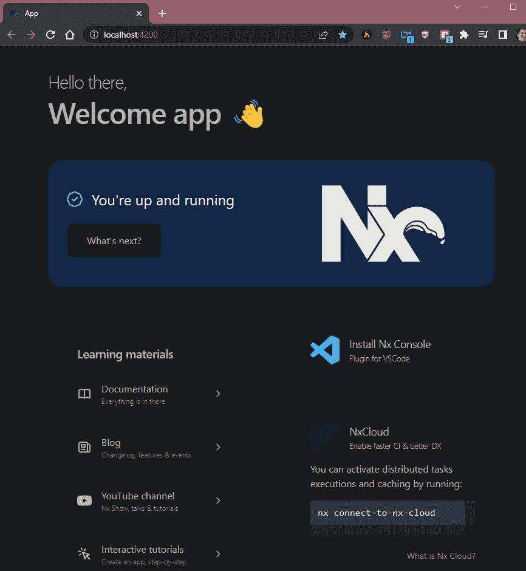

# 使用 NX Monorepo 和 Docker 进行排版(第 1 部分)

> 原文：<https://blog.devgenius.io/going-typestack-with-nx-monorepo-and-docker-part-1-d5ff257981f2?source=collection_archive---------2----------------------->

你好，

在这篇(长)教程中，我将展示如何使用由 [NX](https://nx.dev/) 和 [Docker](https://hub.docker.com/) 提供的架构来实现一个完整的项目(api、app、故事书、数据库)。

这只是第一部分，请继续关注。

首先，让我们集思广益:

*   （同 nonexpendable）非消耗品
*   PNPM(包装经理)
*   码头工人
*   以打字打的文件
*   NodeJS/Express(后端)
*   反应+故事书+顺风 CSS(前端)
*   数据库(MySQL、Redis)
*   Nginx
*   工具:Prisma、Typedocs
*   弹性搜索和基巴纳

我们将构建一个 api，它使用两个数据源(数据和缓存)，包括所有关于安全性和设计模式的最佳实践，在代理后面充当负载平衡器。此外，到最后，我们将在 React 中构建一个使用我们的 api 的应用程序。

这里的目标是如何复制一个完全响应、高效和健康的 monorepo，把应用程序本身放在一边。

使用 monorepo 是一个重大决定，因为我们必须在运行任何长流程(构建、部署等)时确保编码的灵活性和性能。).我曾经与 lerna 一起工作了很长时间，但是一旦项目开始达到一个规模或依赖循环的状态，图像已经建立，观察者正在运行，这时你就会意识到你花在等待上的时间比行动上的时间还要多。

所以，几天后，我决定 NX 是最好的解决方案。又过了几天，事实证明我是对的。20 多个项目在几秒钟内完成。17 使用 docker 图像。那是天堂。

但是并不是所有的事情都是好消息，而且出现了很多错误，所以经过几天的研究，我决定分享最终的骨骼。

假设您已经安装了 node 和 docker，这是我当前对本教程的说明:

基本堆栈

都包好了，让我们开始吧。

我们打算让 PNPM 做我们的包装经理。如果你愿意，你可以使用 npm 或者 yarn，但是 npm 在处理大量的包和泛滥的 node_modules 时更有效。因为我们在处理 monorepos，我们当然希望尽可能少的依赖，而 pnpm(对我来说)是最适合这项工作的。

> npm i -g pnpm@next-7

启动新的 nx 应用程序。让我们称我们的为“类型堆栈”:

> npx create-NX-workspace @ latest—preset = react-express—package manager = pnpm—name = typestack

Nx 会问你是否想连接他们的云，这完全取决于你。你可以在这里了解更多关于[的信息。现在，我们可以选择否](https://nx.app/docs/add-nx-cloud-to-workspace)

现在，我们可以打开我们的编辑器，从这里开始做一些代码。我使用的是 Visual Studio 代码，但是您也可以使用自己喜欢的代码。

默认情况下，Nx 附带我们的源的默认配置:

*   。/libs—我们的包和库所在的位置；
*   。/apps——我们的应用程序/api 的生命所在；

如果需要，您可以通过编辑`nx.json`文件来修改它。现在，我们将使用缺省值。还有，在这里休息一下，看看 [nx.json 文档](https://nx.dev/configuration/packagejson)。

下一步，让我们设置我们的前端应用程序。我们将使用 react，因此需要从 webpack 和 babel 安装一些依赖项:

> pnpm install—save-dev web pack[@ babel/core](http://twitter.com/babel/core)babel-loader[@ babel/preset-env](http://twitter.com/babel/preset-env)

额外收获:Nx 为我们提供了一个 VSCode 的[插件，我们可以从一个非常友好的 UI 运行所有可用的命令，而不是从我们的终端运行所有的 cli 命令:](https://marketplace.visualstudio.com/items?itemName=nrwl.angular-console)

在屏幕截图中，我们可以看到 react 应用程序的生成器正在运行:当我们在 UI 中修改属性时，我们得到了一个模拟执行输出，显示了项目中将要更改的所有内容。在本例中，我们创建了一个名为“app”的新应用程序，使用“scss”作为我们的样式处理器，添加了 react 中的路由模块，只是为了这个(已经太长了)教程，我们不打算使用 e2e。

这是我们在这个配置中得到的最后一个命令:

> pnpm exec NX generate[@ nrwl/react](http://twitter.com/nrwl/react):应用 app—style = scss—e2eTestRunner = none—routing

过程完成后，你应该有一个“应用程序”文件夹在里面。/应用程序。

此时，我们已经有了一个功能性的 react 应用程序。

您可以通过 VSCode 或命令行使用插件运行应用程序:

> nx serve 应用程序

恭喜，您刚刚使用 Nx 提供了一个新的 react 应用程序。

在下一篇文章中，我们将探索并在我们的应用中设置 [Tailwind CSS](https://tailwindcss.com/) 。Tailwind 是一个实用至上的 CSS 框架，里面有像`flex`、`pt-4`、`text-center`和`rotate-90`这样的类，可以直接在你的标记中构建任何设计。

此外，对于我们的前端，我们将配置 [Storybook](https://storybook.js.org/) ，这是一个用于独立构建 UI 组件和页面的开源工具。

最后，我们将在应用程序和我们的 API 之间建立连接。

感谢你到达终点。这是我的第一篇帖子，我希望能给大家带来一些新的或者有用的东西。

干杯。

[第二部分在这里](/going-typestack-with-nx-monorepo-and-docker-part-2-f66c543c7d8f)