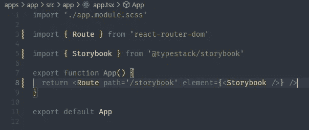

# 使用 NX Monorepo 和 Docker 进行排版(第 2 部分)

> 原文：<https://blog.devgenius.io/going-typestack-with-nx-monorepo-and-docker-part-2-f66c543c7d8f?source=collection_archive---------5----------------------->

故事书，反应和顺风 CSS

今天，我们回到了我们的超级 duper Nx 工作区的第 2 部分，我们将继续通过添加 Storybook 和 Tailwind CSS 来增加我们工作区的灵活性。

[第一部分在这里](https://bit.ly/3MeHqPD)

— [Storybook](https://storybook.js.org/) 是一款开源工具，用于构建独立的 UI 组件和页面，也就是说，它是一款帮助我们创建可重用的独立组件的工具。

— [Tailwind CSS](https://tailwindcss.com/) 提供了一个底层的造型设计，允许并鼓励我们开发更灵活、更优雅的组件。

我在这个项目的源代码中提供了一些我用作基础的顺风预设，请随意更改/删除任何不适合您的项目的内容。

随着这两个框架的合并，我们给了我们的开发环境一堆新的超级能力，允许我们尽可能地发挥创造力。

继续之前，请注意以下几点:

*   在撰写本教程时，当前的故事书插件包不支持 react@18，因此我已经将 Nx 样板捆绑的当前 react 版本降级；
*   Tailwind 使用后处理器来捆绑 css 类，因此当您试图在组件中使用动态类名时，可能会发现一种奇怪的行为。你可以[在这里](https://stackoverflow.com/questions/71818458/tailwind-classes-not-loading-when-using-dynamic-classes-vue)了解更多。

记下笔记，让我们开始创建我们的故事书图书馆。

1 —创建库，并通过导入为`@typestack/storybook;`使其可用

> pnpm exec NX generate[@ nrwl/react](http://twitter.com/nrwl/react):library story book—app project = app—buildable—compiler = SWC—import path =[@ typestack/story book](http://twitter.com/typestack/storybook)—pascalCaseFiles—published

2 —为我们最近创建的库创建初始故事书配置；

> pnpm exec NX generate[@ nrwl/react](http://twitter.com/nrwl/react):story book-配置 story book-no-configureCypress-no-generatecypresspecs

请记住，您总是可以从 VS 代码扩展中使用 UI。

在这两个命令之后，您应该有这样的结构:

当我们创建组件时，Nx 自动导出默认组件，并在我们的应用程序中创建一个路径，以预览来自'/storybook '库的组件。

我们可以运行所有程序来查看结果:`npx nx run-many --target=serve --all`

同时运行应用程序和故事书

故事书运行时间:4400

应用程序运行时间:4200

使用库中组件的代码段

在我们的应用程序中，我们可以这样使用它:

应用程序中故事书组件的使用

现在，让我们来关注一下 Tailwind CSS。

3-安装依赖项

`pnpm install tailwindcss@latest postcss@latest autoprefixer@latest`

4 —这个步骤实际上可以通过跟随 [nx.dev](https://nx.dev/guides/using-tailwind-css-in-react) 上的官方文档来重现。我在这个代码报告(本文末尾的链接)中包含了一些关于顺风的预置，完全可选。

5 —编辑您的`libs/storybook/.storybook/preview.js`文件并导入您在步骤 4 中创建的`css/scss`文件。

将顺风导入您的故事书预览

如果你想改变你的故事书 logo，主 url 等，可以在预览附近创建/编辑一个`theme.js`文件。你可以在这里阅读更多关于[定制故事书](https://storybook.js.org/docs/react/get-started/setup)。

此外，我在这里为 VS 代码留下了 3 个很棒的扩展，以帮助我们在使用 UI 时提高工作效率:

*   [顺风 CSS 运输工具](https://marketplace.visualstudio.com/items?itemName=sudoaugustin.tailwindcss-transpiler)
*   [顺风单据](https://marketplace.visualstudio.com/items?itemName=austenc.tailwind-docs)
*   [顺风 CSS 智能感知](https://marketplace.visualstudio.com/items?itemName=bradlc.vscode-tailwindcss)

下面是它可以对您的 IDE 做的一些事情:

实时 css 预览

媒体查询的简便方法

现在，我们已经准备好利用 Tailwind 提供的一切来创建和服务组件，使用 Nx 来保持我们的工作空间整洁:

`pnpm exec nx generate [@nrwl/react](http://twitter.com/nrwl/react):component button — project=storybook — style=none — directory=form — export — flat — pascalCaseFiles`

*   在故事书库中创建并导出一个名为 Button 的组件。用法:`import { Button } from ‘@typesctack/storybook’`

`pnpm exec nx generate [@nrwl/react](http://twitter.com/nrwl/react):component-story — componentPath=form/Button.tsx — project=storybook`

*   为我们最近创建的按钮组件创建一个故事。

创建按钮组件后的最终结构

我制作了一个简单的代理组件，使用 Tailwind CSS 类代替默认的 HTML 按钮标签来创建默认样式的组件:

然后，对于这些故事，我为每种风格导出了 1 个模板:

为我们的按钮组件定义故事

这是输出结果:

使用按钮

使用 storybook 中的代理按钮组件

[源代码在这里](https://github.com/mend3/typestack)，随着本系列的继续，我会保持更新。

现在，谢谢你的时间和耐心。如果有任何麻木或困惑，请在评论中告诉我。我很乐意帮忙解决任何麻烦。

下次见。干杯。