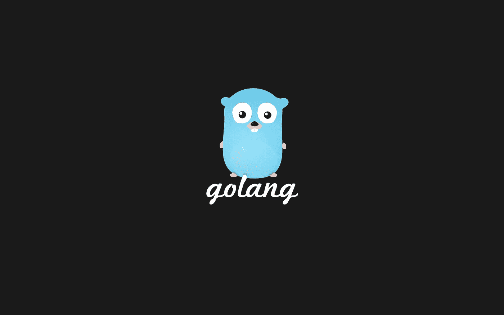
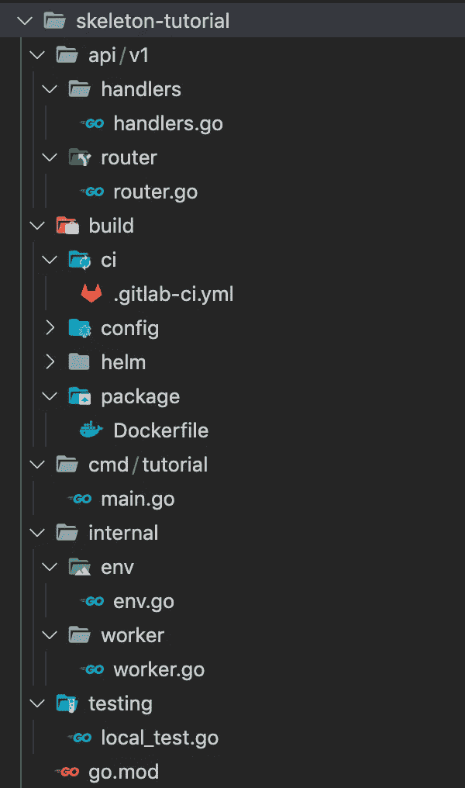

# GoLang APIs:未来项目的框架

> 原文：<https://blog.devgenius.io/golang-apis-a-skeleton-for-your-future-projects-a082dc4d6818?source=collection_archive---------0----------------------->

在这一系列文章中，我将分解开发生产级 API 的最终模板，从项目结构到完整的功能，解释每个步骤的原因和方法。

# 先决条件

*   GoLang 的基础知识是必需的，因为我不会涉及基础知识。(Golang 版)
*   你选择的 IDE，VSCode 是我的首选

# 介绍

在为我的公司开发了几个产品级 API 之后，我发现拥有一个结构良好的框架可以成倍地减少交付时间。当交付日期仓促、业务需求变更或延迟，或者当团队仅仅需要一个快速但健康的交付周期时，这就很重要了。这一部分将关注项目结构、基本功能和重要的依赖关系。代码可以在[这里](https://github.com/javiersoto15/skeleton-tutorial)找到

# 我们的目标是什么？

在开发 API 时，我们关注的重点是性能和可访问性，包括基本响应时间、查询类型以及我们将公开多少数据。

# 项目结构

在构建任何 golang 服务时，我倾向于遵循 [golang 标准项目布局](https://github.com/golang-standards/project-layout),这确实有所回报，因为它让一切井井有条。

这是 API 的扩展版本。

*   托管所有与 HTTP 相关的文件，对代码进行分组和版本控制是一个很好的做法。在这个目录下，您将找到服务器逻辑的 router and handlers 文件夹。
*   `build`包含所有与部署和映像构建相关的文件，如 docker 文件、舵图、CICD 等
*   `cmd/<project-name>`将保留我们的 main.go 文件，作为一个好习惯，我将这个文件保持得相对较小。
*   `internal`文件夹将包含所有不同的逻辑包，如用于业务逻辑的 worker、env 变量设置等。
*   `testing`或`test`是简单的测试文件，我保留了与测试类型相关的文件名，如 unit_test.go 或 bench_test.go

# 服务器设置

我们的服务器逻辑如下，服务器将在 *main.go* 文件中提供服务，路由器(路由安装、中间件)的初始化将在 *router.go* 中，处理定义在 *handler.go* 中。我们从路由器实现开始，然后是处理程序定义，最后我们在 main 中实现服务功能。

我们创建一个`Initialize()`函数来设置我们的 chi 路由器、中间件并安装相应的处理程序路由。中间件方面，这些是我最常见的。`RedirectSlashes`是为了帮助删除尾随斜线，这样在获取参数时就不会干扰。我还为 chi 路由器添加了 CORS 实现，大多数公司需要激活 CORS 报头来接收跨域请求。我们使用一个匿名函数来实现`Mount()`函数，以便在相同的版本/实现下对路由进行分组。

对于`ServeRouter()`函数，我们将调用我们刚刚创建的`Initialize()`函数，并使用`http` GoLang 包来服务和监听，因为它们是兼容的。

继续我们的处理程序包，我们将拥有我们的`Routes()`函数。这个函数将拥有我们所有的路由规则和处理器逻辑。我已经包括了一些关于闭包和依赖注入的例子。

有了这个，您将 100%准备好立即启动您的 REST API Golang 服务器。包括我们关于 [Mongo CRUD](https://javiersotodev.medium.com/golang-implementing-the-official-mongodb-driver-93f3c658171a) 和 [logging](https://javiersotodev.medium.com/golang-logging-101-a-journey-for-the-perfect-system-838fc466ecaa) 的两篇文章，您的服务开发应该是完整且快速的，可以开始在其中工作。节省时间是开发周期的基础。

# Dockerfile 文件

在云架构中，容器占据主导地位，因为这是部署映像的最快方式。这是一个简单的两阶段 docker 构建来封装你的 Golang API

在接下来的文章中，我们将向处理程序展示更深入的实践，并相应地测试它们。

如果有任何问题，请联系我，我非常感谢您花时间通读这篇文章