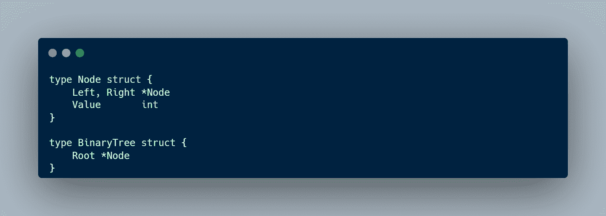

# 戈朗数据结构:二叉查找树#3

> 原文：<https://blog.devgenius.io/golang-data-structures-binary-search-tree-3-5a342d9df2cf?source=collection_archive---------5----------------------->

现在，我将谈论下一个数据结构，这是一个二叉查找树。让我们开始吧。

# 二叉查找树

二叉查找树由通常有父节点和子节点的节点集合组成。子元素被排序，右边的子元素总是比父元素大，左边的子元素总是比父元素小。因为树是排序的，所以当我们进行搜索时，它表现得非常好，特别是如果它是平衡的。通常，二叉查找树是由一个链表构成的。以下是二叉查找树的利与弊。

二叉查找树有三个操作:

*   检查
*   插入
*   删除

以下是数组和二叉查找树之间的区别。

正如我们从大 O 备忘单中看到的，二叉查找树执行得非常好，因为所有的操作都是 O(log n)。但是我们必须确保我们的树是平衡的，如果我们的树是不平衡的，那么我们将有 O(n)时间复杂度。

如上图，我们的二叉查找树是不平衡的，所以操作就像一个普通的链表。

# 操作

在创建我们的树之前，我们必须准备两个结构体。第一个是表示元素的节点。每个节点有两个子节点，左边和右边。另外，创建一个新的 BinaryTree 结构来存储我们的根节点。接下来，我们将把操作作为方法附加到 BinaryTree 结构上。

## 插入

插入是一种操作，我们在树中插入一个新的节点。对于插入，我们必须检查我们想要插入的数字。如果它小于当前节点，那么我们去左边的子节点，如果它大于当前节点，那么我们去右边的子节点。重复该步骤，直到我们遇到一个空值。

下面是上述逻辑的代码实现。

## 检查

Lookup 是在我们的树中搜索特定值的操作。要找到具体的值，逻辑类似于插入操作。我们必须检查我们想要搜索的值，如果值小于当前节点，则转到左边的子节点，否则转到右边的子节点。

下面是上述逻辑的代码实现。

## 删除

删除是一种操作，我们在树中删除一个节点。这是一个有点棘手的操作，我建议你看这个动画来理解其中的逻辑。

从上面的动画中，我们可以看到，当我们想要删除 62 个节点时，我们必须先遍历到右边，然后遍历左边的子节点，直到找到一个空值。之后，我们交换价值。为了清楚地理解它，我推荐你试试这个[二叉查找树可视化](https://visualgo.net/en/bst)。下面是上述逻辑的代码实现

# 结论

在本文中，我们介绍了二叉查找树数据结构，这是最重要的数据结构之一。当我们有可以用小于/大于方式比较的元素时，二叉查找树是有用的。

本文到此为止，别忘了留下一个赞，分享给别人。如果你有任何建议或推荐，我会很高兴你在下面留下评论。感谢你阅读这篇文章，祝你有美好的一天👋。