# Golang 数据结构:图表#4

> 原文：<https://blog.devgenius.io/golang-data-structures-graph-4-627f77288b6d?source=collection_archive---------8----------------------->

现在，我将谈论下一个数据结构，它是一个图形。让我们开始吧！

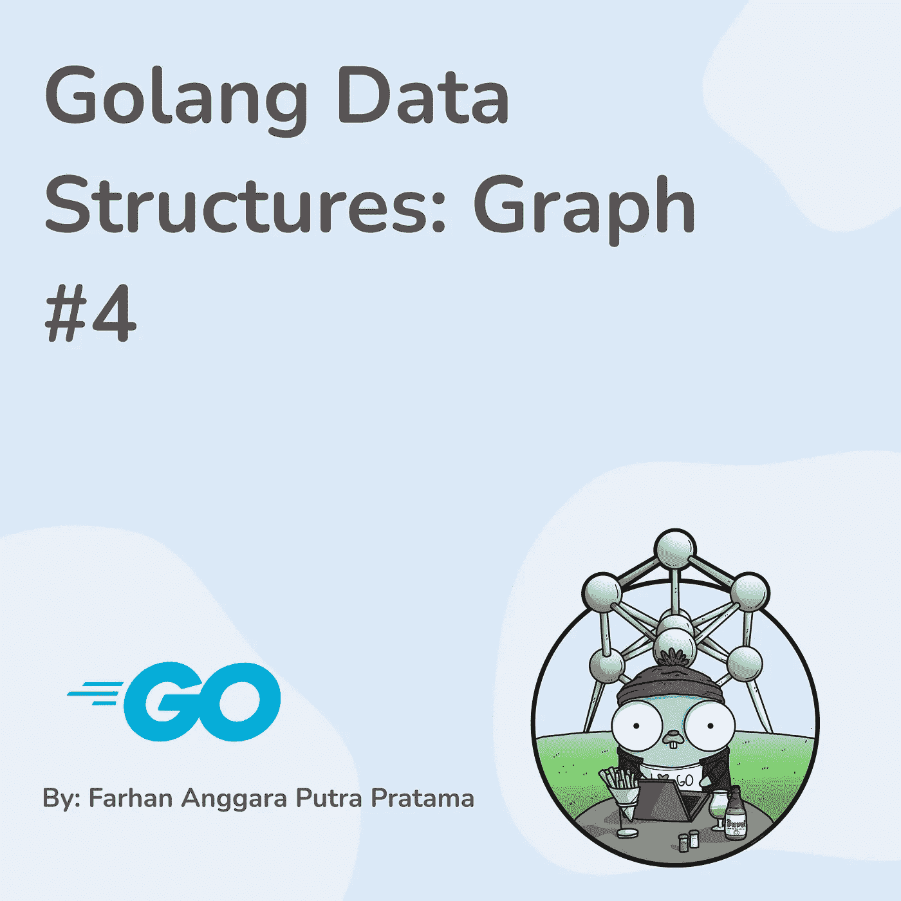

# 图表介绍

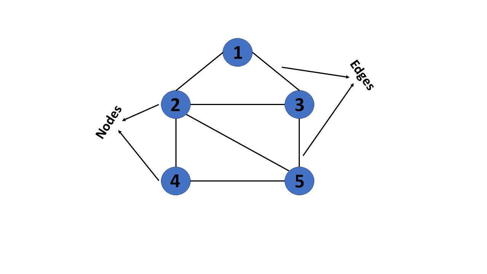

当涉及到模拟现实世界的关系时，图是计算机科学中最有用和最常用的数据结构之一。图只是一组成对相关的值。在图中，每一项称为一个节点或顶点。节点用边连接。

# 图表类型

在本节中，我们将学习可以构建的图表类型。我们可以根据需要组合这些类型的图表。

## 径直的

有向图有助于描述交通流或某种非双向运动的系统。有向图就像一条街道，你只能走一条路。

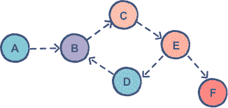

## 未受指导的

无向图就像连接两个城市的高速公路，你可以来回穿梭。

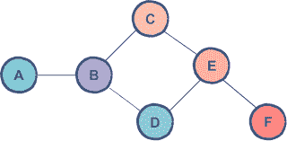

## 衡量过的

加权图是在边上加一个权重。谷歌地图使用加权图来决定最短路径。

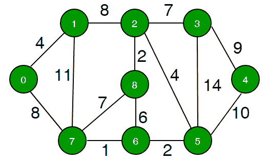

## 未加权的

未加权的图是边上没有任何权重的图。

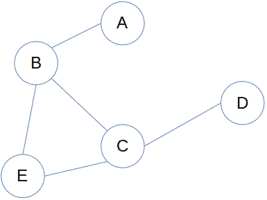

## 循环的

循环图是节点以循环方式连接的图。

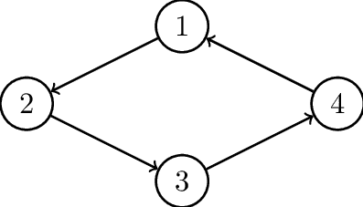

## 无环的

非循环图是节点不以循环方式连接的图。

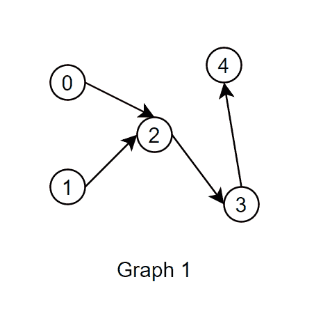

# 如何创建图表

在这一节中，我们将学习如何使用 3 种方法创建一个图，边列表、邻接列表和邻接矩阵。下图是一个无向图、未加权图和循环图的例子。我们将以此图为例。


## 边缘列表

边列表方法意味着我们用一个数组来创建图，该数组表示[值，连接的节点]或者如果它是一个加权图[值，连接的节点，权重]。

```
Example: [[3, 0], [0, 3], [0, 2], [0, 1], [1, 0], [1, 2], [2, 0], [2, 1]]
```

## 相邻列表

节点的值就是索引，I 的索引里面的值就是与之相连的节点。或者，如果它是一个加权图，则连接的节点将包括权重，例如[[[1，99]，[2，88]]，其中索引 0 连接到权重为 99 的节点 1 和权重为 88 的节点 2。

```
Example: [[1, 2], [0, 2], [0, 1], [0]]
```

## 相邻矩阵

节点的值是索引，连接的节点由其索引用 0 或 1 表示。或者如果它是一个加权图，那么我们可以使用权重，如果没有连接/边，权重为 0。

```
Example: [
  [0, 1, 1, 1],
  [1, 0, 1, 0],
  [1, 1, 0, 0],
  [1, 0, 0, 0],
]
```

# 操作

一个图有 3 个操作:添加一个顶点，添加一条边，显示连接。但是在我们制作图表之前，我们可以创建一个新的类型，这样我们就可以给它附加一个方法。我们将使用整数切片图来创建我们的图形。在下面的例子中，我将演示如何创建一个无向、无权重的循环图。

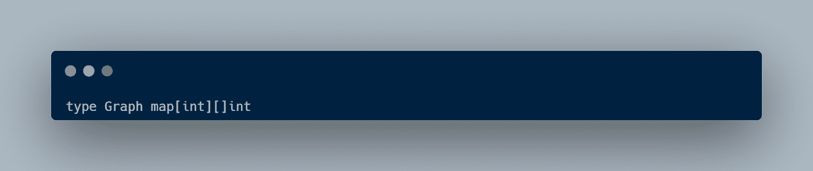

## 添加一个顶点

第一个操作是添加一个顶点，这是我们在图中添加一个新的节点。操作很简单，我们只需根据给定的 map 值添加一个新的键。然后，插入一个空的切片到我们的顶点。

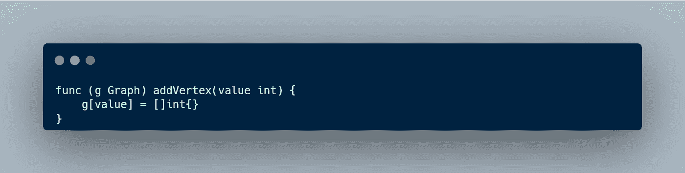

## 添加边缘

第二个操作是添加连接我们两个顶点的边。下面的代码是一个无向图的例子，其中两个顶点都有一个连接。要从顶点 1 创建一个有向图，我们只需使用代码的第一行。

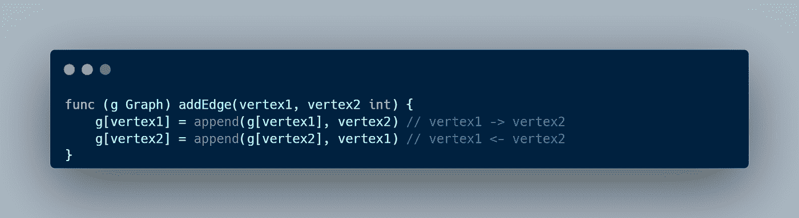

## 显示连接

最后一个操作是显示顶点之间的连接。在这个操作中，我们只是简单地循环我们的图，然后打印键(顶点)和值(连接的顶点)。

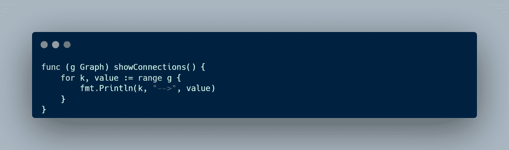

# 例子

在下图中，我们将尝试创建我们的新图。然后，添加从 0 到 6 的新顶点。之后，我们在顶点之间添加一条边。

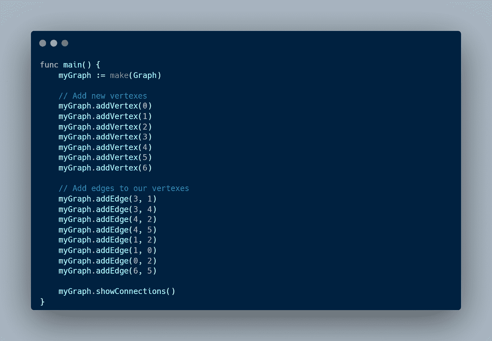

当我们运行代码时，下面是结果。

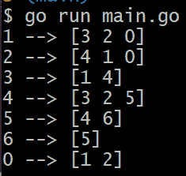

为了可视化图形，我使用了 [visualgo](https://visualgo.net/en/dfsbfs) 来可视化顶点之间的连接。

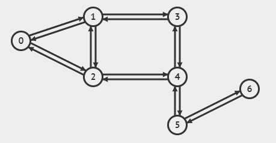

# 结论

总之，图形是一种有用的数据结构，可以可视化元素、节点、对象等之间的联系。谷歌地图使用它来查找两点之间的最短路径，谷歌搜索使用它来显示相关网页，社交媒体使用它来显示两个用户之间的联系。有 6 种类型的图:有向图、无向图、加权图、未加权图、循环图和非循环图。要创建一个图，我们可以使用边列表、邻接列表或邻接矩阵方法。

本文到此为止，别忘了留下一个赞，分享给别人。如果你有任何建议或推荐，我会很高兴你在下面留下评论。感谢你阅读这篇文章，祝你有美好的一天👋。