# Golang 数据结构:链表#1

> 原文：<https://blog.devgenius.io/golang-data-structures-linked-list-1-2e85a90b2605?source=collection_archive---------6----------------------->

在计算机科学中，数据结构是一种数据组织、管理和存储格式，通常用于有效访问数据(维基百科)。著名的数据结构之一是链表。链表是一个链接的列表:)。一个列表包含一组节点，一个节点有两个元素，一个是你要存储的数据的值，一个是指向下一个节点的指针。第一个节点称为头，最后一个节点称为尾。尾部指向 null 或 nil。

链表的好处之一是数据存储在一个随机的内存地址中。不像数组在内存中是一个接一个存储的。所以对于插入和删除，链表比数组快。下面是数组和喜欢列表的一些比较。

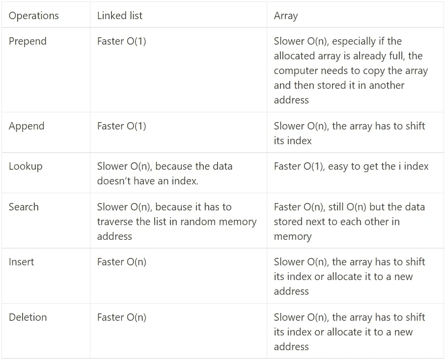

链表与数组

那么什么时候使用链表呢？当我们有很多插入和删除时，就要用到链表。在我们深入研究链表之前，我建议你先看看这个动画，以帮助你更好地理解单向链表和双向链表是如何工作的。

1.  [单链表](https://visualgo.net/en/list?slide=1)
2.  [双向链表](https://visualgo.net/en/list)

# 单向链表

单链表是链表的一种类型。在单链表中，每个节点只有一个指针，它是下一个节点。

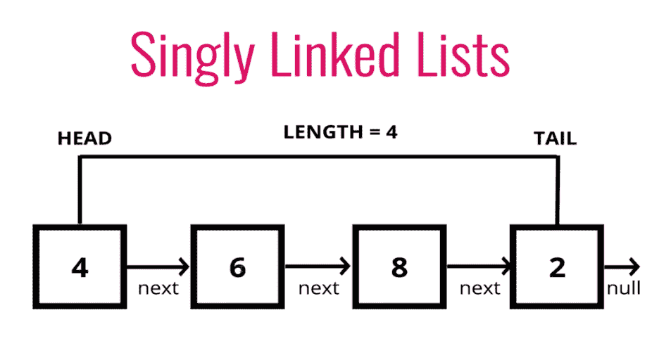

单向链表

在 Golang 中创建一个单链表。首先，我们必须创建一个名为 node 的结构体，它有两个值，一个存储下一个节点地址的 next(这就是为什么它是一种指针)和一个存储值的 value。此外，我们必须创建一个 LinkedList 结构来存储列表的头部、尾部和长度。我们将在 LinkedList 中附加几个方法，这些方法能够执行诸如追加、前置、插入和删除等操作。

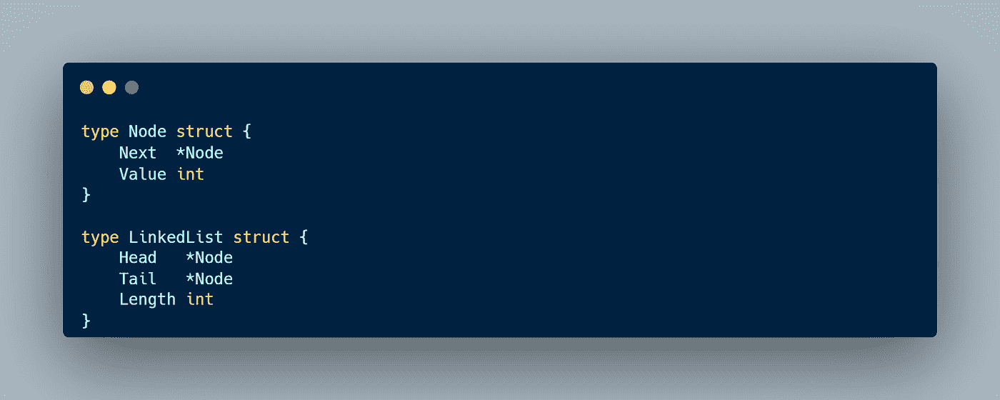

# 附加

Append 是一种操作，我们在列表的末尾添加一个值。这里我使用了一个方法，它附加到一个指针 LinkedList 类型(它必须是一个指针类型，因为我们想修改内存中的值)。为了给我们的列表添加一个新值，我们必须检查我们的列表是否包含节点。如果没有，那么我们在列表的开头和结尾添加新的节点。如果我们的列表中已经有了节点，那么我们在列表的末尾添加新的节点。

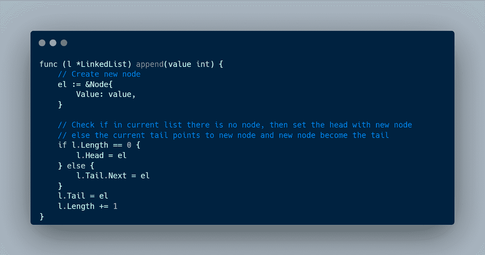

# 预先考虑

Prepend 是一个操作，我们在列表的第一个位置添加值。首先，我们必须检查列表中是否有节点。如果没有，那么添加一个新的节点作为尾部。否则，将下一个值设置为当前头，然后将头设置为新节点

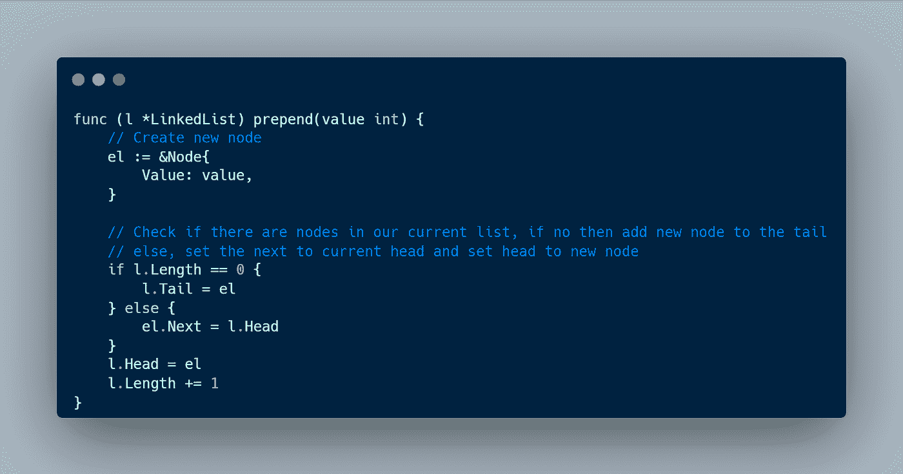

# 插入

插入是一种操作，我们在列表中间插入一个新值。为了给我们的列表增加新的价值，我们必须首先知道索引。例如，当我们想要输入一个索引为 2 的新值时，我们必须获取索引为 1 的前一个节点。

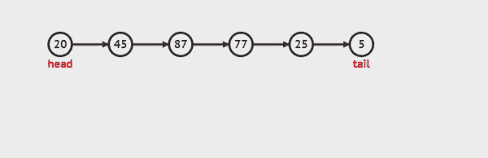

单链表动画中的插入

因此，要在第二个索引中添加一个新值，我们必须遍历 index-1 节点。之后，将新节点中的下一个值设置为当前值。下一步，并设置电流。新节点的下一个值。

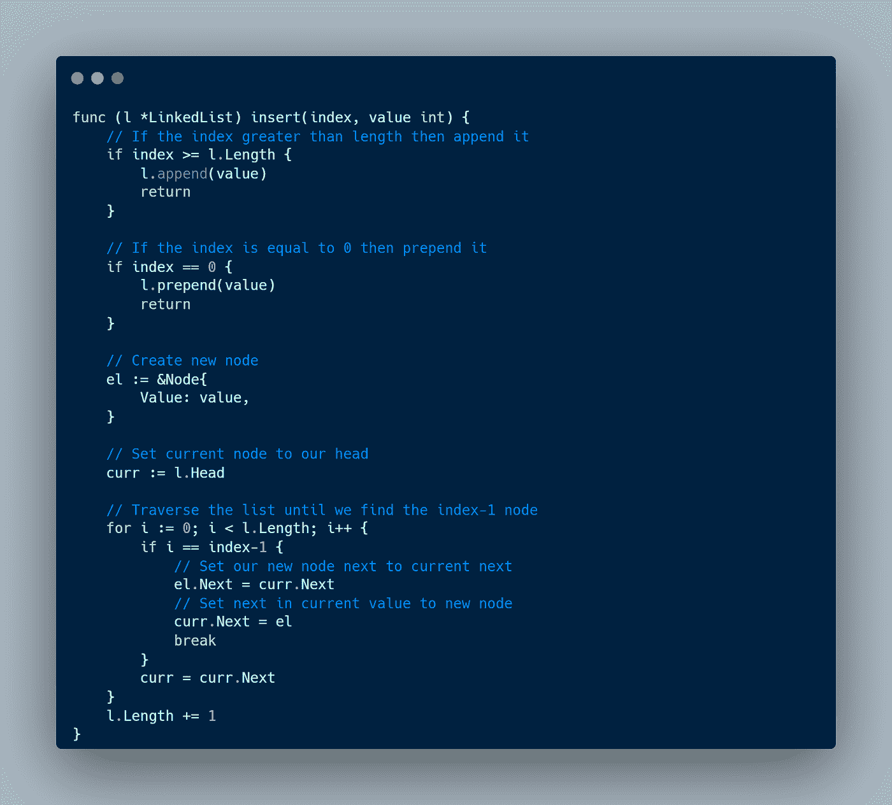

# 删除

删除是删除列表中的一个节点的操作。要删除第 I 个索引中的节点，我们必须获得 index-1 节点。遍历列表，然后将前一个节点上的 next 设置为 next 的第 I 个节点。这可能会令人困惑，但下面的动画很好地解释了这一点。

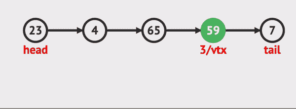

单链表中的删除

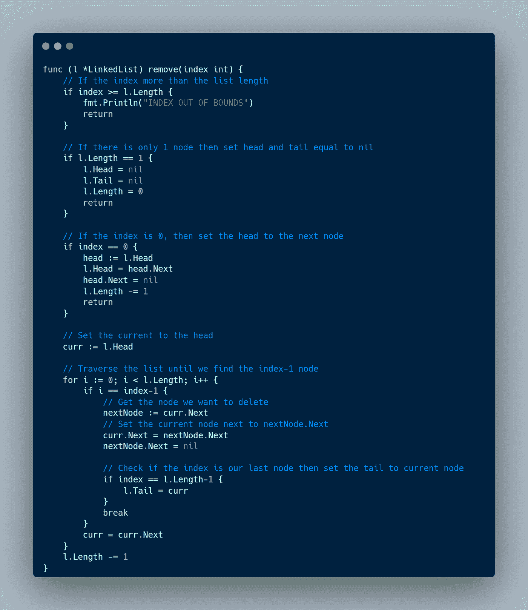

# 双向链表

双向链表和单向链表非常相似。但是，在一个单链表中，我们只能从头到尾遍历，因为我们与前面的节点没有任何联系。在双向链表中，每个节点存储前一个节点和下一个节点。当我们执行搜索功能时，双向链表非常有用，可以节省很多时间。例如，如果我们想要得到的值更靠近尾部，那么我们可以从尾部开始遍历，这比从头开始遍历要快。

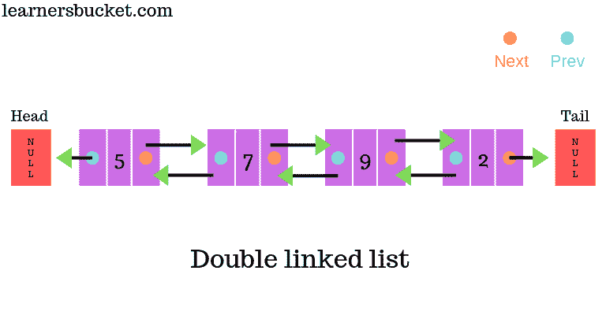

双向链表

要创建一个双向链表，我们可以创建一个结构，不仅存储下一个节点，还存储上一个节点。

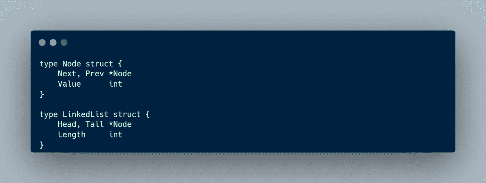

# 附加

追加操作基本上与单链表相同。不同的是我们必须设置先前的节点。如果我们的列表不为空，我们必须将新节点 prev 设置为当前尾，当前尾 next 是我们的新节点。

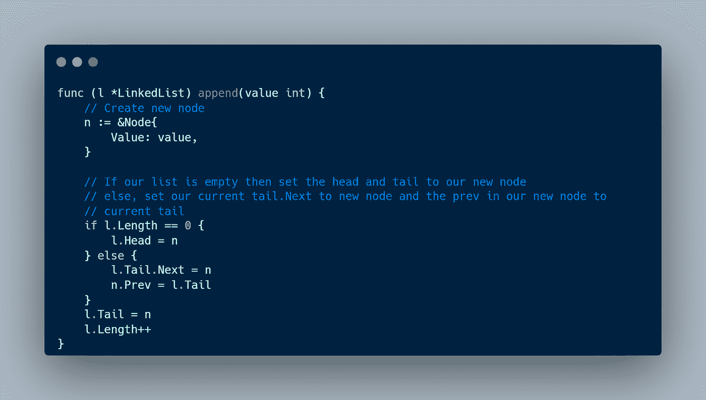

# 预先考虑

要在我们的列表中添加一个新的节点，我们必须将当前的 head prev 设置为新的节点，然后将新的节点设置在当前 head 的旁边。之后，我们将头部设置到新节点。

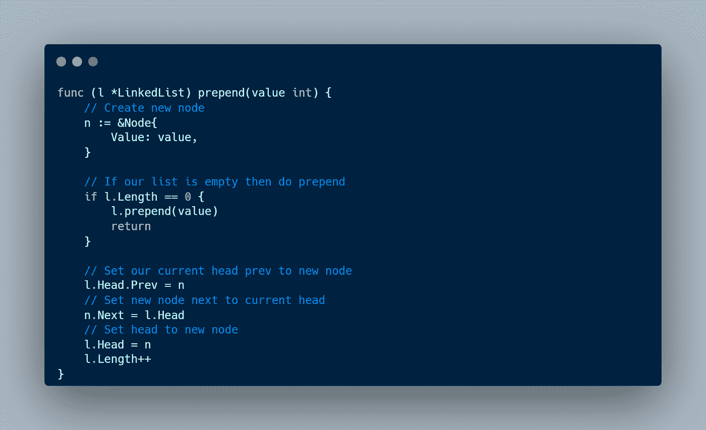

# 插入

对于插入操作，我们必须首先获得 index-1 节点。然后我们插入我们的节点，为了更清楚的步骤，你可以查看下面的动画。

双向链表中的插入

如果我们想在索引 2 处插入一个新节点(21 ),下面是完整的步骤:

1.  获取索引为 74 的 1 节点
2.  目前，我们有一个头，它是 74 个节点(索引-1)和一个新节点(21)
3.  将 21 点沪指设为 74 点
4.  将 21 个下一个点设置为 26
5.  将 26 个 prev 点设置为 21
6.  将 74 个下一个点设置为 21 个

# 删除

对于删除操作，我们不必获取 index-1 节点。我们只需要得到索引节点。

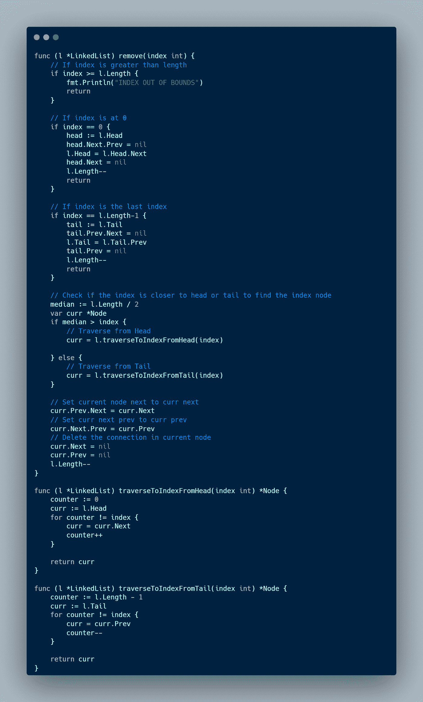

# 单向与双向链表

下面是单向链表和双向链表的比较。

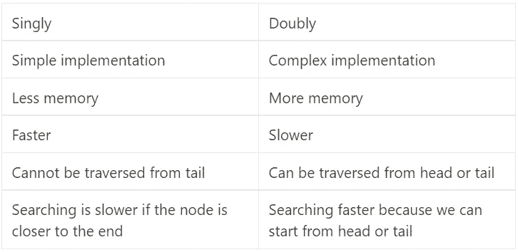

单向与双向链表

# 结论

链表是软件工程师必须理解的数据结构之一。它非常有用，广泛应用于更复杂的项目中。链表有两种实现方式，一种是单向的，一种是双向的。两者各有利弊。当你有很多插入或删除时，链表是很好的选择。

本文到此为止，别忘了留下一个赞，分享给别人。如果你有任何建议或推荐，我会很高兴你在下面留下评论。感谢你阅读这篇文章，祝你有美好的一天👋。