# Golang 数据结构:堆栈和队列#2

> 原文：<https://blog.devgenius.io/golang-data-structures-stack-and-queue-2-5a6822baeb0d?source=collection_archive---------4----------------------->

之前我在 Golang 里写过链表。我们的下一个数据结构是堆栈和队列。堆栈和队列在很多研究案例中都有实现。让我们开始吧！

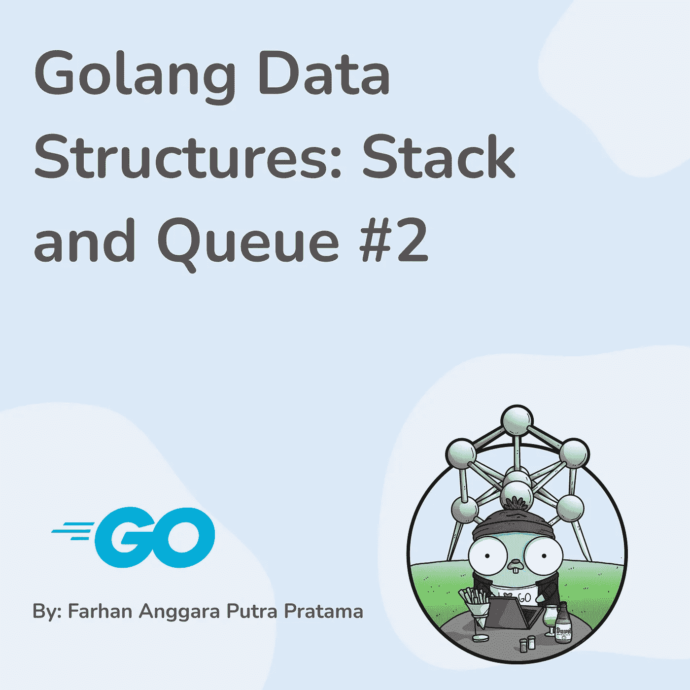

# 堆

堆栈是一种线性数据结构，遵循后进先出(LIFO)顺序的原则。插入堆栈中的最后一个元素将是第一个被移除的元素。堆栈有很多实现方式，例如当我们在食堂吃完饭后把盘子叠放在一起时，或者当计算机读取我们的代码时。当你想以相反的顺序把东西放进去的时候，Stack 是很有用的。

堆栈有 3 个操作

*   推
*   流行音乐
*   偷看

堆栈可以用数组或链表来实现。在这篇文章中，我将展示如何创建一个带有单链表的堆栈。在我们创建堆栈之前，我们必须创建一个新的结构，它是节点和堆栈。

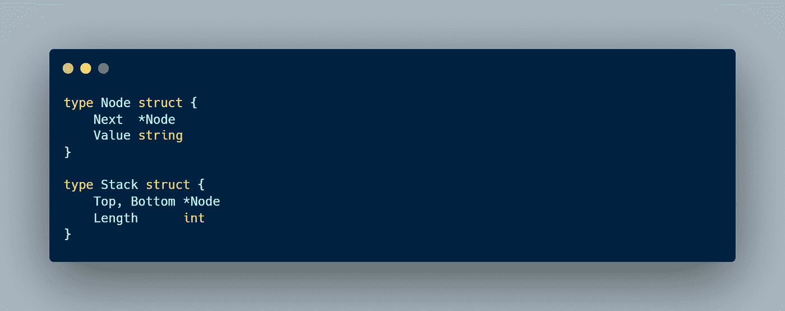

现在，我们必须设计我们的节点如何相互连接。我们有 2 个选择，底部节点指向上面的节点或者相反。

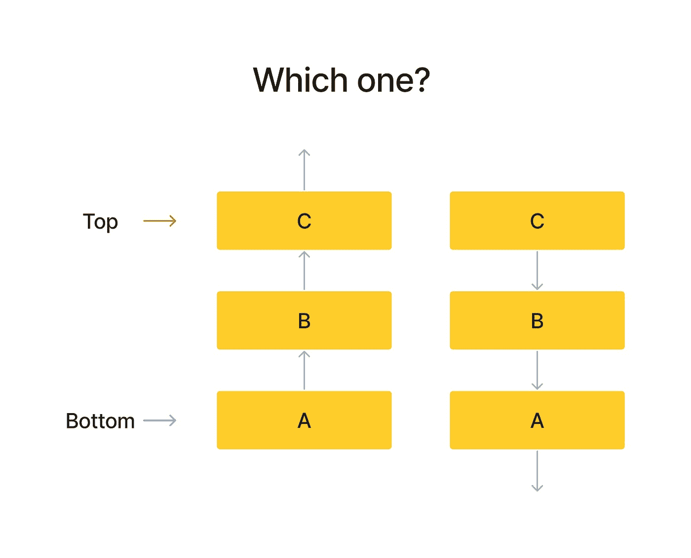

正确答案是第二种，上面的节点指向下面的节点。为什么？因为在堆栈中，我们必须跟踪我们的顶层节点。如果我们在删除顶部节点后使用第一个选择，我们如何能够将顶部节点更改为下面的节点？我们不能，除非我们必须从底部节点遍历，这需要更多的时间或 O(n)。我们要的是 O(1)，所以用第二种选择。如果我们移除顶部节点，我们可以简单地将顶部节点更改为下面的节点。

## 推

在堆栈中，推是在堆栈顶部添加新元素的操作。

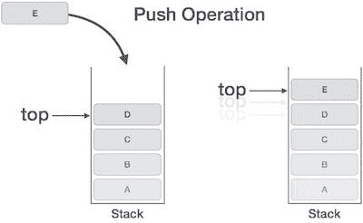

教程要点

为了进行推送操作，我用一种指针将方法附加到堆栈上。首先，我们必须检查堆栈中是否有节点。如果我们没有，那么顶部和底部指向我们的新节点。如果我们已经有节点，我们的新节点指向顶部节点，然后顶部节点指向我们的新节点。

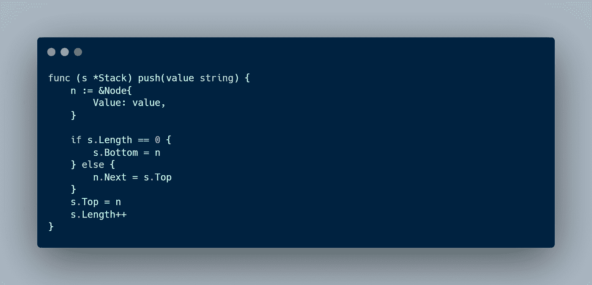

## 流行音乐

Pop 是一个移除栈顶元素的操作。

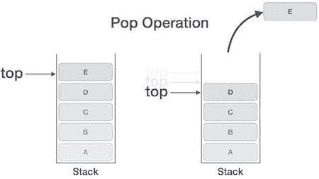

教程要点

我们必须检查堆栈中是否有节点。如果我们没有，那就回来。如果我们只有一个节点，那么我们只需将顶点和底点更改为零。如果我们有一个以上的节点，那么我们改变顶部到顶部。下一步。之后，删除连接从以前我们的顶部节点。

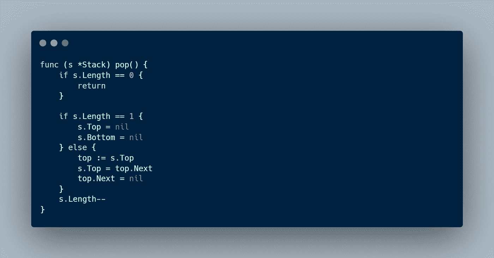

## 偷看

Peek 是一个查看栈顶元素的操作。因为我们跟踪我们的顶部和底部节点，我们可以只打印出顶部节点。

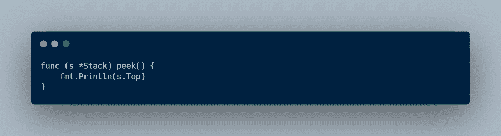

# 长队

队列是一种线性数据结构，遵循先入先出(FIFO)顺序的原则。队列中插入的第一个元素将是第一个被移除的元素。现实生活中有很多排队的例子，比如，打印、买票、叫优步等等。

队列有 3 个操作:

*   入队:在最后一个索引上添加新元素
*   出列:删除第一个元素
*   偷看:看第一个元素

队列可以用数组和链表来实现。但是，最好使用链表，因为我们有一个移除第一个索引的操作。在数组中，O(n)花费更多的时间，因为我们必须移动数组中的索引。首先，我们必须创建一个新的结构，即节点和队列。

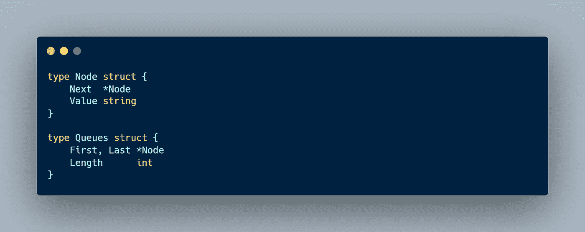

现在，我们必须设计我们的节点如何相互连接。我们有两个选择，第一个节点指向第二个节点或者相反。

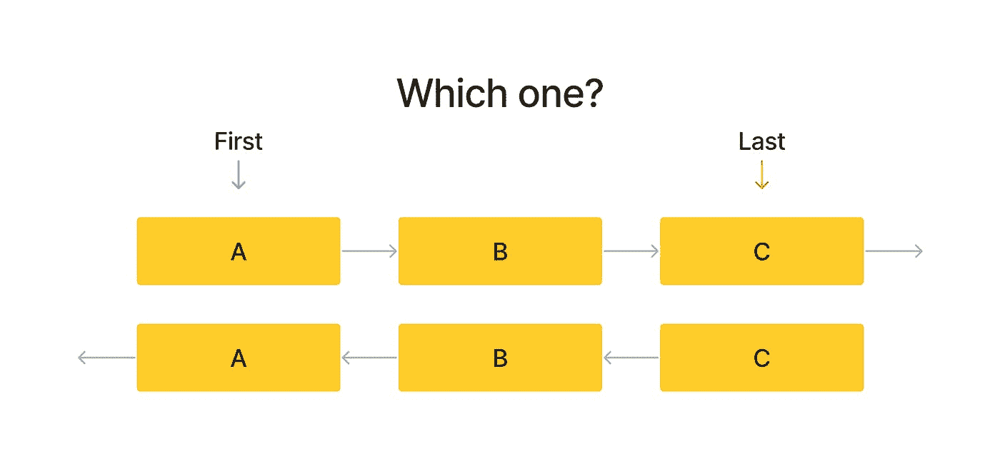

正确答案是最上面的一个，是第一个节点指向第二个节点。为什么？因为我们必须在移除第一个节点时追踪它。例如，如果我们删除第一个节点，我们必须将第一个节点移动到第二个节点。在底部的选择中，当我们删除第一个节点时，第一个节点与第二个节点没有任何连接，因此我们不能将第一个节点移动到第二个节点。

## 使…入队

Enqueue 是在队列末尾添加新元素的操作。

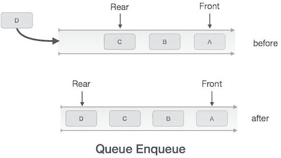

教程要点

要添加一个新节点，我们必须检查我们的队列中是否有任何节点。如果我们没有，那么我们将第一个和最后一个设置为我们的最后一个节点。如果我们有节点，那么最后一个节点指向我们的新节点，然后将最后一个节点移动到我们的节点。

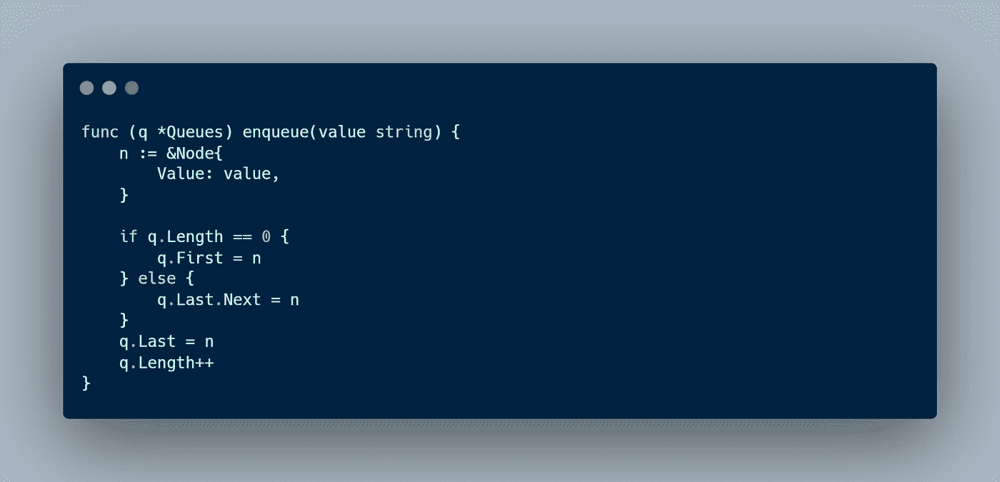

## 出列

出列是删除队列中第一个节点的操作。

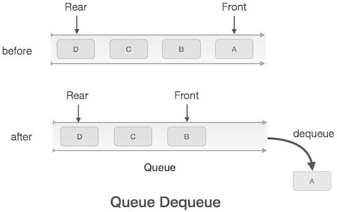

教程要点

要删除第一个节点，我们必须检查我们的队列中是否有任何节点。如果我们没有，那就退回去。如果我们只有一个节点，那么我们将第一个和最后一个设置为零。如果我们有多个节点，那么我们将第一个节点移动到第二个节点，然后删除从第一个节点到第二个节点的连接。

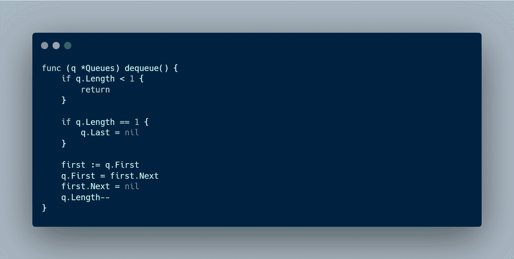

## 偷看

Peek 是查看队列中第一个元素的操作。

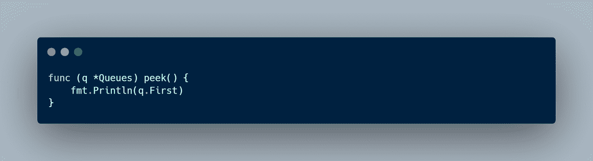

# 结论

堆栈和队列是软件工程师需要了解的数据结构之一。它们可以在很多研究案例中实现。当你想把东西从你放进去的时候以相反的顺序取出来的时候，Stack 是很有用的。堆栈的一个例子是当计算机读取我们的程序时。当事情不是必须立即处理，而是必须以先进先出的顺序处理时，队列很有用。排队的一个例子是我们在电影院买票的时候。

本文到此为止，别忘了留下一个赞，分享给别人。如果你有任何建议或推荐，我会很高兴你在下面留下评论。感谢你阅读这篇文章，祝你有美好的一天👋。