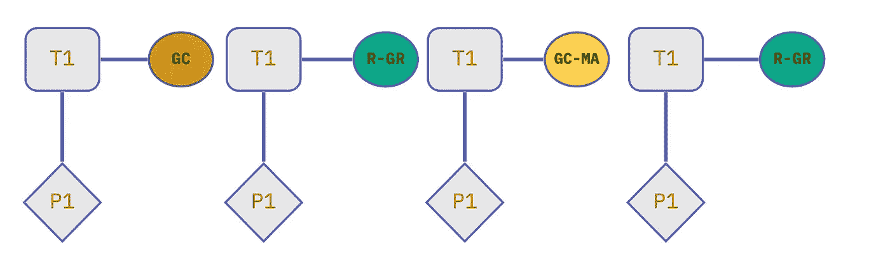

# [Golang]垃圾收集

> 原文：<https://blog.devgenius.io/golang-garbage-collection-in-general-c28ae82558c4?source=collection_archive---------2----------------------->

众所周知`golang`是一种**垃圾收集**语言，其他语言如`**java**`**`**python**`**`**C#**`**等。`**Golang**` 是静态类型化的 ***垃圾收集语言。*********

## ****什么是垃圾收集，为什么需要垃圾收集****

****很多文章都写了这个主题。因此，我将保持这个小范围，并尝试获得一些关于这个概念的更深入的见解。****

> ****在 SML 程序中(以及大多数其他编程语言中)，有可能产生**垃圾**:程序不再可用的已分配空间。****

****当软件在您的计算机上执行时，它使用两个重要的内存位置部分:**堆栈**和**堆**。****

********

****在`code`之上有一个`RandomBox` **类型**，`GenerateRandomBox()`是一个**函数**，它返回`RandomBox` **类型。**`ref`已经在**堆栈**中赋值，结构数据在**堆中。** `Golang`采用 [**逸出分析**](https://en.wikipedia.org/wiki/Escape_analysis) 来确定。****

********

****当引用消失时，我们以**垃圾结束。**这就是我们得到**垃圾**的原因，这些垃圾需要经常清理。****

> ****当程序的内存占用达到一定的阈值时，整个应用程序将被暂停，**垃圾**垃圾**收集器**扫描所有被分配内存空间并回收不再使用的对象，这个过程结束后，用户程序可以继续运行，早期的语言也使用这种策略实现垃圾收集，但今天的实现要复杂得多****

******垃圾收集**可以手动启动，也可以自动启动，这取决于你使用的编程语言。每个程序编译器或解释器都使用特定的算法来执行**垃圾收集。编译语言中的垃圾收集**与解释语言中的工作方式相同。****

****`Golang`使用 [**追踪垃圾**](https://en.wikipedia.org/wiki/Tracing_garbage_collection) **收集器**即使他们的代码通常会提前编译成机器码。Go 使用一个并发标记和清扫垃圾收集器算法。****

## ****垃圾收集过程中会发生什么****

****`Go`的**垃圾收集器**之所以叫 ***并发*** 是因为它可以安全地与主程序并行运行。****

****当编译器基于某种条件(下面讨论)决定是时候运行**垃圾收集**时，它会执行以下操作****

******标记设置******

*   ****这意味着编译器试图停止一切，字面上称为**停止世界**步骤。此时，您的应用程序中不会做任何事情。****
*   ****首先，它会启用**写屏障**，这意味着当此屏障处于*(停止所有 go-routines)* 状态时，不会在内存中写入任何内容。编译器必须执行此操作，以确保您的应用程序不会丢失任何数据。****

********

*   ****一旦执行了 **STW** 并且**写屏障**打开，收集器就进入下一阶段。****

******标记******

****在这一阶段，会发生以下情况****

*   ****检查**堆栈**以找到**堆**中的根指针****
*   ****遍历**堆**并查看它们是否仍在使用****

******收集器**也像我们一样使用**围棋程序**，它从你可用的**围棋程序**中抽取 **25%** 并分配给自己。意味着根据我们之前的例子，1 个线程将专用于**收集器。******

> ****现在，如果 collect 发现它在执行这个任务时可能会耗尽内存，因为其他一些 go-routine 分配了比它可以标记的更多的内存。因此它将选择 go-routine 并请求它帮助标记。这个过程叫做 M **方舟辅助******

********

******标记终止******

****这里**收集器**将再次执行 **STW** ，关闭**写屏障**，执行一些清理并计算下一个**垃圾收集**时间表****

> ******注:**目标是在需要执行的每次采集中，保持 **STW** 下降或在**100 毫秒**内****

****一旦**标记终止**过程完成 *(STW 和写屏障关闭)，*应用再次开始工作，所有 **OS 线程**可用。****

****这就是每次收集发生的情况，你可能会问，是的，它通过识别悬空值做了标记，但是，它没有清理它们。那部分叫做**扫******

> ******流言终结者** : **清扫**不是**垃圾收集**的一部分，它发生在收集过程之外的**。******

## ****扫除****

****这是一个我们要求非标记内存分配的过程。我们需要把它们找回来，这就是垃圾收集的全部目的。****

*   ****当新的分配发生时，要求未使用的位置发生。因此，从技术上来说，**清扫**的等待时间不会添加到**垃圾收集中。******

********

## ****垃圾收集触发器****

*   ****垃圾收集器将观察的第一个指标是堆的增长。默认情况下，当 ***堆的大小是*** 的两倍时，它就会运行。([代码](https://github.com/golang/go/blob/master/src/runtime/mgc.go#L529))****
*   ****垃圾收集器关注的第二个指标是两个垃圾收集器之间的延迟。如果 ***超过两分钟*** 未被触发，将强制一个循环。([代码](https://github.com/golang/go/blob/master/src/runtime/mgc.go#L560))****
*   ****应用内存也可以触发**垃圾收集**是[***runtime . mallocgc***](https://github.com/golang/go/blob/master/src/runtime/malloc.go#L842)函数，它在运行时将堆上的对象按大小分为微对象、小对象和大对象。这三个对象中的每一个的创建都可以触发新的垃圾收集周期。****
*   *******手动*** 调用`[**gc()**](https://github.com/golang/go/blob/master/src/runtime/mgc.go#L412)`触发。****

## ****GC 收集器旋钮****

****与`java`不同的是决定`golang`开发者不应该在他们转移到不同的硬件时调整他们的**垃圾收集器**。所以他们只提供了一个调优配置，叫做[***SetGCPercentage***](https://pkg.go.dev/runtime/debug#SetGCPercent)或者[***GOGC***](https://pkg.go.dev/runtime#hdr-Environment_Variables)环境变量。默认为**为**的 100%********

****************

## ********GC 起搏器********

********有**调步算法**试图计算出何时开始新的**收集。**我们知道，计算发生在**标记终止**垃圾收集的**阶段时。****调步器**算法试图对此进行计算，如果它发现甚至在条件适用之前就开始收集可以获得更多好处，它就会这样做。因此，如果**步行者**认为它可以获得更多利益，那么收集甚至可以在计算的时间之前开始。********

****希望这篇博客能够提供更多关于**垃圾收集**过程和它是如何在`Golang`中实现的****

# ****快乐学习！！****