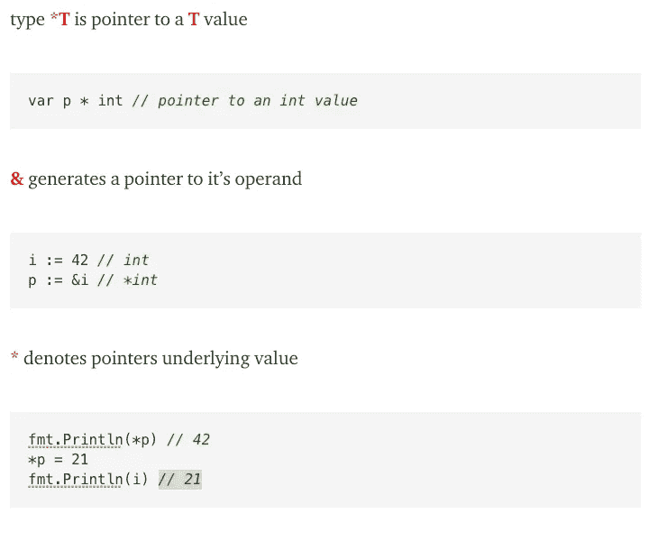

# 60 秒后的 Golang 指针

> 原文：<https://blog.devgenius.io/golang-in-sixty-seconds-pointers-ebe7b49b7c01?source=collection_archive---------4----------------------->


在 [Unsplash](https://unsplash.com?utm_source=medium&utm_medium=referral) 上[拍摄的萨克萨姆黑帮](https://unsplash.com/@saksham?utm_source=medium&utm_medium=referral)

指针是一个值在内存中的位置。理解指针在 Go 中非常重要，因为函数的大多数参数都是通过值传递的，而不是引用。这意味着下面的代码可能不会如您所愿:

```
func add1(num int) {
  num = num+1
}
myNum := 1
add1(myNum)
fmt.Println(myNum)
```

这将把“1”打印到控制台上(你可以试试[这里](https://go.dev/play/p/GgW4iWiLgTu))。当`myNum`被传递给函数`add1`时，它会被复制。所以现在有两个值为 1 的内存位置。函数中使用的将被更新为 2，但原来的`myNum`保持不变。如果我们想让函数变异`myNum`，我们必须像这样使用指针:

```
func add1(num *int) {
  *num = *num+1
}
myNum := 1
add1(&myNum)
fmt.Println(myNum)
```

所有那些星号和&符号让人迷惑，对吗？你可以试试[这里](https://go.dev/play/p/_nS8zOe-fva)

以下是我每天用来帮助自己的备忘单:



更[六十秒后 Golang](https://richard-t-bell90.medium.com/list/golang-in-sixty-seconds-7a26c5131734)

[*获取无限制访问介质*](https://richard-t-bell90.medium.com/membership)

[*给我买杯咖啡*](https://ko-fi.com/richardtbell) *如果你喜欢这篇文章:)*

*更多内容请看*[*blog . dev genius . io*](http://blog.devgenius.io)*。*