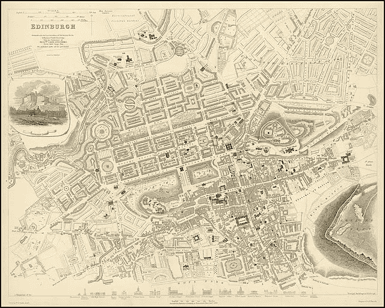

# 60 秒后的 Golang 地图技巧

> 原文：<https://blog.devgenius.io/golang-in-sixty-seconds-tricks-with-maps-74f8107d7e7d?source=collection_archive---------8----------------------->



不是这种地图……(1834 年爱丁堡，作者[威廉·巴纳德·克拉克](https://en.wikipedia.org/wiki/en:William_Barnard_Clarke)

在[之前的一篇文章](https://richard-t-bell90.medium.com/golang-in-sixty-seconds-count-occurrences-in-a-string-984fe04dfa4f)中我提到了`strings.Count`函数。这里有一个更复杂用例的替代方案。

假设我们有一群人:

```
type Person struct {
 name string
 age  int
}
people := []Person{{name: "Bob", age: 21}, {name: "Sam", age: 28}, {name: "Ann", age: 21}, {name: "Joe", age: 22}, {name: "Ben", age: 28}}
```

如果我们想了解我们的人的年龄频率，我们可以利用一个`map`:

```
ageDistribution := map[int]int
for _, person := range people {
  ageDistribution[person.age]++
}
fmt.Println(ageDistribution) // map[21:2 22:1 28:2]
```

我们在这里所做的是循环遍历我们切片中的每个人，并递增我们为该年龄存储的值，本质上是对他们进行计数。你可以在这里[试试](https://go.dev/play/p/IW1rpt2Znk0)

知道年龄的分布可能不太有用，但是您可能希望能够快速获得某一年龄的所有人，在这种情况下，您可以这样做:

```
peopleByAge := make(map[int][]Person)
for _, person := range people {
  peopleByAge[person.age] = append(peopleByAge[person.age], person)
}
fmt.Println(peopleByAge[21]) // [{Bob 21} {Ann 21}]
```

[你可以试试这里](https://go.dev/play/p/ijkVE4-_f_l)

更[六十秒后 Golang](https://richard-t-bell90.medium.com/list/golang-in-sixty-seconds-7a26c5131734)

[*获取无限制访问介质*](https://richard-t-bell90.medium.com/membership)

[*给我买杯咖啡*](https://ko-fi.com/richardtbell) *如果你喜欢这篇文章:)*

*更多内容请看*[*blog . dev genius . io*](http://blog.devgenius.io)*。*