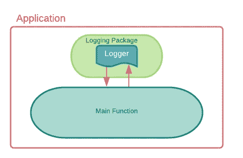

# GoLang 监控 101:完美系统之旅

> 原文：<https://blog.devgenius.io/golang-logging-101-a-journey-for-the-perfect-system-838fc466ecaa?source=collection_archive---------3----------------------->

# 记录

日志记录已经成为现代编码中最重要的方面之一，从帮助你在应用程序的运行时提供有用的信息到更容易地解决 bug，在日志记录时有一个好的实践是很重要的。

几个月前，我负责在我们的 go 微服务(包括 API 和后端服务在内的 10 多种不同的应用程序)中重构我们的日志系统，在研究了实现它的最佳方法之后，我们开始动手，从 stdout 中的简单句子到 JSON 结构化日志，这些日志可以在 Elasticsearch 中解析，并使用它在 Kibana 中构建仪表板。在这篇博客中，我将指导你这个过程，并教你如何获得有用的信息(它将专注于纯 GoLang，Elastic 和 Kibana 将在不同的帖子中)。


当前由 JSON 日志支持的 Kibana 仪表板

# 第一步:检查你的源代码

在我们的领域中，大多数时候，我们没有对代码的完全控制权，因为不同的开发人员参与了每天的变更(除非你是唯一的维护者),或者甚至从老团队接手项目。这带来了问题，但没有什么是你不能处理的。在查看这方面的源代码时，您必须注意两件事，日志记录不足和日志记录过多。

当前最大的问题是日志记录不足，通常，这是因为开发人员忘记实现“额外的”行来提供额外的信息，因为我们(有时我属于这一类)知道它做什么，并且当它不是最好的做法时我们对此没有意见(类似于注释源代码)。过度日志记录更容易，因为它删除了无用的或不提供有意义信息的代码行。随着我们进行下去，事情会变得棘手，因为有了过度日志记录，每一行看起来都有意义，但它可能不会给我们的目标增加任何价值，我们的目标是从洞察中监控我们的应用程序。

两者都可以被认为是技术债务，因为它们不是好的实践。但我们是来解决这些问题的。有一个术语叫做*日志级别，*我们稍后会更深入地讨论它，但这是防止过度日志记录的基础。下一个技巧是回顾你的目标，哪些信息对你和你的团队有用。举个例子，处理函数是 API 世界中最重要的函数之一，一个好的实践是记录函数何时被触发，以及函数何时返回响应。这给了我们一些启示:

处理程序日志模板

*   我们可以记录 API 调用的总持续时间，这有助于我们了解 API 的执行速度。
*   重要的信息也可以从这里提取，比如 HTTP 方法、处理程序名、客户机名等等。

这种类型的分析必须对大部分代码进行，同时要记住你在寻找什么类型的信息，当你习惯后，这个过程会更容易。

# 使用记录器的实例

正如你可能注意到的，我们没有使用 fmt。大多数人用来“记录”的 Printf。不同的库，如 [logrus](https://github.com/sirupsen/logrus) 或 [zap](https://github.com/uber-go/zap) 使用记录器的实例。这真的很重要，因为提供了很多功能，你可以根据自己的需要进行个性化设置。在本文中，我们将重点讨论 logrus，因为它是我使用过的最有经验的包，并且它有很好的性能。

在我的研究中，我发现了如何使用记录器实例的不同选择。最后，我给出了两种最好的方法，一种是全局记录器，另一种是每个包或函数的“本地”记录器。当您想要为一个包定制一个日志记录器时，本地选项是最好的。您可以实例化一个记录器并通过函数传递它，如下例所示:

特定于函数的记录器示例



尽管这可能不是最漂亮也不是最有效的方法，但它让您有可能多次使用这个日志记录器。第二种选择是创建一个日志包，使用一个全局变量来保存配置，并在您的服务中使用它。示例:

在您的主函数中，您使用日志记录。StartLogger()您就可以开始了！在 NewLogger 函数中，我使用一个简单的配置将日志输出到 Stdout 中，并在 JSON 中格式化它。这给了我们随时调用记录器的灵活性，而不用将它传递给函数。

# 标准化日志记录函数和 JSON 字段

这可能是博客最重要的部分，因为它将区分一种通常不被实现的日志记录方式。大多数时候，日志以这种格式出现在一行程序中:

```
logger.Infof(“Something happened”)
```

这很容易，但不方便，也不利于开发。在这种情况下，让你与众不同的想法如下。在您的 API 中，有不同的处理程序，并且不止一个开发人员一直在升级 API。在每个处理程序的末尾，我们记录这个处理程序的结果。您会在控制台中看到两条不同的语句:

```
{ “level”:”info”, “msg”: “Process completed, data returned for client Y”}{ “level”:”info”, “msg”: “Handler completed, response sent back”}
```

澄清一下，没有一个是完全错误的，但这不是我的偏好，还有很大的改进空间。为了突出问题，我们从它不能给我们很多信息这一事实开始。一条简单的消息不会帮助我们弄清楚应用程序的状态，也不会在某些东西不能正常工作的情况下提供帮助。即使日志是 JSON 格式的，它也没有充分利用它，因为我们无法用一行消息查看/查询日志消息。

那我们该如何改进呢？我发现了一种方法，我们可以为了相同的目的去除不同的消息，当团队需要一起协作时，这很有用。引入日志功能，它将作为日志实际含义的抽象/包装。例如，我们希望每次调用处理程序时都有一个日志。我们在日志包中创建了一个名为 HandlerStart 的函数，然后我们实现了实际的日志调用:

我们在应用程序的任何部分都是这样称呼它的:

```
log.HandlerStart(“Tutorial”, “Started”, “Handler”, time.Now())
```

输出给了我们关于内部情况的有意义的信息。

```
{“Handler”:”Example Handler”,”Status”:”Started”,”Time”:”2020–10–05T20:55:05.982493–05:00",”client”:”Tutorial”,”level”:”info”,”msg”:”Handler Example started”,”time”:”2020–10–05T20:55:05–05:00"}
```

一些可能有用的一般位置可能是初始化数据库之前和之后、根据函数的错误语句、重要函数发生之前和之后，例如路由器初始化或批处理创建。它有无限的可能性。我通常为每一个目的准备一个单独的 go 文件，并且我加入了具有相同思想的函数。如所有与连接相关的功能，位于 connection.go 下

字段日志的想法是当您使用 ELK stack 或任何其他日志/度量系统时，使查询更容易并更快地聚集数据。id 或 traces 等重要字段必须在日志中，以便进行调试，特定进程的名称也有助于了解日志来自何处。

# 额外建议

我发现另一个有用的字段，尤其是在微服务下，是服务名或应用名。当你想在你的日志中重复一个字段而不需要重复的时候，钩子是你最好的选择，但是它需要更多的设置。

为此，我们必须创建一个满足 logrus 中钩子接口的 struct(它需要两个函数)。在我们设置记录器的文件中，让我们添加以下内容:

在 Fire 函数中，我们为日志添加了永久字段，即服务名。

现在，在我们的 StartLogger 函数中，我们像这样添加 AddHook 函数:

就是这样！

希望在博客结束时，您对日志可以改进的方式有了更好的认识。自从我们迁移到这个新的“框架”后，它对我的团队非常有用。我将加入一个新的博客来建立 ELK 堆栈，并赋予我们的日志更多的意义。感谢任何反馈！谢谢你