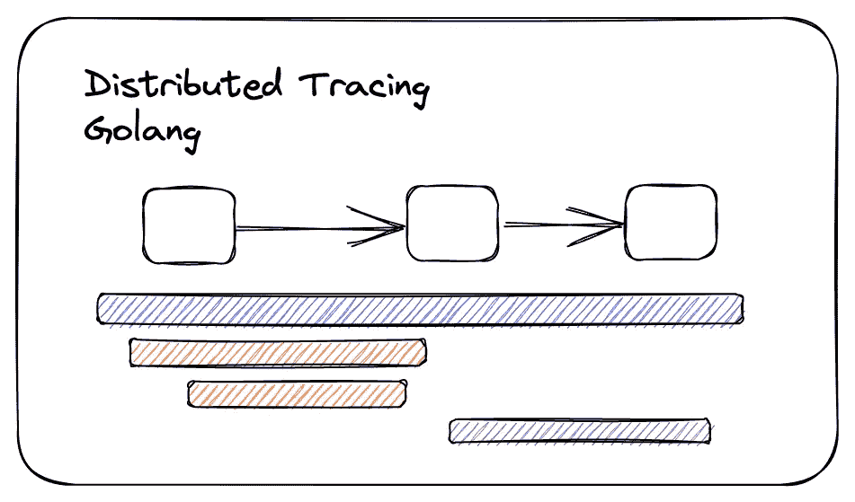

# Golang Monitoring 102:使用 Opentelemetry 的分布式跟踪

> 原文：<https://blog.devgenius.io/golang-monitoring-102-distributed-tracing-with-opentelemetry-17a173e200d1?source=collection_archive---------1----------------------->

下一篇文章将解释用 opentelemetry 实现分布式跟踪系统。它将涵盖用例、术语和代码片段。



当在分布式架构中的不同团队和领域之间进行贡献时，跟踪在可观察性中扮演着重要的角色。您需要知道系统的哪个部分可能存在性能瓶颈，或者需要知道传入请求的端到端流程。这包括错误、故障点等。

Opentelemetry ( [Otel](https://opentelemetry.io/) )是众多可观测性协议之一，它为开源仪器和收集遥测数据设定了标准。

# 概念

为了从技术上涵盖一些核心概念，我们需要定义它们，以便更好地理解它们所指的内容。这些将与 OTel 生态系统紧密耦合，因为它们可能不同于其他生态系统，如[基巴纳](https://medium.com/dev-genius/golang-logging-101-a-journey-for-the-perfect-system-838fc466ecaa)生态系统。

***痕迹***

跟踪是我们的根进程，它将记录跟踪过程中发生的事情。在 Kibana 中，APM 被称为事务。当一个传入的请求到达一个服务、一个进程刚刚开始或者一个工作者的功能开始工作时，一个跟踪被启动。

该跟踪将包含一个跟踪 ID(以及其他信息),它将把该流程中的其余跨度链接在一起。

***跨度***

跨度是来自初始跟踪的不同子过程，它将封装特定的功能以反映一个工作单元。这些可以是单个函数、数据库调用、外部 API 请求、gRPC 方法、消费或产生事件等。

范围可以有属性和事件。属性是描述跨度的键值对，允许收集器使用和分类它们。事件是时间跨度内的时间点，描述它被触发的内容，而不一定创建新的时间跨度。

在 [OTel](https://github.com/open-telemetry) 协议中有 5 种跨度。它们是:

*   客户端:客户端范围是对当前边界之外的服务的请求。这可能是一个 gRPC 方法或对 API 的出站 HTTP 请求。
*   服务器:服务器范围是服务器将处理的传入请求(通常是来自客户端范围的接收者)。
*   内部:内部范围是指在服务逻辑中使用的范围，例如数据库查询、工作例程等。通常是父 span(客户端、服务器等)的子 span。
*   生产者(Producer ):生产者跨度旨在用于稍后将被消费的异步流程中。通常是远程跨距类型。
*   消费者:消费者跨度指的是生产者过程的一个结果，它在生产后很久才被处理。

***跨度语境***

跟踪使用上下文传播在函数、请求和数据库查询之间注入和读取数据。它类似于 Golang 中的相同上下文传播概念，它将是您最好的朋友。Span Context 是一个用于数据结构的术语，该数据结构将包含有关跟踪本身的信息。上下文中包含的一些信息是:

*   跟踪 ID 表示范围是其一部分的跟踪
*   范围的范围 ID
*   跟踪标志，包含跟踪信息的二进制编码
*   跟踪状态，可以携带特定于供应商的跟踪信息的键值对列表

上下文的传播因我们使用的传播格式而异。在本文的后面，我们将讨论*文本映射传播器、*，并且我们将使用 [W3C](https://www.w3.org/TR/trace-context/) 约定来传播这些踪迹。

> 注意:在程序中使用这些概念时，您会遇到 SpanFromContext()、SpanContextFromContext()等函数。注意区分 tracer/span 上下文和 Golang 上下文，因为它们指的不是同一个东西。

# 跟踪实现

简单的跟踪实现将使用软件包中包含的默认全局跟踪器提供程序和传播程序。

span 中的一个关键功能是执行远程 span 上下文。这意味着 span 将最终离开函数的作用域(异步函数),或者它将到达服务或域之外的另一个目的地。

```
gspanCtx := trace.SpanContextFromContext(ctx) 
ctx = trace.ContextWithRemoteSpanContext(ctx, spanCtx)
```

# 分布式跟踪

既然我们已经介绍了基础知识，我们需要理解所有的跟踪是如何链接的，以及收集器如何设法在相同的过程下保持跟踪和跨度。这里是你的建筑和空间工具化的地方。

> 插装只不过是告诉您的服务/代码如何按照您设定的标准使用和导出这些指标。通常情况下，包都带有自动工具，但是您会看到使用自定义指标会得到更好的结果

我们将使用 W3C 惯例来解释跟踪的分布。

分布式追踪的要点是链接不同域和空间之间的追踪。这些跟踪的入口点通常是进入您的生态系统的请求。

跟踪将遍历请求或事件消息的标头。这个数据集合就是跟踪上下文。跟踪上下文包含两个部分，每个部分位于一个单独的标头上。

*   Trace Parent ( *traceparent* ):这是一个包含跟踪 ID 和 Span Parent ID 的单个字符串(包括两个标志)。跟踪 ID 是一个标识根跟踪的 16 字节数组，而 span ID 是一个表示父 span 的 8 字节数组。

*示例:00–0af 7651916 CD 43 DD 8448 EB 211 c 80319 c-b7ad 6b 7169203331–01*

*   跟踪状态( *tracestate* ):它是一组键值对，包含来自与跟踪相关的其他域的信息。例如来自公司外部的请求。

*举例:tutorial=t61rcWkgMzE*

# 拦截器和中间件

当接收到一个请求时，我们需要手动从请求中接收头，提取跟踪信息并将其添加到我们的上下文中，然后由我们的处理程序使用。大部分功能是由 Otel 包创建的，实现[中间件](https://github.com/open-telemetry/opentelemetry-go-contrib/tree/main/instrumentation/github.com/gorilla/mux/otelmux)或 gRPC [拦截器](https://github.com/open-telemetry/opentelemetry-go-contrib/tree/main/instrumentation/google.golang.org/grpc/otelgrpc)取决于你。

当使用像 W3C 这样的约定时，您需要设置跟踪文本映射传播器来处理它。

全局传播器的目的是告诉 otel 包应该按照跟踪上下文 W3C 标准提取和注入跟踪程序。

传播器将做两件事，注入(传出请求)和提取(传入请求)跟踪。当使用来自 W3C 的跟踪上下文时，它将使用头名称来提取跟踪信息、解析、验证，并将跟踪信息添加到跟踪上下文中。

在定制拦截器中，您会看到这两个函数(注入和提取)使用了上下文和一个载体。载体是您将接收跟踪信息的任何结构。对于 HTTP 请求，它是头，对于 gRPC 是元数据，Kafka 事件的头，等等。载体的工作是提供对该结构中的跟踪信息的访问。在您的架构中，发送和接收跟踪的方式保持一致是非常重要的。

最终产品是让您的所有服务实现这些拦截器和中间件，以便以标准方式传播跟踪。这也将有助于接收带有跟踪的传入请求，以获得多域跟踪体验。