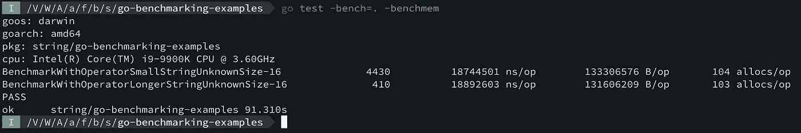
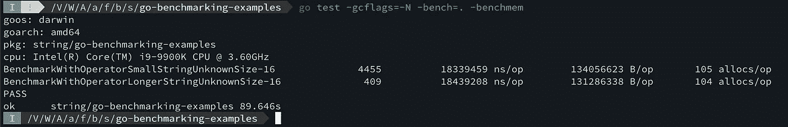
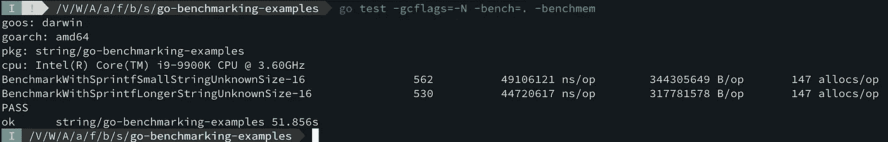
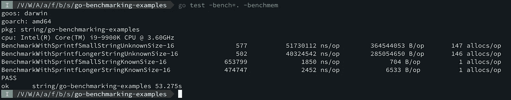
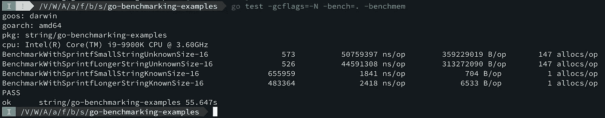
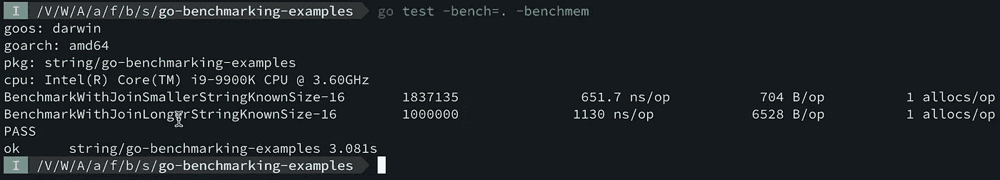
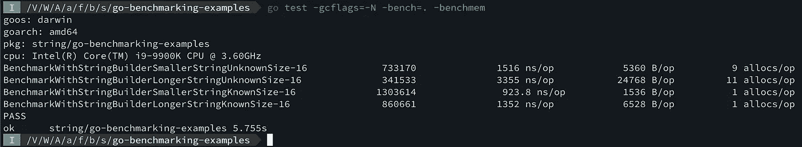

# [Golang]更多关于弦乐

> 原文：<https://blog.devgenius.io/golang-more-on-strings-17b943f9354f?source=collection_archive---------6----------------------->

在`Golang`中或者就此而言，几乎在所有编程语言中`strings`都是**不可变的**数据类型，并且被大量使用。这个博客让我们看看我们可以在`string`上执行的所有操作，以及它们的效率。


那么，让我们来谈谈**字符串串联，有几种方法来执行* ***字符串串联****

*   *使用`[fmt](https://pkg.go.dev/fmt)`包装中的`[Sprintf](https://pkg.go.dev/fmt#Sprintf)`*
*   *使用`[strings](https://pkg.go.dev/strings)`包中的`[Join](https://pkg.go.dev/strings#Join)`功能*
*   *使用`+`符号连接字符串*
*   *从`Golang 1.10`开始使用`[strings](https://pkg.go.dev/strings)`包中的`[Builder](https://pkg.go.dev/strings#Builder)`*

*当你做一些小的连接时，我想这与你使用的方法无关。然而，随着用例的增长和变得越来越大，人们也需要注意这些。*

*让我们用一些`code`例子来验证这一点*

1.  ***使用** `**+**` **运算符***

```
*package mainimport (
 "testing"
)const (
 smallString = "StringsInGolang"
 longString  = "somegarbagestringwithallthecharacterslknvklancerlkwrvcekljrvklrn"
)func **generateRandomLengthOfStrings**(s string) (data []string, size int) {
 // Running the loop for 100 time and each time
 // inserting the same in the List Of String []data
 for i := 0; i < 100; i++ {
  data = append(data, s)
  size += len(s)
 }
 return data, size
}func **BenchmarkWithOperatorSmallStringUnknownSize**(b *testing.B) {
 data, _ := generateRandomLengthOfStrings(**smallString**)
 var s string
 for n := 0; n < b.N; n++ {
  for _, d := range data {
   s += d
  }
  _ = s
 }
}func **BenchmarkWithOperatorLongerStringUnknownSize**(b *testing.B) {
 data, _ := generateRandomLengthOfStrings(**longString**)
 var s string
 for n := 0; n < b.N; n++ {
  for _, d := range data {
   s += d
  }
  _ = s
 }
}*
```

*以下是我运行`go test -bench=. -benchmem`时看到的内容*

**

*清晰可见**较小管柱**标杆取`18744501 ns/op`较长管柱**取`18892603 ns/op`。***

*所以，我们运行了基准禁用 **Golang 优化***

**

*根据编译器执行的运行时优化，该数字会略有变化。*

***2。使用** `**fmt.Sprintf**`*

```
*package mainimport (
 "fmt"
 "strings"
 "testing"
)const (
 smallString = "StringsInGolang"
 longString  = "somegarbagestringwithallthecharacterslknvklancerlkwrvcekljrvklrn"
)func generateRandomLengthOfStrings(s string) (stringCollection []string, stringSize int) {
 // Running the loop for 100 time and each time
 // inserting the same in the List Of String []data
 for i := 0; i < 100; i++ {
  stringCollection = append(stringCollection, s)
  stringSize += len(s)
 }
 return stringCollection, stringSize
}func **BenchmarkWithSprintfSmallStringUnknownSize**(b *testing.B) {
    data, _ := generateRandomLengthOfStrings(**smallString**)
    var s string
    for n := 0; n < b.N; n++ {
        s = fmt.Sprintf(s, data)
        _ = s
    }
}func **BenchmarkWithSprintfLongerStringUnknownSize**(b *testing.B) {
    stringCollection, _ := generateRandomLengthOfStrings(**longString**)
    var s string
    for n := 0; n < b.N; n++ {
        s = fmt.Sprintf(s, stringCollection)
        _ = s
    }
}func **BenchmarkWithSprintfSmallStringKnownSize**(b *testing.B) {
    stringCollection, _ := generateRandomLengthOfStrings(**smallString**)
    var t []interface{}
    for _, d := range stringCollection {
        t = append(t, d)
    }
    format := strings.Repeat("%s ", len(t))
    format = strings.TrimSuffix(format, " ")
    var s string
    for n := 0; n < b.N; n++ {
        s = fmt.Sprintf(format, t...)
        _ = s
    }
}func **BenchmarkWithSprintfLongerStringKnownSize**(b *testing.B) {
    stringCollection, _ := generateRandomLengthOfStrings(**longString**)
    var t []interface{}
    for _, d := range stringCollection {
        t = append(t, d)
    }
    format := strings.Repeat("%s ", len(t))
    format = strings.TrimSuffix(format, " ")
    var s string
    for n := 0; n < b.N; n++ {
        s = fmt.Sprintf(format, t...)
        _ = s
    }
}*
```

*这是我们可以用`-gcflags=-N`看到的*

**

*显然，`Sprintf`花费了更多的时间，如果我们知道字符串的**长度呢***

**

*当字符串的**长度为**已知时，结果发生剧烈变化。**如果我们**启用优化会怎么样？*****

**

*所以现在这些数字各自都有所提高。*

> *现在，对于`string`串联`**+**` **操作符**似乎是**赢得**比赛如果**长度**未知，然而如果**长度已知**，那么`**Sprintf**` 执行方式更好。*

***3。使用** `[**Join**](https://pkg.go.dev/strings#Join)`*

*现在我们用`[Join](https://pkg.go.dev/strings#Join)`看看有什么区别。下面的代码更改*

```
*package mainimport (
 "fmt"
  "strings"
 "testing"
)const (
 smallString = "StringsInGolang"
 longString  = "somegarbagestringwithallthecharacterslknvklancerlkwrvcekljrvklrn"
)func **generateRandomLengthOfStrings**(s string) (stringCollection []string, stringSize int) {
 // Running the loop for 100 time and each time
 // inserting the same in the List Of String []data
 for i := 0; i < 100; i++ {
  stringCollection = append(stringCollection, s)
  stringSize += len(s)
 }
 return stringCollection, stringSize
}func **BenchmarkWithJoinSmallerStringKnownSize**(b *testing.B) {
    stringCollection, _ := generateRandomLengthOfStrings(**smallString**)
    var s string
    for n := 0; n < b.N; n++ {
        s = strings.Join(stringCollection, " ")
        _ = s
    }
}func **BenchmarkWithJoinLongerStringKnownSize**(b *testing.B) {
    stringCollection, _ := generateRandomLengthOfStrings(**longString**)
    var s string
    for n := 0; n < b.N; n++ {
        s = strings.Join(stringCollection, " ")
        _ = s
    }
}*
```

*这里的结果是用`string`与**的长度已知***

**

*如你所见，当字符串长度已知时，与其他方法相比,`[Join](https://pkg.go.dev/strings#Join)`工作得非常好。*

***4。使用** `[**Builder**](https://pkg.go.dev/strings#Builder)` **从** `[**strings**](https://pkg.go.dev/strings)` **包***

*从 Golang 1.10 开始`[**strings**](https://pkg.go.dev/strings)` 包有一个`[**Builder**](https://pkg.go.dev/strings#Builder)` 类型，可以用来构建字符串。下面是代码的变化*

```
*package mainimport (
 "strings"
 "testing"
)const (
 smallString = "StringsInGolang"
 longString  = "somegarbagestringwithallthecharacterslknvklancerlkwrvcekljrvklrn"
)func **generateRandomLengthOfStrings**(s string) (stringCollection []string, stringSize int) {
 // Running the loop for 100 time and each time
 // inserting the same in the List Of String []data
 for i := 0; i < 100; i++ {
  stringCollection = append(stringCollection, s)
  stringSize += len(s)
 }
 return stringCollection, stringSize
}func **BenchmarkWithStringBuilderSmallerStringUnknownSize**(b *testing.B) {
    stringCollection, _ := generateRandomLengthOfStrings(smallString)
    var s string
    for n := 0; n < b.N; n++ {
        var builder strings.Builder
        for _, s := range stringCollection {
            builder.WriteString(s)
        }
        s = builder.String()
        _ = s
    }
}func **BenchmarkWithStringBuilderLongerStringUnknownSize**(b *testing.B) {
    stringCollection, _ := generateRandomLengthOfStrings(**longString**)
    var s string
    for n := 0; n < b.N; n++ {
        var builder strings.Builder
        for _, s := range stringCollection {
            builder.WriteString(s)
        }
        s = builder.String()
        _ = s
    }
}func **BenchmarkWithStringBuilderSmallerStringKnownSize**(b *testing.B) {
    stringCollection, size := generateRandomLengthOfStrings(**smallString**)
    var s string
    for n := 0; n < b.N; n++ {
        var builder strings.Builder
        builder.Grow(size)
        for _, s := range stringCollection {
            builder.WriteString(s)
        }
        s = builder.String()
        _ = s
    }
}func **BenchmarkWithStringBuilderLongerStringKnownSize**(b *testing.B) {
    stringCollection, size := generateRandomLengthOfStrings(**longString**)
    var s string
    for n := 0; n < b.N; n++ {
        var builder strings.Builder
        builder.Grow(size)
        for _, s := range stringCollection {
            builder.WriteString(s)
        }
        s = builder.String()
        _ = s
    }
}*
```

*这是结果*

**

*同样，当长度已知时，它表现得相当好，当长度未知时，它的表现也明显好于`+`操作符*

*因此，总体来看，当字符串长度已知或未知时，基准测试结果看起来像是`[Join](https://pkg.go.dev/strings#Join)`、`[Builder](https://pkg.go.dev/strings#Builder)`、`Sprintf`做得很好。`+`操作符在这两种情况下都表现不佳。*

*希望这能提供更多关于 ***字符串*** 以及语言如何处理它的信息*

# *编码快乐！！*