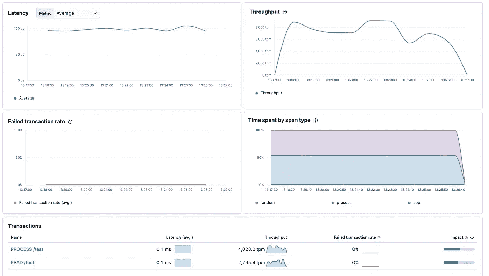
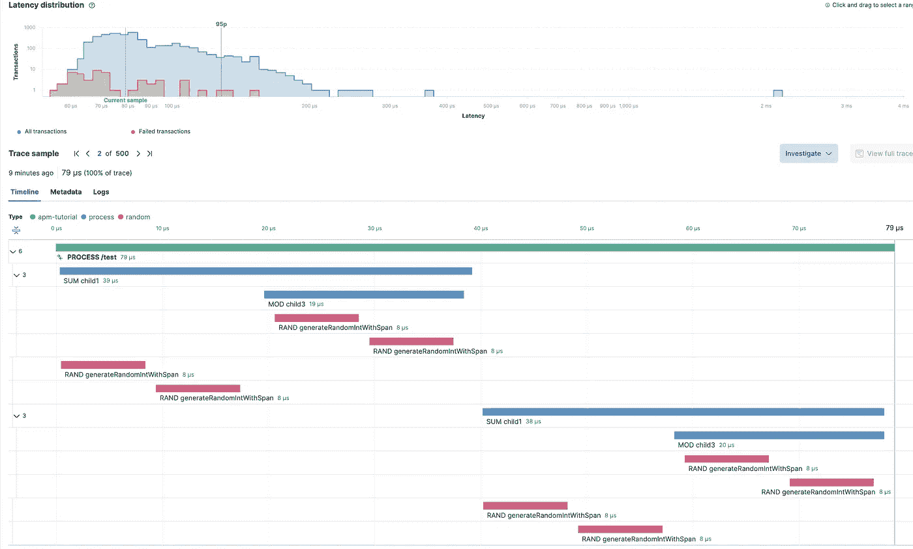
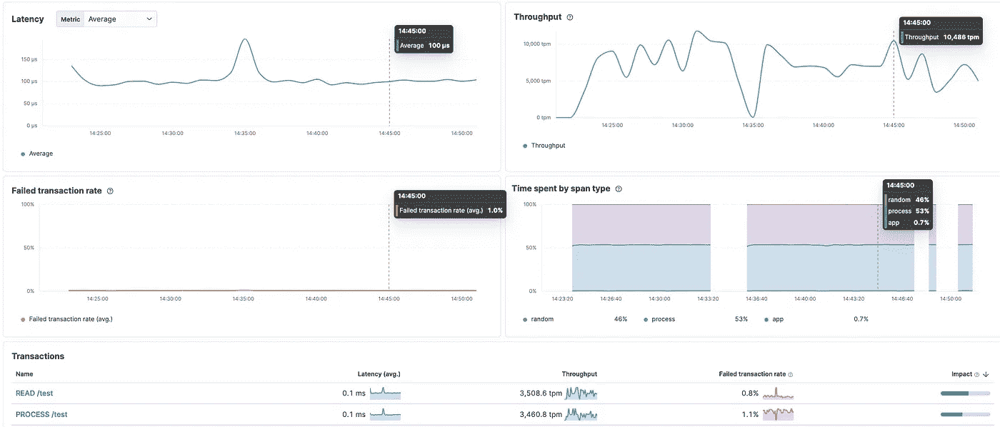

# GoLang 服务:Kibana APM 的度量工具

> 原文：<https://blog.devgenius.io/golang-services-metrics-instrumentation-for-kibana-apm-8d9fa8658af2?source=collection_archive---------4----------------------->

在本文中，我将解释指标的重要性、上下文传播在这种情况下的工作方式、现成的指标以及如何构建您自己的定制指标以导出到 Kibana APM。


# 先决条件

*   GoLang 的基础知识是必需的，因为我不会涉及基础知识。(Golang 版)
*   这并不包括 Kibana 或弹性搜索集群的设置，只是 GoLang 的一部分
*   你选择的 IDE，VSCode 是我的首选

# 介绍

您构建的服务越复杂，您就需要越多的内部信息来监控和理解它在运行时发生了什么。工程微服务不仅仅是构建快速逻辑机器，还必须可靠，易于发现生产中的错误或性能下降。实现这一点的一个重要领域是度量。

去年，我有机会领导我的团队的一个最重要的项目，该项目专注于在我们的空间中整合不同层次的监控、[日志记录](/golang-logging-101-a-journey-for-the-perfect-system-838fc466ecaa)和指标。我们包含不同的服务，从实时摄取到处理数百万事务的 API，自从我加入团队以来，我们的调试就是一场猜谜游戏。

# 基巴纳 APM

Kibana APM 是 [Elastic](https://www.elastic.co/) 提供的服务之一，翻译过来就是“应用性能监控”。有了这个，你就可以可视化内部过程和它们的分解。APM 指标控制面板看起来是这样的:



来自以下测试案例的仪表板

# 度量分解

度量的基础包括两个概念:事务和跨度。这两者与上下文传播概念相结合，使得 APM 指标非常强大。如果你想从基巴纳获得更多信息，这里有[文档](https://www.elastic.co/guide/en/kibana/master/xpack-apm.html)。

一个[事务](https://www.elastic.co/guide/en/apm/agent/go/current/custom-instrumentation.html#custom-instrumentation-transactions)是 APM 代理发送的主要信息。它是顶级操作，描述您想要导出的主要指标。主要用途是 HTTP，gRPC 请求，数据转换过程，循环等。span 是二级操作，通常称为事务的子级。一种常见的模式是拥有一个父事务，它描述了要监控的整个流程，以及要跨越的流程中的函数调用或代码段。这是标准指标的伪代码表示:

```
func MainOperation(ctx context, …) {
   startTransaction(ctx)
   ...
   // logic here
   ...
   ChildFunction1(ctx, ...)
   ...
   ChildFunction2(ctx, ...)
   ...
   closeTransaction()
}func ChildFunction1(ctx, ...){
   startSpan(ctx)
   ...
   closeSpan()}
func ChildFunction2(ctx, ...){
   startSpan(ctx)
   ...
   closeSpan()}
```

上面的表示显示了度量流的基本原理。我们使用一个上下文来启动父事务(如果上下文没有作为参数传递，那么可以在这里创建它)。在这一阶段，我们可以将类型和名称等信息添加到事务中。这里开始记录指标，我们将上下文(包含事务信息)传递给我们的子函数来创建跨度。

我做了这个伪代码，这样任何人(不仅仅是 Golang)都可以在他们的空间中实现这个流程。但是现在让我们把它编码成地鼠:

有了这种模式，您可以随心所欲地使用您的度量标准，几乎没有依赖性。需要了解的关键概念是事务和垃圾邮件的名称和类型，将它们作为弹性组进行聚合，以便在仪表板中进一步显示。

开箱即用的 APM 包如 [mongoDB](https://www.elastic.co/guide/en/apm/agent/go/current/builtin-modules.html#builtin-modules-apmmongo) 或 [gRPC](https://www.elastic.co/guide/en/apm/agent/go/current/builtin-modules.html#builtin-modules-apmgrpc) 完美地支持这个流程，你只需要使用上下文传播到它们的函数中。

APM 代理(如果配置正确)将自动捕获这些指标，但是为了 APM 代理能够正常工作，您还需要实现一件事情。Kibana 文档没有明确指定，但是，您需要包含一个带有 APM wrap [函数](https://www.elastic.co/guide/en/apm/agent/go/current/supported-tech.html#supported-tech-web-frameworks)的 http 服务器。

这是 go-chi 的样板路由器代码片段，对于这种情况来说已经足够了:

# 例子

为了可视化度量流如何在 Kibana 中显示，我建立了一个随机触发的流程链。值得注意的是，这是一个关于指标逻辑如何工作的通用示例，而不是一个特定的真实世界代码。完整的代码，点击[这里](https://github.com/javiersoto15/metrics-tutorial)

这是一个随机触发数千次的过程。目的是看看事务是如何被分解成子跨度的，直到您将它们添加到代码中。

这是事务样本的可视化。它详细解释了每个过程所用的时间、它们之间的层次结构以及您可以添加的额外信息。



我添加了一个不同的事务，并一起运行它们，以向您展示按名称聚合的不同类型的事务的事务面板的外观:



平均延迟、时间间隔内的吞吐量、故障率等指标。

我的建议是通过配置每个交易/垃圾邮件的类型和名称，将每个交易/垃圾邮件分类。我们的一个用例是，每笔交易都对应于一条 Kafka 消息，每条消息都被分解成与所通过的业务逻辑相关联的跨度。

这个系统极大地帮助了我的团队，因为它为我们提供了完美显示的数据，以及性能和错误率等信息。在生产环境中，越快获得这些信息，就能越快地分析服务对客户的可用性。

任何反馈都很感谢，并关注更多类似的文章。

感谢您的阅读:)