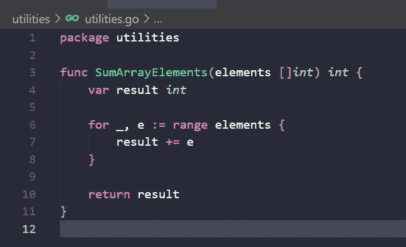

# Golang 单元测试

> 原文：<https://blog.devgenius.io/golang-unit-testing-dd5c2de2c8a5?source=collection_archive---------3----------------------->

## 有用的建议


在这篇文章中，我将讨论如何使用单元测试来测试我们的 Golang 代码，我将向您展示一些测试代码的建议和最佳实践。

## 什么是单元测试？

简言之，单元测试是测试可以从逻辑中分离出来的小段代码的方法。源代码片段可以是函数、方法、子程序等。我们希望确保正确的功能性，涵盖好的途径和可能的失败途径。

每个单元测试都被管理来实现测试用例，在这些测试用例中，我们将定义与要测试的代码片段相关的所有可能的场景。

实现单元测试在我们的开发过程中非常有帮助，因为我们可以:

*   识别缺陷和错误。
*   提高质量。
*   减少组件行为中的缺陷。
*   检测性能问题。
*   验证输入和/或输出是否按预期工作。
*   等等。

正如你从上面的例子中看到的，测试你的代码为我们正在开发的软件带来了很多好处，减少了在交付和准备使用之前在我们的应用程序中发现错误的可能性。

有一些测试方法，比如 TDD(测试驱动设计),在编写代码时非常有用，因为我们将从测试开始开发代码，只编写几行代码来满足单元测试，但是我们可以在单独的文章中讨论。这次我将向你展示如何为 golang 代码编写一个单元测试。

## 单元测试最佳实践

*   养成测试代码的习惯
*   测试用例应该是独立的。
*   定义测试用例，尝试覆盖代码单元几乎所有可能的输出，包括成功结果和预期错误。
*   如果您在运行单元测试的逻辑中发现了一个 bug，您应该在继续开发之前修复它
*   先测试。
*   只为重要的事情添加单元测试。
*   遵循当时的命名约定来定义测试函数。
*   在你的测试用例中要描述清楚。
*   如果源代码改变，确保所有相应的测试覆盖新的逻辑。
*   保持测试更新。
*   一次只测试一段代码。

## 如何测试我的 golang 代码？

让我从一个简单的例子开始，我们将定义一个简单的函数来对数组中的所有元素求和，这个函数是从 main 函数调用的。



我们将要实现的测试是针对`SumArrayElements`函数的。

我们需要做的第一件事是创建一个与源代码文件同名的新文件，但是我们要在名称中包含后缀`_test`(这是我们在运行时命名测试文件的方式)。


在该文件中，我们将包括我们的测试函数，让我们开始:


如你所见，为了定义测试，我们声明了一个带有前缀`Test`的函数，它将一个指向`testing.T`的变量作为参数。目前，定义测试函数的工作已经完成，现在让我们来编写测试逻辑。

所需的测试逻辑可能如下:


我们需要定义函数输入和预期结果，然后调用函数并用预期结果验证结果，如果值不同，测试失败。

现在同样的例子，但是现在使用`assertions`实现`https://github.com/stretchr/testify`:

您可以使用`go get github.com/stretchr/testify`来安装依赖项。


那里有什么不同？因此，现在我们使用比较值的`assert.Equal`，而不是使用`if`进行验证。

要运行我们的测试，我们只需要在终端上执行以下命令:

`go test -cover ./...`


现在，我们需要为这个简单的函数创建测试。

## 嘲弄的

在这一节，我们将看到如何模拟更复杂的函数，这些函数通常是通过使用接口来实现的。

假设我们有以下源代码:

*   与外部服务的连接
*   一个使用服务的层
*   简单来说，main 函数将执行代码


`main.go`

```
package main

import (
 "github.com/josue/golang_testing/connection"
 "github.com/josue/golang_testing/consumer"
)

func main() {
 consumerService := consumer.NewService(connection.NewService())
 consumerService.GetData()

 consumerService.SendData(connection.Data{
  FieldOne: "value1",
  FieldTwo: "value2",
 })
}
```

`service_consumer.go`

这个文件将实现对外部服务的所有调用，正如您所看到的，所有调用都是通过使用接口和依赖注入来完成的。

```
package consumer

import (
 "fmt"
 "time"

 "github.com/josue/golang_testing/connection"
)

type serviceConsumer struct {
 // more properties
 Srv connection.Service
}

type ServiceConsumer interface {
 SendData(data connection.Data) error
 GetData() (*connection.Data, error)
}

func NewService(svc connection.Service) ServiceConsumer {
 return serviceConsumer{
  Srv: svc,
 }
}

func (s serviceConsumer) SendData(data connection.Data) error {
 fmt.Println("completed on SendData")

 err := s.Srv.SendData(data)
 if err != nil {
  fmt.Println("error sending data: ", err.Error())
  return err
 }

 return nil
}
func (s serviceConsumer) GetData() (*connection.Data, error) {
 fmt.Println("on GetData")
 time.Sleep(1 * time.Second)

 data, err := s.Srv.GetData()
 if err != nil {
  fmt.Println("error getting data: ", err.Error())
  return nil, err
 }

 fmt.Println("completed on GetData")
 return &data, nil
}
```

和服务连接`service.go`

这个文件是一个外部连接的伪表示，在那里定义的方法将被服务消费者使用。

```
package connection

import (
 "errors"
 "fmt"
 "time"
)

type Data struct {
 FieldOne string
 FieldTwo string
}

type service struct {
 // more properties
}

type Service interface {
 SendData(data Data) error
 GetData() (Data, error)
}

func NewService() Service {
 return &service{
  //set more properties
 }
}

func (s *service) SendData(data Data) error {
 fmt.Println("on SendData")
 time.Sleep(1 * time.Second)

 if data.FieldOne == "" {
  return errors.New("FieldOne can not be a empty string")
 }
 if data.FieldOne == "" {
  return errors.New("FieldTwo can not be a empty string")
 }

 fmt.Println("completed on SendData")

 return nil
}

func (s *service) GetData() (Data, error) {
 fmt.Println("on GetData")
 time.Sleep(1 * time.Second)
 fmt.Println("completed on GetData")
 return Data{
  FieldOne: "exmple",
  FieldTwo: "example two",
 }, nil
}
```

不要想象你不想在测试中遇到真正的服务，以避免请求饱和，将测试数据推送到可能的数据库，避免数据损坏，等等。，那么我们需要实现模拟，这就是`mockgen`框架帮助我们的地方。

Mockgen 将帮助我们生成模拟我们的方法所需的所有 ew，这样做对使用接口非常重要，因为框架将带它们生成 mock。

首先，我们需要使用以下方法获得依赖框架:

```
go install github.com/golang/mock/mockgen@v1.6.0
```

在定位到服务包之后，我们需要生成模拟文件:

```
mockgen -source=service.go -destination=mock/service_mock.go
```

这将在模拟文件夹中自动生成一个文件。该文件将包含与被模仿的服务一起工作所需的所有内容。


一旦我们都生成了，是时候在我们的测试中实现模拟了。

在这个小例子中，您可以看到我们如何使用 mocks 并模拟到我们服务的连接。

如果你有兴趣了解更多关于 mockgen 的信息，你可以使用官方页面:https://github.com/golang/mock[](https://github.com/golang/mock)

```
package consumer

import (
 "testing"

 "github.com/golang/mock/gomock"
 "github.com/josue/golang_testing/connection"
 mock_service "github.com/josue/golang_testing/connection/mock"
 "github.com/stretchr/testify/assert"
)

func TestGetData(t *testing.T) {

 ctrl := gomock.NewController(t)
 defer ctrl.Finish()

 mockSvcConn := mock_service.NewMockService(ctrl)
 svcConsumer := NewService(mockSvcConn)

 testData := connection.Data{
  FieldOne: "test value 1",
  FieldTwo: "test value 2",
 }

 mockSvcConn.EXPECT().
  GetData().
  Times(1).
  Return(testData, nil)

 result, err := svcConsumer.GetData()

 assert.Nil(t, err)
 assert.Equal(t, result.FieldOne, testData.FieldOne)
 assert.Equal(t, result.FieldTwo, testData.FieldTwo)
}

func TestSendData(t *testing.T) {

 ctrl := gomock.NewController(t)
 defer ctrl.Finish()

 mockSvcConn := mock_service.NewMockService(ctrl)
 svcConsumer := NewService(mockSvcConn)

 testData := connection.Data{
  FieldOne: "test value 1",
  FieldTwo: "test value 2",
 }

 mockSvcConn.EXPECT().
  SendData(gomock.Any()).
  Times(1).
  Return(nil)

 err := svcConsumer.SendData(testData)

 assert.Nil(t, err)
}
```

现在我们只需要使用 golang 工具运行测试。

## 实施测试表方法

当我们进行测试时，我们通常定义测试用例来覆盖代码逻辑中所有可能的流程，这些测试用例可以定义为 golang 测试函数，每个测试用例一个。现在想象一下，我们有很多测试用例，我们必须为每个重复公共代码的测试用例定义一个测试函数，这里是测试表来帮助我们减少测试，只定义一个测试函数来覆盖所有可能的场景。

让我们看一个小例子:

考虑一个函数来验证学生是否同意基于以下内容的课程:

*   学生一年应该有将近 5 节课。
*   所有课程的分数至少要达到 80 分。
*   班级成绩总分应该在 400 到 500 分之间。

函数进行测试，这里定义的逻辑涵盖了上面所有的点:

```
package course

import (
 "errors"
)

type class struct {
 Name  string
 Score int
}

func IsStudentCourseApproved(classes []class) error {

 var total int

 if len(classes) < 5 {
  return errors.New("Invalid number or classes")
 }

 for _, c := range classes {
  total += c.Score
  if c.Score < 80 {
   return errors.New("the class score should be more than 80 points")
  }
 }

 if total < 400 {
  return errors.New("the sum of all classes score should be more than 400 points")
 }

 return nil
}
```

现在我们需要定义我们的测试文件和测试函数，在那里我们将实现测试表。为了简单起见，我将为函数定义两个测试用例，一个用于快乐之路，另一个用于学生没有完成所有必修课的情况。

```
package course

import (
 "github.com/stretchr/testify/assert"
 "testing"
)

func TestIsStudentCourseApproved(t *testing.T) {

 tt := []struct {
  name       string
  data       []class
  hasFailure bool
  errMsg     string
 }{
  {
   name: "happy path",
   data: []class{
    {
     Name:  "math",
     Score: 100,
    },
    {
     Name:  "histoty",
     Score: 100,
    },
    {
     Name:  "art",
     Score: 100,
    },
    {
     Name:  "sport",
     Score: 100,
    },
    {
     Name:  "sciences",
     Score: 100,
    },
   },
   hasFailure: false,
   errMsg:     "",
  },
  {
   name: "Invalid number or classes",
   data: []class{
    {
     Name:  "math",
     Score: 100,
    },
    {
     Name:  "histoty",
     Score: 100,
    },
    {
     Name:  "art",
     Score: 100,
    },
   },
   hasFailure: true,
   errMsg:     "Invalid number or classes",
  },
 }

 for _, tc := range tt {
  t.Run(tc.name, func(t *testing.T) {
   err := IsStudentCourseApproved(tc.data)

   if tc.hasFailure {
    assert.NotNil(t, err)
    assert.Equal(t, err.Error(), tc.errMsg)
   } else {
    assert.Nil(t, err)
   }
  })
 }
}
```

正如你所看到的，我们使用了一个 struct 类型的数组，它定义了我们的测试用例所需的所有字段，在这个例子中，我们有测试名称，当测试用例需要一个错误时预期的错误消息，以及测试数据。

然后我们将迭代测试用例，并使用当前信息执行测试。

简单对吗？，…现在你有了开始在你的 golang 代码中应用测试的基础。

额外奖励:

*   总是测试你的代码
*   试着学习 TDD，这会帮助你变得更好。
*   记住只测试需要测试的东西。
*   不断学习。

希望这篇文章对你有帮助！！…感谢您的阅读！