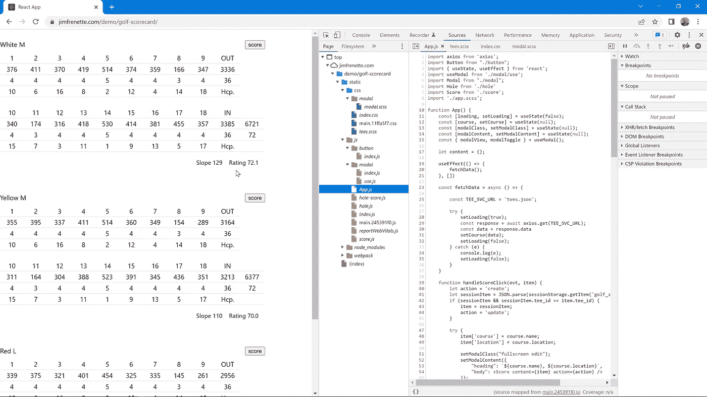
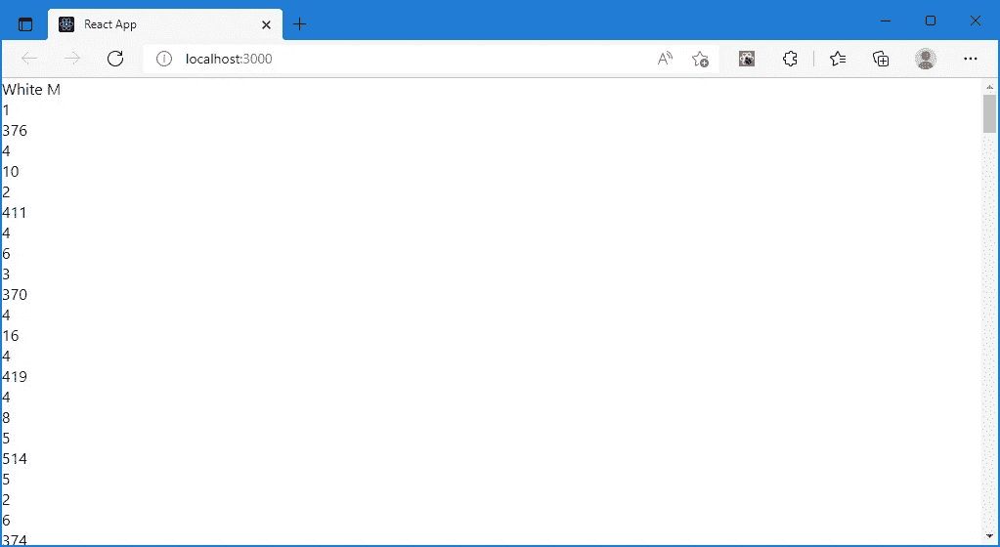
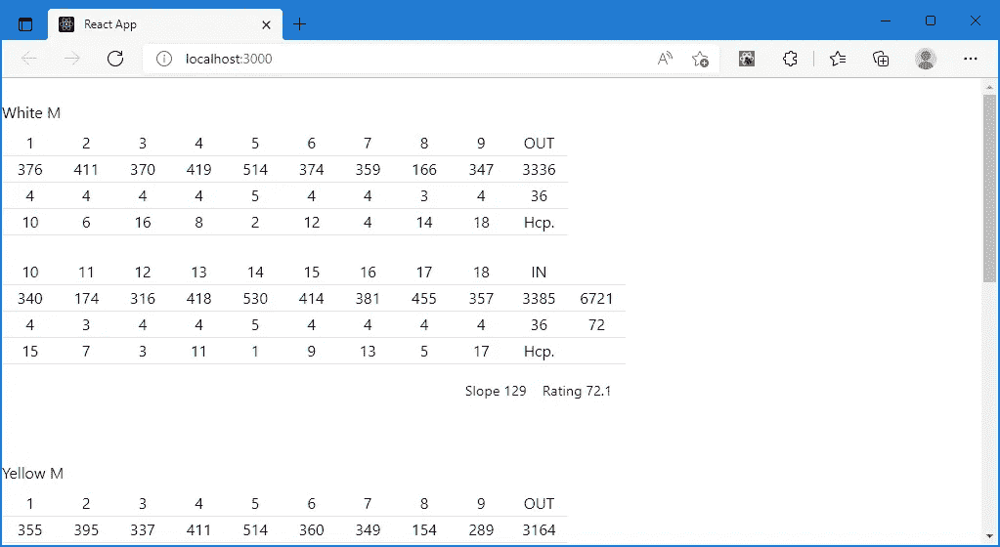
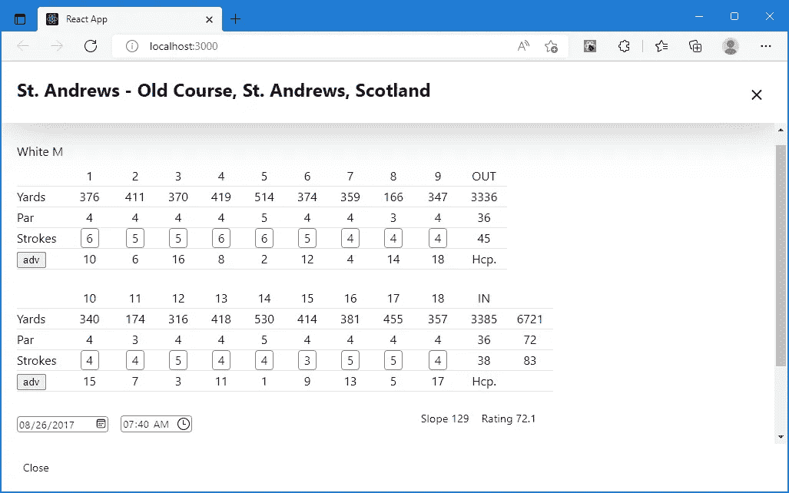
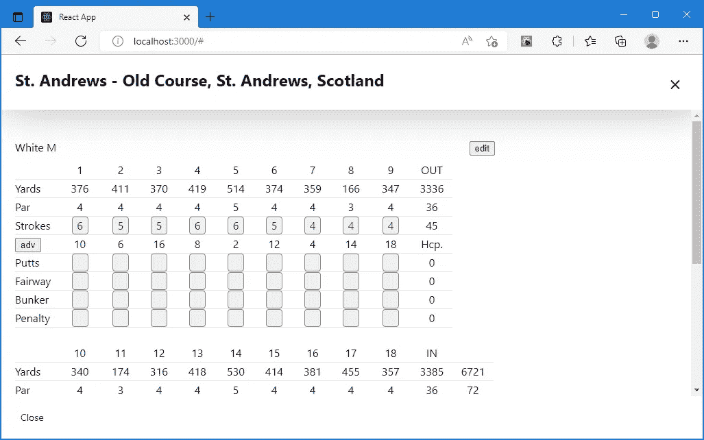

# 高尔夫记分卡反应应用程序

> 原文：<https://blog.devgenius.io/golf-scorecard-react-app-5d4f4a7e20b8?source=collection_archive---------10----------------------->

本教程演示了如何创建一个 react 应用程序，它在许多高尔夫应用程序中使用。一种显示和编辑高尔夫球场记分卡数据的方法。您可以在此 处查看应用 [**的演示**](https://jimfrenette.com/demo/golf-scorecard/)



带源地图的演示

React 的 [Create a New React App](https://reactjs.org/docs/create-a-new-react-app.html) 页面上记录了为本地开发设置 React 应用程序的各种方法。我们将使用 React 所说的“在 React 中开始构建新的单页面应用程序的最佳方式”

## 创建 React 应用

```
npx create-react-app golf-scorecard
cd golf-scorecard
npm start
```

在撰写本文时，`create-react-app`脚本生成一个样板应用程序，`npm start`为您启动一个本地开发服务器。例如，你应该在`localhost:3000`看到一个带有动画 React 标志的页面。

让我们从安装高尔夫记分卡应用程序所需的 [axios](https://github.com/axios/axios) 节点模块开始。该模块用于从高尔夫球场数据源获取数据，并将数据发送到高尔夫球场数据源。

```
npm i axios
```

## 高尔夫球场数据

在现实世界中，我们的应用程序将从 REST API 获取高尔夫球场数据。我们将用一个包含课程数据的`tees.json`文件来模拟这种情况，该文件的格式与典型的 REST 服务的响应格式相同。

将这个 [tees.json](https://jimfrenette.com/demo/golf-scorecard/tees.json) 文件保存并复制到`golf-scorecard/public`文件夹中。

> *使用* `*wget*` *下载 tees.json 文件。例如:*

```
wget -L https://jimfrenette.com/demo/golf-scorecard/tees.json

mv tees.json public/tees.json
```

# 应用

我们的 React 应用程序需要一个组件来呈现记分卡上的每个高尔夫球洞。在`src`文件夹中，创建这个`hole.js` React 组件文件，我们将把它导入到我们的`App.js`中。

**hole.js**

```
.tee-container {
	padding-top: 1**rem**;
	margin-bottom: 1.5**rem**;
	max-width: 30**rem**;

	**input** {
		box-sizing: **border-box**;
		font-family: **inherit**;
		box-shadow: 0 0 0 **transparent**;
		border-radius: 4**px**;
		border: 1**px** **solid** #8c8f94;
		background-color: #fff;
		color: #2c3338;
	}

	**input**[**readonly**] {
		background-color: #f0f0f1;
	}
}

.scorecard {
	.header {
		display: **flex**;
		flex-wrap: **wrap**;
		width: 100**%**;
		padding: 0.5**rem** 0;
		align-items: **center**;

		.btn {
			margin-left: **auto**;
		}
		.btn ~ .btn {
			margin-left: 10**px**;
		}

		.golfer {
			min-width: 100**%**;
		}
	}

	.hole {
		>**div** {
			display: **flex**;
			width: 100**%**;
		}

		.label-wrap {
			text-align: **left**;

			.label {
				padding-right: 8**px**;
			}
		}

		>**div**>**div** {
			min-width: 25**%**;
			min-height: 26**px**;
			line-height: 26**px**;
			white-space: **nowrap**;
			border-bottom: 1**px** **solid** rgba(0, 0, 0, 0.1);
		}

		**input** {
			display: **inline-block**;
			padding: 0 2**px**;
			text-align: **center**;
			width: 24**px**;
			font-size: **inherit**;
			line-height: 1.5;
			min-height: 24**px**;
			text-transform: **uppercase**;
		}
	}

	.footer {
		display: **flex**;
		justify-content: **flex-end**;
		flex-wrap: **wrap**;
		width: 100**%**;
		font-size: 90**%**;
		padding: 0.5**rem**;

		>**div** {
			padding: 0.5**rem**;
		}
	}
}

.edit {

	.tee-container {
		max-width: 700**px**;
	}

	.scorecard {
		display: **flex**;
		flex-wrap: **wrap**;
		max-width: **none**;
		width: 100**%**;

		.adv-toggle {
			cursor: **pointer**;
		}

		.hole {
			min-width: 8**%**;
			text-align: **center**;

			**&**.labels {
				min-width: 14**%**;
				flex-grow: 2;
				display: **flex**;

				>**div** {
					width: 60**%**;
				}
			}

			**&**.sum {
				min-width: 26**%**;
				flex-grow: 3;
				display: **flex**;

				>**div** {
					width: 33**%**;
				}
			}

			>**div** {
				flex-direction: **column**;
			}

			.adv.hide {
				display: **none**;
			}

			**&**.sum~.hole {
				margin-top: 1.5**rem**;
			}
		}

		.footer {
			justify-content: **flex-start**;
			align-items: **flex-end**;
			padding-left: 0;
		}

		.info {
			margin-left: **auto**;

			>**div** {
				display: **inline-block**;
				padding: 0.5**rem**;
			}
		}

		.date-field {
			padding-left: 0;
		}

		.footer **label** {
			display: **block**;
		}

		.notes {
			width: 100**%**;

			>**textarea** {
				width: 100**%**;
			}
		}

		.submit {
			padding-right: 1**rem**;
			padding-left: 2**rem**;
		}

		.footer>**div**:last-child {
			flex: 0 0 100**%**;
			display: **flex**;
			justify-content: **space-between**;
			padding-left: 0;
		}
	}
}

*/* 480 @16 */*
**@media** **screen** **and** (min-width: 30**em**) {
	.course-modal {
		font-size: 16**px**;
	}
}

*/* 768 @16 */*
**@media** **screen** **and** (min-width: 48**em**) {
	.tee-container {
		max-width: 40**rem**;
	}

	.scorecard {
		display: **flex**;
		flex-wrap: **wrap**;
		max-width: **none**;
		width: 100**%**;

		.hole {
			min-width: 9**%**;
			text-align: **center**;

			**&**.sum {
				min-width: 26**%**;
				flex-grow: 3;
				display: **flex**;

				>**div** {
					width: 33**%**;
				}

				~.hole {
					margin-top: 1.5**rem**;
				}
			}

			>**div** {
				flex-direction: **column**;
			}
		}
	}
}

*/* 1024 @16 */*
**@media** **screen** **and** (min-width: 64**em**) {
	.tee-container {
		max-width: 64**em**;
	}

	.scorecard .hole {
		display: **flex**;
		align-items: **flex-start**;
		min-width: 4.5**%**;

		**&**.sum {
			min-width: 10**%**;

			~.hole {
				margin-top: **auto**;
			}
		}
	}
}
```

现在我们到了有趣的部分，我们将编辑运行`create-react-app`时创建的样板文件`src/App.js`。

**App.js**

```
**import** axios from 'axios';
**import** { useState, useEffect } from 'react';
**import** Hole from './hole'

**function** App() {
	**const** [loading, setLoading] = useState(**false**);
	**const** [course, setCourse] = useState(**null**);

	**let** content = {};

    useEffect(() => {
		fetchData();
	}, [])

	**const** fetchData = **async** () => {

		**const** TEE_SVC_URL = 'tees.json';

		**try** {
			setLoading(**true**);
			**const** response = **await** axios.get(TEE_SVC_URL);
			**const** data = response.data
			setCourse(data);
			setLoading(**false**);
		} **catch** (e) {
			console.log(e);
			setLoading(**false**);
		}
	}

	**if** (loading || course == **null**) {
		content.list = <div>Loading...</div>;
	} **else** {
		**let** yardsOut,
			yardsIn,
			yards,
			parOut,
			parIn,
			par;

		content.list = course.tees.map((item) => {
			yardsOut = 0;
			yardsIn = 0;
			yards = 0;
			parOut = 0;
			parIn = 0;
			par = 0;
			**return** (
				<div className="tee-container">
					<div className="scorecard">
						<div className="header">
							<div className="tee">{item.tee} {item.gender}</div>
						</div>
						{item.holes.map((hole, i) => {
							yards = yards + Number(hole.yards);
							par = par + Number(hole.par);
							**if** (i < 9) {
								yardsOut = yardsOut + Number(hole.yards);
								parOut = parOut + Number(hole.par);
							}
							**if** (i > 8) {
								yardsIn = yardsIn + Number(hole.yards);
								parIn = parIn + Number(hole.par);
							}
							**return** (
								<Hole index={i} item={hole} yardsOut={yardsOut} yardsIn={yardsIn} yards={yards} parOut={parOut} parIn={parIn} par={par} />
							);
						})}
						<div className="footer">
							<div>Slope {item.slope}</div>
							<div>Rating {item.rating}</div>
						</div>
					</div>
				</div>
			);
		});
  }

  **return** (
	<div className="course">
		{content.list}
	</div>
	)
}

**export** **default** App;
```

该应用程序现在应该呈现所有的记分卡数据，但没有任何样式，很难理解这里显示的内容。



让我们创建一些 Sass 文件来生成我们的应用程序 css，但是首先我们需要安装一个 Sass 处理器。您需要首先使用 Ctrl+c 停止当前正在运行的 React 脚本。一旦您完成了 Sass 的安装，您可以使用`npm start`再次启动本地开发环境。

安装 Sass

```
npm i sass
```

在`src`文件夹中，创建这个`tees` Sass 模块。

**蒂斯. scss**

```
.tee-container {
	padding-top: 1**rem**;
	margin-bottom: 1.5**rem**;
	max-width: 30**rem**;

	**input** {
		box-sizing: **border-box**;
		font-family: **inherit**;
		box-shadow: 0 0 0 **transparent**;
		border-radius: 4**px**;
		border: 1**px** **solid** #8c8f94;
		background-color: #fff;
		color: #2c3338;
	}

	**input**[**readonly**] {
		background-color: #f0f0f1;
	}
}

.scorecard {
	.header {
		display: **flex**;
		flex-wrap: **wrap**;
		width: 100**%**;
		padding: 0.5**rem** 0;
		align-items: **center**;

		.btn {
			margin-left: **auto**;
		}
		.btn ~ .btn {
			margin-left: 10**px**;
		}

		.golfer {
			min-width: 100**%**;
		}
	}

	.hole {
		>**div** {
			display: **flex**;
			width: 100**%**;
		}

		.label-wrap {
			text-align: **left**;

			.label {
				padding-right: 8**px**;
			}
		}

		>**div**>**div** {
			min-width: 25**%**;
			min-height: 26**px**;
			line-height: 26**px**;
			white-space: **nowrap**;
			border-bottom: 1**px** **solid** rgba(0, 0, 0, 0.1);
		}

		**input** {
			display: **inline-block**;
			padding: 0 2**px**;
			text-align: **center**;
			width: 24**px**;
			font-size: **inherit**;
			line-height: 1.5;
			min-height: 24**px**;
			text-transform: **uppercase**;
		}
	}

	.footer {
		display: **flex**;
		justify-content: **flex-end**;
		flex-wrap: **wrap**;
		width: 100**%**;
		font-size: 90**%**;
		padding: 0.5**rem**;

		>**div** {
			padding: 0.5**rem**;
		}
	}
}

.edit {

	.tee-container {
		max-width: 700**px**;
	}

	.scorecard {
		display: **flex**;
		flex-wrap: **wrap**;
		max-width: **none**;
		width: 100**%**;

		.adv-toggle {
			cursor: **pointer**;
		}

		.hole {
			min-width: 8**%**;
			text-align: **center**;

			**&**.labels {
				min-width: 14**%**;
				flex-grow: 2;
				display: **flex**;

				>**div** {
					width: 60**%**;
				}
			}

			**&**.sum {
				min-width: 26**%**;
				flex-grow: 3;
				display: **flex**;

				>**div** {
					width: 33**%**;
				}
			}

			>**div** {
				flex-direction: **column**;
			}

			.adv.hide {
				display: **none**;
			}

			**&**.sum~.hole {
				margin-top: 1.5**rem**;
			}
		}

		.footer {
			justify-content: **flex-start**;
			align-items: **flex-end**;
			padding-left: 0;
		}

		.info {
			margin-left: **auto**;

			>**div** {
				display: **inline-block**;
				padding: 0.5**rem**;
			}
		}

		.date-field {
			padding-left: 0;
		}

		.footer **label** {
			display: **block**;
		}

		.notes {
			width: 100**%**;

			>**textarea** {
				width: 100**%**;
			}
		}

		.submit {
			padding-right: 1**rem**;
			padding-left: 2**rem**;
		}

		.footer>**div**:last-child {
			flex: 0 0 100**%**;
			display: **flex**;
			justify-content: **space-between**;
			padding-left: 0;
		}
	}
}

*/* 480 @16 */*
**@media** **screen** **and** (min-width: 30**em**) {
	.course-modal {
		font-size: 16**px**;
	}
}

*/* 768 @16 */*
**@media** **screen** **and** (min-width: 48**em**) {
	.tee-container {
		max-width: 40**rem**;
	}

	.scorecard {
		display: **flex**;
		flex-wrap: **wrap**;
		max-width: **none**;
		width: 100**%**;

		.hole {
			min-width: 9**%**;
			text-align: **center**;

			**&**.sum {
				min-width: 26**%**;
				flex-grow: 3;
				display: **flex**;

				>**div** {
					width: 33**%**;
				}

				~.hole {
					margin-top: 1.5**rem**;
				}
			}

			>**div** {
				flex-direction: **column**;
			}
		}
	}
}

*/* 1024 @16 */*
**@media** **screen** **and** (min-width: 64**em**) {
	.tee-container {
		max-width: 64**em**;
	}

	.scorecard .hole {
		display: **flex**;
		align-items: **flex-start**;
		min-width: 4.5**%**;

		**&**.sum {
			min-width: 10**%**;

			~.hole {
				margin-top: **auto**;
			}
		}
	}
}
```

在`golf-scorecard/src`文件夹中，将`App.css`重命名为`app.scss`。

```
*# navigate to the src directory*
cd src

mv App.css app.scss
```

将这一行添加到`app.scss`以导入新的`tees` Sass 模块。

**app.scss**

```
**@import** "./tees";
```

现在我们需要将`app.scss`导入到 React 应用程序中。您可以在导入孔组件后，在应用程序顶部附近添加此导入。例如

**App.js**

```
**import** axios from 'axios';
**import** { useState, useEffect } from 'react';
**import** Hole from './hole'
**import** './app.scss';

...
```

现在，通过一些造型，它开始看起来像高尔夫记分卡。



# 分数模型

现在，我们将为一个可以输入课程分数的模型添加组件。每门课程都有一个分数按钮，用于打开表单输入分数。

在`src`文件夹中，在名为 button 的新文件夹中创建按钮组件文件，如下所示。

```
*# you should be in the src directory*

mkdir button
cd button
touch index.js
```

我们在这里做的是创建一个包含新的`index.js`文件的`button`子目录。

将下面的 JavaScript 添加到我们的`button/index.js`中。

**index.js**

```
**function** Button(props) {
	**return** (
		<div className='btn'>
			<button onClick={(evt) => props.click(evt, props.item)} disabled={props.disabled}>
				{props.icon && <span className={props.icon}></span>}
				<span className="btn-text">{props.label}</span>
			</button>
		</div>
	)
}

**export** **default** Button;
```

我们的模态需要一个`index.js`和一个`use.js`文件，所以让我们创建`modal`子目录及其两个空的 javascript 文件，稍后我们将向其中添加代码。

```
*# you should be in the src directory*

mkdir modal
cd modal
touch index.js use.js
```

对于我们的模型，我们将创建一个自定义的 React 挂钩。打开`use.js`文件进行编辑，并添加以下自定义 react 钩子代码。

**use.js**

```
**import** { useState, useEffect } from 'react';
*/**
 * useModal
 * @returns Custom React Hook
 * usage:`const {modalView, modalToggle} = useModal();`
 *       `modalToggle();` e.g., for onClick
 */*
**const** useModal = () => {
	**const** [modalView, setModalView] = useState(**false**);

	*/**
	 * TODO
	 * Fix this so when multiple modals are open this only applies to the first modal
	 */*
	useEffect(() => {
		**if** (modalView) {
			document.addEventListener('keydown', handleKeyDown);
			document.body.classList.add('light-modal-open');
		} **else** {
			document.body.classList.remove('light-modal-open');
		}
		**return** () => document.removeEventListener('keydown', handleKeyDown);
	}, [modalView]);

	**function** modalToggle() {
		setModalView(!modalView);
	}

	**function** handleKeyDown(event) {
		**if** (event.keyCode !== 27) **return**;
		modalToggle();
	}

	**return** {
		modalView,
		modalToggle,
	}
};

**export** **default** useModal;
```

**index.js**

```
**import** React from 'react';
**import** ReactDOM from 'react-dom'

**function** Modal(props) {
	**const** fragClass = `light-modal **${**props.classes || ''**}**`.trim();

	**return** props.modalView ? ReactDOM.createPortal(
		<React.Fragment>
			<div className={fragClass} aria-modal aria-hidden tabIndex={-1} role="dialog" */*onClick={props.hide}*/*>
				<div className="light-modal-content animated zoomInUp">
					<div className="light-modal-header">
						<h3 className="light-modal-heading">{props.content.heading}</h3>
						<a href="#" className="light-modal-close-icon" onClick={props.hide} aria-label="close">×</a>
					</div>
					<div className="light-modal-body">
						{props.content.body}
					</div>
					<div className="light-modal-footer">
						<a href="#" className="light-modal-close-btn" onClick={props.hide} aria-label="close">Close</a>
						{props.content.footer}
					</div>
				</div>
			</div>
		</React.Fragment>, document.body
	) : **null**;
}

**export** **default** Modal;
```

更新`App.js`现在我们已经创建了模式依赖关系:

**App.js**

```
...

**function** App() {
  **const** [loading, setLoading] = useState(**false**);
  **const** [course, setCourse] = useState(**null**);
  **const** [modalClass, setModalClass] = useState(**null**);
  **const** [modalContent, setModalContent] = useState(**null**);
  **const** { modalView, modalToggle } = useModal();

...
```

# 分数条目

创建这个`score.js` React 组件文件来呈现我们的分数输入表单。

**score.js**

```
**import** { useState, useEffect } from 'react';
*// import axios from 'axios'; // for REST API* **import** Button from "./button";
**import** HoleScore from './hole-score'

**function** Score(props) {
	**const** [loading, setLoading] = useState(**false**);
	**const** [locked, setLocked] = useState(**null**);
	**const** [posted, setPosted] = useState(**null**);
	**const** [strokesOut, setStrokesOut] = useState(0);
	**const** [strokesIn, setStrokesIn] = useState(0);
	**const** [strokesTotal, setStrokesTotal] = useState(0);
	**const** [puttsOut, setPuttsOut] = useState(0);
	**const** [puttsIn, setPuttsIn] = useState(0);
	**const** [puttsTotal, setPuttsTotal] = useState(0);
	**const** [fairwayOut, setFairwayOut] = useState(0);
	**const** [fairwayIn, setFairwayIn] = useState(0);
	**const** [fairwayTotal, setFairwayTotal] = useState(0);
	**const** [bunkerOut, setBunkerOut] = useState(0);
	**const** [bunkerIn, setBunkerIn] = useState(0);
	**const** [bunkerTotal, setBunkerTotal] = useState(0);
	**const** [penaltyOut, setPenaltyOut] = useState(0);
	**const** [penaltyIn, setPenaltyIn] = useState(0);
	**const** [penaltyTotal, setPenaltyTotal] = useState(0);

	**let** content = {};

	useEffect(() => {
		init();
	}, []);

	**const** postData = **async** (data) => {
		*/** In the real world, this would post to a REST API.
			For this demo, we will use session storage and sessionScore state. */*

		*// const SCORE_SVC_URL = `${rest_api_base_url}/score`;* 		**const** body = JSON.stringify(data);

		**try** {
			*// setLoading(true);* 			*// const response = await axios.post(SCORE_SVC_URL, body, {* 			*// 	headers: {* 			*// 		'Content-Type': 'application/json'* 			*// 	}* 			*// });* 
			setLoading(**false**);

			*/** for REST API */*
			*// handleResponse(response);* 
			*/** for demo */*
			window.sessionStorage.setItem('golf_scorecard', body)
			setPosted(
				<div>
					<div>Score: <b>{data.strokesTotal}</b></div>
					<div>{data.course}, {data.location}</div>
					<div>{data.tee}, {data.gender}, rating {data.rating} / slope {data.slope}</div>
					<div>{data.date}, {data.time}</div>
					<div>Notes: {data.notes}</div>
				</div>);
		} **catch** (e) {
			console.log(e);
			setLoading(**false**);
		}
	}

	**let** score,
		yardsOut = 0,
		yardsIn = 0,
		yards = 0,
		parOut = 0,
		parIn = 0,
		par = 0;

	**function** init() {
		**const** allowed = ['L', 'F', 'R'];

		[].slice.call(document.querySelectorAll(`input[name^='fairway_']`)).forEach((el) => {
			el.addEventListener('keydown', **function** (evt) {
				**switch** (evt.key) {
					**case** 'Up': *// IE/Edge* 					**case** 'ArrowUp':
						evt.target.value = 'F';
						**break**;
					**case** 'Left': *// IE/Edge* 					**case** 'ArrowLeft':
						evt.target.value = 'L';
						**break**;
					**case** 'Right': *// IE/Edge* 					**case** 'ArrowRight':
						evt.target.value = 'R';
						**break**;
					**default**:
						evt.target.value = evt.target.value.toUpperCase();
						**if** (allowed.includes(evt.target.value)) {
							**return**;
						}
						**if** (evt.key && !allowed.includes(evt.key.toUpperCase())) {
							evt.target.value = '';
						}
				}

				handleScoreChange(evt);
			}, **true**);
		});

		**if** (props.action == 'update') {
			setLocked('readonly');
			setStrokesOut(props.content.strokesOut);
			setStrokesIn(props.content.strokesIn);
			setStrokesTotal(props.content.strokesTotal);
			setPuttsOut(props.content.puttsOut);
			setPuttsIn(props.content.puttsIn);
			setPuttsTotal(props.content.puttsTotal);
			setFairwayOut(props.content.fairwayOut);
			setFairwayIn(props.content.fairwayIn);
			setFairwayTotal(props.content.fairwayTotal);
			setBunkerOut(props.content.bunkerOut);
			setBunkerIn(props.content.bunkerIn);
			setBunkerTotal(props.content.bunkerTotal);
			setPenaltyOut(props.content.penaltyOut);
			setPenaltyIn(props.content.penaltyIn);
			setPenaltyTotal(props.content.penaltyTotal);
		}
	}

	**function** advToggle(evt) {
		evt.preventDefault();

		[].slice.call(document.querySelectorAll('.edit .hole .adv')).forEach((el) => {
			**if** (el.classList.contains('hide')) {
				el.classList.remove('hide');
			} **else** {
				el.classList.add('hide');
			}
		}, **true**);
	}

	**function** lockToggle(evt) {
		evt.preventDefault();

		**if** (locked == 'readonly') {
			setLocked(**null**);
		} **else** {
			setLocked('readonly');
		}
	}

	**function** sumScores(nodeList) {
		**let** sum = {};
		sum.out = 0;
		sum.**in** = 0;

		[].slice.call(nodeList).forEach((el, index) => {
			**if** (index < 9) {
				sum.out = sum.out + Number(el.value);
			} **else** {
				sum.**in** = sum.**in** + Number(el.value);
			}
		});

		**return** sum;
	}

	*/**
	 * Replaces non-digit element value with an empty string
	 * @param {*} el
	 * @returns
	 */*
	**function** digitVal(el) {
		**if** (el.value && isNaN(el.value)) {
			**return** el.value.replace(/[^\d]+/g,'');
		} **else** {
			**return** el.value;
		}
	}

	**function** handleSubmit(evt) {
		evt.preventDefault();

		score = props.content;

		score['yardsOut'] = yardsOut;
		score['yardsIn'] = yardsIn;
		score['yards'] = yards;
		score['parOut'] = parOut;
		score['parIn'] = parIn;
		score['par'] = par;
		score['strokesOut'] = strokesOut;
		score['strokesIn'] = strokesIn;
		score['strokesTotal'] = strokesTotal;
		score['puttsOut'] = puttsOut;
		score['puttsIn'] = puttsIn;
		score['puttsTotal'] = puttsTotal;
		score['fairwayOut'] = fairwayOut;
		score['fairwayIn'] = fairwayIn;
		score['fairwayTotal'] = fairwayTotal;
		score['bunkerOut'] = bunkerOut;
		score['bunkerIn'] = bunkerIn;
		score['bunkerTotal'] = bunkerTotal;
		score['penaltyOut'] = penaltyOut;
		score['penaltyIn'] = penaltyIn;
		score['penaltyTotal'] = penaltyTotal;

		score['date'] = evt.target.elements.date.value;
		score['time'] = evt.target.elements.time.value;
		score['notes'] = evt.target.elements.notes.value;

		Array.prototype.map.call(evt.target.elements, (el) => {
			**let** name = el.name.split('_');
			**if** (name[1] && el.value.length == 0) {
				**delete** score.holes[name[1]-1][name[0]];
			} **else** **if** (name[1]) {
				score.holes[name[1]-1][name[0]] = el.value;
			}
		});

		postData(score);
	}

	**function** handleScoreChange(evt) {
		**if** (evt.target.name.startsWith('strokes_')) {
			evt.target.value = digitVal(evt.target);
			**const** strokes = document.querySelectorAll(`input[name^='strokes_']`);
			**const** sumStrokes = sumScores(strokes);

			setStrokesOut(sumStrokes.out);
			setStrokesIn(sumStrokes.**in**);
			setStrokesTotal(sumStrokes.**in** + sumStrokes.out);
		}
		**if** (evt.target.name.startsWith('putts_')) {
			evt.target.value = digitVal(evt.target);
			**const** putts = document.querySelectorAll(`input[name^='putts_']`);
			**const** sumPutts = sumScores(putts);

			setPuttsOut(sumPutts.out);
			setPuttsIn(sumPutts.**in**);
			setPuttsTotal(sumPutts.**in** + sumPutts.out);
		}
		**if** (evt.target.name.startsWith('bunker_')) {
			evt.target.value = digitVal(evt.target);
			**const** bunker = document.querySelectorAll(`input[name^='bunker_']`);
			**const** sumBunker = sumScores(bunker);

			setBunkerOut(sumBunker.out);
			setBunkerIn(sumBunker.**in**);
			setBunkerTotal(sumBunker.**in** + sumBunker.out);
		}
		**if** (evt.target.name.startsWith('penalty_')) {
			evt.target.value = digitVal(evt.target);
			**const** penalty = document.querySelectorAll(`input[name^='penalty_']`);
			**const** sumPenalty = sumScores(penalty);

			setPenaltyOut(sumPenalty.out);
			setPenaltyIn(sumPenalty.**in**);
			setPenaltyTotal(sumPenalty.**in** + sumPenalty.out);
		}
		**if** (evt.target.name.startsWith('fairway_')) {
			**const** fairway = document.querySelectorAll(`input[name^='fairway_']`);
			**let** sum = {};
			sum.out = 0;
			sum.**in** = 0;

			[].slice.call(fairway).forEach((el, index) => {
				**if** (el.value == 'F') {
					**if** (index < 9) {
						sum.out = sum.out + 1;
					} **else** {
						sum.**in** = sum.**in** + 1;
					}
				}
			});

			setFairwayOut(sum.out);
			setFairwayIn(sum.**in**);
			setFairwayTotal(sum.**in** + sum.out);
		}
	}

    */** Uncomment this function when using a REST API **/*
	*// function handleResponse(response) {* 	*// 	const data = JSON.parse(response.config.data);* 	*// 	if (response.status == 200) {* 	*// 		setPosted(* 	*// 			<div>* 	*// 				<div>Score: <b>{data.strokesTotal}</b></div>* 	*// 				<div>{data.course}, {data.location}</div>* 	*// 				<div>{data.tee}, {data.gender}, rating {data.rating} / slope {data.slope}</div>* 	*// 				<div>{data.date}, {data.time}</div>* 	*// 				<div>Notes: {data.notes}</div>* 	*// 			</div>);* 	*// 	} else {* 	*// 		setPosted(* 	*// 			<div>* 	*// 				<div>Error: <b>{response.status}</b> {response.statusText}</div>* 	*// 			</div>);* 	*// 	}* 	*// }* 
	**if** (posted) {
		content =
		<div>Score Posted</div>
	} **else** {
		content =
		<form onSubmit={(evt) => handleSubmit(evt)}>
			<div className="tee-container">
			<div className="scorecard">
				<div className="header">
					<div className="tee">{props.content.tee} {props.content.gender}</div>
					{props.action == 'update' &&
						<Button click={lockToggle} label={`**${**locked == 'readonly' ? 'edit' : 'view'**}**`} />
					}
				</div>
				{props.content.holes.map((hole, i) => {
					yards = yards + Number(hole.yards);
					par = par + Number(hole.par);
					**if** (i < 9) {
						yardsOut = yardsOut + Number(hole.yards);
						parOut = parOut + Number(hole.par);
					}
					**if** (i > 8) {
						yardsIn = yardsIn + Number(hole.yards);
						parIn = parIn + Number(hole.par);
					}
					**return** (
						<HoleScore
							locked={locked}
							index={i}
							item={hole}
							yardsOut={yardsOut}
							yardsIn={yardsIn}
							yards={yards}
							parOut={parOut}
							parIn={parIn}
							par={par}
							strokesOut={strokesOut}
							strokesIn={strokesIn}
							strokesTotal={strokesTotal}
							puttsOut={puttsOut}
							puttsIn={puttsIn}
							puttsTotal={puttsTotal}
							fairwayOut={fairwayOut}
							fairwayIn={fairwayIn}
							fairwayTotal={fairwayTotal}
							bunkerOut={bunkerOut}
							bunkerIn={bunkerIn}
							bunkerTotal={bunkerTotal}
							penaltyOut={penaltyOut}
							penaltyIn={penaltyIn}
							penaltyTotal={penaltyTotal}
							advToggle={advToggle}
							scoreChange={handleScoreChange} />
					);
				})}
				<div className="footer">
					<div className="date-field">
						<input type="date" name="date" id="date" defaultValue={props.content.date} readOnly={locked} />
					</div>
					<div className="time-field">
						<input type="time" name="time" id="time" defaultValue={props.content.time} readOnly={locked} />
					</div>
					<div className="info">
						<div>Slope {props.content.slope}</div>
						<div>Rating {props.content.rating}</div>
					</div>
					<div>
						<div className="notes">
							<label htmlFor="notes">Notes</label>
							<textarea name="notes" id="notes" defaultValue={props.content.notes} readOnly={locked} />
						</div>
						<div className="submit">
							<input type="submit" value="Submit" disabled={`**${**locked == 'readonly' ? 'disabled' : ''**}**`} />
						</div>
					</div>
				</div>
			</div>
			</div>
		</form>
	}

	**return** (
		<div className="score">
			{content}
			<div>{posted}</div>
		</div>
	);
}

**export** **default** Score;
```

创建这个`hole-score.js` React 组件文件，在我们的得分输入表单中呈现每个球洞的所有输入。

**hole-score.js**

```
**import** Button from "./button";

**function** HoleScore(props) {
	**let** contentLabels,
		contentOut,
		contentIn,
		contentTotal,
		bunkerInput = `bunker_**${**props.item.number**}**`,
		fairwayInput = `fairway_**${**props.item.number**}**`,
		penaltyInput = `penalty_**${**props.item.number**}**`,
		puttsInput = `putts_**${**props.item.number**}**`,
		strokesInput = `strokes_**${**props.item.number**}**`,
		labels = **false**,
		sum = **false**;

	**if** (props.index == 0 || props.index == 9) {
		contentLabels =
			<div className="label-wrap">
				<div>&nbsp;</div>
				<div>Yards</div>
				<div>Par</div>
				<div className="label">Strokes</div>
				<div className="adv-toggle">
					<Button click={props.advToggle} label="adv" />
				</div>
				<div className="label adv">Putts</div>
				<div className="label adv">Fairway</div>
				<div className="label adv">Bunker</div>
				<div className="label adv">Penalty</div>
			</div>;
		labels = **true**;
	} **else** **if** (props.index == 8) {
		contentOut =
			<div className="out">
				<div>OUT</div>
				<div className="yards">{props.yardsOut}</div>
				<div>{props.parOut}</div>
				<div className="label strokes">{props.strokesOut}</div>
				<div>Hcp.</div>
				<div className="label adv putts">{props.puttsOut}</div>
				<div className="label adv fairway">{props.fairwayOut}</div>
				<div className="label adv bunker">{props.bunkerOut}</div>
				<div className="label adv penalty">{props.penaltyOut}</div>
			</div>;
		sum = **true**;
	} **else** **if** (props.index == 17) {
		contentIn =
			<div className="in">
				<div>IN</div>
				<div className="yards">{props.yardsIn}</div>
				<div>{props.parIn}</div>
				<div className="label strokes">{props.strokesIn}</div>
				<div>Hcp.</div>
				<div className="label adv putts">{props.puttsIn}</div>
				<div className="label adv fairway">{props.fairwayIn}</div>
				<div className="label adv bunker">{props.bunkerIn}</div>
				<div className="label adv penalty">{props.penaltyIn}</div>
			</div>;
		contentTotal =
			<div>
				<div>&nbsp;</div>
				<div className="yards">{props.yards}</div>
				<div>{props.par}</div>
				<div className="label strokes">{props.strokesTotal}</div>
				<div>&nbsp;</div>
				<div className="label adv putts">{props.puttsTotal}</div>
				<div className="label adv fairway">{props.fairwayTotal}</div>
				<div className="label adv bunker">{props.bunkerTotal}</div>
				<div className="label adv penalty">{props.penaltyTotal}</div>
			</div>;
		sum = **true**;
	}

	**return** (
		<div className={`hole**${**sum = sum ? ' sum' : ''**}${**labels = labels ? ' labels' : ''**}**`}>
			{contentLabels}
			<div>
				<div>{props.item.number}</div>
				<div className="yards">{props.item.yards}</div>
				<div>{props.item.par}</div>
				<div><input name={strokesInput} type="tel" required="" aria-required="true" onChange={props.scoreChange} maxLength="2" defaultValue={props.item.strokes} readOnly={props.locked} /></div>
				<div>{props.item.handicap}</div>
				<div className="adv"><input name={puttsInput} type="tel" required="" aria-required="false" onChange={props.scoreChange} maxLength="1" defaultValue={props.item.putts} readOnly={props.locked} /></div>
				<div className="adv"><input name={fairwayInput} type="text" required="" aria-required="false" maxLength="1" defaultValue={props.item.fairway} readOnly={props.locked} /></div>
				<div className="adv"><input name={bunkerInput} type="tel" required="" aria-required="false" onChange={props.scoreChange} maxLength="1" defaultValue={props.item.bunker} readOnly={props.locked} /></div>
				<div className="adv"><input name={penaltyInput} type="tel" required="" aria-required="false" onChange={props.scoreChange} maxLength="1" defaultValue={props.item.penalty} readOnly={props.locked} /></div>
			</div>
			{contentOut}
			{contentIn}
			{contentTotal}
		</div>
	);

}

**export** **default** HoleScore;
```

导入按钮、modal、score 组件并在我们的`App.js`顶部使用 modal hook。举个例子，

**App.js**

```
**import** axios from 'axios';
**import** Button from "./button";
**import** { useState, useEffect } from 'react';
**import** useModal from './modal/use';
**import** Modal from "./modal";
**import** Hole from './hole'
**import** Score from './score';
**import** './app.scss';

...
```

每个球座都有一个按钮，用户可以点击它来输入分数。这个 click 事件调用一个打开模态的函数。该函数接受 evt(event 的缩写)和 item 参数。item 参数包含所有的球座属性，我们的分数条目表单将需要这些属性来呈现相应球座的记分卡。

添加按钮点击事件将绑定到的`handleScoreClick`函数。您可以随时参考[**源代码**](https://github.com/jimfrenette/react-recipes/tree/main/golf-scorecard) 了解更多详细信息。

**App.js**

```
**function** handleScoreClick(evt, item) {
	**let** action = 'create';
	**let** sessionItem = JSON.parse(sessionStorage.getItem('golf_scorecard'));
	**if** (sessionItem && sessionItem.tee_id == item.tee_id) {
		item = sessionItem;
		action = 'update';
	}

	**try** {
		item['course'] = course.name;
		item['location'] = course.location;

		setModalClass("fullscreen edit");
		setModalContent({
			"heading": `**${**course.name**}**, **${**course.location**}**`,
			"body": <Score content={item} action={action} />
		});

		modalToggle();
	} **catch** (e) {
		console.log(e);
	}
}
...
```

更新应用程序以呈现每个球座的得分按钮。找到为每个 t 形球返回标记的这段代码，并添加我们的按钮组件`<Button item={item} click={handleScoreClick} label='score' />`。举个例子，

**App.js**

```
...
**return** (
    <div className="tee-container">
        <div className="scorecard">
            <div className="header">
                <div className="tee">{item.tee} {item.gender}</div>
                <Button item={item} click={handleScoreClick} label='score' />
            </div>
...
```

然后找到靠近应用程序底部的最终返回，并添加我们的模态组件`<Modal modalView={modalView} hide={modalToggle} content={modalContent} classes={modalClass} />`。举个例子，

**App.js**

```
...
**return** (
	<div className="course">
		{content.list}
		<Modal modalView={modalView} hide={modalToggle} content={modalContent} classes={modalClass} />
	</div>
	)
...
```

现在，单击“分数”按钮将在应用程序底部输出带有表单的模态组件标记。让我们添加一些 css，使模型具有覆盖我们的课程和发球台内容所需的样式。将模态导入添加到我们的`app.scss`文件的顶部。

**app.scss**

```
**@import** "./modal/modal";
**@import** "./tees";
```

在模式文件夹中创建这个 Sass。举个例子，

**modal.scss**

```
**body**.light-modal-open {
	overflow: **hidden**;
}

.light-modal {
	--lm-body-bg: #FFF;
	--lm-close-bg: #FFF;
	--lm-small-modal: 30**vw**;
	--lm-large-modal: 50**vw**;
	--lm-font-size: 16**px**;
	position: **fixed**;
	background: rgba(0, 0, 0, 0.5);
	top: 0;
	bottom: 0;
	left: 0;
	align-items: **center**;
	display: **flex**;
	justify-content: **center**;
	right: 0;
	z-index: 9000;
	transition: background 1**s**;
	font-size: var(--lm-font-size);
}

.light-modal-content {
	background: var(--lm-body-bg);
	color: #000;
	width: var(--lm-small-modal);
	border-radius: 0.2**rem**;
	position: **relative**;
	max-height: calc(100**vh** - 150**px**);
	line-height: 1.4;
	display: **flex**;
	flex-direction: **column**;
}

.light-modal-header {
	padding: 20**px** 20**px** 20**px** 20**px**;
	background: var(--lm-body-bg);
	display: **flex**;
	justify-content: **space-between**;
	box-shadow: 0**px** 0**px** 60**px** -3**px** rgb(0 0 0 / 33**%**);
}

.light-modal-heading {
	color: #000;
	margin: 0;
	font-size: 1.5**rem**;
}

.light-modal-body {
	padding: 20**px**;
	overflow: **auto**;
	max-height: 450**px**;
}

.light-modal-footer {
	font-size: 0.875**rem**;
	padding: 20**px** 20**px** 20**px** 20**px**;
	background: var(--lm-body-bg);
	text-align: **right**;
	display: **flex**;
	justify-content: **space-between**;
	align-items: **center**;
}

.light-modal-close-icon,
.light-modal-close-btn {
	text-decoration: **none**;
	color: #000;
	background: var(--lm-close-bg);
	box-shadow: **none** **!important**;
}

.light-modal-close-icon {
	position: **relative**;
	width: 2.5**rem**;
	height: 2.5**rem**;
	font-size: 2**rem**;
	line-height: 2.5**rem**;
	transition: **all** .4**s**;
	text-align: **center**;
	border-radius: 100**%**;

	**&**:hover {
		transform: scale(1.1);
	}
}

.light-modal-close-btn {
	line-height: 1;
	padding: 4**px** 8**px**;
	border-radius: 0.2**rem**;

	**&**:hover {
		transform: scale(1.1);
	}
}

.light-modal.fullscreen {
	.light-modal-body {
		max-height: **none**;
	}

	.light-modal-content {
		width: 100**%**;
		max-height: 100**%**;
	}
}

**@media** (max-width: 1000**px**) {
	.light-modal {
		--lm-small-modal: 70**vw**;
		--lm-large-modal: 70**vw**;
	}
}
```

现在我们可以输入圣安德鲁斯旧球场一轮比赛的分数了



单击高级按钮可切换显示“高级评分”字段。球道字段在其 keydown 事件上有一个监听器，用于将光标按键输入转换为字符值。举个例子，

←翻译为球道左侧开球的`**L**`。
→对于球道右侧的开球，翻译为`**R**`。
↑翻译过来就是球道上开球的`**F**`。

所有其他孔字段只接受数字，因为它们的类型被设置为`tel`。

总数会随着每个孔场的变化而更新。



可以通过选择“编辑”按钮来编辑和重新发布已发布的分数。

原帖可在[https://jimfrenette.com/javascript/react/golf-scorecard/](https://jimfrenette.com/javascript/react/golf-scorecard/)找到