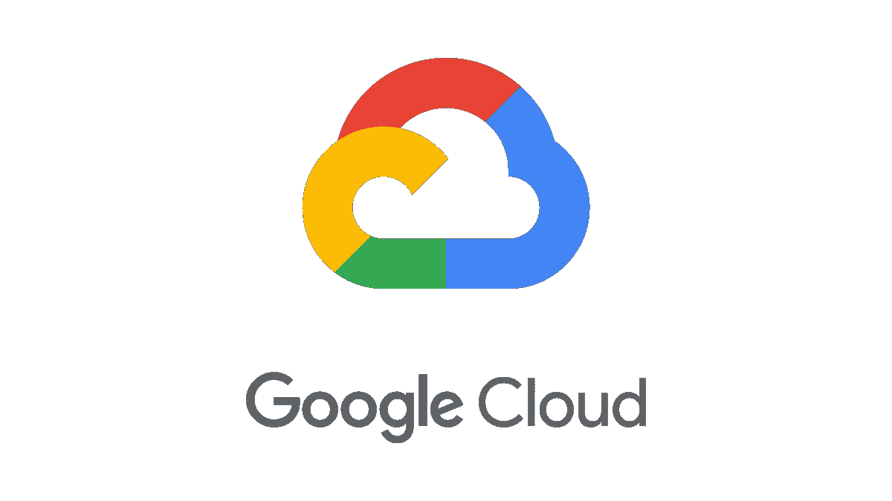

# 谷歌云平台—第 2 部分|完整教程

> 原文：<https://blog.devgenius.io/google-cloud-platform-part-2-complete-tutorial-2e06253858f3?source=collection_archive---------4----------------------->

本文是系列文章的一部分。如果你没看过上一篇文章，可以在这里看[。在你读完那篇文章后，回来享受这篇文章吧！](https://medium.com/dev-genius/the-cloud-part-1-intro-mental-model-bde4ccabcaf3)

# 介绍

因此，基于我们之前的文章，我们已经了解到云是计算机的集合，其主要目标是存储东西，而不是必须存储在*你的*计算机的硬盘上。我们还了解到云的未来是多么有前途，以及越来越多的公司正在向云投入资源。

现在我们已经有了这些背景知识，让我们来看看云服务的 3 个主要参与者，他们提供什么，他们如何工作，以及我们如何在我们的项目中使用他们。如果你完整地阅读了这篇文章，你将确切地知道你需要知道什么来开始。但如果你赶时间，我离开了 TL；(博士太长；没看)段落为你需要知道的最重要的信息；您也可以随意跳过整篇文章，找到与您的需求相关的信息。先说**谷歌云平台(GCP)** 。

谷歌云平台标志

当你第一次看到[谷歌云主页](https://cloud.google.com/)时，它可能看起来令人生畏。所有这些技术和工具都有这些花哨的名字，但不要担心，这与我们在上一篇文章中讨论的没有什么不同。让我们记住谷歌云平台为我们提供了什么(以非学术的定义):

> *谷歌云平台(GCP)允许我们将应用程序放在他们的服务器上，并连接不同的工具和技术，使我们的应用程序可扩展。*

因此，如果你不记得其他任何事情，请记住这个:**本质上，当我们在谷歌云上开发我们的应用程序时，我们将服务混合和匹配成组合，提供我们需要的基础设施，然后添加我们的代码来实现我们想要构建的场景**。咻好了，现在我们有了谷歌云平台(GCP)为我们做什么的坚实基础，让我们在此基础上更深入地了解 GCP 是如何组织的。

> 在我们开始之前，最后一件事:很多技术术语和术语被用来描述产品和用例。这使得穿越 GCP 变得更加困难。在一头扎进 GCP 之前，我建议从基础话题开始，尤其是如果你打算使用 ***计算引擎*** *:*
> 
> 什么是 Linux，流行的 bash 控制台命令有哪些？什么是脚本(。sh)和 YAML 文件？什么是虚拟化？什么是虚拟机？什么是服务器？宋承宪是做什么的？什么是端口和防火墙？什么是 IP 地址和公共/私有网络？
> 
> *我知道这是很多，因为这些都是相当***复杂的话题。但是，只要有一个基本的理解，浏览谷歌云的文档就会变得容易得多，并允许更深层次的理解。**

# ***谷歌云平台的布局***

*你会发现 GCP 有很多工具。看到 GCP 提供的无数选择，可能会让人不知所措。然而，与许多其他云提供商类似，GCP 将他们的工具分成产品，使我们能够找到我们的用例所需的确切工具。最受欢迎的产品包括:*

*   **计算*:在云中计算和托管数据的工具。*
*   **存储和数据库*:存储数据和文件的工具。*
*   **联网*:跨资源负载平衡流量、创建 DNS 记录等工具。*
*   **大数据*:云端查询大数据的工具。*
*   **开发者工具*:开发应用的工具。*
*   *身份和安全:增加应用程序安全性的工具。*
*   **物联网*:构建物联网产品的工具。*
*   **云 AI* :为你的应用添加机器学习的工具*
*   **管理工具*:管理应用程序的工具。*
*   **Google API 平台*:将 Google 的 API 集成到你的应用中的工具。*

*点击查看更多服务[。这是一个很大的列表！但是不用担心。没有必要记住每一项服务。但是，有一个关于你可以用谷歌云平台做的不同类型的事情的宏观视图是很好的。](https://cloud.google.com/terms/services)*

> *(TL；DR):我强烈推荐阅读[谷歌的文档](https://cloud.google.com/docs#get-started)。他们的文档涵盖了我们在 GCP 上启动和运行所需要知道的一切。简而言之，GCP 将其服务分成多个领域；上面列出了最重要的。*

# ***主要特点***

**

*GCP 的主要特色*

## *计算*

*计算是最重要的特性之一，因为它*决定了你在*上运行代码的平台的细节。有 3 个选项可供选择:*

***App Engine** 是一个平台即服务(Paas)。这意味着您只需简单地部署您的代码，平台会为您完成所有其他工作。例如，如果您的应用非常成功，App Engine 将自动创建更多实例来处理增加的数量。*

***计算引擎**是一个基础设施即服务(IaaS)。您必须创建和配置自己的虚拟机实例。它给你更多的灵活性和成本比 App Engine 低得多。缺点是你必须自己管理你的应用和虚拟机。(*所以现在我们开始明白为什么能够理解和管理我们自己的虚拟机是有益的了！*)*

***容器引擎(GKE)** 是一个[集群](https://www.webopedia.com/TERM/C/clustering.html)管理和[容器](https://www.webopedia.com/TERM/C/containerization.html)编排系统，开发用于运行和管理 [Docker](https://www.webopedia.com/TERM/D/docker.html) 容器。*

## *储存；储备*

*下一个重要特性是我们将如何为我们的应用程序存储数据。与大多数云提供商类似，他们有许多可靠的选择，包括:*

*[**云 SQL**](https://www.netsolutions.com/insights/what-is-google-cloud-sql-its-features-and-some-products-that-have-benefited-from-it/) 是帮助管理和存储数据的关系型 MySQL 数据库。为了确保性能和可用性，Google 负责数据库管理、补丁管理和复制。*

*云存储是一种高可用性和持久性的对象存储服务。由于全球范围的边缘缓存，用户可以从任何地方快速访问应用程序中的数据。Google 提供了一个简单的 API，提供了一个健壮的服务级别协议，并运行版本控制来让您以编程方式处理数据。*

***云数据存储**提供了一个无模式、NoSQL、托管的数据库，用于存储非关系数据。除了事务之外，还很好地支持类似 SQL 的查询，并且数据存储也可以根据需要进行扩展。*

***BigQuery** 分析**大数据** ( *使用传统数据库系统*在云中存储、管理和分析通常过于昂贵的数据)。它可以在几秒钟内处理包含几个 TB 的数据集，并运行类似 SQL 的快速查询。它甚至提供实时见解，可扩展且易于使用。*

## *建立工作关系网*

*App Engine 为你管理网络，GKE 使用 [Kubernetes 模型](https://cloud.google.com/kubernetes-engine/docs/concepts/network-overview)，**计算引擎**提供一套网络服务。这些服务可以帮助你在资源间进行流量负载平衡，创建 DNS 记录，并将你现有的网络连接到谷歌的网络。*

## *监控和记录*

*云监控是一组工具，可让您回答重要问题:*

*   *“我的服务健康吗？”*
*   *“我的服务负载是多少？”*
*   *“我的网站是否正常运行并正确响应？”*
*   *“我的服务表现好吗？”*

> *(TL；DR):你应该知道的主要特性在上面的图片中列出来了，但是还有很多选项。最重要的是要熟悉计算、存储、网络和监控服务。下面是[官方概述](https://cloud.google.com/docs/overview/cloud-platform-services#computing-hosting)。*

# *让我们实际一点…*

*我们已经讨论了足够多的关于万物运行的理论。现在，我们如何将我们的应用程序放到谷歌云上呢？*

**

*取自 Google Cloud Docs 的示例项目*

> ***注意**:与服务交互的方式主要有 3 种:1)谷歌云控制台(基于网络的 GUI)。2)命令行通过 Cloud SDK(在你的机器上)或者通过名为 Cloud Shell 的浏览器。3)客户端库。**对于初学者来说，使用谷歌云控制台(第一个选项)很有帮助，但 gcloud 命令行工具是我们从命令行与谷歌云资源交互的主要方式(第二个选项)**。*

1.  ***C** [**创建一个项目**](https://console.cloud.google.com/projectselector2/) 。项目是你正在构建的组织实体。项目由描述应用程序的设置、权限和其他元数据组成。我们的项目有一个名称(*示例项目*)、ID ( *示例-id* )、项目编号( *#123456789012* ) **。所以，我们建造的一切都必须与一个项目相关联。***
2.  ***检查并启用计费**。已经有许多开发人员意外地在云提供商身上花费数千美元的恐怖故事。让我们确保了解我们分配的资源和服务的定价方式。*
3.  ***挑个引擎**。我们是希望自己管理我们的应用程序，还是接收我们自己的虚拟机？如果 AppEngine，不需要额外的工作，我们立即开始编写代码。如果是计算，我们必须创建一个虚拟机，并允许机器在收到 HTTP 请求时促进响应。 ***注*** *:在 GCP，所有的机器都位于世界各地的特定地点(它们必须住在某个地方，对吗？).这些位置由* [*区域和*](https://cloud.google.com/compute/docs/regions-zones) *分区组成。区域是您可以托管资源的特定地理位置。而地带是区域内的孤立位置。区域的全限定名由* `<region>-<zone>` *组成。例如，区域* `us-central1` *中区域* `a` *的全限定名称为* `us-central1-a` *。**
4.  *安装监测和测井工具* 。嘿，虚拟机，你还活着吗？我们需要能够监控我们的机器，这样我们就知道机器内部发生了什么。(* *如果使用计算引擎*)。*
5.  ***集成您的应用所需的工具**。典型的使用案例是集成 1)数据库，2)非结构化视频或图像的存储，或 3) GCP 云功能*。集成工具通常意味着下载一个 SDK(软件开发工具包，即一组带有预定义代码部分的库或 API，允许开发人员在平台上执行常见的编程任务)，然后将其初始化到您的 GCP 项目中。*
6.  ***开始构建你的应用**！但是……请记住，我们从来不只是在我们的应用程序中填充工具，因为它可供我们使用。这不仅使我们的应用程序变得庞大，维护起来也很昂贵。仅仅因为 GCP 提供了一个工具并不意味着我们必须使用它！我们只使用对我们的应用程序至关重要的工具。*

> ***云函数(在步骤 3 中谈到)实际上越来越受欢迎，并且是许多应用程序的常见用例。简而言之，把云功能想象成一个定制的机器人吸尘器。我们为它们定义了一个特定的函数，并告诉它们监听事件。当事件发生时，函数开始运行。例如*某个功能可能会在其他云服务或应用程序中查找特定事件(如错误),触发日志文件检查，并通过通知服务向特定管理员或开发人员发送所需的日志条目。*

**

*丹尼·米勒在 [Unsplash](https://unsplash.com/s/photos/robotic-vacuum?utm_source=unsplash&utm_medium=referral&utm_content=creditCopyText) 上的照片*

# ***定价***

> *(TL；大卫:GCP 的价格是基于你所使用的服务。他们有免费的定价工具，可以有效地用于大型应用程序，但对于中小型应用程序，您可以在使用服务时计算价格。众所周知，GCP 比其他云提供商更便宜。*

*GCP 的定价基于我们使用的服务和我们需要的资源量。GCP 有一个[免费的定价工具](https://cloud.google.com/products/calculator)，它可以让我们估计我们的应用程序的成本(如果我们知道某些技术的预测用途)。*

*众所周知，GCP 比其他云提供商更便宜(按分钟收费)，并且提供许多折扣，使其价格更低。*

# ***认证***

*你可能知道，谷歌云平台充满了非常强大的服务、工具和技术。仅仅知道如何使用一些东西是不够的，我们希望将我们的业务需求转化为 GCP 的高效解决方案。例如，如果要求您创建一个高效的负载平衡的 web 服务器，它具有能够支持 100 万用户的特定规范，您知道如何去做吗？这就是这些认证有效地教给你的！*

**

*谷歌云平台认证标志*

*因此，他们提供了三种不同级别的认证，这取决于你想走的路。*

1.  ***助理认证**:助理级认证侧重于在 Google Cloud 上部署、监控和维护项目的基本技能。该认证对于初涉云计算的人来说是一个很好的起点，可以作为获得专业级认证的途径。*
2.  ***专业认证**:专业认证跨越关键技术工作职能，评估设计、实施和管理方面的高级技能。这些认证推荐给具有行业经验并熟悉 Google Cloud 产品和解决方案的个人。*
3.  ***用户认证**:用户认证面向有使用 Google Workspace 经验的个人，决定个人使用核心协作工具的能力。*

*证书是展示你在某个领域知识的最好方式之一。它证明了你的专业知识和信誉！云是一个不断增长的市场，对具有这种专业知识的人的需求也在增长。更不用说专门开发高效云解决方案的人的极高工资和稳定的职位了。*

> *(TL；DR):因为谷歌云提供的巨大工具，他们提供三种类型的认证，但是如果你刚刚开始，考虑一下[助理认证](https://cloud.google.com/certification/cloud-engineer)。*

# *谁在用谷歌云平台？*

*那么谁在用谷歌云平台呢？*

*公司如:苹果、脸书、雅虎、Spotify、汇丰、家得宝、Paypal、Snapchat、Evernote、易贝、GitLab、Twitter、HTC、百思买、飞利浦、可口可乐、达美乐、Feedly、ShareThis、索尼音乐和育碧。*

*成千上万的公司在应用和服务上依赖于 GCP 的某些方面，这些只是其中的一部分。*

**参见“研究和链接”部分，了解这些信息的来源*。*

# ***我应该使用谷歌云平台吗？***

*通常情况下，我们在 AWS 或 Azure 上会更有效率，因为我们只需点击几下鼠标就可以进入一个庞大的供应商生态系统，并有大量的支持可以依靠，而 **GCP 是更大公司的更好家园，这些公司已经建立了一切，只需要强大的核心产品和操作简单性**。*

*这并不是说我们不能将 GCP 用于任何其他用例。有时这只是个人偏好，因为每个云提供商都会提供相同的核心功能，只是名称不同，格式不同。但是，让我们理解为什么这是典型的使用案例…*

## *优势*

*   ***定价**:与其他云提供商相比，GCP 的定价以分钟为单位，这意味着极低的定价。*
*   *运行 google.com、YouTube 和 gMail 的强大机器也可以用于我们的应用程序。*
*   ***存储、网络和安全+其他功能都非常高效**:有了 BigQuery 这样的技术、快速网络通信的低延迟以及轻松管理项目的能力，我们可以打赌 GCP 提供的功能是精华。*

## *不足之处*

*   ***糟糕的定制选项**:如果我们真的知道自己在做什么，并且不想被迫进入 GCP 放入的盒子，那么我们可能会考虑其他云提供商。例如，GCP 的语言选择有限。*
*   *客户支持+文档:许多工程师都表示，如果他们不是来自一家拥有数百万资金的公司，他们很难从 GCP 那里获得帮助。此外，我知道我们之前讨论过文档，但是有些人对此有复杂的感觉(要么太罗嗦，要么不够)。*

***注**:这些都是主观的。*

# *结论*

*一篇文章不可能涵盖谷歌云平台提供的所有东西。GCP 装了太多东西。但是我希望这篇文章给了你一个好的起点，让你了解你还不知道的 GCP。另外，请注意:**这是硬东西**。这些概念、工具和技术中的许多都需要很多年才能成为专家。要明白这不会自然而然地发生，而是成为一个拥有[成长心态](https://www.renaissance.com/edwords/growth-mindset/)的人。*

*我试图将 GCP 的知识浓缩到对新人来说最重要的部分，所以如果有任何需要纠正或补充的地方，请随时告诉我。感谢阅读，上帝保佑。*

*接下来是:亚马逊网络服务。*

## *参考和链接*

*https://cloud.google.com/docs#get-started[，](https://cloud.google.com/docs#get-started)[https://www.youtube.com/watch?v=6wxgrtpQ1MI&t = 0s](https://www.youtube.com/watch?v=6wxgrtpQ1MI&t=1s))*

*堆栈溢出:([https://stack Overflow . com/questions/22697049/Google-app-engine-and-Google-compute-engine](https://stackoverflow.com/questions/22697049/what-is-the-difference-between-google-app-engine-and-google-compute-engine)，)*

*使用 GCP 的公司:([https://kinsta.com/blog/google-cloud-hosting/](https://kinsta.com/blog/google-cloud-hosting/)，[https://www . contino . io/insights/whos-using-Google-cloud-platform](https://www.contino.io/insights/whos-using-google-cloud-platform))*

**