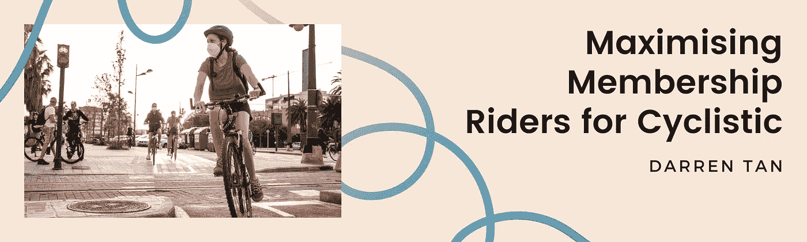
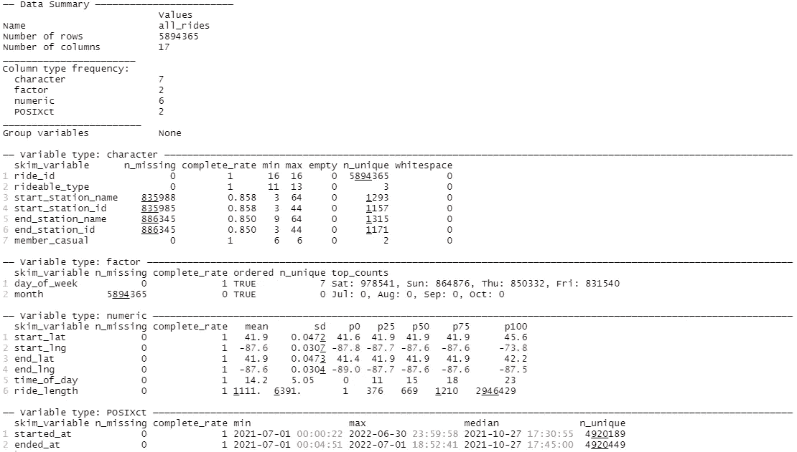
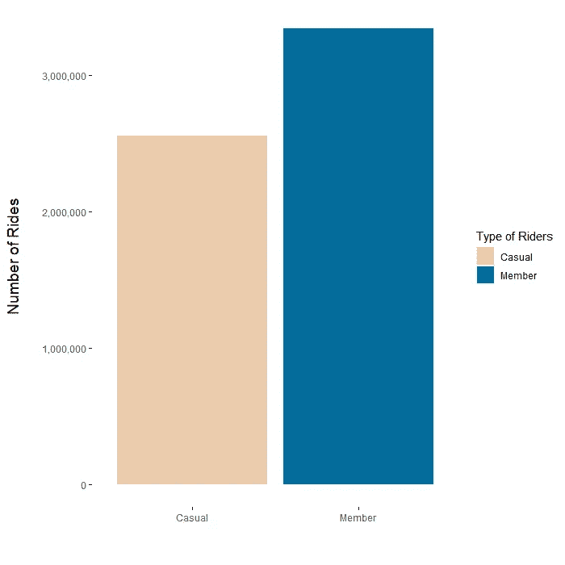
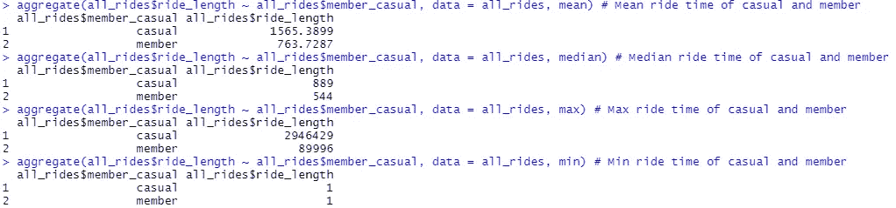
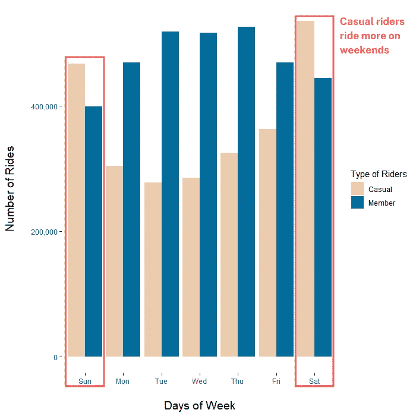
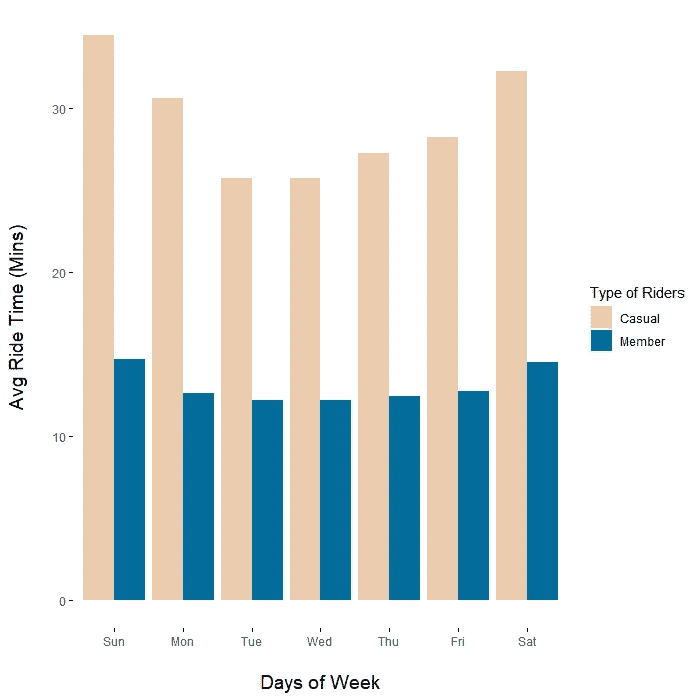
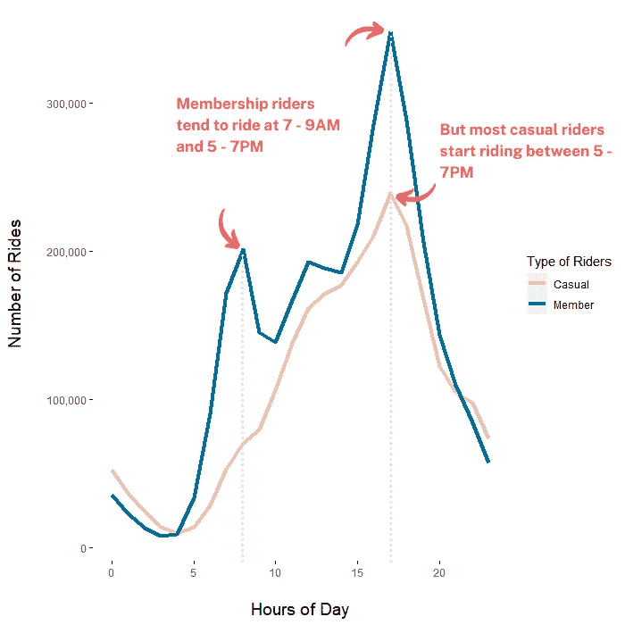
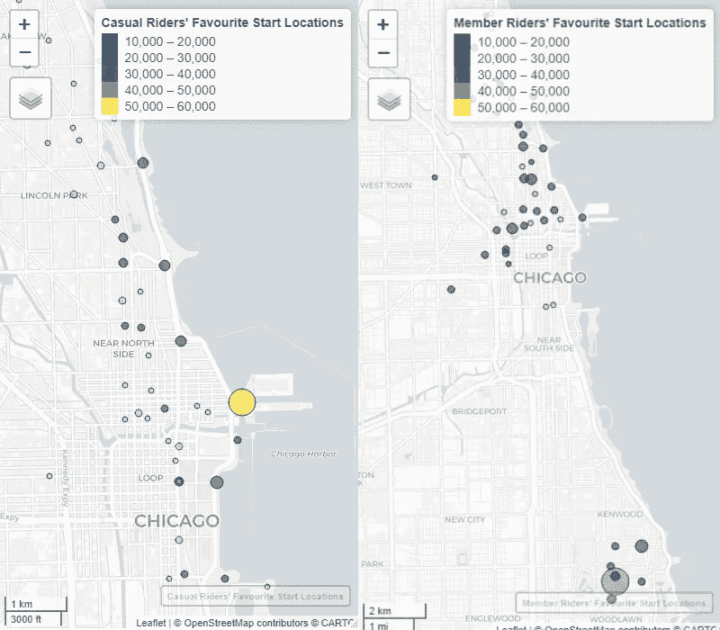

# 谷歌数据分析顶点:关于数据清理、分析和可视化的思考过程

> 原文：<https://blog.devgenius.io/google-data-analytics-capstone-thought-process-on-data-cleaning-analysing-and-visualising-ecbce38775cb?source=collection_archive---------7----------------------->

**TL；博士** : Cyclistic(虚构的)旨在通过营销增加他们的成员数量。我分析了临时骑手和会员骑手在用户行为上的差异，并建议自行车骑手应该:

1.  设计一个以促进心血管健康为基础的营销活动，增加会员
2.  创建一个新的周末会员资格，以增加和保留会员资格

你可以在这里查看我为这个项目[写的 R 脚本](https://github.com/jubeelant/bike_membership/blob/main/Code%20Script.R)。

. . .

## 案例研究总结

Cyclistic(虚构)希望增加年度会员的数量，因此任务是帮助管理团队了解休闲骑手和年度会员如何不同地使用 Cyclistic 自行车，并最终推荐旨在增加会员的营销策略。

Cyclistic 于 2016 年推出，目前拥有一支由 5，824 辆自行车组成的车队，以及遍布美国芝加哥的 692 个车站的网络。

临时骑手被定义为购买单程或全天通行证的客户，而会员被定义为购买年度会员资格的客户。

## 数据

我使用的数据集可以在这里找到[。我下载了 2021 年 7 月到 2022 年 6 月的数据。](https://divvy-tripdata.s3.amazonaws.com/index.html)

激励国际公司在此[许可](https://ride.divvybikes.com/data-license-agreement)下提供数据。

## 数据清理

由于数据的巨大性质，以及我无法弄清楚 Big Query 的计费设置这一事实，我决定使用 R 来处理我的数据。

我首先加载每个单独的 csv 文件，使用 skim_without_charts()检查它们的一致性，然后使用 rbind()将它们组合在一起。

接下来，我创建了新列:

*   ***ride_lengths*** 显示每次骑行的持续时间(秒)
*   ***月*** 显示每次乘坐的月份
*   ***星期几*** 显示星期几(如周一、周二等)。)的一周
*   ***一天中的时间*** 显示小时(如凌晨 1 点、2 点等)。)的一天，每次乘坐开始于

最后，我做了一些清理工作:

*   *星期几一栏没有排好，所以我重新排序，从星期天开始，星期六结束*
*   ****月*** 列也被重新排序，因为我的数据是从 2021 年 7 月到 2022 年 6 月*
*   *在 ***ride_lengths*** 中有负值或值为 0 的情况，这是不应该的，因此我删除了它们*
*   *为了填充像***start _ station _ name***或 ***start_station_id、*** 这样的列中的空行，我希望引用具有类似 ***start_lat*** 和 ***start_lng 的其他行。*** 然而，当我直观地浏览表格时，我意识到同一个 ***start_lat*** 和 ***start_lng*** 可能不等同于同一个***start _ station _ name***和***start _ station _ id****
*   *因此，我决定删除 ***end_lat*** 或 ***end_lng*** 中为空的行。与删除起点/终点桩号名称等中为空的行相比，这导致删除的行要少得多。*
*   *然后，我为临时乘客的出发地点和会员乘客的出发地点创建了分组表格，所有表格都按乘坐次数进行了汇总*

*以下是已清理的 all_rides 表的摘要:*

**

## *数据分析*

*我决定先看看一些描述性的数据:*

*   *临时骑手和会员骑手完成的骑行总数*

**

*   *休闲骑手和会员骑手的平均、中间、最大、最小骑行长度*

**

*看起来会员骑手比休闲骑手多，但休闲骑手的骑行时间比会员骑手长。为了进一步研究这个问题，我:*

*   *检查休闲或会员骑手是否有不同的首选自行车类型*
*   *查看了几个月、几天和几个小时内临时骑手和会员骑手的骑行次数*
*   *查看了休闲骑手和会员骑手在一周内和一天内的平均骑行时间*
*   *查看排名前 10 位(按乘车次数)的始发站和终点站，将它们标在地图上，并按临时乘客和会员乘客进行对比*
*   *使用 R 的 ggplot2 软件包将分析可视化成图表*

*这是我的发现:*

*   *休闲骑手在周末比平日骑得更多*

**

*   *休闲骑手也倾向于在周末骑得更久*

**

*   *从骑行次数来看，会员骑行者在一天中的上午(上午 7-9 点)和晚上(下午 5-7 点)左右达到高峰，而从骑行次数来看，休闲骑行者仅在晚上(下午 5-7 点)达到高峰。**这一点以及上述两个发现似乎表明，休闲骑行者倾向于将自行车用于休闲(例如观光、团体活动)，而会员骑行者倾向于将自行车用于目的(例如通勤、锻炼)***

**

*   *骑行次数最多的休闲骑行者的起点位于海滩/公园/旅游景点附近，而骑行次数最多的会员骑行者的终点位于郊区— **这进一步证明了休闲骑行者倾向于使用自行车探索城市/观光，而会员骑行者倾向于使用自行车上下班***

**

## *营销策略建议*

*根据我的分析，我建议 Cyclistic 应该:*

*   *创建一个营销活动的基础上促进心血管健身自行车可以是有趣的/有价值的/容易的*
*   *一个可能的方向是鼓励用户生成内容并利用它们——“自从我开始骑自行车以来，我瘦了 X 公斤”，或者记录他们骑自行车体验的用户片段(例如，视图、自行车类型、访问便利性等)。)*
*   *这可以通过游戏化体验来进一步补充——基于连续循环的使用计数/天数等来授予数字代币/奖章。*
*   *另一种方法是创建一个周末会员资格，以进一步说服休闲骑手转化为会员*

## *限制*

*确实需要更多的数据来微调营销策略(例如，什么样的公关活动，哪种营销媒体最有效等)。).*

*虽然与任务无关，但有 4，718 次(. 08%)乘坐时间超过 1 天。这些都是临时骑手，所以可能有一小部分临时骑手滥用自行车共享系统。*

*最后，我想强调的是，一些读者可能会认为鼓励 Cyclistic 的成员进行锻炼是不可行的；**人们可以简单地购买一辆自行车，从长远来看，这将比 Cyclistic 的会员资格便宜得多。***

*然而，cyclic istic 已经有了一批成员，他们更喜欢拥有 cyclic istic 的会员资格，而不是购买自己的自行车——我认为 cyclic istic 的目标是扩大他们的客户群，正是这群人没有转化为 cyclic istic 的会员资格。*