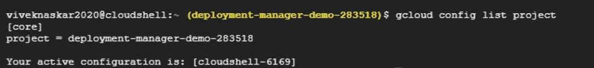

# Google 部署管理器:简化您的云管理

> 原文：<https://blog.devgenius.io/google-deployment-manager-simplify-your-cloud-management-1699083e63ae?source=collection_archive---------14----------------------->


Deployment Manager 是一项基础设施部署服务，可以自动创建和管理谷歌云平台资源，如*计算、数据库、存储、*和*网络*。您可以编写灵活的模板和配置文件，并使用它们来创建具有各种云平台服务的部署，如配置为协同工作的*谷歌云存储*、*谷歌计算引擎*和*谷歌云 SQL* 。这些云环境的管理是通过使用*基础设施即代码*方法来完成的。

# **创建配置文件**


2.点击*激活云壳*图标


3.登录后，需要几分钟来调配和连接到环境。一旦连接上，您就已经通过了项目 id 的认证—*deployment-manager-demo-283518(这是我的项目 id，用于演示)*


4.在这里，我们使用 gcloud 来运行我们所有的命令，以演示一个简单的部署管理器演示。

使用下面的 gcloud 命令*，*我已经列出了相关的活动帐户名称。

```
**gcloud auth list**
```


同样，您也可以使用以下命令列出与之关联的活动项目 id:

```
**gcloud config list project**
```



*在* 这里找到 gcloud 可用 [*的备忘单。*](https://cloud.google.com/sdk/docs/cheatsheet)

5.我们可以创建一个 YAML 文件，其中包含描述单个文档的所有配置。因此，使用以下命令创建了一个 YAML 文件:

6.在新创建的 YAML 文件中添加以下配置，然后保存它。

*可以从这个* [*链接*](https://cloud.google.com/deployment-manager/docs/configuration/supported-resource-types) *中参考要添加的资源。*

*您也可以参考* [*链接*](https://cloud.google.com/deployment-manager/docs/configuration/create-basic-configuration) *中的如何在部署管理器中创建配置文件。*


使用的资源指定如下:

*   **区域:**美国中部 1-f
*   **机器类型:**f1-微
*   **根持久磁盘:**磁盘-我的第一个-部署
*   图片: debian-9
*   随机分配的外部 IP 地址

# **部署配置文件**

为了部署配置文件，您必须执行以下命令:

```
**gcloud deployment-manager deployments create my-first-deployment -config deploy-man.yaml**
```

*我的首次部署→* 实例的名称

*deploy-man.yaml →* 指定资源详细信息的配置名称

运行该命令后，您的部署将会成功，您将会看到以下消息:


您可以在**计算引擎** → **虚拟机实例**中验证新创建的实例


*找到引用* [*链接*](https://cloud.google.com/deployment-manager/docs/deployments) *用于使用 gcloud 或 API 创建部署。*

# **查看部署详情**

您可以通过运行以下命令来查看有关部署的信息:

```
**gcloud deployment-manager deployments describe my-first-deployment**
```

您应该看到部署的描述，包括其*开始和结束时间、部署状态、*和*任何警告*或*错误*(如果适用)。

您将获得以下输出:


# 部署清单

清单是一个只读对象，它包含您提供的原始配置，包括任何导入的模板，还包含由部署管理器创建的完全展开的资源列表。每次更新部署时，部署管理器都会生成一个新的清单文件来反映部署的新状态。对部署问题进行故障排除时，查看清单很有用。

您可以在查看部署详细信息时获得部署清单(见上图)。你得到的*清单-1594964918043* 实际上是*清单- <时间戳>*

要查看清单，您必须运行以下命令以获得以下输出:

```
**gcloud deployment-manager manifests describe <manifest-[TIMESTAMP]> -deployment my-first-deployment**
```


点击了解查看清单[的更多详情。](https://cloud.google.com/deployment-manager/docs/deployments/viewing-manifest)

# **从模板创建实例**

您可以使用以下命令克隆可用的部署管理(DM)模板。

```
**gsutil cp -r gs://spls/gsp148/create-sql-instance.jinja**
```

*在这里* *找到 gsutil* [*的备忘单。*](https://alexisperrier.com/gcp/2017/11/02/gsutil-cheatsheet.html)

当您克隆模板时，您可以通过使用模板中的变量更新模板中的变量来简单地*修改实例名、数据库名、区域*。

使用以下命令部署克隆的配置:

```
**gcloud deployment-manager deployments create testdep-instance -template create-sql-instance.jinja**
```

**导航至 SQL:**


您会发现已经创建了 SQL 实例:


# **创建自己的 DM 模板**

开发应用程序时，您很可能需要复杂的体系结构。为了使您的部署更容易复制和故障排除，我们建议您将您的配置分成*模板*。

模板是定义一组资源的独立文件。您可以在不同的部署中重用模板，从而在复杂的部署中保持一致性。

您可以使用 *Python* 或 *Jinja2* 为部署管理器创建模板。

*在这里* *找到创建自己的模板引擎* [*的参考。*](https://cloud.google.com/deployment-manager/docs/step-by-step-guide/create-a-template)

# **结论**

*   Google Cloud Deployment Manager 允许您使用 YAML 以声明格式指定应用程序所需的所有资源。
*   可重复的部署过程通过创建定义资源的配置文件，可以一遍又一遍地重复创建这些资源的过程，并获得一致的结果。
*   它使用声明性方法，允许用户指定配置应该是什么，并让系统计算出要采取的步骤。
*   它是模板驱动的，这意味着模板允许使用构建块来创建通常一起部署的抽象或资源集。因此，模板可以反复使用，因为它们很容易参数化。

# **更多参考文献**

你可能会发现下面的文章和参考资料很有用。

[](https://medium.com/dev-genius/docker-the-most-loved-platform-every-developer-must-learn-6e5bb702c97b) [## docker——每个开发人员必须学习的最受欢迎的平台

### 实际上，根据 Stackoverflow 调查，它是第二大最受开发者喜爱的平台。

medium.com](https://medium.com/dev-genius/docker-the-most-loved-platform-every-developer-must-learn-6e5bb702c97b) [](https://medium.com/dev-genius/everything-a-developer-must-know-about-microservices-dae854782ab) [## 开发人员必须了解的关于微服务的一切

### 微服务是首选的应用平台，每个开发人员都必须了解它。

medium.com](https://medium.com/dev-genius/everything-a-developer-must-know-about-microservices-dae854782ab) [](https://cloud.google.com/deployment-manager/docs/best-practices) [## 使用部署管理器的最佳实践

### 发送反馈在作为部署的一部分创建资源后，如果需要修改，请使用部署管理器…

cloud.google.com](https://cloud.google.com/deployment-manager/docs/best-practices) [](https://cloud.google.com/docs/compare/aws/deployment-tools) [## 面向 AWS 专业人员的谷歌云:基础设施部署工具

### 在 Google Cloud 和 Amazon Web Services (AWS)上，您可以使用……

cloud.google.com](https://cloud.google.com/docs/compare/aws/deployment-tools)