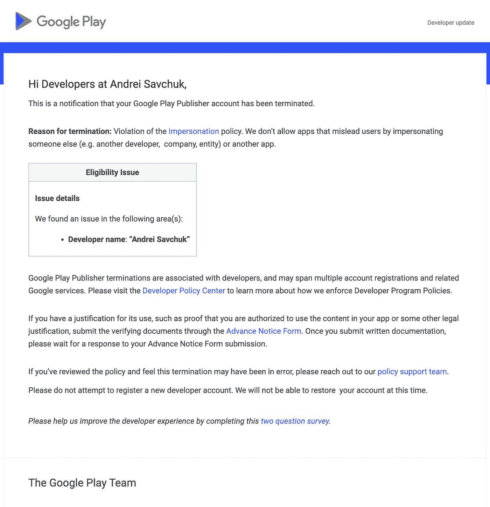
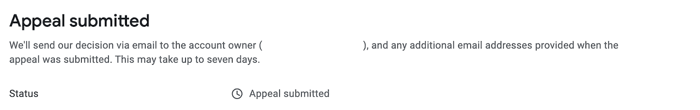

# 谷歌摧毁了我的 Google Play 开发者账户和我过去两年的工作。

> 原文：<https://blog.devgenius.io/google-destroyed-my-google-play-developer-account-and-my-work-for-the-last-2-years-c4aa5034a221?source=collection_archive---------0----------------------->

我希望在未来的某个时候，谷歌会改变它的自动终止政策，停止摧毁那些试图在 Android 生态系统中创造一些东西的开发者的梦想和劳动。

我是一名全栈开发人员，大约 5 年前，我想出了创建一个应用程序的想法，但由于各种原因，我推迟了它。两年前，星星排成一行，我开始开发这个应用程序。

我走过了一段漫长的路，犯了一些错误，作为一名开发人员，我不得不学习一些不同寻常的东西，比如创建自己的品牌、社交媒体页面、宣传视频、广告等。经过近 2 年的发展，与用户合作，收集反馈，当然，改进应用程序，我的帐户和我的应用程序已被完全删除，下面是一些细节。

长话短说——由于搬到了另一个国家，我想更新我的开发者帐户，以遵守该国的所有税收相关规则，但使用谷歌，这并不容易，你不能为现有的支付配置文件更改国家(也不能创建新的支付配置文件)，你需要创建一个新的谷歌帐户，然后为新的开发者帐户支付，然后创建一个新的支付配置文件，并将你的应用程序转移到新的帐户。

完成上述所有步骤后，为了不误导任何人，我更改了我的开发人员姓名，根据 [Google Play 文档](https://support.google.com/paymentscenter/answer/9037880?hl=en)，这应该没问题，下面是其中的一个片段:

> 1.按照以下步骤创建新的付款配置文件。设置个人资料时，请特别注意您输入的国家/地区。
> 
> 2.转移您的开发者名称。如果您希望在新个人资料中使用与原始个人资料中相同的开发人员姓名，请先更改原始个人资料中的姓名。在您更改原始配置文件上的开发人员姓名后，您可以更新新配置文件上的开发人员姓名。

我所做的正是这个代码片段中所列出的:我在我原来的帐户上更改了我的开发人员姓名，然后，几分钟后，在我的新帐户上更改了它。这大概就是我的错误所在。我想我需要等待我的原始帐户的更改被批准，然后才更改新的帐户，但这只是我的假设，您可以看到文档中没有关于这一点的任何内容。

第二天早上，我收到了一封无情的谷歌机器人发来的电子邮件:

我简直不敢相信我正在读的东西——我的账户和应用已经被终止了。紧接着，我提出了上诉，声明这两个账户都属于我，我遵循了谷歌的文档，不想误导任何人，甚至相反，我试图阻止它。在已提交的上诉旁边，我仍然可以看到可能需要长达七天的时间:

20 天后，他们几乎 3 次违反了自己的截止日期，而我根本没有收到任何进一步的回复。

还有，在这 20 天里，我为支持团队创建了 10 张票，尝试与真人聊天描述情况，并询问我需要等待多长时间的回应。你猜怎么着？没什么。答案总是一样的，只是从他们的政策中复制粘贴的片段，如果你一直坚持，你只会得到:“我们感受到你的痛苦，抱歉，但我们不能帮助也不能提供任何联系方式来联系政策团队”，你找不到任何人来联系你的案件进行审查。

他们为什么称自己为后援团？他们这边一点支持都没有，更像是嘲讽。

而现在，我对谷歌缺乏客户支持感到震惊，更担心的是，我未来创建的任何新账户也可能会被毫无预警地删除。我在这里真的无能为力。

现在，回答购买了我的应用程序或在 Google Play 市场上找不到它的用户的问题并向他们道歉，我明白我有点讨厌谷歌感到无助，因为 2 年来几乎每天的工作都可能在几秒钟内被摧毁，没有人关心它，因为谷歌对开发者的态度，感谢谷歌获得大量资金并建立了 Android 生态系统。

我最后的希望是，阅读这封信的善良的人们会喜欢、分享和评论这个故事，希望谷歌团队会做正确的事情，恢复我的应用程序和开发者账户。

## 2022 年 3 月 28 日更新

看起来我的声音被听到了，我的账户被恢复了。该应用程序仍在审查中，之后应该可以在 Google Play 上使用。我仍然对 Google Play 的支持非常失望，我可能需要考虑未来的备份计划，但现在感谢所有阅读这篇文章并直接或间接提供帮助的人！