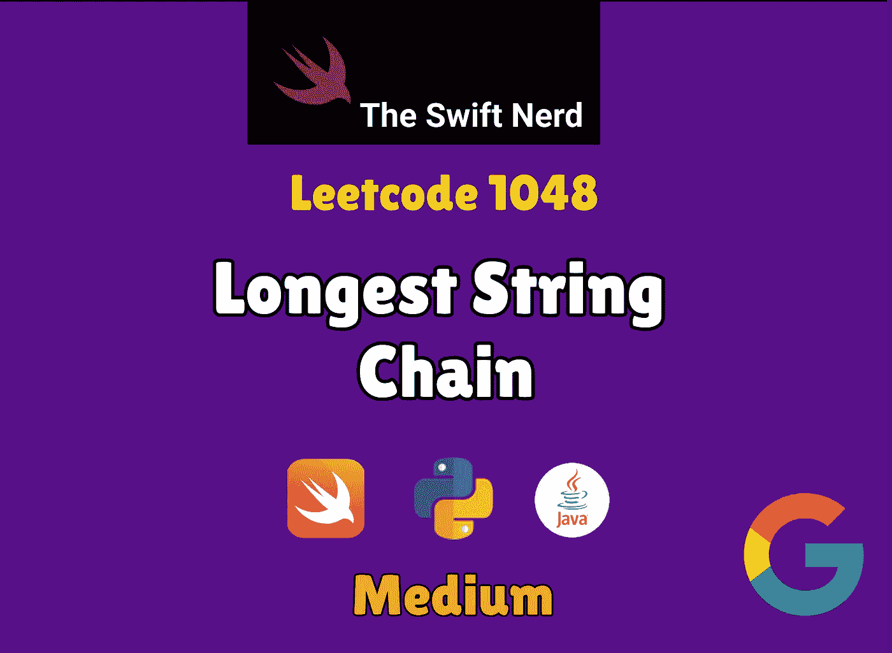

# 谷歌面试问题:最长的字符串链

> 原文：<https://blog.devgenius.io/google-interview-problem-longest-string-chain-5da51dd6bd4?source=collection_archive---------0----------------------->

## Swift +动态编程=🔥 🔥 🔥



第二个:Leetcode 1048

[](https://theswiftnerd.com/longest-string-chain-leetcode/) [## 最长的字符串链(Leetcode 1048)

### 给定一个单词列表，每个单词由英文小写字母组成。假设单词 1 是单词 2 的前身，如果…

theswiftnerd.com](https://theswiftnerd.com/longest-string-chain-leetcode/) 

如果你正在准备编码面试，那就去 Swift Nerd 博客上看看令人惊叹的 Swift Leetcode 系列吧。

# 问题描述

给定一个单词列表，每个单词由英文小写字母组成。

假设`word1`是`word2`的前身，当且仅当我们可以在`word1`的任意位置添加一个字母，使其等于`word2`。比如`"abc"`就是`"abac"`的前身。

一个*字链*是一个带有`k >= 1`的字序列`[word_1, word_2, ..., word_k]`，其中`word_1`是`word_2`的前任，`word_2`是`word_3`的前任，以此类推。

从给定的`words`列表中选择单词，返回单词链的最大可能长度。

# 例子

```
**Input:** words = ["a","b","ba","bca","bda","bdca"]
**Output:** 4
**Explanation**: One of the longest word chain is "a","ba","bda","bdca".**Input:** words = ["xbc","pcxbcf","xb","cxbc","pcxbc"]
**Output:** 5
```

# 限制

*   `1 <= words.length <= 1000`
*   `1 <= words[i].length <= 16`
*   `words[i]`仅由英文小写字母组成。

# 解决办法

我们可以确定链中每个字符串的长度递增的模式，因此如果当前元素是“abc ”,则下一个元素的长度必须是 Length(abc) + 1 = 4。问题陈述中的一个关键点是，当且仅当我们可以在 word1 中的任意位置添加一个字母使其等于 word2 时，word1 可以是 word2 的前身。换句话说，word2 应该比 word1 多一个字母，这个新字母的位置可以是任何地方。注意*不需要保持单词的顺序。*

一件棘手的事情是，如果我们直觉地把我们的解决方案建立在前任的定义上，那么这将是困难的。举个例子，要检查“ab”是“acb”的前身，我们将不得不分割字符串，并尝试所有可能的字母组合，如果它们匹配的话。" ab" = {a-z} + "ab "，" a" + {a-z} + "b "，" ab" + {a-z}。如果字符空间增加，就会增加复杂性。如果我们颠倒定义呢？对于“acb”是链接中的一个连续链，我们可以将每个字符逐个删除，并与“ab”匹配。这是一个简单的 O(L)运算。

# 自底向上动态编程

当我们从左向右移动时，序列中单词的长度增加。如果我们可以根据单词的长度对其进行升序排序，我们就可以确定列表中的下一个单词会比当前单词更长。接下来，我们可以遍历排序后的列表，计算可能的最长序列的长度，其中索引 I 处的单词是结束单词。我们如何计算可能的前置字符是我们从字符串中一个接一个地删除一个字符，并检查结果字符串是否已经在链中起作用。我们将这个结果存储在一个映射中，其中`key`是单词，`value`是序列长度。通过这样做，我们可以确保，对于我们遇到的每个单词，我们已经知道它所有可能的前身的结果。

# 复杂性分析

对大小为 N 的列表进行排序需要 O(NLogN)时间。我们迭代单词列表，并尝试通过逐个删除来匹配字符，这需要 O(L2)。单词操作是 O(L2 ),因为首先我们迭代单词长度以去除字符，即 O(L ),并且对于每次迭代，我们试图构建剩余的字符串，它本身是 O(L ),因此是 O(L2)。因此，总时间复杂度增加到 *O(NLogN) + O(L2)* 。

对于空间，最多可以存储 N 个字，因此它是线性的。

**Time = O(NLogN) + O(L2)** //其中 N 为字数，L 为每个单词的长度

**Space = O(N)**

感谢您的阅读。如果你喜欢这篇文章，并发现它很有用，请分享并像野火一样传播它！

你可以在[the swift nerd](https://theswiftnerd.com/)|[LinkedIn](https://www.linkedin.com/in/varunrathi28/)|[Github](https://github.com/varunrathi28)上找到我