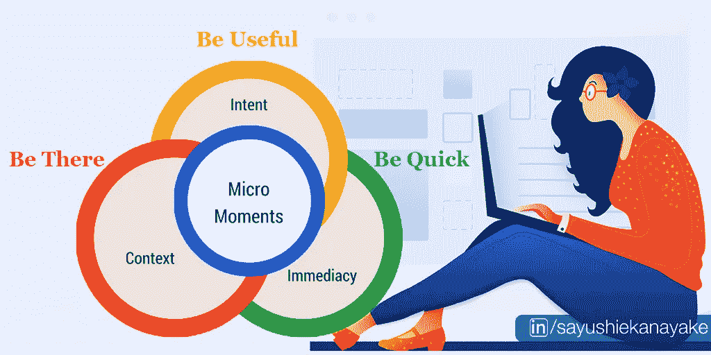
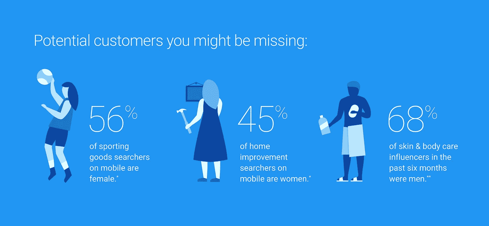

# 数字营销的谷歌微时刻概念

> 原文：<https://blog.devgenius.io/google-micro-moments-for-digital-marketing-14ed556a3992?source=collection_archive---------2----------------------->

## 数字营销

谷歌是微时刻概念的创始人。谷歌并没有止步于仅仅引入微时刻的概念。但自那以后，该公司定期发布支持信息、各种内容渠道的足够细节和描述性数据，以及与特定行业、平台和用户行为相关的支持平台。此外，谷歌微时刻的概念是一个主要的组成部分，你可以用在你的网站的搜索引擎优化，内容和营销策略。

Google micro moments 是一种战略性的方法，可以帮助你将网站的用户旅程框定在最终转化或产品服务购买上。在这个过程中，你可以特别关注移动和人们在谷歌上搜索的需求或查询。微时刻的定义很容易掌握，并通过执行和组织关键词分析为客户提供了一个完美的消费之旅，数字营销人员、决策者和 SEO 战略家都将从中受益。

**有哪些谷歌微时刻？**

*   我想知道一些时刻——有人在寻找某样东西，但在这个阶段他们没有购买模式。
*   我想立刻去找一家当地商店或附近与第一阶段搜索相关的地方。
*   我想做的时刻-想要帮助，更多的细节和尝试一些新的东西。
*   我想购买瞬间——为购买做好准备，并需要帮助来决定购买和如何购买。

# **如何一步一步为你的网站使用谷歌微时刻？**

## **第一阶段:了解基本的微观时刻——消费者行为和消费者旅程图**

首先，你必须了解你的消费者之旅或用户路径的结构，并根据你的具体业务或垂直行业进行调整，以明确识别你的网站的微时刻机会。

例如，如果你的网站是一个旅游相关行业，我们可以将你的客户的微时刻分为四个主要阶段。

*   我想知道时刻:我想离开的时刻，做梦的阶段。
*   我想去的时刻:制定计划的时刻，计划阶段。
*   我想做的时刻:让我们预订它的时刻，预订阶段。
*   我想买时刻:迫不及待地探索时刻，体验阶段。

这些阶段支持客户旅程中从开始到购买的每一步，您的数字营销团队可以通过识别关键词机会和消费者满意度来寻找这些谷歌微时刻机会。然后你可以根据你确定的谷歌微时刻对它们进行逻辑分类。

**如何规划您的消费之旅？**

*   用消费者观点和你的商业目标清楚地确定你的消费者目标。
*   确定整个旅程中的消费者参与点。
*   以消费者的身份看待你的网站，亲身体验消费之旅。
*   抓住消费者旅途中的所有痛点。
*   做一个简单的了解消费者旅程的地图草图。
*   将您的消费者旅程地图与 Google Micro moments 结合起来。

当您确定您的消费者之旅的痛点和缺失部分时，也要考虑 6 个典型的消费者需求。

**消费者的 6 大需求是什么？**

*   **给我惊喜**
*   **打动我**
*   **让我激动**
*   **教育我**
*   **帮帮我**
*   **让我安心**

需求状态建立在情感的基础上。决策的现实是，它是非理性的，主要受消费者对你的产品、服务或你的感觉的影响，而不是合乎逻辑的。这 6 种典型的消费者需求是基于消费者需求背后的情感状态。你的消费者行为不仅会极大地影响谷歌微时刻，还会影响这 6 种典型的消费者需求。这 6 种典型的消费者需求是消费者情感状态、功能状态和社会状态的组合。因此，你需要将谷歌微时刻与 6 种消费者需求结合起来，以获得强有力的结果。

我希望在我的下一篇文章中更详细地讨论“消费者旅程图”和“6 种典型的消费者需求”。

在这整个旅程中，关键词和策略是基础。所以你要仔细识别你的机会，消费者目标，你的商业目标，痛点和消费者转化点。基于这些发现，你可以重组、分类和增强受谷歌微时刻影响的关键词和内容计划。不仅如此，你还可以一步一步地计划你未来的搜索引擎优化策略、内容策略、营销策略和所有其他策略。

## **第二阶段:组织-研究、分析和准备**

一旦你弄清楚了如何分类和重组你的关键词，下一步就是弄清楚你可以在消费者的道路上使用什么关键词修饰语来获得更多的转化。在这一步中，你要根据之前的发现、数据渠道和研究来绘制你的关键词修饰语。您可以使用所有可用的修改量，但请记住，并非所有修改量都适用于每个阶段的每个客户。如果你这样做，会让消费者的旅程变得更加凌乱和复杂。最终，你的最终目标是让消费者满意，增加转化率。

**技术相关搜索的关键词修饰符示例？**

介词:关键字+With/Near/For/not/Free/From

*   例如:为 iPhone 下载 XYZ

提问:关键词+如何/何时/什么/为什么/哪里/哪个/

*   如何下载 XYZ，XYZ 什么时候上映，有哪些最好的 XYZ

请记住，微时刻数据收集不会在关键字阶段结束。消费者意图、细节、需求、竞争对手流和许多相关流必须在上述消费者旅程阶段中进行定义和分组，以便有效利用确定的机会级别和优先级别。

## **第三阶段:投资回报的预测和优先排序**

现在你已经完成了对微时刻机会的分析和准备。下一阶段是确定预测机会，并根据调查结果确定投资回报的优先顺序。您可以使用合格的 SEO 专家或数字营销公司来完成这些步骤，因为我们有许多支持工具，如付费关键词分析工具、关键词收入预测工具和许多其他方法来更准确地获得结果。但是如果你有一个小规模的项目，你可以根据关键词、页面和其他确定的参数参考你的客户端性能数据，从而大致有一个概念。

你必须根据关键词定位找到你的点击率。(AVG CTR =有机条目/完全匹配 AVG 搜索量)。最好的来源是谷歌搜索控制台。在谷歌搜索控制台中，你可以根据许多参数(如关键词)过滤掉你以前的数据。

然后，基于这些先前的发现，你可以对你的网站的排名预测、潜在回报、独特的转换率和平均订单量做出更准确的假设、计算和假设。不要仅仅停留在找到你的数据上。

通过关注你的竞争对手，你也可以有一个更清晰的认识。

## **第四阶段:内容分析和结果**

只要谷歌搜索你的目标关键词，深入检查你的竞争对手的网站、消费者旅程、网站流量、图形、域名、其他关键词及其排名和所有必要的信息。通过根据关键词和排名将你的注意力放在你的主要竞争对手身上，你可以有更多的洞察力，以及你网站上的缺失点。此外，您还可以了解搜索引擎算法如何处理您的关键词、未来的内容趋势、关键词机会以及如何在用户旅程中捕捉谷歌微时刻的最佳示例。这些信息不仅有助于页面优化，也有助于更多的页面外优化。

所有这些阶段和阶段将帮助你提高你的排名，如果你以一种独特和战略性的方式使用这些发现和计算的信息，你的收入。不仅仅是搜索引擎优化，数字营销和内容策略，你也可以使用这些数据来提高你的存在，品牌和更多的建议。我希望你有一个简单的想法，如何在你的业务上寻找谷歌微时刻，关键词的重要性和令人满意的消费者之旅。