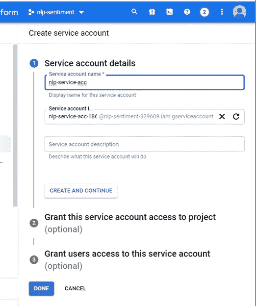
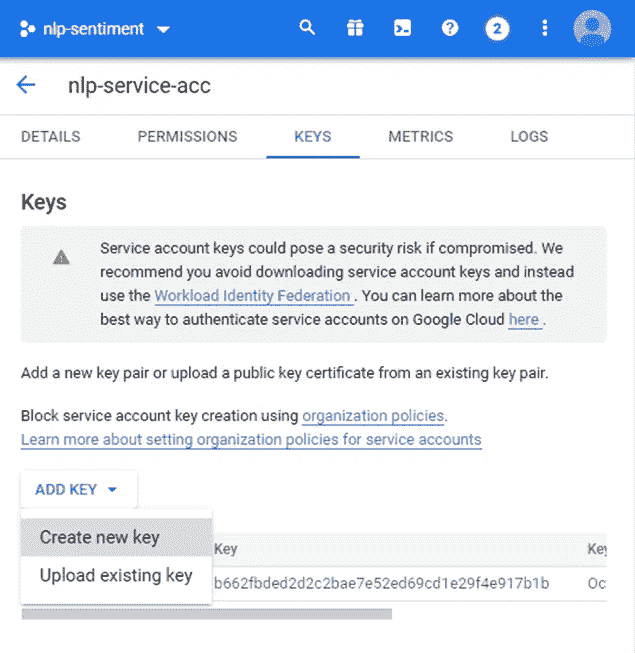
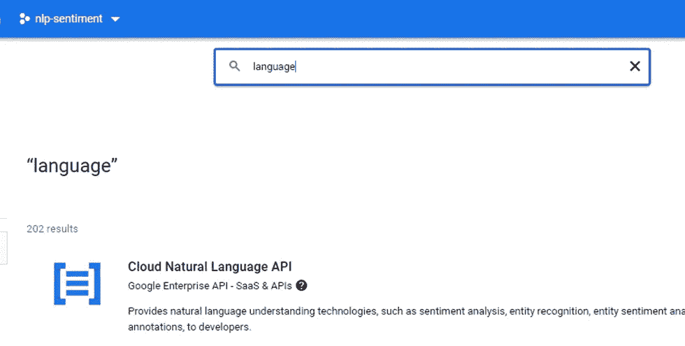

# Google 自然语言 API——使用 Python 的 Google NLP 项目

> 原文：<https://blog.devgenius.io/google-natural-language-api-google-nlp-project-with-python-becb21150805?source=collection_archive---------5----------------------->

# 介绍

谷歌提供了一个强大的基于云的 API 来从非结构化数据中提取见解。分析文章的句法和语义成分。提取关于人、地点、事件等的信息。典型的数据源可以是任何东西——博客、新闻、社交网络——你能想到的。该 API 包含了六种旨在解决常见 NLP 任务的方法。让我们看看这些是什么。

# API 概述

1.  analyzeEntities —查找实体、它们的**类型**、显著性(重要性)和其他元数据。
2.  analyzeEntitySentiment 返回实体及其**情感**。
3.  分析情感—定义整个文本的情感。
4.  analyzeSyntax 返回标记化的文本。
5.  annotateText —在单个调用中调用方法 1、3、4。
6.  classifyText —指定一个具有[类别](https://cloud.google.com/natural-language/docs/categories)的文本。

API 支持相当多的[语言](https://cloud.google.com/natural-language/docs/languages)，但是这取决于方法。

# 先决条件

让我们来测试一下 API。从激活你的[谷歌云](https://console.developers.google.com/)账户开始，零成本，不费吹灰之力。

不用担心，超过免费试用额度不会收费。

接下来，在搜索栏中，键入“服务帐户”。指定名称并点击“完成”。

是时候创建一个稍后将用于访问我们的 API 的密钥了。

打开服务帐户菜单，单击“密钥”选项卡。在“添加密钥”下拉菜单中，点击“创建新密钥”以生成您的访问令牌。嘘，这是个秘密。

好消息是，我们几乎完成了设置。

将密钥作为 JSON 文件下载到您的本地机器上。然后在搜索栏输入“语言”，选择服务“云自然语言 API”。

现在，该编码了。

# 使用 API

打开你最喜欢的 Python IDE，安装谷歌云 NLP 库，导入必要的包。

接下来，用之前保存的密钥初始化一个名为“GOOGLE_APPLICATION_CREDENTIALS”的环境变量。

我们将定义一些方法来包装 API 的功能和格式化控制台输出。让我们从分析文章的整体情绪开始。

输出将是

这意味着高情感分数(接近 1)和强幅度。事实上，数字结果准确地描述了文章的情感肖像。

有关 API 返回的内容的更多详细信息，请参考[文档](https://cloud.google.com/natural-language/docs/basics#interpreting_sentiment_analysis_values)。

每个实体都持有自己的观点。你可以这样找到它:

现在，让我们看看如何对实体进行分类和分析:

你可以这样对整篇文章进行分类:

分析看起来很公平。它输出所有类别，文章以指定的置信度与这些类别相切。

# 结论

本文给出了 Google 自然语言 API 的概述，并提供了几个如何将其付诸实践的例子。

*本文代码笔记本* [*此处*](https://github.com/Vice10/ds_notebooks/blob/main/google_language_api.ipynb) *。*