# 谷歌 Nest Mini vs 亚马逊 Echo dot 第四代[使用智能设备比较工具完成比较 2021]

> 原文：<https://blog.devgenius.io/google-nest-mini-vs-amazon-echo-dot-4th-gen-using-a-smart-device-comparison-tool-2021-e6b69dbd9a62?source=collection_archive---------0----------------------->

我想为我新建的家选择最好的智能音箱，因为我是智能家居自动化的新手。我见过谷歌和亚马逊用他们惊人的智能音箱竞争。谷歌 Nest Mini 和亚马逊 Echo Dot 第四代是他们的新伙伴。与此同时，我很自豪地说，我幸运地找到了一个简单的比较我最喜欢的智能扬声器的工具。所以，我能够用这个工具挑选出最好的智能助手。我只是想和你分享我的经历。所以，我回顾了谷歌 Nest Mini 与亚马逊 Echo Dot 第四代的对比。哪个适合你？让我们看看哪个扬声器更好。

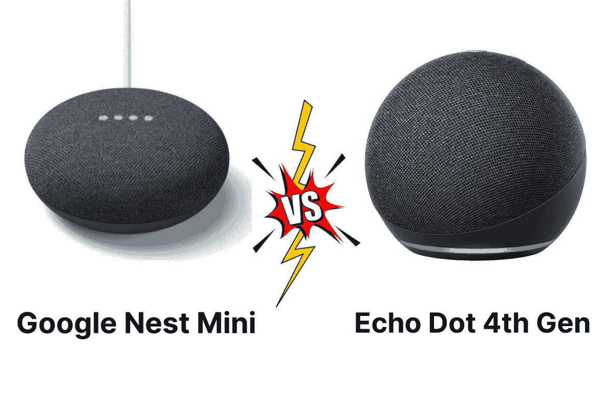

谷歌巢迷你 vs 亚马逊回声点第四代

## ***在这篇文章中，你会学到；***

*   什么是「Google Nest Mini」和「亚马逊 Echo Dot 4 代」？
*   如何使用智能家居比较工具比较我最喜欢的智能音箱？
*   智能家居设备比较工具有什么优势？
*   Google Nest Mini 与亚马逊 Echo Dot 第四代的功能对比
*   价格比较
*   Google Home Mini 和亚马逊 Echo Dot 哪个好？

# **什么是「Google Nest Mini」和「亚马逊 Echo Dot 4 代」？**

Google Nest Mini 是一款出色的智能扬声器，就其尺寸和价格范围而言，声音非常清晰。它是最初的 Google Home Mini 的升级版。此外，它有惊人的充足的低音和布面设计。但是，有许多设计功能与 Echo Dot 相同。

[亚马逊 Echo Dot 第四代](https://kodmy.com/alexa-echo-dot/)是一款令人印象深刻的智能音箱，配有 1.6 英寸扬声器，声音的低音略强于谷歌 Nest Mini。此外，这个 Echo Dot 还有一个 3.5 毫米的音频插孔，用于连接更好的大扬声器。

快一点！ [**从亚马逊**](https://www.amazon.com/gp/product/B08YT2N5SX/ref=as_li_tl?ie=UTF8&camp=1789&creative=9325&creativeASIN=B08YT2N5SX&linkCode=as2&tag=kodmy-20&linkId=7e005260ae6bf1f3b3b6d75f239924f4) 获得亚马逊 Echo dot 第四代智能音箱。

# **如何使用智能家居比较工具比较我喜欢的智能音箱？**

[Google Nest Mini 和 Google Home Mini](https://kodmy.com/compare/smart-speakers?modelList=google-nest-mini,google-home-mini) 有很多相似的功能。但是当考虑尺寸、重量、语音支持等等时，还是有一些不同。我已经使用智能设备工具来比较这些智能扬声器。让我们深入了解一下。

# ***设计***

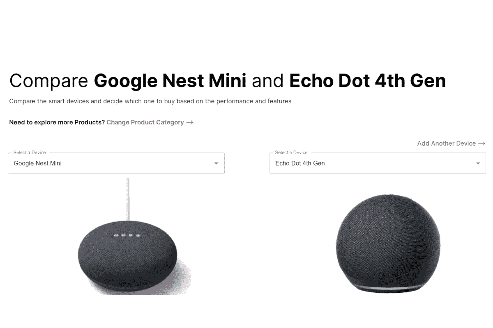

智能家居设备比较工具的比较

说到设计，我们可以看到这些智能音箱在外观上的一些差异。这两个大小不同。Echo dot 第四代为球形，看起来比 Nest Mini 大。我用这个智能工具对比了它的设计。这很酷。我可以用这个来比较这些外观。Echo dot 的高度是 Nest Mini 的两倍。

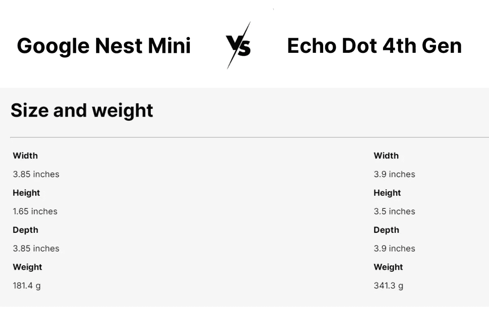

Nest mini 和 Echo Dot 的大小和重量比较

Echo dot 第四代智能音箱有三个版本，分别是 Echo Dot、Echo Dot 带时钟、Echo Dot 儿童版。这个很棒的比较工具也有比较这三个版本的功能。然而，谷歌 Nest Mini 没有时钟选项。还有 Dot 是 2019 年发布的，Echo Dot 是 2020 年发布的。

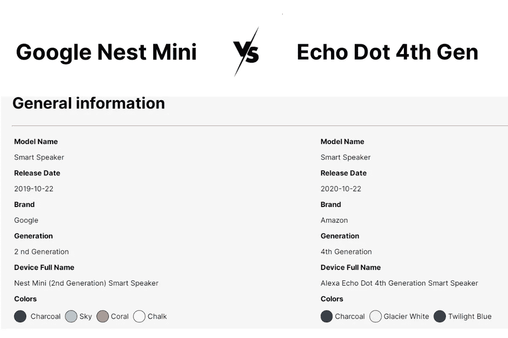

比较 Nest Mini 和 Echo Dot 的一般信息

此外，Nest mini 有白垩色、木炭色、珊瑚色和天蓝色可选。以及木炭色、冰川白和暮光蓝 Echo dot。我能够从这个简单的工具中找到与这个比较相关的所有信息。此外，Echo Dot 在扬声器顶部有麦克风静音、音量和触发的物理按钮。但是 Nest Mini 有一个后部开关和触摸感应音量控制。

# ***辅助功能和其他功能***

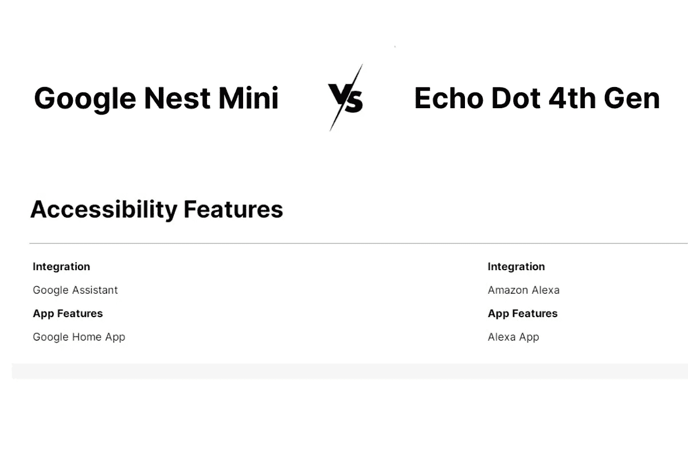

比较辅助功能

你最喜欢的智能助手是什么？—谷歌助手还是亚马逊 Alexa？Nest Mini 与谷歌助手集成，Echo dots 与亚马逊 Alexa 集成。你可以使用 Google Home 应用或 Alexa 应用与你最喜欢的语音助手进行交互。这两款设备都提供了增强的功能，如食谱、新闻报道、笑话等。但亚马逊是这方面的领导者。它还支持 Alexa 上的更多服务，如 Pandora、Apple Music、Spotify Premium、iHeartRadio、TuneIn Radio 等。但是 Google Nest mini 几乎没有像 Google Play Music、Pandora、YouTube 和 Deezer 这样的音乐服务来源。

# ***连通性***

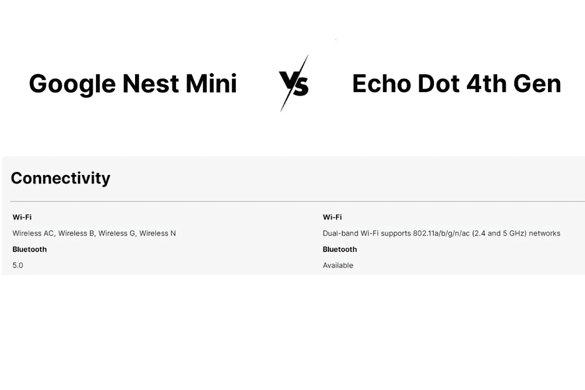

连通性比较

两个扬声器都可以使用 Wi-Fi 和蓝牙连接。此外，您还可以控制和连接各种智能家居设备，如飞利浦 Hue 照明、智能锁、电源插座等。当考虑亚马逊和谷歌时，谷歌与硬件集成有许多合作伙伴关系，但亚马逊仍然在这方面落后。

# ***音频***

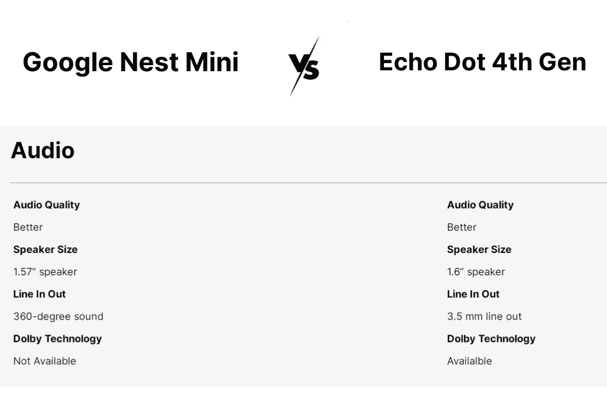

比较 Nest Mini 和 Echo Dot 的音频性能

谷歌 Nest Mini 拥有 360 度声音的干净音频。如果你想调整高音和低音，你可以使用均衡器。它还有三个麦克风，在接收语音命令方面做得很好。

第四代 Dot 的声音比采用杜比技术的 Nest Mini 更响亮。它还提供 3.5 毫米的线路输入输出。它有一个 1.6 英寸的扬声器，但 Nest Mini 有一个 1.57 英寸的扬声器。考虑音乐播放的时候可以推荐 Echo dot。但它的麦克风不像 Nest Mini 那样对语音命令敏感。

# ***利弊***

当我们选择一个设备时，我们倾向于比较它的优点和缺点。所以，我想比较一下它的利弊。真是惊喜！这个比较工具很适合你。

考虑到它们的价格范围，这两款智能扬声器都很实惠。但是购买和避免这些智能音箱有一些特殊的原因。

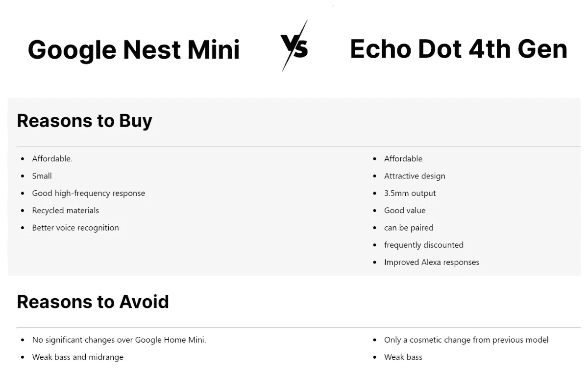

Nest Mini 和 Echo Dot 第四代的优缺点

# **智能家居设备比较工具有什么优势？**

当比较我最喜欢的两个智能音箱时，我有很多优势。我只是想选出最好的智能音箱。这款比较工具包含您需要了解的所有设备信息。因此，您可以根据外观、品牌、颜色、最佳价格、最佳价格链接、供应商、尺寸和重量、集成、连接性、系统要求、音频、设置技术、购买理由、避免理由等所有特性轻松选择和比较您选择的设备。

我只想选择这两个设备。这对你很有好处。使用这个工具，你可以比较任何你想要选择的智能设备。它有最好的比较，你可以很容易地为你的家选择最好的扬声器。如果你想选出最好的智能设备，你可以使用这个工具。所以，如果你对智能音箱之类的智能设备感兴趣，可以用这个工具。此外，您可以比较多达三个设备，并从中选择合适的设备。我得到了所有的信息，我想选择我最好的智能音箱。

# **Google Nest Mini 与亚马逊 Echo Dot 第四代的功能对比**

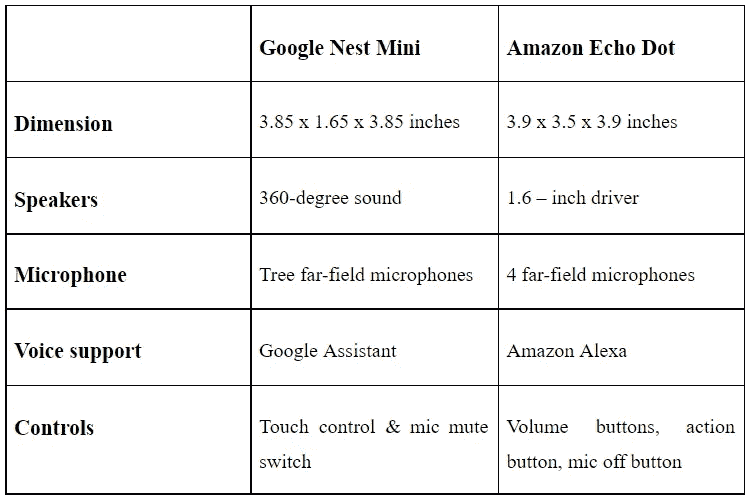

# **谷歌 Nest Mini 和亚马逊 Echo Dot 第四代的价格对比**

考虑价格的时候，这两个价格一样。但 Echo Dot 拥有比 Nest Mini 更先进的功能。没有争论。使用这个工具，我能够找到最好的价格链接和供应商。

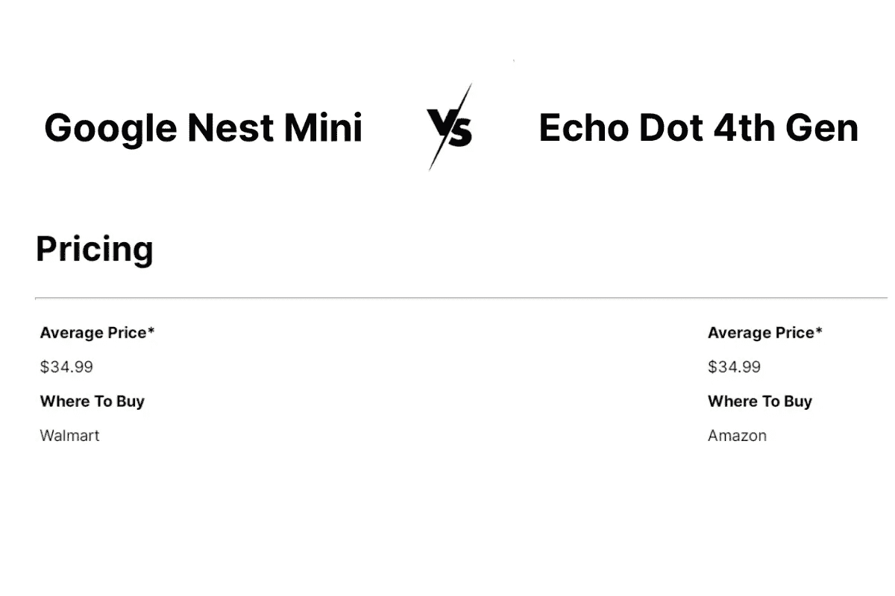

在比较工具中比较 Nest mini 和 Echo Dot 的价格

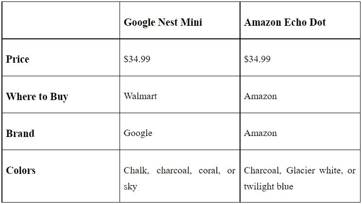

# **Google Home Mini 和亚马逊 Echo Dot 哪个好？**

如果你想让你的钱物有所值，你可以选择这款 Echo Dot 第四代，因为它比 Nest Mini 拥有更先进的功能。我选择了 Echo Dot 第四代，因为它具有 3.5 毫米插头、3.5 毫米音频插孔、低音炮等高级功能。

但是，更重要的是，你经常使用谷歌平台；这款 Nest Mini 为你增加了超赞的智能助手功能。但如果你经常选择亚马逊平台，你最好选择这个神奇的 echo dot。

对智能家居设备感兴趣？或者你希望选择最适合你的智能家居设备吗？然后，您可以使用这个神奇的比较工具来比较您的智能家居设备。我能够选择最好的智能音箱。现在，您可以比较所有智能家居设备的价格、功能和供应商，以及最佳价格链接。所以，不要迟到。现在你可以[对比谷歌 Nest Mini 和亚马逊 Echo Dot 第四代](https://kodmy.com/compare/smart-speakers?modelList=google-nest-mini,echo-dot-4th-gen)。