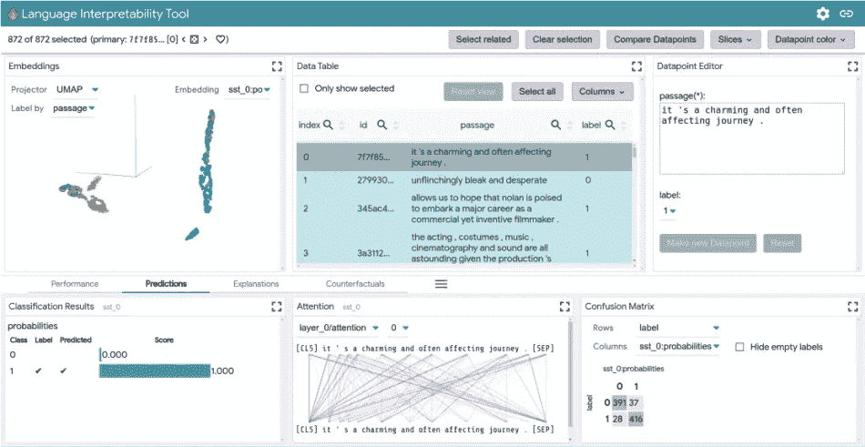

# 谷歌开源文学

> 原文：<https://blog.devgenius.io/google-open-sources-lit-69405a4d8ceb?source=collection_archive---------9----------------------->

oogle AI 研究人员最近将他们的工具语言可解释性工具(LIT)变成了一个开源平台，用于改进自然语言处理模型。LIT 为开发人员提供了一种方式来查看和检查他们的 AI 模型如何执行，以及为什么他们在某些情况下可能会挣扎。

## 点燃的是什么？

LIT 是一种语言可解释性工具，可用于可视化、审计和理解 NLP 模型。它专注于人工智能模型，并回答关于它们行为的深层问题，如人工智能模型为什么会做出某些预测，或者这些预测是否可以归因于敌对行为，或者训练集中不良的先验。

此外，科学家们在一篇关于 LIT 的学术论文中解释说，他们的重点是关于模型行为的核心问题。“为什么我的模型会做出这样的预测？什么时候表现差？在输入的受控变化下会发生什么？LIT 将本地解释、汇总分析和反事实生成集成到一个简化的基于浏览器的界面中，以实现快速探索和错误分析。”

## LIT 功能

*   计算并显示整个数据集的指标，以突出模型性能的模式。
*   分析软件如何对语言建模，对输入进行分类，并预测对话可能会如何进行，找出可能难以用原始数据识别的偏见和趋势。
*   支持自然语言处理任务，如分类、语言建模和结构化预测。
*   适用于可以从 Python 运行的任何模型，包括 TensorFlow、PyTorch 和服务器上的远程模型。

## 发光特征

*   **本地解释**通过显著性地图、注意力和模型预测的丰富可视化。
*   **聚合分析**，包括自定义指标、切片&宁滨和嵌入空间的可视化。
*   **反事实生成**通过手动编辑或生成器插件来动态创建和评估新示例。
*   **并排模式**比较两个或多个模型或一个模型上的一对实例。
*   **高度可扩展**到新的模型类型，包括分类、回归、跨度标注、seq2seq 和语言建模。支持开箱即用的多头型号和多种输入功能。
*   **与框架无关**并兼容 TensorFlow、PyTorch 等。

Google LIT 团队表示，在不久的将来，该工具集将获得一些功能，如反事实生成插件、针对序列和结构化输出类型的额外指标和可视化，以及为不同应用程序定制用户界面(UI)的更大能力。

LIT 背后的开发人员将所有文档放在 GitHub 上，鼓励其他人使用和试验这个软件。

**论文:**【https://arxiv.org/pdf/2008.05122.pdf】T4