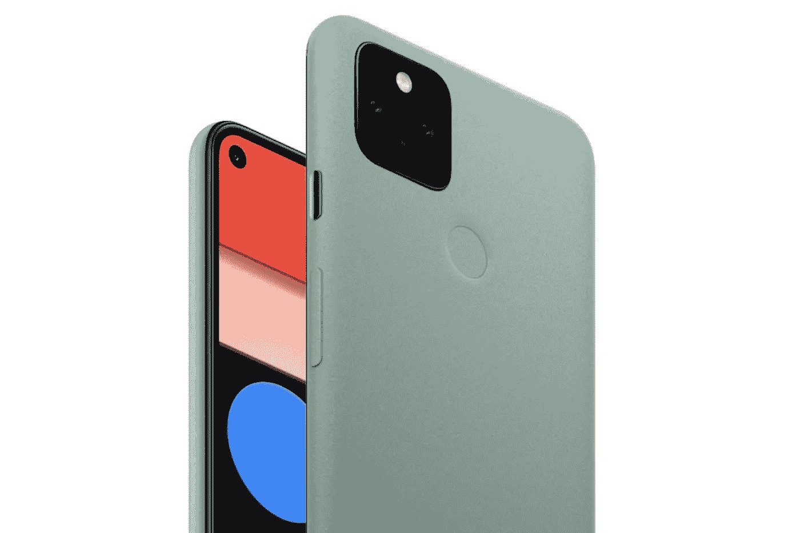
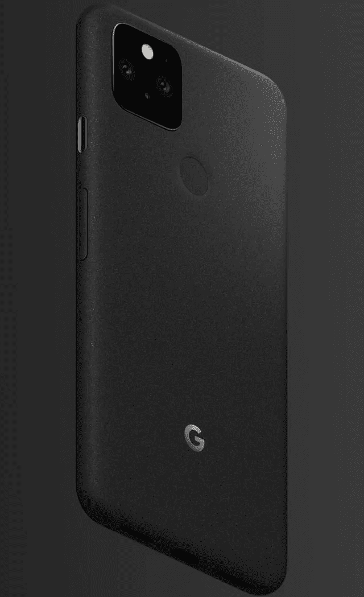
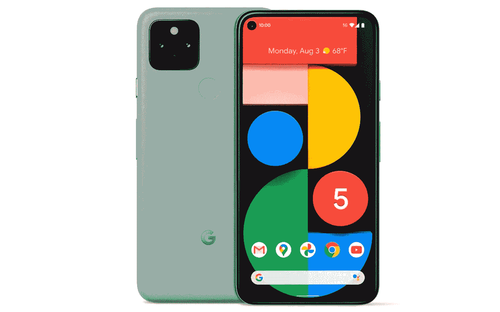
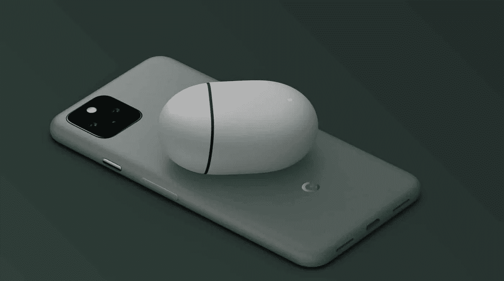
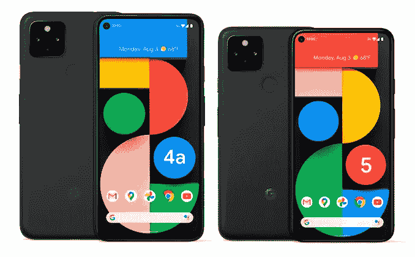

# 谷歌 Pixel 5 ~安卓之最，终于？

> 原文：<https://blog.devgenius.io/google-pixel-5-the-best-of-android-finally-a2cb9c450e85?source=collection_archive---------2----------------------->

谷歌正式发布了最新的 Pixel 手机！

像素 5——一种 Sage 模型。图片来自谷歌

本周谷歌宣布了 Pixel 5(699/599 美元)和更大的 Pixel 4a 5G(499/499 美元)，但我现在将重点放在 Pixel 5 上，因为它是谷歌今年唯一的“旗舰”。

我知道有些人不高兴，因为它不会有最先进的规格和最新的骁龙芯片，但老实说，我喜欢它。

看起来，谷歌正在后退一步，试图满足大部分 Android 用户和 iOS 用户的基本需求，而不是试图引入一些疯狂的新技术或噱头，这些技术或噱头人们很少使用，增加了成本，也没有被开发人员采用(欢呼，电池耗尽 Soli)。

像素 5 为黑色。图片来自谷歌。

他们终于**摆脱了所有的缺口和挡板！我喜欢这种做法，后退一步，给谷歌提供一个重新开始的机会。我希望他们继续生产这个价位的产品，但只要他们对增加的功能更有选择性。**

**像素 5 的规格**

Pixel 5 拥有 6 英寸的有机发光二极管屏幕，分辨率为 2340 x 1080，纵横比为 19.5:9。这使它的尺寸介于 Pixel 4 和 4 XL 之间，后者的屏幕尺寸分别为 5.7 英寸和 6.3 英寸。

也没有更多的顶部挡板，这使手机看起来更时尚和现代，但也标志着运动感应 Soli 功能的终结。

相反，背面有一个指纹传感器用于认证，最近在 Pixel 4a 上看到。

该设备具有 90hz 的完全边到边显示，没有下巴，这是第一个具有统一边框的 Android 设备，最终与 iPhone 相匹配。

像素 5 的正面和背面。图片来自谷歌

Pixel 5 将与骁龙 765G 一起发货，这款手机将有 8GB 内存和 128GB 内部存储，IPx8 等级，5G 和以前 Pixel 手机的 Titan M 安全模块也存在。

Pixel 5 将配备 4,080mAh 电池，但快速充电仍然局限于与以前型号相同的 18W 速度。

我们还支持反向无线充电(手机可以无线充电另一个设备，如 buds)，因此 Pixel 5 将支持常规和反向无线充电。

这款设备将采用 100%再生铝框架，背面中央切割出玻璃用于无线充电，并覆盖有哑光涂层，以提供一体式外观和感觉。

Pixel 5 将有两种颜色——有点像鼠尾草色和黑色——价格为 699 美元/ 599 美元/€619 美元。

新的反向无线充电功能。图片来自谷歌。

Pixel 4 和 4 XL 在美国的售价分别为 799 美元和 899 美元，因此 Pixel 5 在美国的价格下降很好，在英国和欧盟的价格下降很大。

在屏幕的左上方有一个单孔照相机，但在下方有更多。

**像素 5 摄像头，主事件。**

配备索尼传感器的 1220 万像素主摄像头与去年的设置相同，光圈为 f/1.7，FOV 为 77 度，具有电子/光学图像稳定功能。

Pixel 4 的第二个长焦镜头已经被 Pixel 5 的广角相机取代，为您提供更好的风景照片或团体照片。

超分辨率变焦模式应该可以覆盖你的长焦拍摄，前置摄像头为 800 万像素，具有 f/2.0 光圈和 83 度 FOV。

最值得注意的是，主摄像头可以录制 1080p @ 240FPS 和 4K @ 60FPS，这使得这款谷歌的第一款具有 4K 60FPS 录制功能的手机(终于！).

**最后**，这是 Android 现在需要的手机，但它不会从某些科技媒体领域获得应有的赞誉，因为它没有像三星那样炫耀噱头和规格，但它拥有你真正需要的一切，拥有出色的设计、一流的摄像头、5G、大电池和边到边有机发光二极管显示屏。

Pixel 5 相机是旗舰级的，并且一直都是，你可以花 1000 美元买一部三星或 iPhone，这款 699 美元的设备仍然会在大多数摄影领域击败他们，这是我推荐这款手机的主要原因之一。

不要让 SD 765G 欺骗了你，Pixel 是你在 Android 上可以获得的最流畅的体验，8GB RAM 足以满足你的需求，而且一旦谷歌发布一款带有传言中的定制谷歌白教堂 SoC 的设备，它只会变得更好。

这款设备面向那些想要尝试 Android 而没有 iPhone 的臃肿和噱头的人，以及那些想要快速更新和所有基本功能都以合理价格完成的干净体验的 Android 用户。

像素 4a 为 5G，像素 5 为黑色。图片来自谷歌。

对于那些仍然觉得价格有点高但想要谷歌产品的人来说，499 美元的 Pixel 4a 5G 也宣布了其更大的 6.2 英寸显示屏和与 Pixel 5 相同的双镜头，但具有塑料一体式机身，没有无线充电，90hz 显示屏或 IP 等级。Pixel 4a 也是一个不错的选择，售价 349 美元，已经上市，但具有较小的 5.8 英寸有机发光二极管显示屏，只有单个后置镜头，没有 5G。

我觉得 Pixel 现在终于成为了 Android 的 iPhone，它注定是这样的，它给普通用户提供了易于使用的流畅设备，具有有用的功能，强大的电池和苹果给他们用户的优秀相机。

最后，谷歌干得不错。