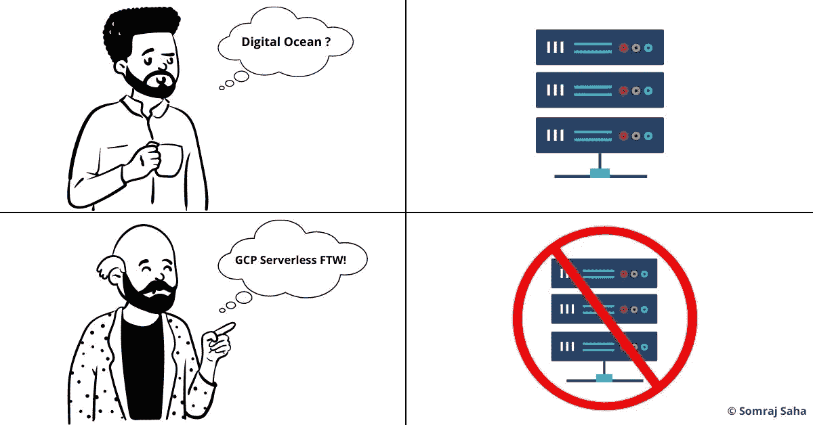

# 谷歌无服务器基础设施:GCP 和无服务器计算入门

> 原文：<https://blog.devgenius.io/google-serverless-infrastructure-ccfb2977482?source=collection_archive---------10----------------------->

## DevOps

## 了解 GCP &它的无服务器计算基础设施。了解何时使用谷歌云平台上的应用引擎、云功能或云运行。

有了谷歌无服务器服务，谁还需要数字海洋？

你曾经构建过机器学习应用吗？你是否想过如何在互联网上展示它，那么你并不孤单。幸运的是，有一个很好的解决这个难题的方法。而解决方案就是“*无服务器计算*”！你猜怎么着？谷歌云平台(GCP) &无服务器计算是天作之合。

有了 GCP，你得到的不仅仅是一种无服务器服务，而是三种卓越的服务。并且每一个都基于你的项目类型来迎合一个非常特殊的需求。但是选择正确的服务可能会令人困惑，这就是我写这篇文章的原因。它应该指导您决定什么适合您的项目需求。

# 什么是无服务器计算

有很多关于“*无服务器架构*”、“*无服务器这个那个*”的传言。过滤杂音&理解无服务器计算的核心概念非常重要。它将帮助你更好地管理你的项目。

那么，让我们了解一下无服务器计算是怎么回事。下面是维基百科对这个概念的简要描述；

> *无服务器计算是一种云计算执行模式，其中云提供商按需分配机器资源，代表客户管理服务器。【&mldr；]当一个应用程序未被使用时，没有计算资源分配给该应用程序。定价基于应用程序消耗的实际资源量。【&mldr；]“无服务器”是一个误称，因为云服务提供商仍然使用服务器来为开发人员执行代码。然而，无服务器应用程序的开发人员并不关心容器、虚拟机或物理服务器的容量规划、配置、管理、维护、操作或扩展。*

重申维基百科上的引文，让我为你总结信息:

1.  云服务提供商提供一系列无服务器服务，其中他们动态管理项目所需的所有资源。这个领域的主要参与者是谷歌云平台(GCP)、亚马逊网络服务(AWS)和微软 Azure。
2.  定价基于项目使用的具体资源量。因此，通常使用无服务器计算比租用真实的服务器更便宜。
3.  开发人员不必担心服务器的状态。他们可以专注于改进产品，将维护服务器的责任留给云服务提供商。

所以，现在你应该对什么是无服务器计算有了更好的理解。有了这些知识，让我们更深入地了解谷歌能提供什么。更具体地说，我们将研究他们的无服务器计算服务。

# 谷歌的无服务器计算解决方案

谷歌云平台(GCP)提供三种无服务器计算服务；即:

虽然这些服务从表面上看起来都很相似，但事实并非如此。它们的具体使用情形有所不同。与它们一起使用的编程语言也各不相同&甚至更多。

因此，让我们来看看您可能会如何、何时以及为什么想要使用这些服务。

谷歌将 Cloud Run 定义为“部署容器化应用的完全托管服务”。更具体的说，Cloud Run 通过 [Knative](https://knative.dev/) 提供了一个 API。然后，开发人员可以使用 API 与容器化的实例进行交互。

在引擎盖下，Knative 只是一个围绕 Kubernetes 的开源包装器。它使开发人员能够为自己托管无服务器基础设施。

请注意，云运行利用了基于容器的技术。因此，您可以使用自己选择的任何编程语言，甚至是二进制语言！唯一会阻止您的是构建容器的映像无法下载。

您可以在 cloud.google.com/run 的[找到更多关于云跑的信息。](https://cloud.google.com/run)

App Engine 很像是为自己出租一台服务器。警告是，谷歌为你管理服务器。它配有你需要的每一套工具。

因此，您可以自由选择最流行的编程语言之一。或者你可以用你选择的其他东西。

例如，您可以用 Python 构建应用程序的后端。让 App Engine 负责扩展它和/或将其与其他服务集成。如果你可以根据自己的喜好选择其他语言！

你应该使用 Docker 容器来交付你的代码&应用引擎会处理剩下的事情。除此之外，App Engine 还会对您的应用程序进行版本控制。但是，如果您愿意，您可以拆分传入流量，执行健康检查等等。

如你所见，App Engine 非常适合需要大量资源的生产应用。如果你不想管理后端维护，App Engine 是你的理想选择。

也就是说，你可以在 cloud.google.com/appengine找到 App Engine 的详细信息

# 云函数

GCP 以“功能即服务”的方式提供云功能。它们是响应特定事件而执行的模块化代码。因此，对于基于微服务的应用，云功能是金钱可以买到的最佳选择。

与大多数无服务器基础架构一样，云功能也提供了类似的优势。例如，增加的开发速度和内置的可伸缩性等等。因此，开发者不必担心服务器维护。

云功能的定价也很轻。它们的定价基于函数运行的时间、被调用的次数以及为函数提供的额外资源。

使用云函数的唯一缺点是测试它们。因为，你需要“上传”你的功能到 GCP，很难保证你的功能的质量。此外，如果没有一个强大的 CI/CD 渠道来监督质量标准，事情可能会变糟。当它们真的破裂时，混乱会比布加迪·贝隆更快地向南方蔓延。

也就是说，请在[cloud.google.com/functions](https://cloud.google.com/functions)的官方文档中仔细阅读关于云功能的信息。

# 你应该使用哪种服务

现在，对于你一直在等待的问题，“*你应该使用哪种谷歌无服务器服务？*”。

这个问题的简短答案很简单，*看情况！*😅但是，让我们更深入地了解它依赖于什么样的环境。

*   如果你的应用是容器化的，选择& Kubernetes 是必须的。选择这种上下文的主要好处是可重复性。因为应用程序是容器化的，所以运行时环境可以很容易地在其他地方复制。
*   如果应用程序没有容器化，请选择 App Engine。但是，您需要一个完全托管的平台来部署应用程序。有了应用引擎，你可以让谷歌负责管理后端系统。放大还是缩小？让谷歌去做吧。管理依赖关系？还是让谷歌来处理吧。
*   最后，云函数。如果您想要一种零管理的方式来将其他模块化代码片段粘合在一起，请选择它。如果应用构建在微服务 architecutre 之上，情况尤其如此。云功能可以作为应用程序的粘合代码。您可以将您的应用程序设计为只在特定的事件集上调用特定的功能。谷歌会在需要的时候放大/缩小它。

# 最后的话

希望你现在对谷歌的无服务器计算产品有了更好的理解。在使用和研究这些服务的过程中，我确实学到了很多。但我可能错过了什么。或者你可能想给这篇文章补充一两件事。如果是这样，请随时联系我。🤗

也就是说，既然您现在已经理解了无服务器计算，那么就开始部署您自己的东西吧。如果是的话，你可能想阅读这些文章来获得更多的灵感:

*原载于 2021 年 4 月 19 日*[*https://jarmos . netlify . app*](https://jarmos.netlify.app/posts/details-of-google-serverless-computing/)*。*