# Google Sheet API 与 Python 的集成

> 原文：<https://blog.devgenius.io/google-sheet-api-integration-with-python-1793795a9bc4?source=collection_archive---------1----------------------->

大家好！我希望一切都很好，今天我们将了解 google sheets 与 Python 编程语言的集成，并进行基本的 CRUD 操作。好的，我们开始吧！


**谷歌工作表**

谷歌工作表是基于云的电子表格，是谷歌的产品之一。我们可以用它来进行数据分析、迷你数据存储等。在这里，我们将把这个 Google sheet 与 python 集成在一起，并从 Google cloud console 使用 Google sheet 和 Google Drive API 来执行一些基本操作。

**谷歌云控制台中的流程**

第一步:使用这个链接【https://console.cloud.google.com/ 进入谷歌控制台并登录

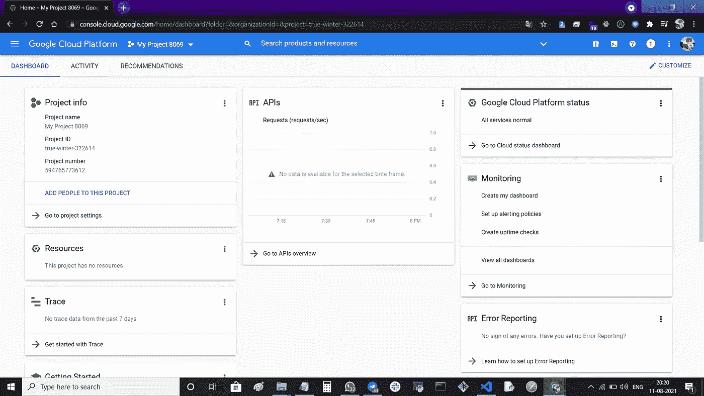

第二步:登录后，开始**创建新项目**

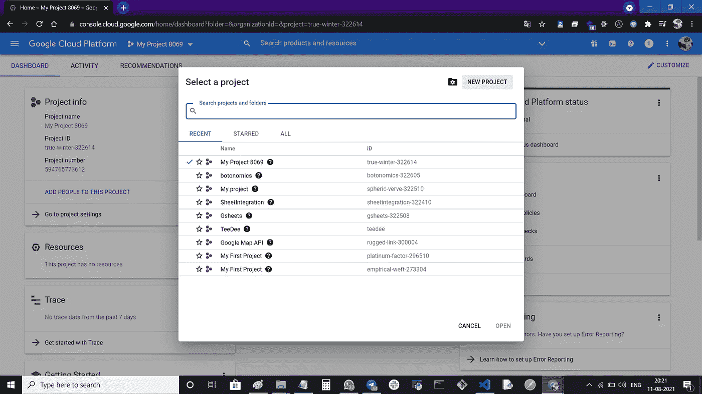

步骤 3:转到 **API 和服务**

第 4 步:去图书馆选择 **google sheets API** 并启用它

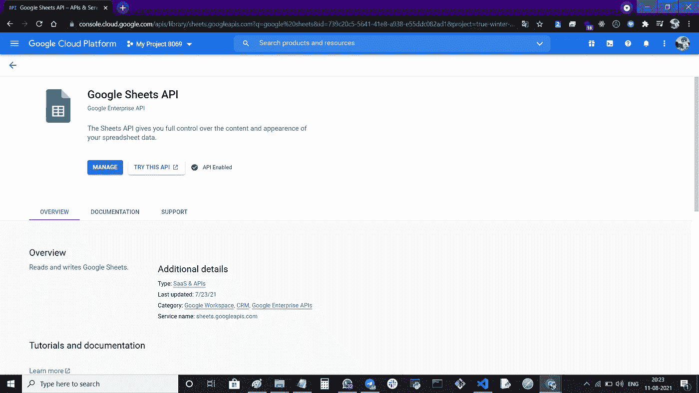

第五步:去图书馆选择 **Google Drive API** 并启用它

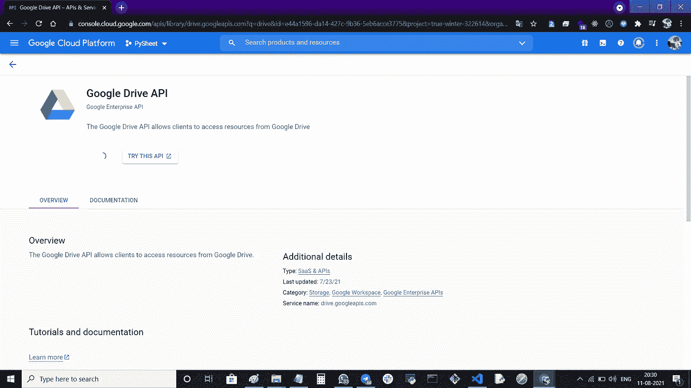

第 6 步:返回 API 服务，点击凭证并选择**服务帐户创建**栏

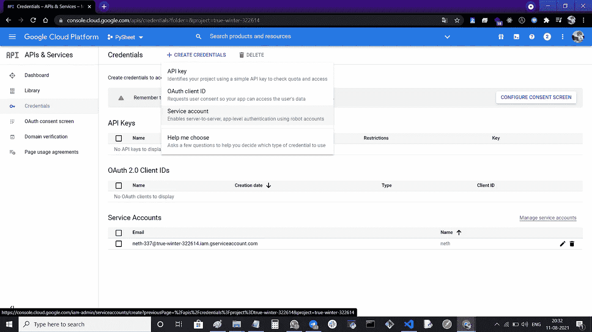

步骤 6.1:填写所有服务帐户详细信息

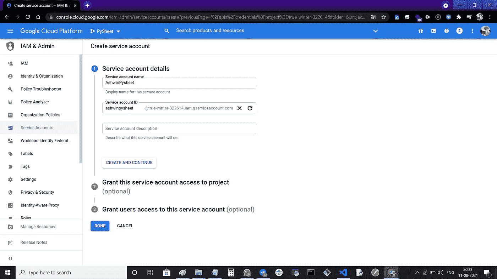

第 6.2 步:在**授予该服务帐户访问**项目的权限中，选择角色为**“项目”**，选择**“编辑或所有者”**。

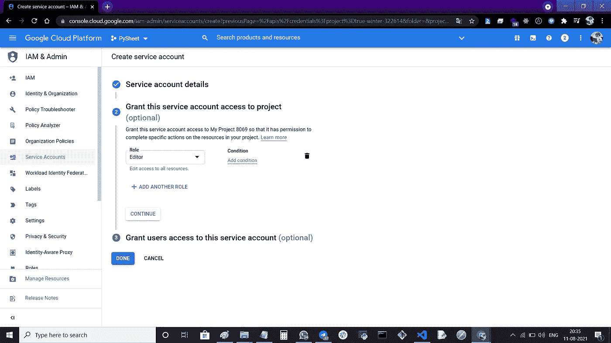

> **编辑器**:编辑文件的权限
> 
> **所有者**:创建、删除和编辑文件的权限

第 7 步:点击您可以在**服务账户空间**看到的电子邮件

> 邮件是这样存在的**xyz@true-winter-322614.iam.gserviceaccount.com**

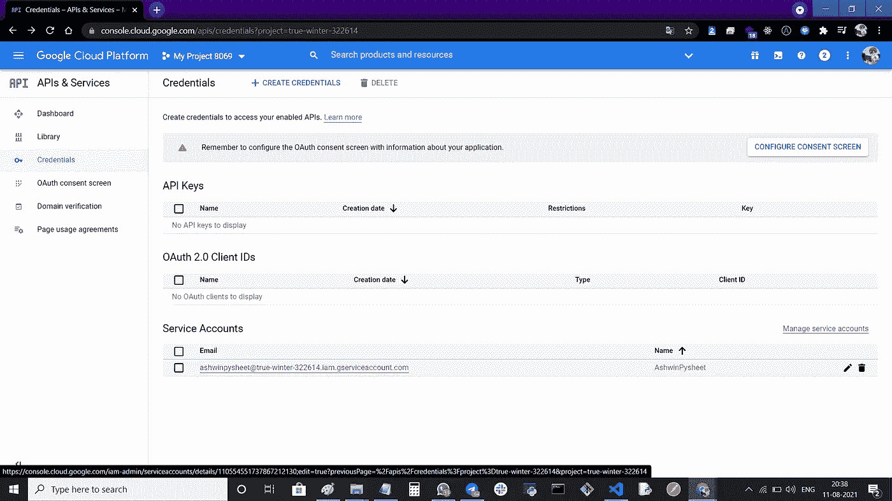

第八步:点击**键**，从**“添加键”**下拉菜单中选择**“创建新键”**选项。

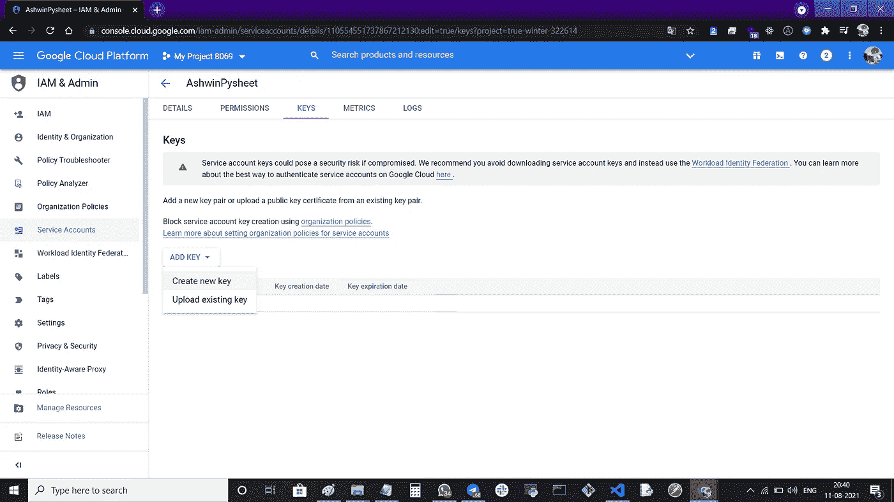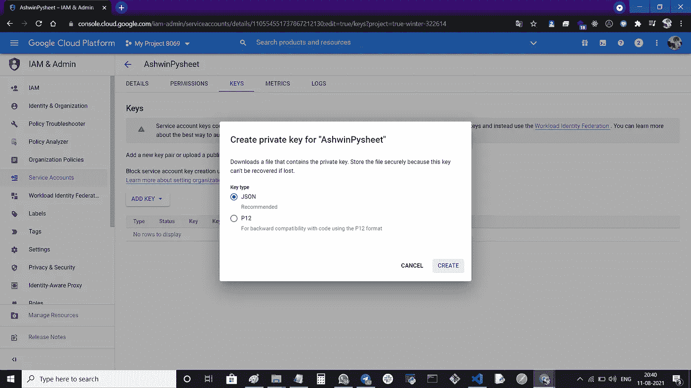

> 它会自动在我们的操作系统中下载 JSON 文件

第九步:然后关闭它，回到上一页，复制邮件并粘贴到你的剪贴板或记事本中，以备将来使用

**谷歌表单中的流程**

在 Google Cloud Console 中完成上述流程后，下面是 google sheet 中的下一个流程。

步骤 1:使用这个链接创建一个 Google 工作表

> [https://docs.google.com/spreadsheets/](https://docs.google.com/spreadsheets/u/0/)

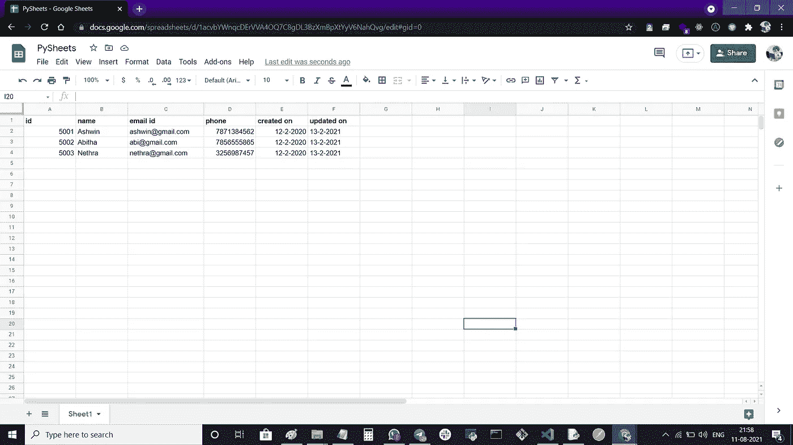

第二步:在你的表格字段中写一些你想要的东西，如 ID，姓名，电子邮件等。

第三步:点击右上角的分享按钮**将复制的邮箱地址**粘贴到那里。然后单击完成。


> 如有疑问，请参考流程 1 的第 9 步

**代码编辑器中的过程**

到目前为止，我们已经完成了 API 创建和工作表创建，现在我们将编写一个 python 程序来完成 Google sheet 中的一些基本操作。

转到您最喜欢的代码编辑器

步骤 1:安装一个名为 **gspread** 的 python 包

第二步:安装一个名为 **oauth2client** 的 python 包

第三步:之后写代码

第四步:将下载的 JSON 文件保存到你的工作目录中，例如 **Creds.json**

**文件名-Main.py**

```
import gspreadfrom oauth2client.service_account import ServiceAccountCredentialsdef integrate(idno,name,email,phone,created_on,updated_on):
     scope=   ["https://spreadsheets.google.com/feeds",'https://www.googleapis.com/auth/spreadsheets',"https://www.googleapis.com/auth/drive.file","https://www.googleapis.com/auth/drive"]credentials=ServiceAccountCredentials.from_json_keyfile_name('creds.json',scope) gc=gspread.authorize(credentials) wks=gc.open('Google Sheet Name').sheet1 try: wks.append_row([idno,name,email,phone,created_on,updated_on]) #[idno,name,email,phone,created_on,updated_on] google sheet field    #names. print("Inserted Successfully !") except:
          print("Error Occurred") return#Getting Input from useridno=int(input("Enter the id:"))name=input("Enter the Name:")email=input("Enter the Email:")phone=int(input("Enter the phone number:"))created_on=str(input("Created on:"))updated_on=str(input("Updated on:"))#Function Call
integrate(idno,name,email,phone,created_on,updated_on) 
```


最后，用户可以看到输入的值存储在我们的工作表行中。

我们成功地完成了，

谢谢大家！❤