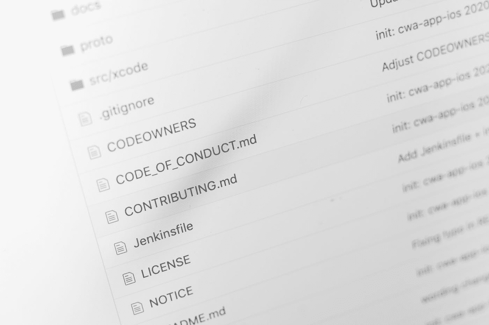
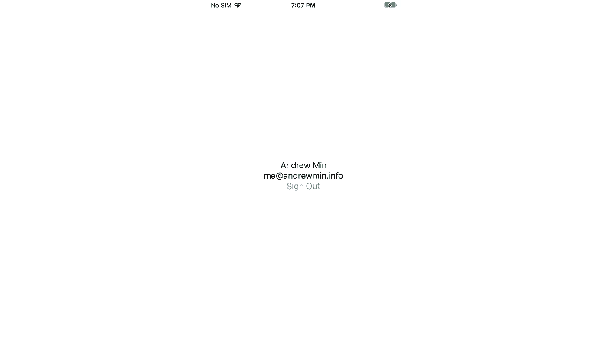

# 使用 SwiftUI 登录 Google

> 原文：<https://blog.devgenius.io/google-sign-in-with-swiftui-63f8e1deeae6?source=collection_archive---------1----------------------->



马库斯·温克勒在 [Unsplash](https://unsplash.com?utm_source=medium&utm_medium=referral) 上拍摄的照片

*原贴于我的* [*博客*](https://www.andrewmin.info/blog/google-sign-in/)

# 概观

谷歌提供了一个简单的 SDK，通过一个有用的[指南](https://developers.google.com/identity/sign-in/ios/start-integrating)将谷歌登录与 iOS 应用集成在一起。然而，该指南介绍了使用 UIKit 的代码示例，因此我将展示如何使用 SwiftUI 和管理状态来使用 Google Sign-In(这是**而不是**旨在取代该指南，这只是展示了使用 SwiftUI 的示例)。

# 装置

[指南](https://developers.google.com/identity/sign-in/ios/start-integrating)中有几页是关于为你的项目设置`GoogleSignIn`的。总而言之，您需要:

*   用 CocoaPods ( `pod 'GoogleSignIn'`)将`GoogleSignIn`包添加到您的项目中。
*   去谷歌的开发者控制台创建一个新项目，然后获取你的 OAuth 2.0 客户端 ID 证书。
*   在 Xcode 项目目标的“信息”选项卡下的“URL 类型”中添加一个条目。URL 方案可以在开发人员控制台的“iOS URL 方案”下找到(这只是您的“客户端 ID”，域名颠倒了)。添加 URL 方案允许登录网页重定向回你的应用。

# 谷歌代表

Google 建议在你的`AppDelegate`中实现`GIDSignInDelegate`，但是相反，我们将创建一个单独的`GoogleDelegate`，这将使得管理 SwiftUI 状态更加容易。`GoogleDelegate`也将实现`ObservableObject`并包含一个已发布的属性— `signedIn`。处理登录的视图可以通过观察`signedIn`属性自动更新。

```
import GoogleSignInclass GoogleDelegate: NSObject, GIDSignInDelegate, ObservableObject { @Published var signedIn: Bool = false ...
}
```

接下来，我们必须实现用户登录时调用的`sign(_:didSignInFor:withError:)`方法。该指南提供了一个示例实现，但是如果登录成功，我们将添加一行来将我们的`signedIn`属性设置为`true`。

```
func sign(_ signIn: GIDSignIn!, didSignInFor user: GIDGoogleUser!, withError error: Error!) {
    if let error = error {
        if (error as NSError).code == GIDSignInErrorCode.hasNoAuthInKeychain.rawValue {
            print("The user has not signed in before or they have since signed out.")
        } else {
            print("\(error.localizedDescription)")
        }
        return
    } // If the previous `error` is null, then the sign-in was succesful
    print("Successful sign-in!")
    signedIn = true
}
```

注意:如果您决定用一种不同于打印错误的方式来处理错误，一定要检查错误不是`GIDSignInErrorCode.canceled`。如果用户点击登录按钮，然后关闭登录页面，`sign(_:didSignInFor:withError:)`将被调用，并显示一个`GIDSignInErrorCode.canceled`错误，您很可能想忽略这个错误。

# 应用和场景代表

现在`GoogleDelegate`已经完成，我们需要给`AppDelegate`和`SceneDelegate`添加更多的设置。

首先，在我们的`AppDelegate`的`application(_:didFinishLaunchingWithOptions:`(应用程序入口点)中，我们将设置我们的:

*   客户端 ID —客户端 ID 位于开发人员控制台中。
*   代表—我们的`GoogleDelegate`班。
*   范围——您的应用程序需要请求的任何额外的[范围](https://developers.google.com/identity/protocols/oauth2/scopes)。

```
// GIDSignIn's delegate is a weak property, so we have to define our GoogleDelegate outside the function to prevent it from being deallocated.
let googleDelegate = GoogleDelegate()func application(_ application: UIApplication, didFinishLaunchingWithOptions launchOptions [UIApplication.LaunchOptionsKey: Any]?) -> Bool { GIDSignIn.sharedInstance().clientID = "...googleusercontent.com"
    GIDSignIn.sharedInstance().delegate = googleDelegate
    GIDSignIn.sharedInstance().scopes = Constants.GS.scopes return true
}
```

我们还必须实现`application(_:open:options:)`，它在登录页面重定向回我们的应用程序时被调用。

```
func application(_ app: UIApplication, open url: URL, options [UIApplication.OpenURLOptionsKey : Any]) -> Bool {
    return GIDSignIn.sharedInstance().handle(url)
}
```

接下来，我们必须给`SceneDelegate`中的`scene(_:willConnectTo:options:)`方法添加一些东西。首先，我们将把我们的`googleDelegate`设置为`EnvironmentObject`，这样我们的视图可以很容易地访问它。其次，我们还需要设置`GIDSignIn.sharedInstance().presentingViewController`。通常，我们会将`presentingViewController`设置为`UIViewController`拥有的任何登录视图，但是因为我们没有任何视图控制器，所以我们将它设置为`rootViewController`。

```
func scene(_ scene: UIScene, willConnectTo session: UISceneSession, options connectionOptions: UIScene.ConnectionOptions) { // Get the googleDelegate from AppDelegate
    let googleDelegate = (UIApplication.shared.delegate as! AppDelegate).googleDelegate // Add googleDelegate as an environment object
    let contentView = ContentView()
        .environmentObject(googleDelegate) if let windowScene = scene as? UIWindowScene {
        let window = UIWindow(windowScene: windowScene)
        window.rootViewController = UIHostingController(rootView: contentView) // Set presentingViewControll to rootViewController
        GIDSignIn.sharedInstance().presentingViewController = window.rootViewController self.window = window
        window.makeKeyAndVisible()
    }
}
```

# 登录按钮

最后，完成所有设置后，我们可以创建我们的登录页面了。我们将设计我们的页面，如果用户没有登录，我们会显示一个简单的登录按钮。如果用户已登录，我们将显示他们的姓名和电子邮件以及一个注销按钮。请注意，这里关注的是功能，而不是漂亮的 UI。

对于登录按钮，Google 提供了`GIDSignInButton`类，它已经有了一个标准的 Google 外观并处理点击动作。由于按钮是一个`UIControl`，我们需要将它包装在一个`UIViewRepresentable`中，以便在 SwiftUI 主体中使用它。

```
import GoogleSignIn
import SwiftUIstruct SignInButton: UIViewRepresentable { func makeUIView(context: Context) -> GIDSignInButton {
        let button = GIDSignInButton()
        // Customize button here
        button.colorScheme = .light
        return button
    } func updateUIView(_ uiView: UIViewType, context: Context) {}   
}struct ContentView: View { @EnvironmentObject var googleDelegate: GoogleDelegate var body: some View {
        SignInButton()
    }
}
```

或者，您可以创建自己的按钮，并在点击时调用`GIDSignIn.sharedInstance().signIn()`。

```
var body: some View {
    Button(action: {
        GIDSignIn.sharedInstance().signIn()
    }) {
        Text("Sign In")
    }
}
```

太好了，现在我们的用户可以登录了。然而，`GoogleDelegate`的全部目的是在用户登录后更新我们的视图，所以让我们显示一些用户登录后的信息。个人资料可以在`GIDSignIn.sharedInstance().currentUser!.profile`中找到。

我们还需要一个注销按钮。当它被按下时，我们调用`GIDSignIn.sharedInstance().signOut()`,并将我们的 GoogleDelegate 中的`signedIn`设置为`false`,以再次显示登录按钮。

```
// To use if/else in our body, we need to wrap the view in a Group
var body: some View {
    Group {
        if googleDelegate.signedIn {
            VStack {
                Text(GIDSignIn.sharedInstance().currentUser!.profile.name)
                Text(GIDSignIn.sharedInstance().currentUser!.profile.email)
                Button(action: {
                    GIDSignIn.sharedInstance().signOut()
                    googleDelegate.signedIn = false
                }) {
                    Text("Sign Out")
                }
            }
        } else {
            Button(action: {
                GIDSignIn.sharedInstance().signIn()
            }) {
                Text("Sign In")
            }
        }
    }
}
```

现在，如果我们运行我们的应用程序，我们会看到一个登录按钮。按下时，谷歌登录模式将弹出。请注意，如果您请求了敏感范围(可以访问个人信息的范围)，您将看到一个警告，上面写着“此应用程序未经验证”。为了摆脱这一点，你需要让你的应用程序[得到验证](https://support.google.com/cloud/answer/7454865?hl=en)。但是对于测试，您可以只按左下角的“高级”，然后“转到*App*(不安全)”。

登录后，模式应该消失，视图现在应该显示您的姓名和电子邮件地址，以及一个注销按钮。按注销将刷新视图，并再次显示登录按钮。



用户登录后，视图会显示他们的姓名和电子邮件。

最后，为了在用户关闭并重新打开应用程序时自动登录，我们需要在用户打开登录页面时调用`GIDSignIn.sharedInstance().restorePreviousSignIn()`。

```
var body: some View {
    Group {
        ...
    }
    .onAppear {
        GIDSignIn.sharedInstance().restorePreviousSignIn()
    }
}
```

# 摘要

使用 SwiftUI 的`ObservableObject`来管理状态使得我们的视图在用户登录或退出时自动更新变得非常容易。使用 UIKit，当用户登录或退出时，你必须管理混乱的`NotificationCenter`帖子来更新 UI。

使用 Google Sign-In 做一些有用的事情，比如进行 API 调用或者向您自己的后端验证用户，这超出了本文的范围，但是 Google 提供了许多他们自己的指南。

*原发于我的* [*博客*](https://www.andrewmin.info/blog/google-sign-in/)