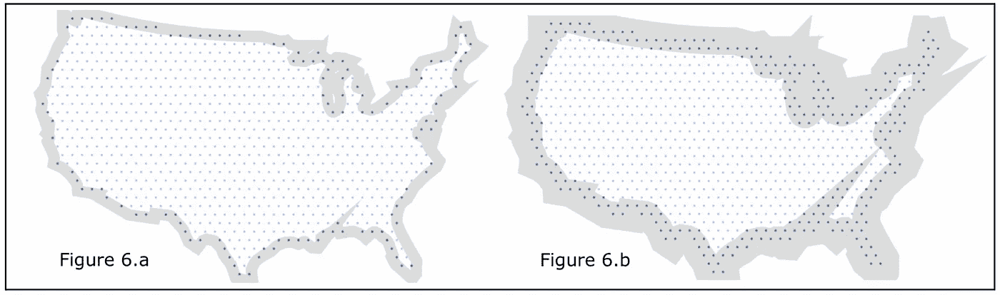

# 谷歌代码之夏——制图员制图

> 原文：<https://blog.devgenius.io/google-summer-of-code-cartograms-in-grapher-1a18d33bf174?source=collection_archive---------12----------------------->


祝我好运:)

**更新**:我得到了工作😋

我为谷歌代码之夏，2022 年夏天向我们的数据世界(OWID)提交了一份提案，以实现一个人口规模、形状保留的世界地图。

# 1.概观

我们的数据世界(OWID)致力于通过交互式地理数据可视化来了解和理解全球问题，了解世界是如何随着时间发生变化的。

快速直观地查看与人口相关的世界地图，使观众能够轻松地将效果与相对测量的重力关联起来。OWID 使用了一系列的 choropleth 地图，但是按大小缩放的地图有缺点，主要是因为人类的视觉感知将区域与重要性联系在一起。此外，现成的替代品使用的是扭曲国家形状的镶嵌图。

基本思想是通过按人口调整区域大小来扭曲地图，因为人口是最重要的考虑因素之一；例如，如果一个幅员辽阔的国家营养不良率很高，那么严重程度就比一个小国营养不良率高要严重得多。


图 1 是一幅基于人口的地图，显示了与原始地图相比，地图如何能给人以不同的世界人口印象。

# 2.问题描述

在一句话中，主要目标是通过用一种在形状和面积之间进行权衡的方法来说明领土，从而绘制出一张直观的世界地图。

此外，确保区域的形状或轮廓(例如:国家和省份)得到保留也很重要，即可视化步骤必须到位，以使生成的地图图看起来与原始世界地图图相似，从而仅通过其外观就可以很容易地识别该区域，而无需明确的标签并快速理解显示的数据。

因此，问题的定义归结为[2]:

*   形状保存:在不改变形状的情况下，按一个因子重新缩放区域几乎是不可能的；因此，该解决方案填补了理想解决方案和预期结果之间的空白。
*   拓扑保持:强调算法提供到原始多边形集的映射的重要性，没有它，求解图同构是有挑战性的。

# 3.履行

该项目主要由 3 个部分组成:

*   数据检索与转换
*   核心服务
*   输出和可视化

在处理单个组件之前，第一步也是最重要的一步是合同定义(低级设计)，考虑最突出的用例；第一步是最终确定输入、数据集的结构、接口、dto 和 Dao。

# 3.1.数据检索与转换

数据源:

*   文件系统:CSV 或 TSV。
*   数据库:MySQL。
*   API:用于处理 OWID 数据目录的 Pythonic API[参考](https://github.com/owid/owid-catalog-py)。

不管数据源是什么，产生的内存列表或迭代器(对于大型数据集)是转换层的输入，负责标准化核心服务的输入；这确保了输入的变化在理想情况下独立于核心功能。

# 3.2.核心服务

# 3.2.1.输入/输出

**摘要**:将数据转换后的人口数据集作为输入，生成输出，绘制相对比例尺的世界地图。

**输入参数**:

*   人口数据集。
*   图表中的像元数(正方形或六边形)(默认值:20000，对于像元密度为 50 万的视觉敏锐的世界地图，这是一个近似值)。
*   世界地图的初始边界(默认:大小/面积比例地图)。

**输出**:

*   世界地图的最终边界。
*   每个地区/国家/地区的上述边界内的单元格映射。
*   输出格式:CSV 或 Json。

# 3.2.2.算法的要点

*   举个例子，假设在一幅按大小比例绘制的世界地图中有 20000 个正方形(1x1)的像元，其中每个国家都有特定数量的像元来表示总面积。
*   现在，以人口而不是大小作为衡量标准会改变每个国家的像元数(像元总数仍为 20000)。
*   为了将大小比例的世界地图转换为人口比例的地图，我们在保留形状的情况下跨国家移动细胞，也称为扩散法(DIF)，其中细胞从一个国家移动到另一个国家，直到达到平衡分布[3]

为简单起见，我们以澳大利亚和印度为例。印度约为 3，287，263 平方公里，而澳大利亚约为 7，741，220 平方公里，使澳大利亚几乎是印度的 2.4 倍。另一方面，澳大利亚和印度的人口分别为 26，068，792 人和 1，406，631，776 人，使得印度的人口是澳大利亚的 54 倍。


图 2 显示了澳大利亚和印度的比例图；为了将地图缩放到人口比例，我们将单元从澳大利亚移动到印度；图 3 显示了这两个国家的人口比例图。请注意，地图在保持国家形状的同时进行了缩放。然而，通过缩放后的形状对一个国家进行视觉识别的程度是主观的，但可以通过计算区域和人口比例的世界地图之间的失真程度来测量。

注:图 2 和图 3 没有完全按比例绘制，也没有手绘来显示相关性。

注意事项:

*   单元可以被认为是像素，而边界是围绕像素的周界。
*   虽然算法不限于人口数据集并且是通用的，但是输入和输出可以遵循特定于人口的变换和标准，例如国家代码和 [geojson](https://python-geojson.readthedocs.io/en/latest/) 规范。
*   需要注意的是，像元的值也会发生变化，即在图 2 中，每个像元代表 25，000 平方公里的区域，而在图 2 中，每个像元代表 50 万人口。

# 3.3.输出和可视化

如上所述，输出主要由两部分组成，单元格和边框。每个单元格都与一个地区/国家代码、XY 坐标(左下角)和元数据相关联。核心服务的输出被提供给转换层，以生成有意义的插图；一个这样的例子是创建一个世界地图的 SVG。此外，转换后的输出被适当地存储在数据或文件存储中。其他转换包括便于与可视化工具集成的格式。

# 4.交付成果和里程碑

# 4.1.可交付成果

**输入和输出标准化**(独立于数据集，但足够灵活以支持多种群体数据集)和转换(映射器)。

来自 Topo-json 的**单元** (X，Y，国家)和**边界** (X，Y，国家代码，边界类型)生成器。

**像元密度**(每个像元的值，例如一个人口 500 万的国家如果每个像元换算成 50 万就有 10 个像元)计算器根据输入；需要在世界地图中确定适当数量的单元。

**测量失真或拓扑错误**:找出国家形状失真的程度、国家间位置或方向的相对变化以及相邻国家间的邻接失真[3]。

**图表的算法**:

*   扩散法的实施(第 3.2.2 节)。
*   实验/使用其他算法的抽象。

**输出转换**:

*   数据帧(单元格和边框)到 CSV/JSON 转换器。
*   输出的持久性(MySQL/file-store)。
*   SVG 形式的持久化输出的可视化表示。
*   与图形可视化工具集成(可能需要额外的输出数据转换)。

# 4.2.时间表

工作估算:300 小时

在夏季学期，我选择了参加一个额外的课程，“数据科学的过程”，并可能自愿为一个非政府组织做饭。我打算一周工作 20 小时，直到项目完成，没有休息。

敏捷方法 15 周时间表和 7 x 2 周冲刺:

**冲刺 1:6 月 13 日—6 月 20 日**

*   先决条件:需求关闭和存储库设置。
*   数据:输入和输出的格式和单位最终确定(可灵活扩展)。
*   Cartogram 算法:实现细节(伪代码)。

**冲刺二:6 月 20 日—7 月 4 日**

*   数据(转换):栅格(。asc)到小区坐标列表和小区组/国家边界的计算。
*   图表算法:带有测试用例的低层次设计。
*   可视化:探索合适的库来可视化输出。

**冲刺 3:6 月 4 日—7 月 18 日**

*   Cartogram 算法:跨细胞群/国家移动细胞的第一个工作模型。
*   验证:计算人口比例地图相对于大小比例地图的扭曲程度(理想情况下，找到一种保持形状的方法)。
*   验证测试用例(测试驱动开发)。

**冲刺 4:7 月 18 日—8 月 1 日**

*   Cartogram 算法:形状保持实现细节、底层设计和测试用例。
*   可视化:可视化人口比例的世界地图，以更好地了解形状保存。

**冲刺 5:8 月 1 日—8 月 15 日**

*   扩散算法:形状保持实现和重新迭代。
*   验证测试用例(测试驱动开发)。

**冲刺 6:8 月 15 日—8 月 29 日**

*   Cartogram 算法:实现闭包来拼凑(结果:跨单元组/国家移动单元，同时保留国家的形状，并测量扭曲程度)。
*   可视化:探索开发一个易于使用的可视化工具，在网格(世界地图)中删除和插入单元，以微调输出地图。

**冲刺 7:8 月 29 日—9 月 12 日**

*   可视化:实现一个可视化工具来微调输出世界地图并重新生成输出 CSV。

**关闭时间:9 月 12 日—9 月 19 日**

*   剩余部分的完成缓冲。
*   文档:安装、使用和示例。

# 4.3.原型

早期的需求收集和构建原型为所涉及的工作提供了良好的开端和清晰性，转化为近乎精确的项目计划。

# 4.3.1.连续图表

我最初构建了一个原型，做了以下工作:

*   如第 3.2.2 节所述，具有 20000 个像元的大小比例的世界地图是从分辨率为 60 分钟/1 度(~ 110 千米)的光栅世界地图数据集得到的。
*   接下来，从所有唯一国家代码的像元计算边界。
*   最后，与通过跨国家移动细胞手动获得的人口比例世界地图进行比较[1]。


图 4:大小比例的世界地图

图 4 显示了从栅格数据集[5]获得的大小比例的世界地图，而图 5 显示了预期的人口比例的世界地图输出。在这个项目结束时，目标是通过算法生成图 5。


图 5:人口比例的世界地图(2018 年)

# 4.3.2.非连续图表

虽然生成人口比例的世界地图的高级设计在概念上保持不变，但扭曲多边形的另一种方法(重新排列会增加复杂性):

*   导入大小比例/上一年人口比例的世界地图(geoJson)。
*   用代表单元格中心的点填充整个区域。
*   过滤多边形(国家)外的单元格；执行此操作时，用于选择边节点的边框周围的笔划宽度负责增加/减少像元的数量(同时保持形状)。
*   对所有多边形/国家重复上述步骤。



图 6.a 和 6.b:美国国土面积缩小。深蓝色的点代表要移除的细胞。

# 4.3.3.工作原型

最后，使用前一年的统计图生成下一年的统计图比按比例缩放世界地图产生更好的结果。例如，图 7 显示了 2018 年人口比例统计图(手动生成)。图 8 显示了以图 7 为基准，通过算法生成的 2050 年地图。

在探索了现有的工具如 [Tilegrams](https://github.com/PitchInteractiveInc/tilegrams) (不再维护)之后，我构建了一个轻量级的原型来处理更高的分辨率。

原型:【https://www.pyblog.xyz/population-cartogram 

其他剧本:【https://github.com/addu390/population-cartogram 

该原型允许改变六边形的半径，并可视化从 1950 年到 2100 年的人口比例的世界地图。


图 7:1960 年至 2060 年的世界人口统计图

# 4.3.4.师徒制

我一直在与行业专家集思广益，并收到了这个项目的巨大反馈。最重要的是，OWID GSoC 导师 [Daniel Bachler](https://github.com/danyx23) 不断帮助我收集需求，制定可能的解决方案，并改进提案。其次，与 Matt Dzugan 就[世界人口图表](https://github.com/mattdzugan/World-Population-Cartogram/issues/13)进行的讨论为原型奠定了基础。

# 5.关于我

我的名字是阿德什·纳尔贝·阿迪穆尔蒂，我是达尔豪西大学的计算机科学研究生，是一名崭露头角的插画师，之前是 PhonePe 和 YC·clear tax 的后端工程师。我精通 Java 和 Python，但也能适应任何编程语言。从 GSoC，我希望作为一个开源贡献者有一个良好的开端，并回馈社区。

**链接**:

*   github:[https://github.com/addu390](https://github.com/addu390)
*   作者:[https://pyblog.xyz/](https://pyblog.xyz/)
*   简历:[https://www.pyblog.xyz/about](https://www.pyblog.xyz/about)

相关项目和讨论:

*   [混合空间索引](https://www.pyblog.xyz/hybrid-spatial-index-conclusion)和用于安全交付的[原型](https://github.com/addu390/dedo)。
*   [项目构想及讨论](https://github.com/owid/owid-grapher/discussions/1288)

# 6)参考文献

```
[1] M. Dzugan, “World Population Cartogram,” GitHub, Mar. 25, 2022\. https://github.com/mattdzugan/World-Population-Cartogram (accessed Mar. 25, 2022).[2] Keim, Daniel & North, Stephen & Panse, Christian. (2004). CartoDraw: A Fast Algorithm for Generating Contiguous Cartograms. IEEE transactions on visualization and computer graphics. 10\. 95-110\. 10.1109/TVCG.2004.1260761\. [3] M. Alam, S. Kobourov, M. Schneider, and S. Veeramoni, "An Experimental Study of Algorithms for Cartogram Generation." Accessed: Mar. 25, 2022\. [Online]. Available: https://www2.cs.arizona.edu/~mjalam/cartogram/main.pdf.[4] "Proposal Example 2, Google Summer of Code Guides," google.github.io. https://google.github.io/gsocguides/student/proposal-example-2.html (accessed Mar. 25, 2022).[5] "National Identifier Grid, v4.11: Gridded Population of the World (GPW), v4, SEDAC," sedac.ciesin.columbia.edu. https://sedac.ciesin.columbia.edu/data/set/gpw-v4-national-identifier-grid-rev11 (accessed Mar. 28, 2022).
```