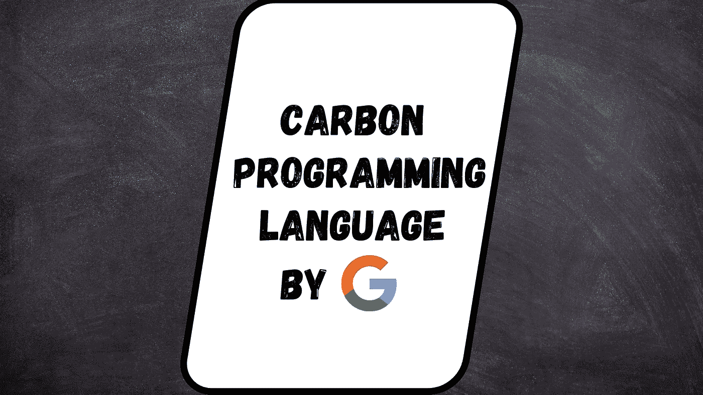

# 谷歌的新编程语言:Carbon

> 原文：<https://blog.devgenius.io/googles-new-programming-language-carbon-b4c5f9120cb0?source=collection_archive---------3----------------------->

# 介绍

谷歌宣布了一种叫做 Carbon 的新编程语言。碳排放日期是 2022 年 7 月 19 日。Carbon 是一种通用编程语言，由 Google 创建，是 C++的后继语言。一位名叫钱德勒·卡鲁斯的谷歌员工向开发人员介绍了一种叫做 Carbon 的新编程语言。

Google 编程语言的技术主管 Chandler Carruth 告诉我们，他们将从 C++社区开始这项实验工作。该语言将在 [GitHub](https://github.com/carbon-language/carbon-lang#why-build-carbon) 上设计开发。

# 为什么要造碳？

C++仍然是性能关键型软件的主流编程语言。然而，如上所述，它正在努力改进和满足开发者的需求，部分原因是积累了几十年的技术债务和发展过程中的挑战。解决这些问题的最佳方法是避免继承 C 或 C++的遗产，而是从坚实的语言基础开始，如现代泛型系统、模块化代码组织、一致而简单的语法。

Carbon 从根本上说是一种后继语言方法，而不是一种增量进化 C++的尝试。C++的后继语言需要:

*   性能匹配 C++，这是我们开发人员的基本属性。
*   与 C++无缝的双向互操作性，这样现有 C++堆栈中的任何库都可以采用 Carbon，而无需移植其余的。
*   C++开发人员适度熟悉的温和学习曲线。
*   可比较的表达能力和对现有软件设计的支持。
*   可伸缩的迁移，对惯用的 C++代码进行某种程度的源代码到源代码的翻译。

有几种语言在其他生态系统中遵循了这种模式，Carbon 旨在为 C++扮演类似的角色:

*   JavaScript ->类型脚本
*   Java -> Kotlin
*   C++ ->碳

# 语言目标

他们设计碳来支持:

*   性能关键型软件
*   软件和语言进化
*   易于阅读、书写和理解的代码。
*   实用的安全和测试机制
*   快速和可扩展的开发
*   现代操作系统平台、硬件架构和环境
*   与现有 C++代码的互操作性和从现有 c++代码的迁移

Carbon Language 目前是一个实验项目。没有有效的编译器或工具链。你可以在 compiler-explorer.com 的[上看到碳的演示解释器](https://carbon.compiler-explorer.com/)

你可以在这里了解 carbon 编程语言[的语法](https://programmingeeksclub.com/carbon-programming-language-new-programming-language-google/)