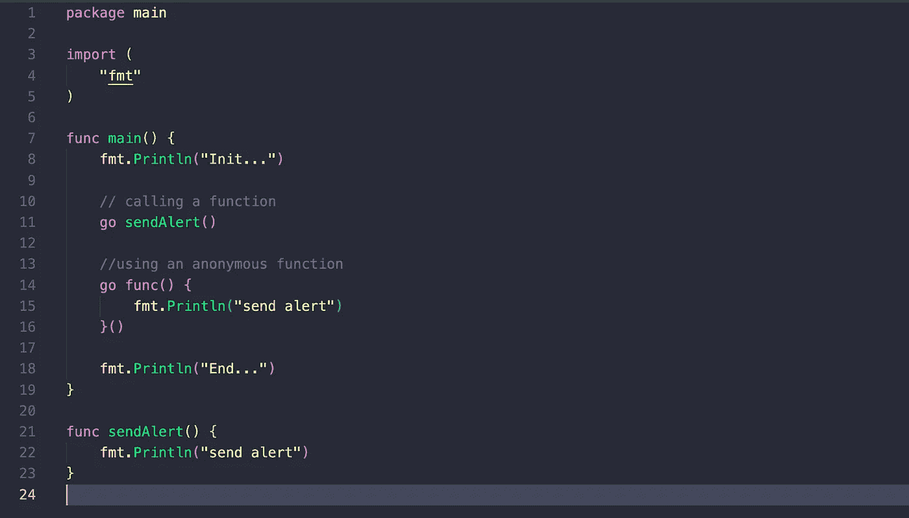
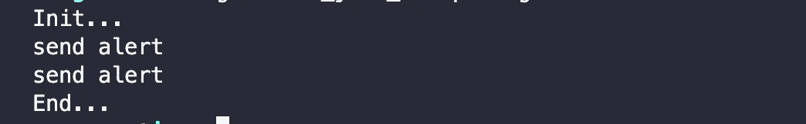

# 戈鲁廷斯

> 原文：<https://blog.devgenius.io/goroutines-da7ed6ced8a1?source=collection_archive---------12----------------------->

## 从基础开始

我们可以将 goroutine 定义为*“定义要运行的程序或函数的逻辑执行单元，它还包含与 goroutine 相关的重要信息，如堆栈内存，其中的机器/线程正在运行 goroutine 和堆栈跟踪”。*

简而言之，goroutine 是一个与主 goroutine 同时执行的函数。

在 go 编程语言中，一个新的“线程”是在函数调用之前由关键字“Go”生成的。

示例:

**输出:**

如图所示，代码定义了两个 goroutines 一个在第 11 行调用“sendAlert”函数，第二个使用匿名函数定义。

这就是我们现在正在创建的 goroutines！。

在接下来的章节中，我们将了解哪些组、互斥体和通道将有助于我们编写更复杂的 goroutines。

***下一步:*** [***如何实现 WaitGroup***](https://medium.com/@josueparra2892/golang-waitgroups-2cd6c5b4306d)

> 本文与 Golang 并发教程相关，您可以在以下链接中找到该教程:
> 
> [https://medium . com/@ josueparra 2892/concurrency-in-go-BF 93 e 23 bebd 4](https://medium.com/@josueparra2892/concurrency-in-go-bf93e23bebd4)