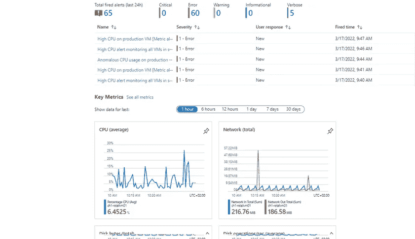
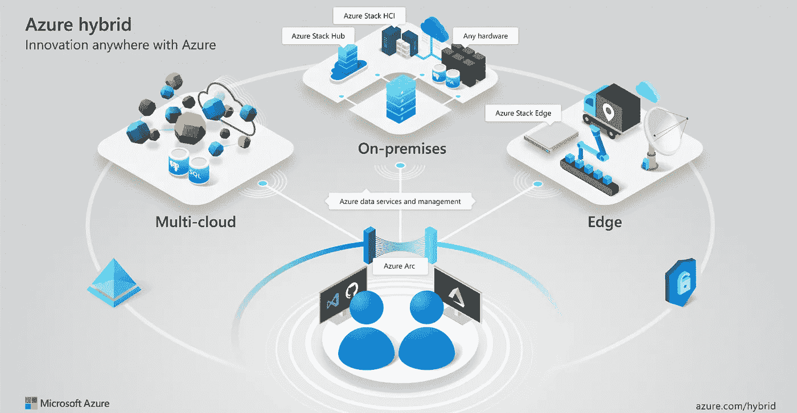

# 使用 Azure Arc 治理和管理多云和本地平台

> 原文：<https://blog.devgenius.io/governance-and-management-of-multi-cloud-and-on-premises-platform-using-azure-arc-50c3156583d2?source=collection_archive---------8----------------------->

在公共云环境中，每次供应、扩展、停止或终止虚拟机等资源时，操作都要经过结构控制器。

Azure 中的每个资源不断向结构控制器报告其状态。例如，在 Azure VMs 的情况下，通信由运行在虚拟机内的代理(VM 代理)发起和管理。

在 fabric 控制器和资源之间，还有另一层叫做 Azure Resource Manager (ARM ),可以自动化资源生命周期。微软已经为 Azure 中运行的每个服务建立了资源提供者。例如，虚拟机、SQL 数据库、Azure Kubernetes 服务充当资源提供者。客户可以通过 ARM 模板声明这些资源的配置，ARM 模板是一个简单的文本文件，定义了资源的期望状态。

它将帮助我们监控、维护和保护我们拥有的资源。

例如，在 Azure monitor 中，我们可以看到关键指标。

很多时候，组织会选择多种云解决方案，并向多个供应商承诺支持他们的云战略。在这种模式下，如果价格上涨或服务质量下降，你不会受到单一供应商的摆布。组织选择遵循混合公共云和私有云模式的原因有很多。随着组织的发展，管理这种分布式基础架构变得越来越困难。然后我们有这样的问题…

*   我们如何让本地运行的传统系统参与到云计算之旅中？
*   当资源驻留在 Azure 内部和外部时，我们如何正确地保护资源？
*   我们如何可靠地清点、部署、修补和维护这个庞大的资源网络？

**溶液是天蓝色的弧光。**

# 什么是 Azure Arc？

图片来源:微软

Azure Arc 是一座桥梁，它扩展了 Azure 平台，以帮助您构建具有跨数据中心、在边缘和在多云环境中运行的灵活性的应用程序和服务。

使用一致的开发、运营和安全模式开发云原生应用。

Azure Arc 运行在新的和现有的硬件、虚拟化和 Kubernetes 平台、物联网设备和集成系统上。

# Azure Arc 的主要优势

Arc 通过简化管理、加速应用程序开发以及确保所有环境中的 Azure 服务保持一致，让您能够加速混合云和多云环境中的创新。

**使用 Azure Monitor 扩展资源监控**

所有注册到 Azure Arc 的资源都将日志发送到中央的、基于云的 Azure Monitor。这是一种从高度分散和不同的基础设施环境中获得洞察力的非常强大的方法。

**扩展 Azure 安全中心**

企业可以使用 [Azure 安全中心](https://azure.microsoft.com/en-in/services/security-center/)来确保向 Azure Arc 注册的所有资源的合规性，而不管它们部署在哪里。一旦发现漏洞，他们可以快速修补虚拟机中运行的操作系统。客户只需按一下按钮，就可以加密所有虚拟机上的文件系统。策略可以定义一次，并自动应用于 Azure、数据中心甚至运行在其他云平台上的虚拟机的所有资源。

**ARM 模板和 Azure APIs 的优势**

有了 Azure Arc，客户可以通过同一个控制平面管理部署在 Azure 内部和外部的资源。他们可以利用 ARM 模板和 Azure API 提供的自动化功能。它使得对资源应用 RBAC、标记和身份策略成为可能。

要管理资源，Azure Arc 用户可以使用 Azure Portal、CLI、SDK 和 Terraform 等工具来自动化资源管理，就像在公共云中管理资源一样。

# Azure Arc 入门？

要开始使用 Azure Arc，您需要一个 Azure cloud 帐户。一旦登录，

**第一步:**通过 Azure Arc 注册想要管理的外部资源。

**第二步:**生成安装脚本。

**步骤 3:** 在各自的内部/外部公共云服务器上执行脚本。[脚本安装 Azure Arc 代理并允许 Azure Fabric 控制器管理它们]

一旦完成上述步骤，外部服务器将在 Azure 门户中可见。您可以应用 RBAC、政策等。

有关更多详细信息，您可以查看:[https://learn . Microsoft . com/en-us/azure/azure-arc/servers/on board-portal](https://learn.microsoft.com/en-us/azure/azure-arc/servers/onboard-portal)

# **Azure Arc vs 亚马逊前哨 vs 谷歌 Anthos**

Azure Arc 适用于任何类型的硬件。它还可以注册和管理使用外部服务托管的工作负载，即使该服务运行在与 Azure 竞争的公共云上。

Amazon Outposts 需要特定的硬件，并且只与 AWS 自己的云服务上托管的工作负载兼容。

Azure Arc 和谷歌 Anthos 产品类似。Anthos 还允许用户部署和管理在内部数据中心或任何公共云上运行的工作负载。Anthos 主要设计用于部署作为容器运行的工作负载，并且可以使用 kubernetes 进行管理。

来源:

[https://azure . Microsoft . com/en-in/products/azure-arc/# overview](https://azure.microsoft.com/en-in/products/azure-arc/#overview)

[https://www . business 2 community . com/cloud-computing/azure-arc-healing-the-pain-of-hybrid-and-multi-cloud-02288636](https://www.business2community.com/cloud-computing/azure-arc-healing-the-pain-of-hybrid-and-multi-cloud-02288636)

[https://learn . Microsoft . com/en-us/azure/azure-arc/servers/plan-at-scale-deployment](https://learn.microsoft.com/en-us/azure/azure-arc/servers/plan-at-scale-deployment)