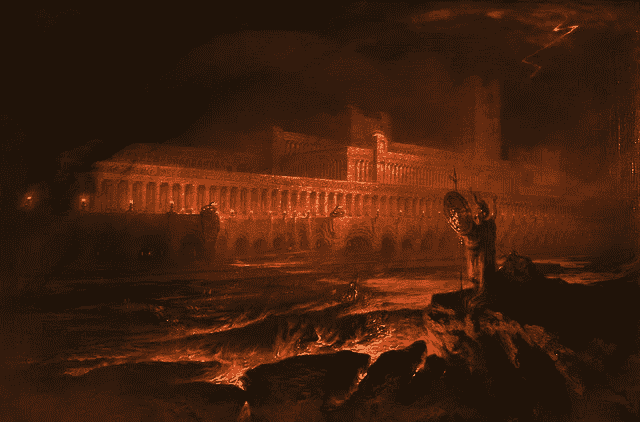
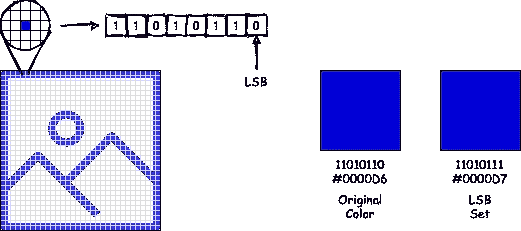
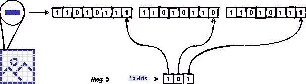
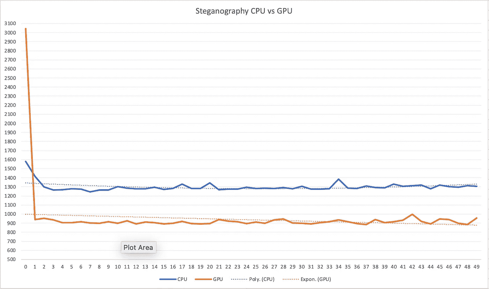
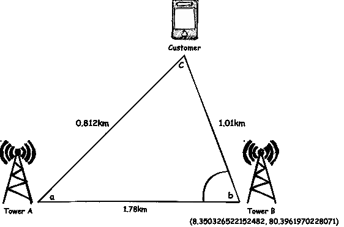
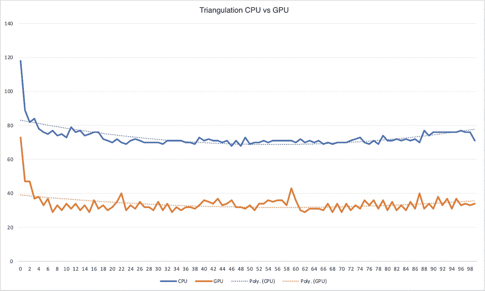

# GPU 驱动的 Java:带有隐写术的暗示

> 原文：<https://blog.devgenius.io/gpu-powered-java-with-a-hint-of-steganography-2ab24c6e6665?source=collection_archive---------3----------------------->

[约翰·马丁，公共领域，通过维基共享资源](https://commons.wikimedia.org/wiki/File:John_Martin_Le_Pandemonium_Louvre.JPG)

*我仍然记得我第一次去卢浮宫的时候，站在一幅醒目的深色油画前，这幅画有一个对比鲜明的金色框架。每一笔都是邀请我深入画布中的世界，我看得越多，它向我展示的就越多。从那以后，我就成了约翰·马丁的《混乱》的粉丝。*

B 信不信由你，GPU 从 20 世纪 70 年代就已经存在了。早期的 GPU 是专门专注于交付图形的设备，独立于 CPU 工作。虽然首字母缩略词的内涵保持不变，但功能和应用已经发生了巨大的变化。现代 GPU 是高吞吐量的发电站，允许它们以高帧速率提供超高分辨率的逼真图形。GPU 已经发展到可以容纳数百个能够并行处理大量指令的内核。这种并行处理的能力引起了不同领域研究者的注意。今天，GPU 被用于大量的应用中，从机器学习、流数据仓库、分析数据库，甚至是 Java。

这些年来，出现了一些允许在 GPU 上执行原生 Java 代码的项目。好的，所以将 CPU 受限的操作移出 Java，并使用 OpenCL 将它们构建为库的选择是并且一直是可能的。不过，这就有趣多了。我们在这里讨论的是在异构设备上直接运行您的原生 Java 代码，对您的代码做最小的更改。我设计了一个测试这个的计划。现在，如果我刚刚编写了一个应用程序，遍历一个非常长的数组并对每个元素执行计算，我就可以轻松地对竞争者进行基准测试。但是，这有什么意思呢？

如果你想知道我在谈论那些混乱的事情，我有一个巧妙的计划。这篇文章的标题图像中有一个隐藏的消息编码。肉眼是看不到的，但是如果你知道怎么看，在哪里看，你会找到的。这是隐写术。具体来说，我在这里使用的是 LSB(最低有效位)隐写术。这个理论很简单。让我解释一下。

图像本质上是像素阵列。我们要做的是，取一个像素，将其转换为位，然后设置该像素的最低有效位。这将导致像素的实际颜色变化非常微小，肉眼无法看到。

现在，让我们关注如何在图像中隐藏消息(甚至是文件)。假设我们需要在图像中隐藏数字 5。二进制的 5 是 101。消息的每一位将利用图像像素的 LSB。

如果你一直密切关注，你会明白，我们编码的每个字节，需要八个图像像素。消息越长，你需要做的数组操作就越多。为了让事情变得更有趣一点，我将根据密码散列创建一个消息长度的密码。然后，我将合并密码和消息以创建一个加密文本，它将隐藏在图像中。

让我们改变一下我们的看法。当我们想到数组时，我们会想到需要顺序处理的东西。如果我们把它看作是一组可以并行执行的独立计算会怎么样。这就是 GPU 要做的，同时计算数组的每个元素。为了获得预期的性能优势，我只需要在 GPU 上执行部分应用程序。看，尽管 GPU 可能很强大，但它不是万能的，那是 CPU 的工作。

这就是在异构硬件上执行应用程序的能力派上用场的地方。第一步是了解我的应用程序的哪些元素将受益于 GPU。然后，我可以重写我的代码，这样我的代码的一部分将使用 GPU 执行，其余的在 CPU 上执行。当我重构代码时，我需要意识到我没有使用复杂的数据类型或者调用阻塞方法，这将违背并行处理的目的。为此，我将使用 **aparapi** 。当使用 **aparapi** 编写时，上面的 FOR 循环看起来像这样。

一旦测试应用程序和测试设置就绪，就到了基准测试的时候了！我使用了一个 **AWS g4dn.xlarge** 实例，一个 **nVidia Tesla T4 GPU** 和四个**第二代英特尔至强 vcpu**。结果一点也不令人惊讶。

查看图表，我们可以看到 GPU 的平均性能提升了 25%。由于图像大小和消息长度导致的冗长数组，隐写应用程序需要大约 1000 毫秒才能完成。实际上，我们只是利用了 GPU 的并行处理能力。GPU 优于 CPU 的另一个方面是当你必须执行复杂的数学运算时。

想象一个蜂窝三角测量场景。一家移动运营商正在根据手机信号塔追踪一名用户。用户 C 在信号塔 A 和 b 上注册。移动运营商知道该客户离每个信号塔有多远，以及两个信号塔之间的距离。使用此信息，我们可以计算用户与基站 B 的角度。然后，使用基站 B 的角度和地理坐标，我们可以计算客户的坐标。

实际上，如果运营商希望使用手机信号发射塔的位置来跟踪他们的客户，这种计算每秒钟必须发生数百万次。我创建了一个设置来用模拟值执行这个计算，当然，每次迭代一百万次。这一次，GPU 的性能提高了 50%左右。

这个故事的寓意是什么？好吧，如果你的应用包含复杂的数组操作或者可以并行执行的数学计算，那么在 GPU 上执行部分代码是有意义的。然而，也有权衡。GPU 不擅长执行基于开关的执行。如果在您的逻辑中需要 IF-ELSE 语句或 SWITCH-CASE 语句，那么您最好使用 CPU。另一个缺点是你需要重构你的代码。有些项目，比如 TornadoVM，允许你最小化代码重组。相反，要在 GPU 上执行的代码可以使用注释来标记。尽管如此，对代码和您的思考方式的微小修改是必要的，因为这些库不能处理复杂的数据类型，例如 String 不能工作。

TornadoVM 注释

好吧，我承认这篇文章有点信息大杂烩。原因是我试图在一定程度上涵盖本文中使用的概念，但又不想让读者厌烦。如果您需要关于此处涉及的任何主题的更多信息，请随时联系我们。如果您有兴趣尝试本文中使用的示例，我已经在这里链接了 git repository⁵ [。
如果你想知道标题图片提供了什么秘密，密码是*失乐园*。](https://github.com/charith26/SteganographyGPU)

> 世界都在他们面前，选择
> 他们休息的地方，和普罗维登斯他们的向导:
> 他们，手拉着手，徘徊的脚步和缓慢的，
> 通过伊甸园采取他们孤独的方式。

[1][https://github.com/Syncleus/aparapi](https://github.com/Syncleus/aparapi)

[https://github.com/beehive-lab/TornadoVM](https://github.com/beehive-lab/TornadoVM)

[3][https://en.wikipedia.org/wiki/Steganography](https://en.wikipedia.org/wiki/Steganography)

[4][https://en . Wikipedia . org/wiki/Mobile _ phone _ tracking # Network-based](https://en.wikipedia.org/wiki/Mobile_phone_tracking#Network-based)

[https://github.com/charith26/SteganographyGPU](https://github.com/charith26/SteganographyGPU)

[6] [https://commons.wikimedia.org/wiki/File:John_Martin_Le_Pandemonium_Louvre。JPG(T1)](https://commons.wikimedia.org/wiki/File:John_Martin_Le_Pandemonium_Louvre.JPG)