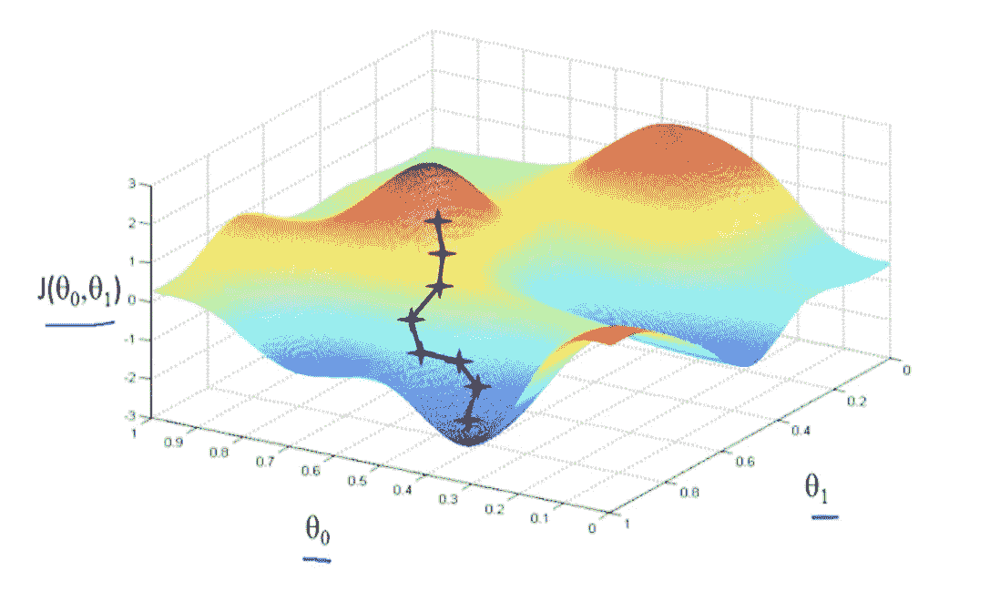
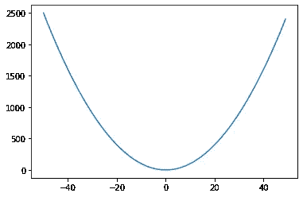
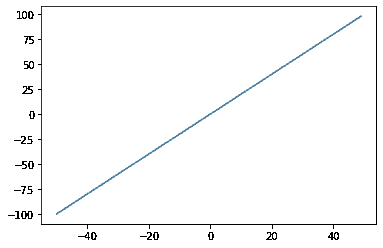
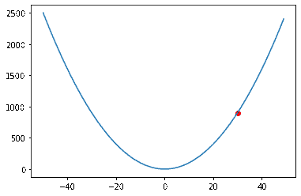

# 梯度下降:ML 背后的魔力

> 原文：<https://blog.devgenius.io/gradient-descent-the-magic-behind-ml-6dc17668d0af?source=collection_archive---------18----------------------->

梯度下降是一个非常酷的算法，用于优化和机器学习程序。这个过程背后的思想是从函数路径上的 x 和 y 坐标开始。然后我们得到梯度(最小化的最陡下降或最大化的上升),它告诉我们应该往哪个方向走，以便最快地下降或上升。我们采取小步骤，检查每一步的新梯度。你可以认为梯度下降是在山顶，并试图尽可能快地下来，山的一边以 2 dy/dx 下降，而另一边以 1 dy/dx 下降(dy/dx 表示 x 每变化一次 y 的变化，因此在 x 方向上走 1 英尺相当于第一个选项 y 变化 2 英尺)。你可能会选择 2 dy/dx 路径，但是当你继续下降时，可能会有另一条更陡的路径，所以你总是想寻找当前最快的下降路径。

[沈子涛](https://zitaoshen.rbind.io/project/optimization/1-min-of-machine-learning-gradient-decent/)

下面是我将在本教程中使用的 colabs 笔记本。

 [## 谷歌联合实验室

### 梯度下降

colab.research.google.com](https://colab.research.google.com/drive/1tR4Ie5hvkM0pyUwxYHSRI-5tq90pqYrH?usp=sharing) 

该算法包括两个步骤

1.  计算当前位置的梯度
2.  在梯度方向上移动一些小的增量

然后重复，直到您达到某个预先确定的迭代次数，或者您的位置变化不大。

**计算坡度**

任何一步的梯度都是该点函数的导数，在这个例子中，我们用 X。

X 的导数是 2X

因此，如果函数中的 X=40，我们应该采取δ* 2(40)=δ* 80 的步长。如果我们在 X=5，我们采取大小为δ* 10 的步骤。你可以看到(为了最小化),当我们接近 x=0 的最小值时，步长会变得越来越小。

**移动**

选择一个小的增量是一个好主意，这样当你迈步时就不会超过最小值，在这个例子中我使用了增量= 0.1。然后我们将开始采取我们的步骤。每走一步，我们都要重新检查我们位置的梯度，以确定下一步应该是什么幅度和方向。

**ML 中的应用**

在机器学习中，梯度下降被用作“学习”部分的主要机制。一个 ML 系统就是一个有很多变量的大函数。在 ML 中，我们定义了一个凹的、可微的损失函数(比如预测和地面真值平方之间的距离)。这样，我们就可以获得损失函数上任意点的导数，并向最小值移动，以使损失最小化。这些梯度步长如何进入模型参数的实际过程称为[反向传播](https://en.wikipedia.org/wiki/Backpropagation)，它在输出端采用梯度步长，并将变化通过模型一路传播回输入层。