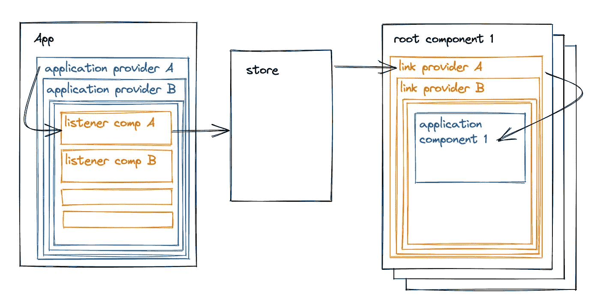

# 逐步重写以做出反应——开始

> 原文：<https://blog.devgenius.io/gradual-rewrite-to-react-the-beginning-7287eb76c5aa?source=collection_archive---------6----------------------->

## 尤其是在我的情况下。

在 [Unsplash](https://unsplash.com/?utm_source=unsplash&utm_medium=referral&utm_content=creditCopyText) 上由 [Milivoj Kuhar](https://unsplash.com/@mimithecook?utm_source=unsplash&utm_medium=referral&utm_content=creditCopyText) 拍摄的照片

最近，我被分配了一项可怕的工作，领导一个 7 岁的 AngularJS 应用程序的逐步重写，以做出反应。我所说的渐进是指我们将应用程序分成几个部分。在进入下一部分之前，每个部分都经过了重写、测试和部署，从而创建了一个混合的 React-AngularJs 应用程序。
与此同时，仍有新的功能并行开发。

我相信重写通常是正确的选择——这里有很多要说的，但重要的是你要试着从整体上重新想象你的系统。

当然，我们更喜欢完全重写，但它是一次性部署的，很难正确测试，而且它会将现有的应用程序置于功能冻结状态，直到所有工作都完成为止——这往往会比预计的时间长得多。

完全重写可能发生的最糟糕的事情是我们永远不会部署它，但是逐步重写可能发生的最糟糕的事情是我们永远不会完成它，因为它更复杂、更长，并且新的特性不断出现。

***为什么渐进重写这么难？***

*   我们需要创建一个混合应用程序——两个应用程序——新旧并存，同时看起来像一个连贯的应用程序。
*   我们必须接受以前的一些决定，即使这些决定会让我们的生活变得复杂。想象一把锤子；你首先更换金属头，然后更换手柄。你的“新”锤子将会继承旧锤子的许多特征，比如尺寸。
*   我们可能会被迫两次实现一些新功能。一次用于旧代码，一次用于新代码。
*   这将需要大量的回归测试

还有很多。

# 这是一场马拉松。你将只有足够的力量进行最后的短距离冲刺。

为了避免在最后被一堆要做的事情卡住，我建议在问题出现时就解决它们，不要把它们推迟到以后。此外，我们应该以这样一种方式来计划我们的项目，这种方式将使我们在进行过程中处理所有的应用层:与服务器的通信、状态管理、UI 组件、CSS、测试、路由等等。

本着这种精神，我们将从一开始就维护一个只支持 react 的应用程序。

## 维护一个只支持 React 的应用

起初，这个应用程序看起来很奇怪:显示简单的组件，没有太多的上下文。但是它会成长并最终成熟为我们唯一的应用程序。

维护一个只支持 React 的应用程序将对我们的开发过程产生积极的副作用。它将迫使我们:

*   学会直接与后端交互(获取/更新数据)。
*   编写所有需要的 CSS。
*   最后，处理路由和结构组件，比如模态。

它会让我们一次做一个垂直的工作:一个功能一个功能地替换(有时是复制)。

想象一下，当你还住在房子里的时候，房子正在翻新。你可能更喜欢一个房间一个房间地走，尽可能少地打扰你的日常生活。在一个房间里测试你的新想法，而不是在粉刷整个房子后才发现颜色不对。

我们将更换每个房间的所有东西，从电力到墙上的画。

## 混合应用程序:角度反应或角度反应

在我们开始写任何东西之前，我们必须决定是否在 React 应用程序中使用 Angular 组件，反之亦然。

我开始认为 React 应用中的角形组件听起来更好:我们在开始会有很多艰苦的工作:结构组件、路由器、页面等。但是到最后只剩下一些无关紧要的部分需要重写。
然后我意识到开始可能太难了:
假设我们在 React 中有一些组件，它的所有子组件都在 Angular 中。我们的 React 组件需要将所有必要的道具传递给它的 Angular 子组件，这将迫使我们:

*   遵从很多年前在 Angular app 里做的决定，这可能是我们不愿意做的。否则，我们一开始就不会重写。
*   重构角度组件以更好地适应我们的计划，这是浪费时间，因为我们想删除所有的角度代码。

现在，让我们仔细看看另一个选项，Angular 应用程序中的 React 组件。
这就好办多了；如果我们愿意，我们可以替换任何 UI 元素。
有不利的一面；更换或增强路由器和结构组件(如侧边栏)将不得不等待。因为我们希望避免在角度组件中包含 React 组件，而角度组件又在 React 组件中，所以我们不能在重写组件的子组件之前访问组件。

我认为第二种方法的缺点不太明显。

**它是一个角形 app 中的反应元件。**

# 我们如何创建我们的混合应用

## 如何将 React 代码加载到我们的角度页面中。

根据我们所做的最少的研究，似乎最简单的方法是将我们的 React 应用捆绑到 npm 库中。

这样，Angular 只需要安装 npm 包，将 js + CSS 文件添加到它的 index.html 中，并使用节点调用一些 init 函数来呈现 React 主组件。

作为一个甜蜜的奖励，你可以在当地与“国家预防机制链接”

我们用 Create React App 开始我们的应用程序，并为 React-only 应用程序使用其默认的 Webpack 版本；在此基础上，我们为 npm 库添加了一个汇总版本(安装在 Angular 应用程序中。)

前者的入口点是“index.tsx ”,而后者的入口点则不同；例如 lib.ts

## 如何将 React 组件嵌入到角树中？

这里我们发现了两个可能的方向:

1.  使用名为 [react2angular](https://github.com/coatue-oss/react2angular) 的库。
    该库为每个角度组件的直接子组件创建一个反应根。它还允许您将道具从父角度组件传递到反应子组件。
    缺点是我们不能开箱即用 React 上下文，因为有多个 React 根。
    ** [这里的](https://github.com/alissaVrk/react2angular)是支持 react 18 的 lib 版本
2.  在门户中呈现 React 组件，以将它们放置在角度树中的正确位置。
    缺点是我们需要自己实现传递道具的桥梁。这里有一篇关于这个主题的文章 Tonkean 博客中的[文章。](https://tonkean.com/blog/developers/it1/embedding-angularjs-and-react-like-a-pro-e6236e3b33a4/)

我们不喜欢第二种选择。它需要编写更多的代码，其中很大一部分是 Angular。所以我们找到了解决上下文问题的方法。

***如何跨多个 React 根使用 React 上下文***

我试着用一个例子来解释:我们希望在应用程序的多个不相关的地方显示一个简单的计数器。因此，在 React-only 应用程序中，我们用“CounterContext”来实现它，它有两个字段:“counter”和“setCounter ”,由“CounterProvider”提供。

现在，在混合应用程序中，组件 A、B 和 C 位于不同的 react 根中，因此它们不能是同一个 CounterProvider 的子级，如果我们使用三个不同的 counter provider，它们中的计数器将会不同。解决方案是在某个地方有一个真实的供应商和三个特殊的*交易对手* **与真实的供应商同步**。

唉，我们需要一个地方——商店——来保存状态，并在发生变化时通知我们的交易对手。React Query、Redux 等都可以，或者下面是 store 的一个简单实现:

简单反应存储

好，我们有一个同步机制。现在我们需要一个地方来存放真正的“对方”并给商店写信。为了实现这一点，我们将添加一个没有任何 UI 的应用程序组件，用一个特殊的 ListenerComponent 呈现 CounterProvider，它将使用 CounterContext 并在更改时写入存储。我们本可以直接从 CounterProvider 向 store 中写入数据，但是我们不希望在我们的 react-only 应用程序中包含任何混合应用程序所需的代码。

总而言之，我们需要一个 App 组件和两个特殊组件:一个我们称之为 LinkProvider 的*类 CounterProvider* 和一个 ListenerComponent。
我们称真正的提供者为应用程序提供者，而真正的组件为应用程序组件。

这里有一张图纸和一些代码

在根组件之间同步上下文数据

在 react 根-链接提供者之间同步上下文

***如何在两个 app 之间传递信息***

技术部分很容易，不要害羞；把 API 贴在窗户上就行了。

上述 API 的设计并不容易，主要取决于你的产品。

主要的问题是，我们的架构中有两个并排的应用程序，每个都独立地与后端通信。但是为了让它看起来像一个单一的连贯产品，我们需要一种方法让一个应用程序知道另一个应用程序中的数据已经改变。

我在这里试着给出几个指点:

*   React 应用程序应该为 angular 应用程序提供一个“init”函数，该函数将接收一些初始信息，如登录信息和应用程序组件的 dom 节点。
*   尝试在单独的模块中编写与这些 API 相关的代码。为此，您需要一种对全局状态变化做出反应的方法。我使用 Redux 进行状态管理，所以我可以依靠' store.subscribe '来知道我应该通知 Angular。
*   如果可能的话，避免在应用程序之间传递信息。使用后端数据库作为事实的来源。
*   如果无法避免传递信息，就模仿与后端的通信。如果你的 Angular 应用不时地从后端轮询数据，那么 React 应用应该提供一个 API，以与后端相同的方式返回数据。

# 最后一个建议

如果你还没有自动测试(e2e 测试)，现在是时候开始了。逐步重写需要大量的回归测试。

它并不像开始前看起来那么可怕:)

希望这篇文章有所帮助，感谢您的阅读。