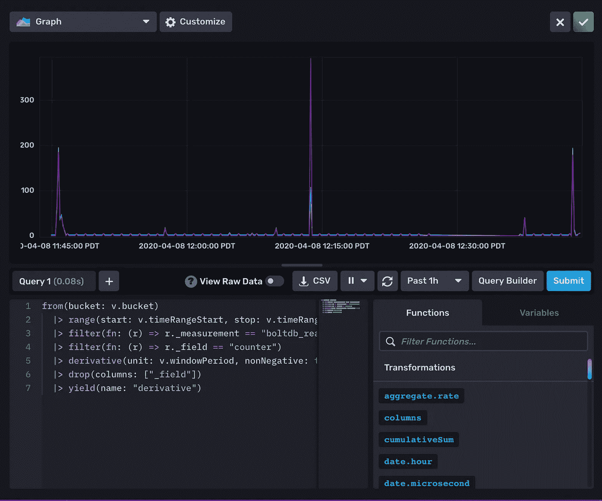
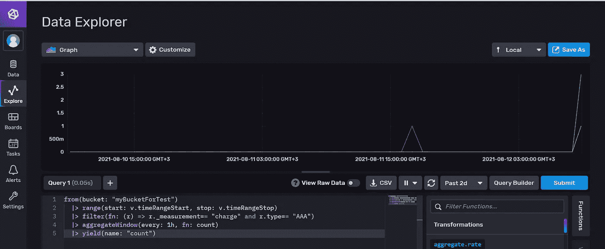

# Grafana + Influxdb 作为 SQL 数据可视化

> 原文：<https://blog.devgenius.io/grafana-influxdb-as-sql-data-visualization-561e89b207?source=collection_archive---------0----------------------->

有用和好看的外部工具来扩展我们的视野。


原则上，每个开发人员都熟悉 SQL 语言。我们以某种方式从 API 请求中收集数据，并将其保存到数据库中。并且希望以可视化的方式看到查询结果。这个故事基于 InfluxQL 语言和它的后继者——Flux 语言，它在函数式编程范例中工作。

让我们想象一下，我们有一个不时保存一些统计测量数据的系统。偶尔会异步写入度量值。但我们希望看到基于这些数据的图表和图形。

实际上，InfluxDB 可以与 InfluxQL 和 Flux 语言一起工作，它们非常相似。这取决于 InfluxDB 版本:1 或 2。

Grafana 提供了借助不同图形可视化 SQL 数据的能力:饼图、仪表图、条形图、表格等等

InfluxDB 编辑器中的一个流量查询示例:



Grafana 和 InfluxDB 的著名紫罗兰风格

让我们在 InfluxDB 数据浏览器中编写一些查询。

**From** 关键字:我们可以定义某个桶，也可以使用默认值。

```
from(bucket: "developerBucket")
from(bucket: v.defaultBucket)
```

**时间范围:**可以是从今天开始的某段时间。

```
from(bucket: v.defaultBucket)
|> range(start: 2021-29-07T00:00:00Z,
           stop: 2021-29-07T23:59:00Z)
|> range(start: -1d)
|> range(start: v.timeRangeStart, stop: v.timeRangeStop)
```

**Sum** 关键字是聚合函数，就像 count、min、max 等。

```
from(bucket: v.defaultBucket)
|> range(start: v.timeRangeStart, stop: v.timeRangeStop)
|> filter(fn: (r) => r._measurement == "charge" and r.type == "AAA")
|> sum()
```

或者用**Union**关键字组合两个查询得到相同的结果:

```
bucket1 = from(bucket: v.defaultBucket)
|> range(start: v.timeRangeStart, stop: v.timeRangeStop)
|> filter(fn: (r) => r._measurement == "charge" and r.type == "AAA")
|> filter(fn: (r) => r["status"] == "false")bucket2 = from(bucket: v.defaultBucket)
|> range(start: v.timeRangeStart, stop: v.timeRangeStop)
|> filter(fn: (r) => r._measurement == "charge" and r.type == "AAA")
|> filter(fn: (r) => r["status"] == "true")union(tables: [bucket1, bucket2])
|> sum()
```

**保留**关键字:在表格视图中显示某些列的情况下。还有 **drop()** ， **rename()** 有非常直白的逻辑。

```
|> keep(columns: ["type", "status", "_value])
|> rename(columns: {"_value": "amount"})
```

**Group** 关键字:聚合行，计算总和，正确映射名称。

```
from(bucket: v.defaultBucket)
  |> range(start: v.timeRangeStart, stop: v.timeRangeStop)
  |> filter(fn: (r) => r._measurement== "charge" and r.type== "AAA")
  |> group(columns: ["status"])
  |> sum()
  |> map(fn: (r) =>  ({
     r with status:
       if r.status== "true" then "Enabled"
       else "Disabled"
     })
   )
```

**Yield** 关键字—获得带有字段名称的结果。Yield 表示接收到的输入表应该作为查询的结果进行传递。在这里，我们计算“平均”值，并显示在图表上。

```
from(bucket: v.defaultBucket)
|> range(start: v.timeRangeStart, stop: v.timeRangeStop)
|> filter(fn: (r) => r._measurement == "charge" and r.type== "AAA")
|> group(columns: ["status"])
|> aggregateWindow(every: v.windowPeriod, fn: mean, createEmpty: false)
|> yield(name: "mean")
```

**语法**。可以借助点号或括号调用字段:

```
|> filter(fn: (r) => r._measurement == "charge")
or the same:
|> filter(fn: (r) => r["_measurement"] == "charge")
```

其他一些实际任务。

**任务 1** :用关键字**集合**在表格中动态添加一个新列

```
from(bucket: v.defaultBucket)
|> range(start: v.timeRangeStart, stop: v.timeRangeStop)
|> filter(fn: (r) => r._measurement == "charge" and r.type== "AAA")
|> sum()
|> set(key: "name_field", value: "Total")
```

**设置**关键字也可以作为数据源:

```
from(bucket: v.defaultBucket)
  |> range(start: v.timeRangeStart, stop: v.timeRangeStop)
  |> filter(fn: (r) => contains(value: r["_field"], set: ${devices:json}))
  |> aggregateWindow(every: v.windowPeriod, fn: last)
```

**任务 2** :将字段值映射到另一个字段值。 **Map** 关键字帮助我们进行不同的转换。例如，从布尔值到字符串:

```
from(bucket: v.defaultBucket)
  |> range(start: v.timeRangeStart, stop: v.timeRangeStop)
  |> filter(fn: (r) => r._measurement== "charge" and r.type== "AAA")
  |> sum()
  |> map(fn: (r) =>  ({
     r with name:
       if r.status == "true" then "Enabled"
       else "Disabled"
     })
   )
  |> map(fn: (r) => ({
     r with type: ""
     })
   )
```

任务 3。用**聚集窗口**功能在图形上显示记录的数据:

**aggregateWindow** 支持按日历开窗数据:1h、1d、1mo、1yr。

```
from(bucket: "myBucketForTest")
  |> range(start: v.timeRangeStart, stop: v.timeRangeStop)
  |> filter(fn: (r) => r._measurement== "charge" and r.type== "AAA")
  |> aggregateWindow(every: 1h, fn: count)
  |> yield(name: "count")
```



**任务四**“_value”字段的棘手问题。

InfluxDB/Grafana 需要实际数据来可视化。因此它有一些默认字段，如“_ 开始”、“停止”、“时间”、“测量”、“值”等。如果你能创建自己的字段并将数据收集到其中，那就太好了。

```
|> filter(fn: (r) => r["_field"] == "my_counter")
```

无论如何，InfluxDB 至少需要 1 个字段来度量，我们总是可以使用“_value”来度量。

所以，让我们得到 **max** 函数的聚合值；这里没有提到“_value”字段，但它在幕后。

```
from(bucket: "MyBucket")
  |> range(start: v.timeRangeStart, stop: v.timeRangeStop)
  |> filter(fn: (r) => r._measurement== "charge" and r.type== "AAA")
  |> aggregateWindow(every: 1h, fn: max)
  |> max()
```

**任务五**。用 **pivot** 关键字重组数据。我们需要确保每个字段都有自己的列。适用于表格视图:

```
from(bucket: "devtest")
  |> range(start: v.timeRangeStart, stop: v.timeRangeStop)
  |> filter(fn: (r) => r._measurement== "charge" and r.type== "BBB")
  |> group(columns: ["type"])  
  |> pivot(rowKey: ["_time", "_measurement"], columnKey: ["_field"], valueColumn: "_value")
  |> drop(columns: ["_time", "_start", "_stop"])
  |> group()
```

任务六。添加别名而不是字段名。**地图**功能帮助我们:

```
from(bucket: "myBucket")
  |> range(start: v.timeRangeStart, stop: v.timeRangeStop)
  |> filter(fn: (r) => r._measurement== "charge" and r.type== "VVV")
  |> map(fn: (r) => ({_value:r._value, _time:r._time, _field:"MyAmount"}))
  |> keep(columns: ["_field", "_time", "_value"])
  |> yield()
```

**任务 7** 获取上次保存的值。

```
from(bucket: "myBucket")
  |> range(start: v.timeRangeStart, stop: v.timeRangeStop)
  |> filter(fn: (r) => r._measurement== "charge" and r.type== "BBB")
  |> last()
  |> yield(name: "last")
```

**结论**

Grafana 有一个很好的社区，我们可以在那里找到如何创建复杂流量查询的正确答案。我喜欢玩这样的东西。系统将数据以 SQL 形式存储到 InfluxDB，数据可以可视化以实时显示更新的统计数据。这些链接非常有助于找到您需要的内容:

**链接**

 [## 开始使用 Flux

### Flux 是 InfluxData 的函数式数据脚本语言，设计用于查询、分析和处理数据。这个…

docs.influxdata.com](https://docs.influxdata.com/influxdb/cloud/query-data/get-started/) [](https://www.sqlpac.com/en/documents/influxdb-moving-from-influxql-language-to-flux-language.html) [## influx db——从 InfluxQL 转向 Flux 语言

### 时序数据库 InfluxDB v2 已于 2020 年 11 月发布。已经发表了一篇关于如何…

www.sqlpac.com](https://www.sqlpac.com/en/documents/influxdb-moving-from-influxql-language-to-flux-language.html) [](https://community.grafana.com/t/no-alias-by-when-using-flux/15575/7) [## 使用 flux 时没有“别名 BY”？

### 大家好。我正在尝试使用 flux lang 设置一个“别名”。然而，我看不到这样做的选择。这个选项是…

community.grafana.com](https://community.grafana.com/t/no-alias-by-when-using-flux/15575/7) [](https://www.influxdata.com/) [## InfluxDB:专门构建的开源时间序列数据库| InfluxData

### InfluxDB 开源时间序列数据库，由 InfluxData 专门构建，用于监控指标和事件，提供…

www.influxdata.com](https://www.influxdata.com/) [](https://www.sqlpac.com/en/documents/influxdb-flux-language-advanced-features.html) [## InfluxDB - Flux 语言，高级功能

### InfluxDB - Flux 语言，高级特性。联接、透视、直方图、计算列(映射)、自定义聚合…

www.sqlpac.com](https://www.sqlpac.com/en/documents/influxdb-flux-language-advanced-features.html)