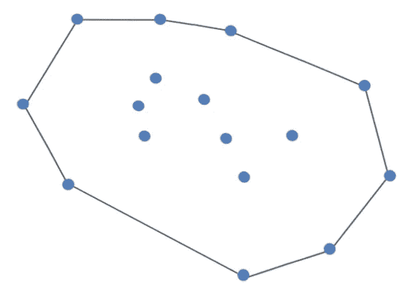

# 格雷厄姆的扫描直观地解释了

> 原文：<https://blog.devgenius.io/grahams-scan-visually-explained-be54b712e2ba?source=collection_archive---------5----------------------->

raham 的扫描是一种寻找包含平面上所有点的凸包的方法。下面你会看到一个凸包的例子。

Graham 的扫描从找到 y 坐标最低的点开始。如果 y 坐标上有多个点，则选择 x 值最小的点。这些点按逆时针旋转的极角排序。格雷厄姆的扫描利用了堆栈。将点推送到堆栈上。如果该点不是凸包的一部分，则从堆栈中弹出该点。让我们看一个例子。

我们有一组点。很清楚哪个点的 y 坐标值最低。

从那里开始，点以递增的角度排列。

现在，我们可以按照格雷厄姆的扫描来找出哪些点创建了凸包。将点 0 推送到堆栈上。

紧接着，点 1 被推到堆栈上。

下一个要添加到堆栈中的点是 2。从点 1 到
点 2 形成一条线。

每当左转时，该点被假定为凸包的一部分。我们可以清楚地看到从点 1 左转到点 2。为了到达第 3 点，需要再次左转。目前，点 3 是凸包的一部分。从点 2 到 3 绘制一条线段，并将 3 推送到堆栈上。

我们右转到 4 号点。我们将把线画到点 4，但不会把它推到堆栈上。

每当右转时，格雷厄姆的扫描算法从堆栈中弹出前一个值，并再次将新值与堆栈顶部进行比较。在这种情况下，我们将从堆栈的顶部弹出 3，然后看看从点 2 到点 4 是否会产生左弯。在这种情况下确实如此，所以我们将绘制一条从 2 到 4 的线段，并将 4 推送到堆栈上。

因为从 4 到 5 会产生一个左转，所以我们将 5 推到堆栈上。点 5 当前是凸包的一部分。

从点 5 移动到点 6 会产生一个左转弯，所以我们将把 6 推到堆栈上。点 6 当前是凸包的一部分。

要到达 7 点，我们必须在 6 点右转。

从堆栈中弹出点 6，并检查从点 5 到点 7 的回合。因为我们从点 5 向点 7 左转，所以我们将点 7 推到堆栈上。

我们试图将第 8 点压入堆栈。为了到达点 8，我们在点 7 左转，因此点 8 被添加到堆栈中。点 8 当前是凸包的一部分。

去点 9 需要在点 8 右转。

因为有一个右转弯，所以从堆栈中弹出点 8，并将点 9 与点 7 进行比较。

从点 7 到点 9 需要另一次右转，所以我们也从堆栈中弹出点 7，并将点 9 和点 5 进行比较。我们在点 5 左转到达点 9，所以 9 被推到堆栈上。

接下来，我们左转到达第 10 点。点 10 当前是凸包的一部分。

从点 10 到点 11 需要右转。

因为在点 10 右转，所以从堆栈中弹出点 10，并且检查从点 9 到点 10 的路径。因为在点 9 左转到达点 11，所以点 11 被推到堆栈上。

在点 11 左转到达点 12。点 12 因此被推到堆栈上，并且当前被认为是凸包的一部分。

从点 12 到点 13 需要右转。

从堆栈中弹出点 12，并检查从点 11 到点 13 的路径。由于在点 11 左转，点 13 被推到堆栈上。

在点 13 左转到达点 14，因此点 14 被推到堆栈上。

从点 14 到点 15 需要右转。

由于在点 14 右转，点 14 从堆栈中弹出。接下来检查从点 13 到点 15 的路径。在点 13 左转到达点 15，因此点 15 被推到堆栈上。

从点 15 到起点 0 需要左转。因为初始点是我们需要到达以完成凸包的点，所以算法结束。

创建凸包所需的点有

> 0–1–2–4–5–9–11–13–15.

如果你喜欢你所读的，看看我的书，**算法的说明性介绍。**

**

*Dino Cajic 目前是 [LSBio(寿命生物科学公司)](https://www.lsbio.com/)、[绝对抗体](https://absoluteantibody.com/)、 [Kerafast](https://www.kerafast.com/) 、 [Everest BioTech](https://everestbiotech.com/) 、 [Nordic MUbio](https://www.nordicmubio.com/) 和 [Exalpha](https://www.exalpha.com/) 的 IT 负责人。他还是我的自动系统公司的首席执行官。他有十多年的软件工程经验。他拥有计算机科学学士学位，辅修生物学。他的背景包括创建企业级电子商务应用程序、执行基于研究的软件开发，以及通过写作促进知识的传播。*

*你可以在 [LinkedIn](https://www.linkedin.com/in/dinocajic/) 上联系他，在 [Instagram](https://instagram.com/think.dino) 上关注他，或者[订阅他的媒体出版物](https://dinocajic.medium.com/subscribe)。*

*阅读迪诺·卡吉克(以及媒体上成千上万的其他作家)的每一个故事。你的会员费直接支持迪诺·卡吉克和你阅读的其他作家。你也可以在媒体上看到所有的故事。*