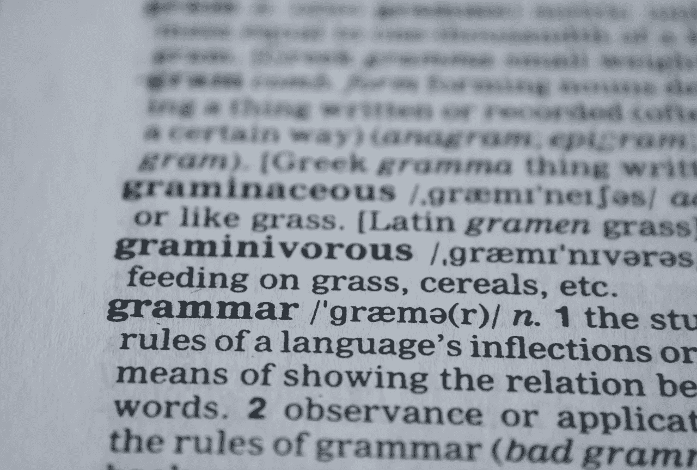
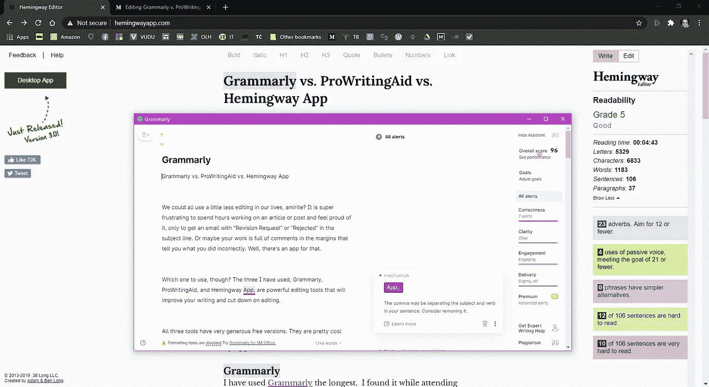
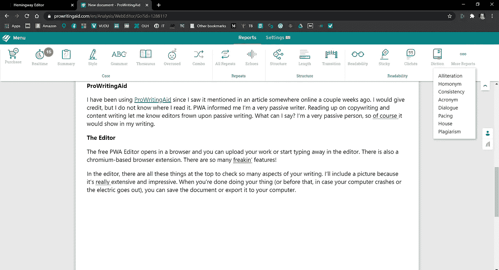
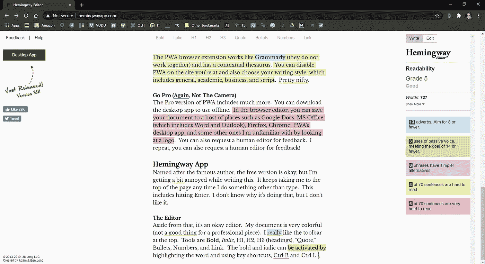

# 语法 vs .专业写作 Aid vs .海明威 App

> 原文：<https://blog.devgenius.io/grammarly-vs-prowritingaid-vs-hemingway-app-c2b45a5c255d?source=collection_archive---------8----------------------->

图片来自 [Pixabay](http://www.pixabay.com) 的 [PDPics](https://pixabay.com/users/pdpics-44804/)

我们都可以在生活中少用一点剪辑，阿米利特？花几个小时写一篇文章或一篇帖子，并为此感到自豪，却收到一封主题为“修改请求”或“拒绝”的电子邮件，这是非常令人沮丧的。或者你的作品在页边空白处写满了注释，告诉你哪里做错了。有一个应用程序可以做到这一点。

但是，使用哪一个呢？我用过的三个，Grammarly，ProWritingAid 和 Hemingway App，都是强大的编辑工具，会提高你的写作水平，减少编辑。

这三个工具都有非常慷慨的免费版本。它们是非常酷的应用程序，但我确信付费版本更有用，也更物有所值。我在海明威应用编辑器中输入这个，因为我没怎么用过它。我们开始吧！

# 语法和编辑应用程序

从语法上来说，ProWritingAid 和海明威编辑器是旨在帮助你写好文章的应用程序。他们检查你的拼写、语法、句子结构等等。我会一个一个地检查它们。

# 语法上

我用[语法](http://www.grammarly.com)的时间最长。我在上大学的时候发现了它，因为英语竞赛一和二试图杀了我。免费版本包括基于 chromium 的浏览器扩展、桌面应用、Microsoft Word 插件、Outlook 插件、电话应用和新的 iPad 应用。我是苹果人，所以不了解其他平板。iPad 是一项新功能。

语法上捕捉拼写错误的单词和正常的“常见”错误，如 your/your ' s、判断/判断、its/it's、there/their/they ' s、is/are 等。，一切都在进行中(当您键入时)。一个更新的功能可以让你看到你的文章是什么样的风格，是商业的，学术的，休闲的，幽默的，等等。

## 绩效分数

语法编辑器扫描你上传的文档，并根据正确性、清晰性、参与度、交付(每个类别都有建议)和高级功能(不能深入查看)对你的写作进行评分，满分为 100 分，但如果你猜出并纠正错误，错误数量会减少。

您可以调整在编辑器中打开的每个文档的受众、形式、领域(风格)、语气和意图，以便进行自定义编辑。

自从我上次使用免费版以来，它真的扩展了，Grammarly 是一个很好的工具。

语法桌面编辑器

## Go Pro(不是相机)

专业版深入研究了逗号的用法，包括抄袭检查，词汇增强，以及其他功能，如被动语态的使用和过时的语言。您还可以从人工编辑那里获得帮助和反馈。每月 30 美元或每年 11.66 美元。

# ProWritingAid

自从几周前我在网上某处的一篇文章中看到它，我就一直在使用 [ProWritingAid](http://www.prowritingaid.com) 。PWA 告诉我，我是一个非常被动的作家。阅读文案和内容写作告诉我，编辑不赞成被动写作。我能说什么呢？我是一个非常被动的人，所以，当然，这将在我的写作中表现出来。

## 编辑

免费的 PWA 编辑器在浏览器中打开，你可以上传你的文档或者开始在编辑器中打字。还有一个基于 chromium 的浏览器扩展。有这么多奇怪的功能！

在编辑器中，所有这些东西都在顶部，以检查*你写作的这么多*方面。我会附上一张图片，因为它真的很广泛，令人印象深刻。当你完成你的事情时(或者在此之前，万一你的电脑崩溃或者停电了)，你可以保存文档或者将它导出到你的电脑。

PWA 浏览器扩展的工作方式类似于 Grammarly(它们不能一起工作),并且有一个上下文词典。你可以在你所在的网站上禁用 PWA，也可以选择你的写作风格，包括一般、学术、商业和脚本。相当漂亮。

ProWritingAid 浏览器内编辑器。看看那些特征！

## Go Pro(还是那句话，不是相机)

PWA 的专业版包括更多内容。可以下载桌面 app 离线使用。在浏览器编辑器中，你可以将你的文档保存到许多地方，如谷歌文档、MS Office(包括 Word 和 Outlook)、Firefox、Chrome、PWA 的桌面应用程序，以及其他一些我通过查看徽标而不熟悉的地方。您还可以请求人工编辑提供反馈。

# 海明威应用程序

以著名作家命名的免费[海明威应用](http://www.hemingwayapp.com)还不错，但是我在写这个的时候有点烦。每当我做打字以外的事情时，它总是把我带到页面的顶部；这包括按一次回车键或切换浏览器标签。我不知道这背后的逻辑。

## 编辑

除此之外，这是一个不错的编辑器。我的文档非常丰富多彩(对于专业的作品来说不是一件好事)。我真的很喜欢顶部的工具栏。工具有**粗体**、*斜体*、H1、H2、H3(标题)、“引用”、项目符号、数字和链接。粗体和斜体可以通过突出显示单词并点击粗体或斜体或使用快捷键 Ctrl B 和 Ctrl I 来激活。

## 分阶段

虽然编辑器会对可读性进行评分，但这并没有多大帮助，因为除非突出显示一两个单词，否则它不会提供任何建议。现在，这个句子是黄色的(难以阅读)，鼠标悬停在句子上并不提示我如何修复它；它只是告诉我很难读懂。

单词“被突出显示”以绿色突出显示，悬停在上面告诉我这是被动语态，我应该使用主动语态。我可以选择点击“省略”，这将删除单词，然后带我回到文档的开头(真的很烦人)。

我喜欢边上包含的字数和错误数。我有一张 5，但我不知道那是什么。计数器会在“显示更多”下拉列表中显示阅读时间、字母、字符、单词、句子和段落。

我用了 15 次副词，应该以 9 次或更少为目标；被动语态 5 次，达到 16 以下的目标；没有比这更简单的短语了；82 句中有 9 句很难读懂；84 个句子中有 6 个非常难读，包括这个。(抱歉各位！)

我认为更多的建议会使海明威在语法和写作方面达到同等水平。如果我们知道什么听起来最好并增加可读性，我们就不会在一开始就犯错误。我没有看到海明威进行任何拼写检查。

海明威应用程序浏览器内编辑器。下划线是 PWA 扩展名。

## 走向专业(你明白了)

海明威应用程序桌面应用程序售价 19.99 美元，非常便宜。你可以离线工作，或者从桌面应用程序直接发布到 Medium 或 Wordpress。不在媒体或 Wordpress 上？那也没关系。桌面应用程序可以处理标题、格式和链接，所以你不必这么做。

# 结论

对我来说，这几乎是自由语法和 ProWritingAid 之间的纽带。如果我成为职业选手，我肯定会选择 PWA。如果你是色盲，颜色对你没有好处，但是点击 Grammarly 和 PWA 中带下划线的单词或短语会给你你需要的信息。对于海明威，右边的可读性功能将帮助你。