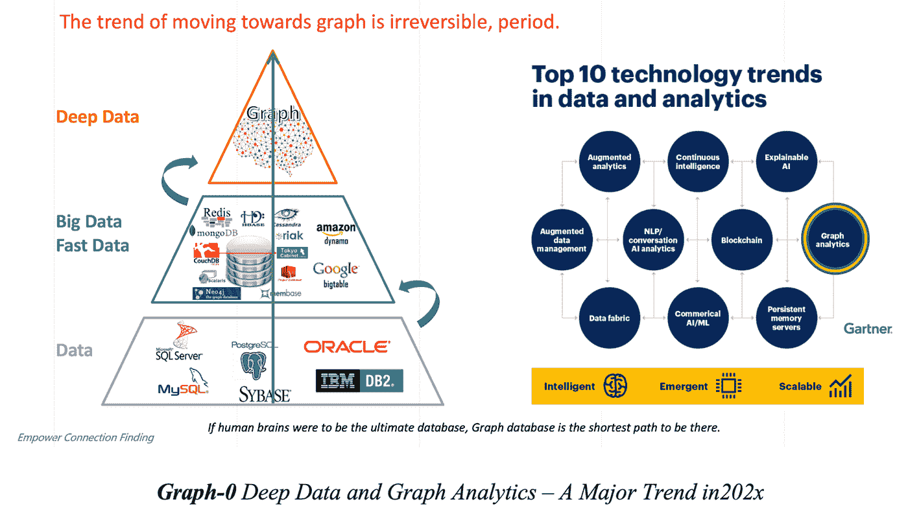
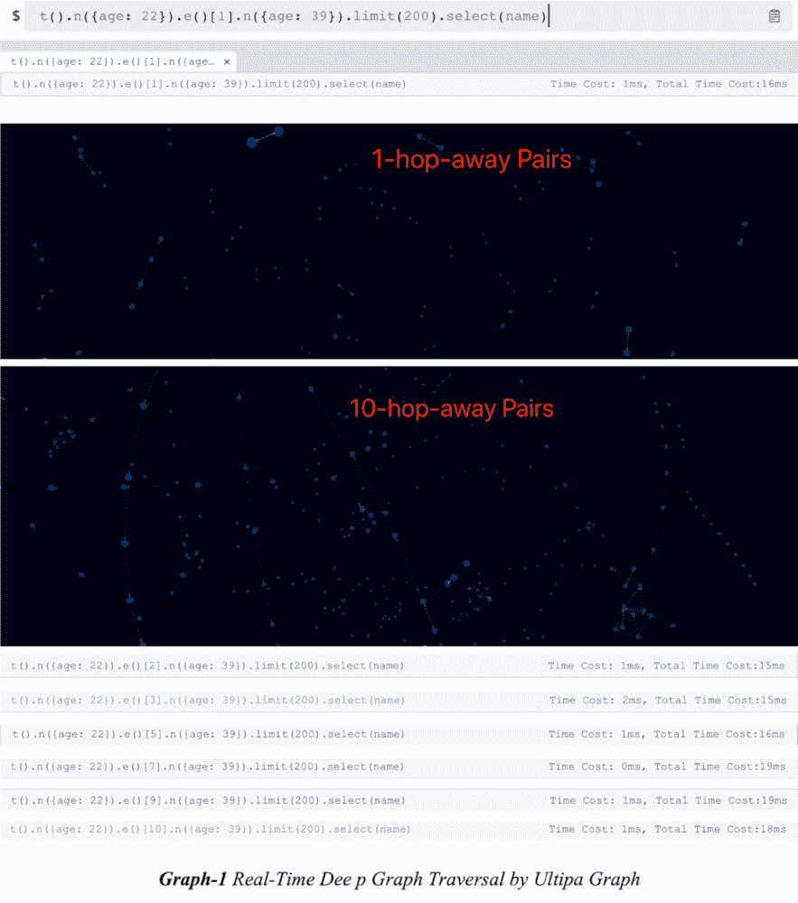
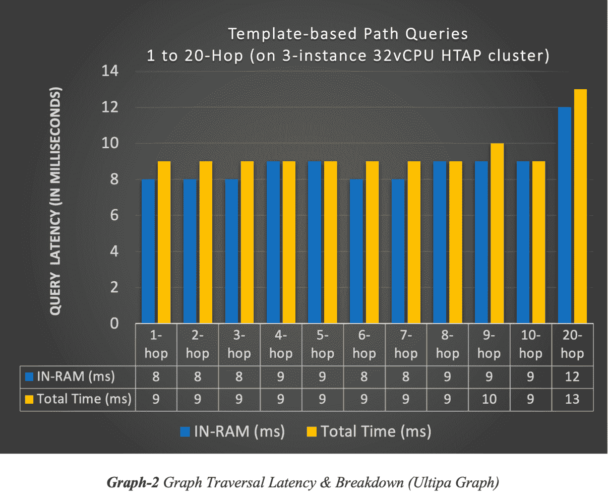
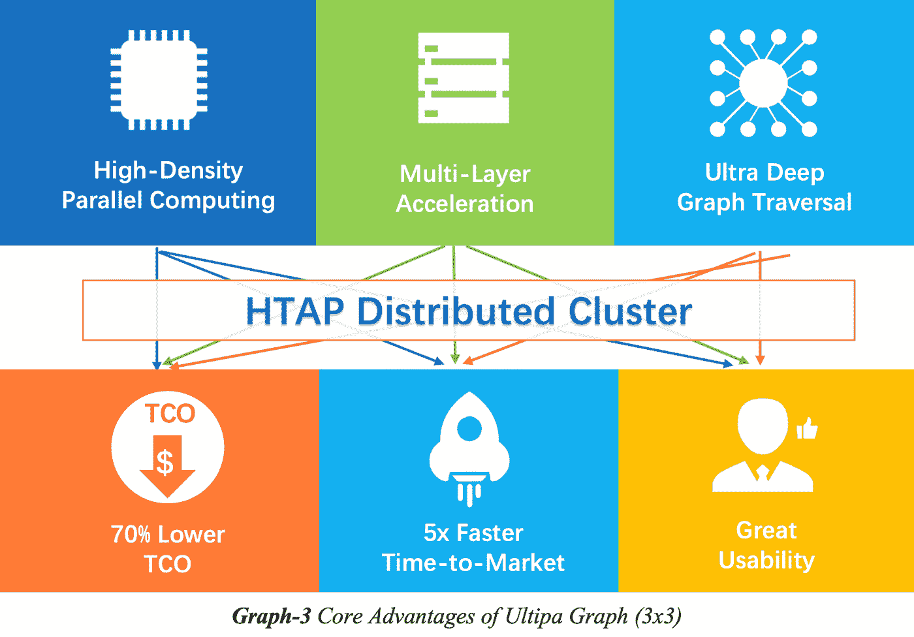
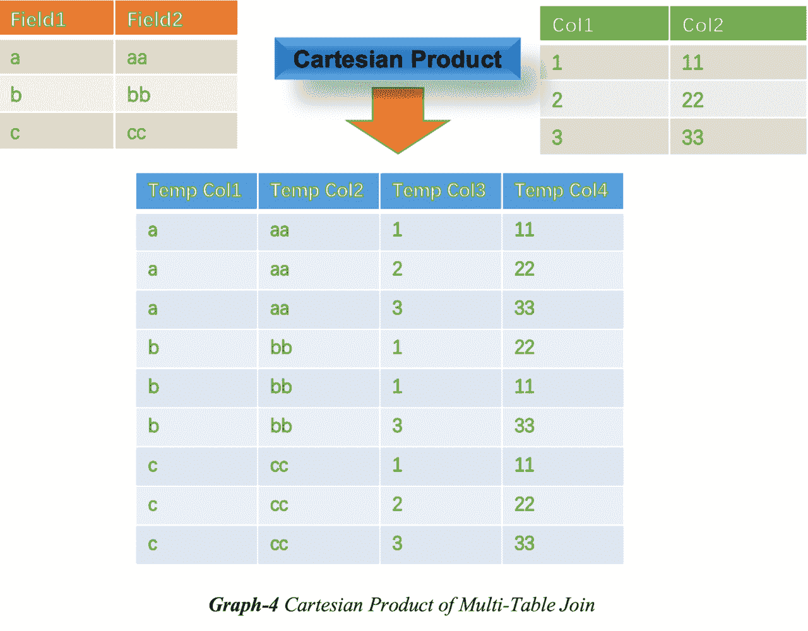
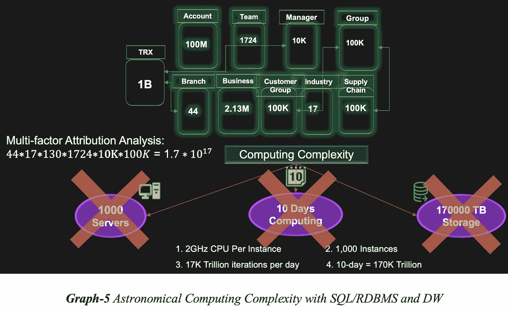
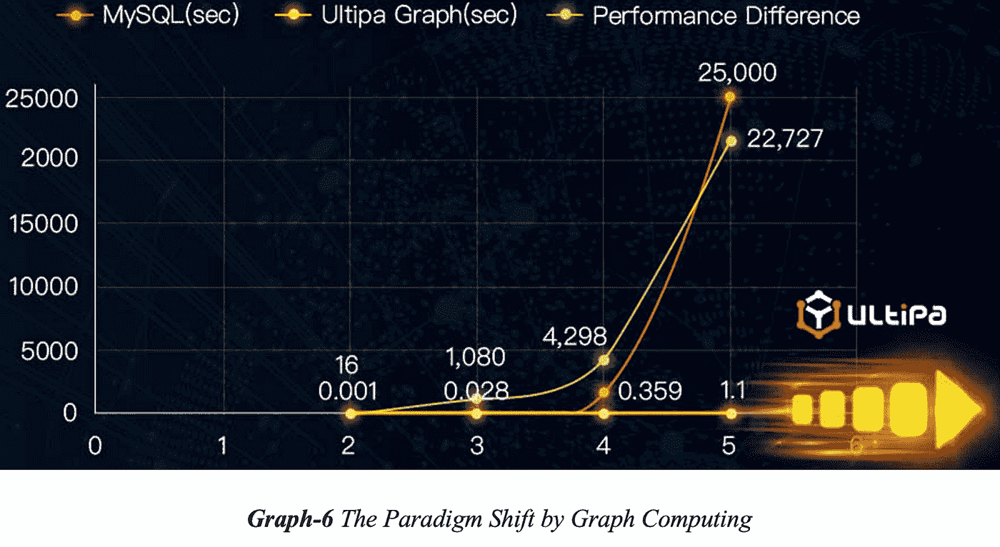
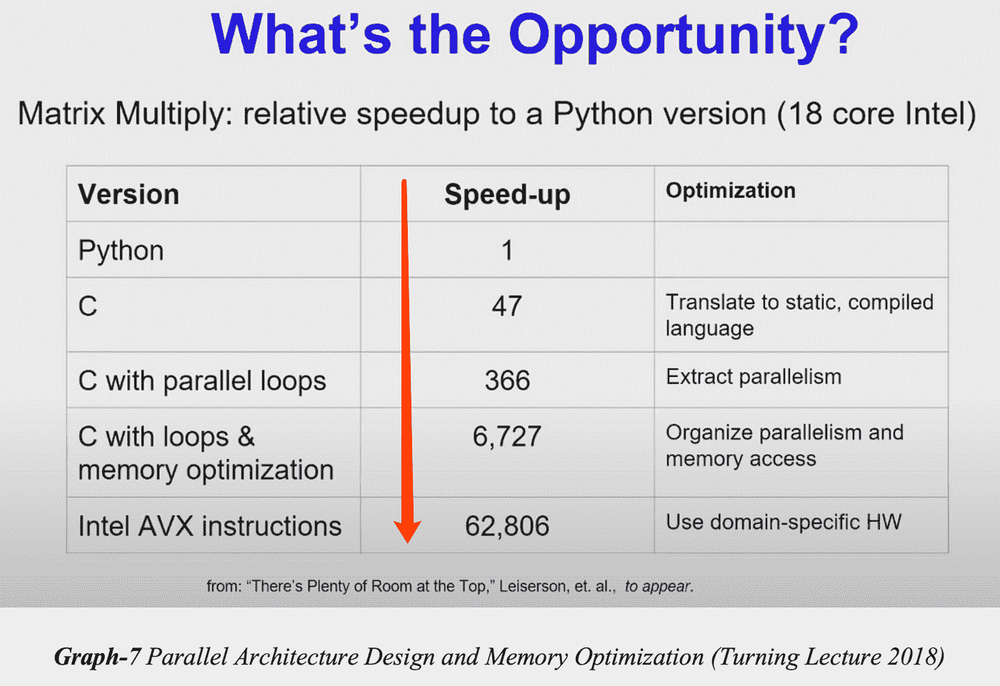
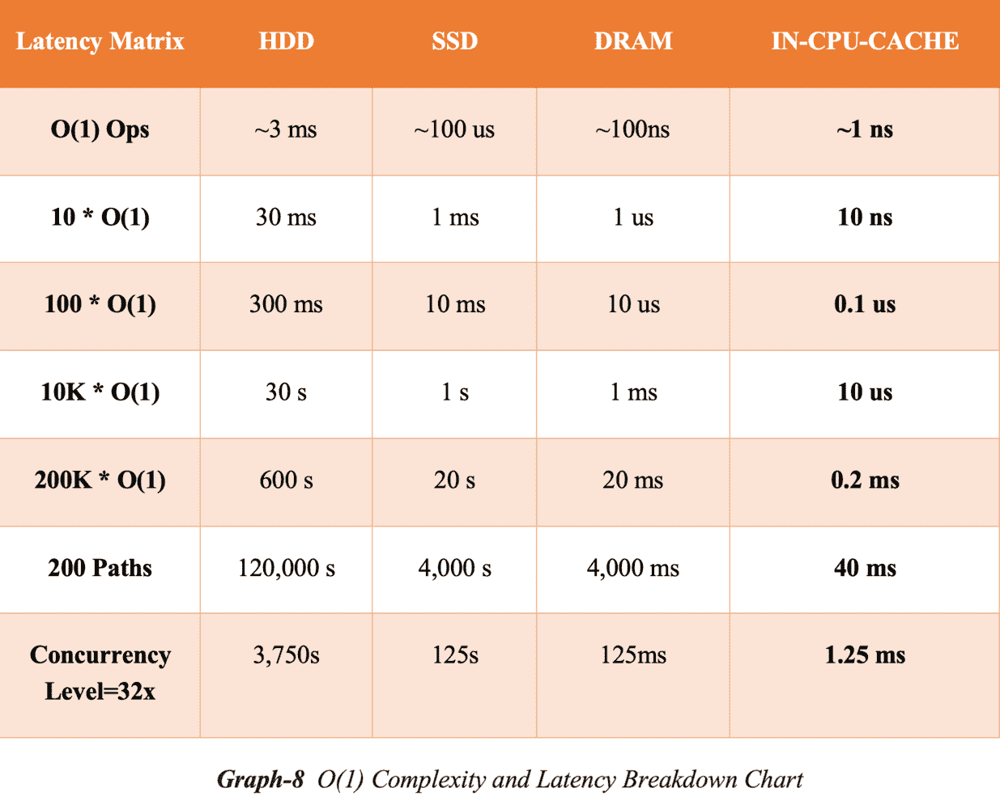

# 图形数据库和查询语言 101:速度和简单性(上)

> 原文：<https://blog.devgenius.io/graph-database-and-query-language-101-speed-simplicity-f8ca7e600ec7?source=collection_archive---------8----------------------->

# 第一部分

注意:这是讨论图形数据库和图形查询语言的系列文章的第 1 部分，重点关注两个最相关的方面——速度和简单性。在第一部分中，我们将展示一个案例研究，解释真正的高性能计算如何帮助加速图形查询和分析；在第二部分中，我们将通过真实的例子来接触查询语言的简单性。

我们已经知道，关系数据库使用 SQL 和二维表来模拟世界，这与图形数据库解决问题的方式形成了鲜明的对比。简而言之，图形数据库使用高维数据建模策略来 100%模拟世界——因为真实世界是高维的，所以图形被认为是 100%自然的。这种自然是有代价的，尤其是对于习惯了权衡假设或零和博弈理论的人来说。代价是你必须足够勇敢和聪明，跳出框框，跳出现有的框架，跳出困境，跳出没有比 SQL 或 RDBMS 更好的建模现实世界问题的方法的局限。

在当今的商业世界中，我们看到越来越多的企业依靠图形分析和图形计算来支持他们的商业决策。

在 2019 年 11 月至 2021 年 6 月的一系列报告中，Gartner 预测，Graph analytics 不仅是 10 大数据和分析趋势之一(见上图)，还指出:到 2025 年，全球 80%的商业决策创新将由 graph analytics 推动。

现在，让我们暂停一下，思考一下您希望图形数据库提供的主要特性？它们是什么？这是一个相当于问:SQL 和 RDBMS 缺什么特性的问题？

和往常一样，这是一个开放性的问题，答案可能非常多样化，不需要标准化。然而，在所有可能的答案中，有 3 件事来自我们的直觉，如果你深入思考，你会与我们产生共鸣，它们是:

简单性(例如，喜欢编写数百行 SQL？)

递归操作(即递归查询)

速度(即实时性)

按照相反的顺序，让我们看看这个三击出局列表:速度和闪电般的快速性能深深植根于图形数据库向世界提供的最初承诺。由于众所周知的笛卡儿积或表扫描问题，传统的表连接产生数据的速度慢得惊人，因此我们建模和处理数据的方式的根本改变是必要的和关键的。

如果你从高维空间考虑，图是通过将实体连接成网络、树或图来连接点(顶点)的最自然的方式，并且对图的工作简单地是找到任何顶点的邻居、到达或离开顶点的路径、任何顶点对之间的公共属性共享(相似性)、图或子图的中心性、图中顶点的排序等等。

有许多方法可以对抗图表并从中寻找价值。然而，随着图表变得越来越大、越来越密集或者查询变得越来越复杂，性能下降被大多数人认为是一种常态…好吧，事实并非如此。

考虑下面的场景，在数百万相互交互的用户的社交(或金融)图中，找到多达 200 对用户(从年龄=22 的用户开始，到年龄=33 的用户结束),这些用户彼此相距 1 跳、2 跳，并且一直到 20 跳。如果有任何性能下降，请对其进行测量。

上面的屏幕截图显示了在 Ultipa Graph(一个能够进行实时超深度图形遍历的高性能图形数据库)上运行查询的周转时间(往返延迟),与增强的 Amazon-0601 图形数据集(350 万条边和 50 万个顶点，具有多个属性，如 id、名称、年龄、关系类型、等级等)进行比较。).这些查询基于模板路径查询标准遍历图，从 1 跳开始，逐渐深入到 20 跳。下图捕获了查询延迟比较:

正如您所看到的，当我们深入图表时，总体延迟增长趋势保持平稳或次线性，而不是指数增长。没有明显的性能下降。如果您考虑在一个图中定位 200 条路径，每条路径的长度都是 20(沿着路径有 20 条边和 21 个顶点)，再加上起始用户年龄=22、终止用户年龄=33 的过滤参数，这种查询的复杂性是相当惊人的。

如下图所示，这种几乎平坦的、绝对次线性的查询延迟增长是通过 3 种核心技术实现的:

高密度并行图形计算

超深度图遍历(和动态图剪枝)

多层存储和计算加速

并且，它们共同且交织地带来 3 大好处:

更快的价值实现和上市时间

低得多的总拥有成本

卓越的可用性和用户体验

与关系型 DBMS、NoSQLs 或 Hadoop/Spark 不同，图形 DBMS 的横向扩展方式不同。关键的区别在于 graph 的独特优势:它整体处理数据的能力。换句话说，图形 DBMS 必须允许数据的深度渗透(和相关性)，而所有其他 RDBMS、NoSQL 或大数据框架都不具备类似的能力。在 RDBMS/SQL 的上下文中打个比方，深入数据就是将多个表连接在一起，这可能是灾难性的。

图 4 说明了这个问题:当两个表连接在一起时，笛卡尔乘积效应将创建一个大表，将两个表的行相乘。如果涉及多个大型表(即数百万行)，结果表的大小可能会令人吃惊，这种惊人意味着不可能实时获得查询结果，不仅如此，实际上，您甚至无法及时获得结果。

在图 5 中，我们说明了使用 SQL/RDBMS 的典型属性分析(也称为贡献分析或性能/影响分析)将需要 1000 台服务器 10 天的计算时间和大量存储来计算所有可能性，SQL/RDBMS 的纯粹计算复杂性令人无法忍受，它们太死板、太慢、太复杂。

一个范式的转变即将发生，图形计算和图形数据库将会拯救我们。Graph-6 说明了典型的关系数据库和图形系统之间的区别，随着我们对数据挖掘得越来越深(跳得越来越多)，关系 DBMS 的延迟呈指数增长，而图形 DBMS 的延迟呈线性增长。这就造成了所有的差异。

有图形供应商在宣传无限可伸缩性图形 DBMS，它能够处理具有数万亿个顶点和边的单个图形。我们发现这是一个神话。有两点可以打破这个流言:

在什么情况下你必须使用一张有数万亿顶点/边的图？一个万亿级的图必须传播到许多物理实例中，因为任何需要对所有实例进行处理的查询，而它们都相互依赖于中间结果，这将成倍地降低整体系统性能，这是任何 BSP(庞大的同步处理)系统的典型困境。如果让一个大型 BSP 系统处理 3 跳或更深层次的图查询，您能想象它会有多慢吗？

水平分布图 DBMS 的一个更明智的设计是编排一个包含多个(或许多)图的系统。就像对有许多表的 RDBMS 一样。像金融交易这样的典型场景往往有时间戳，您可以将一年的交易逻辑地分布到 12 个月中，每个月的交易可以独立包含在一个图表中(基本上将所有交易账户与当月发生的交易联系起来)，12 个月的图表共同构成了一个逻辑上完整的巨型图表。

以上段落中的要点应该提醒那些想知道为什么 JanusGraph、AWS Neptune 或 ArangoDB(以及少数其他商业图形产品)如此缓慢，并且在尝试完成同类图形查询时不能及时返回的读者。他们的核心弱点在于他们不明智且盲目复杂的分布式架构设计。

抛开分布策略不谈，加速图查询(如路径查找或 k 跳)的最重要的技术是通过密度计算和深度遍历运行时修剪。然而，这两个被认为是基本的技术被许多程序员遗忘了很久。无可否认，我们生活在一个高级编程语言的世界里，数以百万计的新一代年轻程序员相信 Python 无所不能的能力和易用性正在统治这个世界。然而，就处理能力而言，这只是一个问题，Java 和任何专注于 GC(垃圾收集)的语言也是如此。

在 ACM 2018 年度转折演讲中，图灵奖获得者大卫·帕特森和约翰·汉尼斯概述了在 18 核英特尔 X86–64 CPU 上使用并行 C 加速 Python 程序超过 62，000 倍的机会！这通过以下方式实现:

低级编程语言(最大限度地发挥硬件优势)

内存优化(同上)

利用 CPU 的高级指令集特性(同上)

总而言之，这些技术都有助于实现“高密度”计算。此外，通过新颖的数据结构设计，实现了运行时动态图剪枝和深度图遍历。在作者之前题为“图形数据结构的具体演变”的文章中，介绍了一种新的邻接哈希*数据结构，可以有效地用于存储图形拓扑并实现运行时过滤(也称为动态图形修整或修剪)——当然，最引人注目的部分是:在时间复杂性方面，图形上的大多数操作都具有 big-O 符号， O(1)的——而不是 O(log N)或 O(N)甚至 O(N * log N) …这对于确保当我们深入遍历图形时，我们不必处理指数级增长的搜索复杂性至关重要。 以下是“指数挑战”的概述，以增强的 Amazon-0601 图形数据集为例。

|E|/|V| = 8(顶点的平均度数)

搜索 1 跳路径的复杂度~= 8

搜索 2 跳路径的复杂度~= 64

搜索 5 跳路径的复杂度~= 8*8*8*8*8 = 32，768

搜索 10 跳路径的复杂度~= 1，073，741，824(10 亿次搜索)

搜索 200 对 10 跳路径的复杂度~ = 2000 亿！

显然，如果复杂度真的超过 2000 亿，任何图形系统都不可能在几毫秒内返回。上述复杂性只是理论上的。实际上，O(1)操作的最大可能搜索复杂度决不会超过图中的总边数，在我们的情况下，总边数为 350 万，因此，我们可以假设从 7 跳(32768 * 8 * 8)开始到任何更深的跳，最大复杂度被限制在 350 万(对于 Amazon 0601，就该 Amazon 数据集而言，实际复杂度实际上大约为 20 万，特别是大约 6 到 8 跳深)

调整了 6 到 10 跳路径的复杂性=每跳最大 200，000。

因此，可以查看图 8 所示的延迟明细:

将图 8 中的数字与图 1 和图 2 中的数字进行比较，不难得出结论:通过利用最大并发性(并行化)和 CPU 缓存，Ultipa 实现了接近底层硬件平台最大吞吐量的延迟(返回 200 条 10 跳深度路径的平均延迟约为 10ms，介于 DRAM 和 CPU 缓存之间)。

在[第二部分](https://medium.com/@RickySun/graph-database-and-query-language-101-speed-simplicity-part-ii-ada397fea6e)中，我们将展示简单、直观而强大的图表查询语言如何让你的生活变得更加轻松。请继续关注。