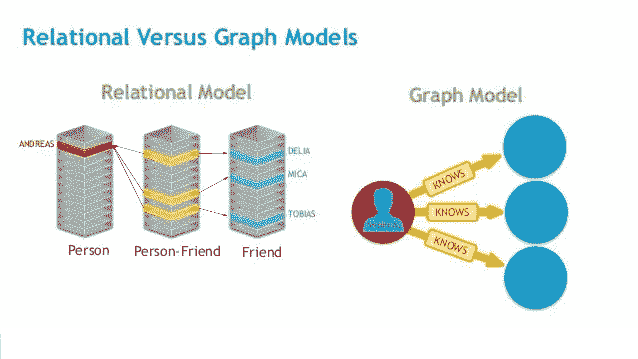
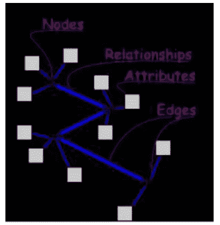
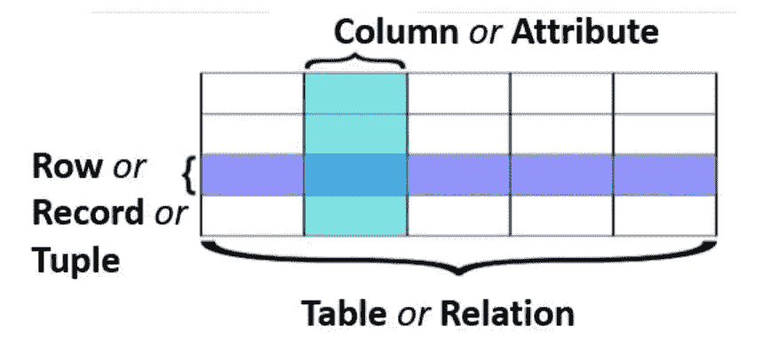

# 图形数据库与关系数据库

> 原文：<https://blog.devgenius.io/graph-database-vs-relational-database-70f6156f7415?source=collection_archive---------4----------------------->

## 什么是数据库？

数据库是以一种有组织的方式收集了[逻辑上相关的信息](http://entradasoft.com/blogs/graph-database-vs-relational-database),以便于访问、管理和更新。还可以对数据库执行其他一些操作，如添加、更新和删除数据。

一个数据库可以是简单的包含一系列名字的文本文件，也可以是复杂的包含一些数据的大量文本文件。基于不同类型的信息，数据库有不同的类型。在这里，我们将谈论[图和关系数据库](http://entradasoft.com/blogs/graph-database-vs-relational-database)。

全文:[http://entradasoft . com/blogs/graph-database-vs-relational-database](http://entradasoft.com/blogs/graph-database-vs-relational-database)

## 图形数据库

顾名思义，它是一种使用图形结构来表示数据的数据库。它是一个数据库，使用带有节点、边和属性的图结构进行语义查询，以统一的方式存储和表示数据。该系统的一个关键概念是图。

数据的两个节点及其关系都被命名，并且可以[存储由键/值对](http://entradasoft.com/blogs/graph-database-vs-relational-database)表示的属性。节点可以被标记为组。

## 图形数据库的属性

1.  它们总是有一个开始节点和一个结束节点。
2.  他们使这个图成为有向图。

图形是灵活的，因此它允许用户在现有数据中插入新数据，而不会损失应用程序的功能。一些著名的图形数据库有:Allegro Graph、Amazon Neptune、Infinite Graph、Oracle Spatial and Graph、Orient DB、RDFox、Teradata Aster、TerminusDB 等。

## 关系数据库

[关系数据库](http://entradasoft.com/blogs/graph-database-vs-relational-database)是一种基于数据关系模型的数字数据库，它是一种存储并提供对彼此相关的数据点的访问的数据库。[关系数据库](http://entradasoft.com/blogs/graph-database-vs-relational-database)基于关系模型，这是一种在表格中表示数据的直观而简单的方式。

该模型将数据组织到一个或多个由列和行组成的表中，并使用唯一的键来标识每一行。行也称为记录或元组。列也称为属性。通常每个表关系代表一个“实体类型”。行代表该实体类型的实例，列代表属于该实例的值。

## 关系数据库的属性

*   价值观是原子的。
*   每一行都是唯一的。
*   一列中的所有值都具有相同的数据类型。
*   列的顺序无关紧要。
*   每列都有一个唯一的名称。
*   完整性约束维护多个表之间的数据一致性。

一些流行的关系数据库管理系统有:DB2 和 Informix 动态服务器——IBM，Oracle 和 RDB——Oracle，SQL Server 和 Microsoft Access

根据这两个数据库的上述特性，我们得出结论，这两个数据库在不同方面都优于对方。因为关系数据库以[行和](http://entradasoft.com/blogs/graph-database-vs-relational-database)列的形式显示结果。这很容易理解。另一方面，图形数据库以三种不同类型的图形的形式展示数据或信息。但不是每个人都能理解图表。关系数据库只关心数据，而不关心可以提高模型性能的结构。

另一方面，图形数据库比关系数据库更加灵活。它在复杂的[深度分析](http://entradasoft.com/blogs/graph-database-vs-relational-database)中表现出更高的性能，而关系数据库在深度分析中表现不佳。图形数据库在另一方面比关系数据库更灵活，因为它在处理复杂事务时表现出比关系数据库更高的性能。

阅读更多:[http://entradasoft . com/blogs/graph-database-vs-relational-database](http://entradasoft.com/blogs/graph-database-vs-relational-database)