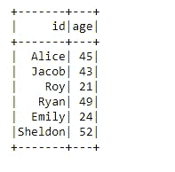
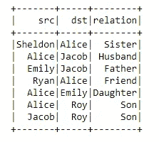
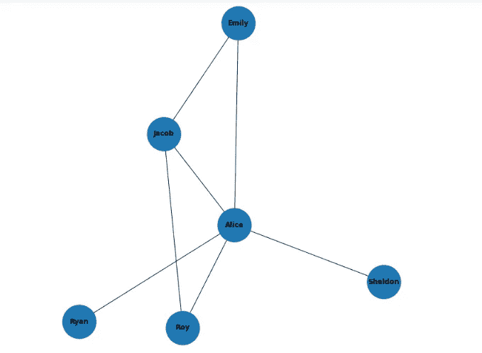
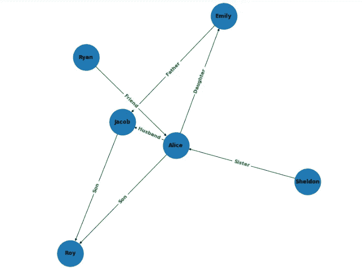
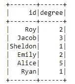
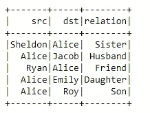
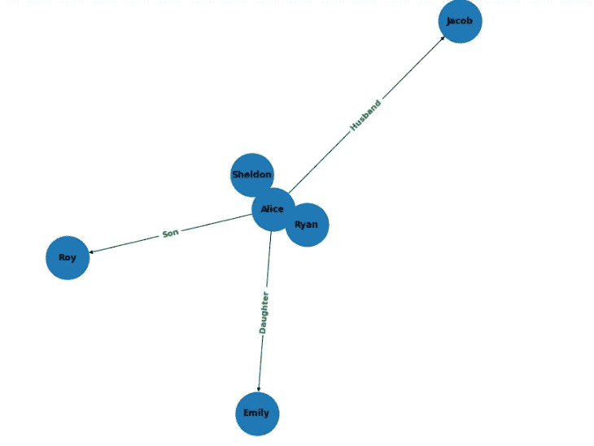
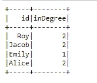
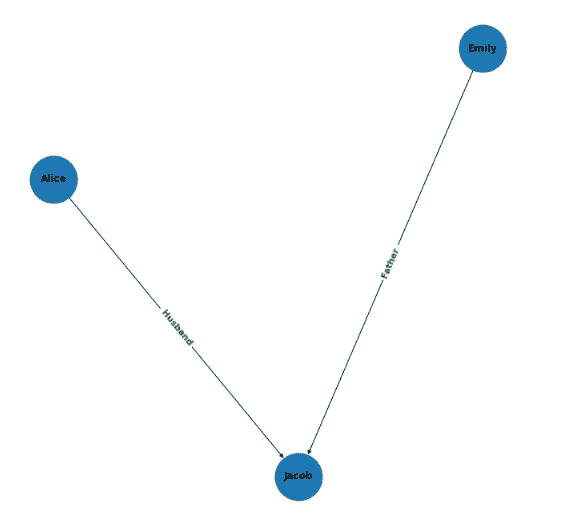
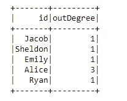

# 使用 GraphFrames 在 PySpark 中进行图形建模:第 1 部分

> 原文：<https://blog.devgenius.io/graph-modeling-in-pyspark-using-graphframes-part-1-e7cb42099182?source=collection_archive---------1----------------------->

这将是一个多部分的教程，在其中我将演示图形框架的使用。

在本系列的第 1 部分中，我们将了解:

1.  图表框架概述
2.  在我们的机器上设置图表框架。
3.  创建我们的第一个图表并操作它。
4.  图形的可视化
5.  图形中的度数

## 概观

graph frames**是 Apache Spark 的一个包，它提供了基于数据帧的图形**。它提供了 Java、Python 和 Scala 的高级 API。GraphFrames 用于进行图形分析。图形分析**使用算法来探索图形数据库中条目之间的关系，包括不同人、交易或组织之间的联系**。

图是使用边相互连接的顶点的组合。虽然顶点可以被认为是节点或实体，但是边表示这些实体之间的关系。

图形结构的用例

1.  搜索引擎
2.  社交网络
3.  欺诈检测
4.  人工智能

## 设置图表框架

在设置 GraphFrames 之前，请确保您遵循了我之前的教程中列出的在 windows 上安装 pyspark 的步骤。

[https://medium . com/data-engineering-on-cloud/py spark-with-examples-96919 B3 d 1192](https://medium.com/data-engineering-on-cloud/pyspark-with-examples-96919b3d1192)

请按照以下步骤导入模块-

1.  下载“graph frames-0 . 8 . 2-spark 3.0-s _ 2.12”[https://spark-packages.org/package/graphframes/graphframes](https://spark-packages.org/package/graphframes/graphframes)
2.  从 graph frames-0 . 8 . 2-spark 3.0-s _ 2.12 中提取 JAR 内容
3.  导航到“graphframe”目录并压缩其中的内容。
    zip graphframes.zip -r *
4.  复制压缩文件“graph frames . zip”C:\ spark-3 . 1 . 2-bin-Hadoop 3.2 \ python
5.  将 graph frames-0 . 8 . 2-spark 3.0-s _ 2.12 . jar 文件复制到 C:\ spark-3 . 1 . 2-bin-Hadoop 3.2 \ jars 中

## 让我们开始编码吧。

第一步:启动 jupyter 笔记本

步骤 2:设置环境变量并初始化 spark

```
import os
import sys
import glob
from os.path import abspath
os.environ['SPARK_HOME'] = 'C:\spark-3.1.2-bin-hadoop3.2'
os.environ['JAVA_HOME'] = 'C:\Program Files\Java\jdk1.8.0_201'
os.environ['HADOOP_HOME'] = 'C:\spark-3.1.2-bin-hadoop3.2'
spark_python = os.path.join(os.environ.get('SPARK_HOME',None),'python')
py4j = glob.glob(os.path.join(spark_python,'lib','py4j-*.zip'))[0]
graphf = glob.glob(os.path.join(spark_python,'graphframes.zip'))[0]
sys.path[:0]=[spark_python,py4j]
sys.path[:0]=[spark_python,graphf]
os.environ['PYTHONPATH']=py4j+os.pathsep+graphf
import findspark
findspark.init()
findspark.find()
from pyspark.sql import SparkSession
spark = SparkSession.builder.appName("Spark Examples").enableHiveSupport().getOrCreate()
from graphframes import *
import networkx as nx
import matplotlib.pyplot as plt
```

步骤 3:让我们创建两个数据框，顶点数据框和边数据框。

```
vertices = spark.createDataFrame([
    ("Alice", 45),
    ("Jacob", 43),
    ("Roy", 21),
    ("Ryan", 49),
    ("Emily", 24),
    ("Sheldon", 52)],
    ["id", "age"]
)edges = spark.createDataFrame([("Sheldon", "Alice", "Sister"),
                              ("Alice", "Jacob", "Husband"),
                              ("Emily", "Jacob", "Father"),
                              ("Ryan", "Alice", "Friend"),
                              ("Alice", "Emily", "Daughter"),
                              ("Alice", "Roy", "Son"),
                              ("Jacob", "Roy", "Son")],
                             ["src", "dst", "relation"])vertices.show()
edges.show()
```



以下命令创建了您的第一个 GraphFrame。它接受 2 个数据帧作为输入，即顶点和边。

需要遵循一些命名约定:

1.  表示顶点的 dataframe 应该包含一个名为 id 的列。
2.  表示边缘的 dataframe 应该包含名为 src 和 dst 的列。

```
family_tree = GraphFrame(vertices, edges)
```

## 可视化图表

1.  绘制无向图

```
# the function will plot the source and destination nodes and connect them by meand of undirected line
def plot_undirected_graph(edge_list):
    # edge list contains infor,ation about edges which have clear direction
    # hoowever we will diregard the the direction in this function
    # the first thing is to plot the figure
    plt.figure(figsize=(9,9))
    # we instantiate a networkx graoh object.
    # nx. graoh represents an undirected graph.
    gplot=nx.Graph()
    for row in edge_list.select("src", "dst").take(1000):
        gplot.add_edge(row["src"], row["dst"])
    nx.draw(gplot, with_labels=True, font_weight="bold", node_size=3500)plot_undirected_graph(family_tree.edges)
```



2.有向图

```
# the function will plot the source and destination nodes and connect them by meand of undirected line
def plot_directed_graph(edge_list):
    plt.figure(figsize=(9,9))
    gplot=nx.DiGraph()
    edge_labels = {}
    for row in edge_list.select("src", "dst", "relation").take(1000):
        gplot.add_edge(row["src"], row["dst"])
        edge_labels[(row["src"], row["dst"])] = row["relation"]
    pos = nx.spring_layout(gplot)
    nx.draw(gplot, pos, with_labels=True, font_weight="bold", node_size=3500)
    nx.draw_networkx_edge_labels(gplot, pos, edge_labels=edge_labels, font_color="green", font_size=11, font_weight="bold")plot_directed_graph(family_tree.edges)
```



## 节点的度数

既然我们已经创建了 GraphFrame，理解度是很重要的。

GraphFrames 支持两种类型的度数。

1.  inDegrees:到顶点的传入链接的数量。
2.  outDegrees:从一个节点发出的边的数量。

```
tree_degree = family_tree.degrees
tree_degree.show()
```



```
degree_edges = edges.filter(("src = 'Alice' or dst = 'Alice'"))
degree_edges.show()
```



```
plot_directed_graph(degree_edges)
```



```
tree_inDegree = family_tree.inDegrees
tree_inDegree.show()
```



```
indegree_edges = edges.filter(("dst = 'Jacob'"))
plot_directed_graph(indegree_edges)
```



```
tree_outDegree = family_tree.outDegrees
tree_outDegree.show()
```



这就把我们带到了第 1 部分的结尾，第 1 部分的代码可以在:

[**https://github . com/shorya 1996/PySpark/blob/main/gettingstartedwithgraphframespart 1 . ipynb**](https://github.com/shorya1996/PySpark/blob/main/GettingStartedWithGraphFramesPart1.ipynb)

**在 Linkedin 上关注我**

**领英:**[**https://www.linkedin.com/in/shorya-sharma-b94161121/**](https://www.linkedin.com/in/shorya-sharma-b94161121/)