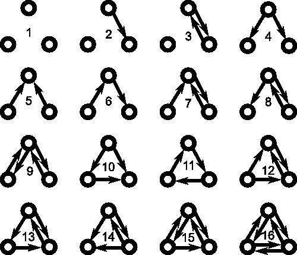
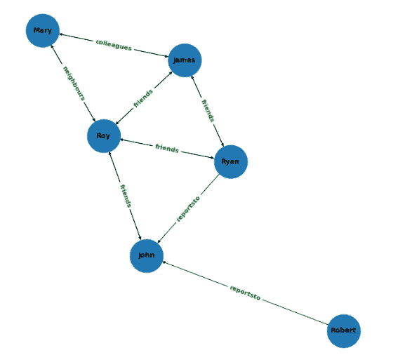
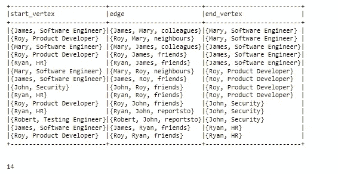
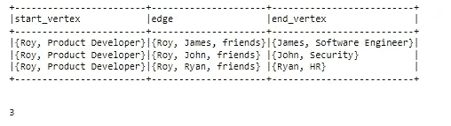
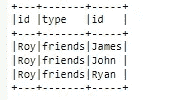

# 使用 GraphFrames 在 PySpark 中进行图形建模:第 2 部分

> 原文：<https://blog.devgenius.io/graph-modeling-in-pyspark-using-graphframes-part-2-26645ccd4ae7?source=collection_archive---------4----------------------->

这是多部分教程的第 2 部分，我将演示如何在 GraphFrames 中找到主题。



如果您还没有阅读本教程的第 1 部分，我强烈建议您在跳到这里之前先阅读第 1 部分。如果您对 graphframes 有所了解，可以跳过第 1 部分

[https://sharmashorya 1996 . medium . com/graph-modeling-in-py spark-using-graph frames-part-1-e7cb 42099182](https://sharmashorya1996.medium.com/graph-modeling-in-pyspark-using-graphframes-part-1-e7cb42099182)

## 什么是图案？

图形主题是具有明确结构的**小的连通子图**。这些函数在图中搜索各种主题。在网络中多次出现的连通图称为网络的主题。

简而言之，网络**主题**是网络中反复出现的重要互联模式。这里，模式意味着它是一个小的诱导子图。

## 在图形框架中寻找简单的主题

在本教程中，我们将模拟一个朋友的社交网络。因此，我们将在 6 个不同的个体之间定义不同类型的关系。

## 让我们编码，

```
import os
import sys
import glob
from os.path import abspath
os.environ['SPARK_HOME'] = 'C:\spark-3.1.2-bin-hadoop3.2'
os.environ['JAVA_HOME'] = 'C:\Program Files\Java\jdk1.8.0_201'
os.environ['HADOOP_HOME'] = 'C:\spark-3.1.2-bin-hadoop3.2'
spark_python = os.path.join(os.environ.get('SPARK_HOME',None),'python')
py4j = glob.glob(os.path.join(spark_python,'lib','py4j-*.zip'))[0]
graphf = glob.glob(os.path.join(spark_python,'graphframes.zip'))[0]
sys.path[:0]=[spark_python,py4j]
sys.path[:0]=[spark_python,graphf]
os.environ['PYTHONPATH']=py4j+os.pathsep+graphf
import findspark
findspark.init()
findspark.find()
from pyspark.sql import SparkSession
spark = SparkSession.builder.appName("Spark Examples").enableHiveSupport().getOrCreate()
from graphframes import *
import networkx as nx
import matplotlib.pyplot as plt
```

在顶点中，我们有关于这些个体的信息。

```
vertices = spark.createDataFrame([("James", "Software Engineer"),
                                 ("Mary", "Software Engineer"),
                                 ("Roy", "Product Developer"),
                                 ("Ryan", "HR"),
                                 ("John", "Security"),
                                 ("Robert", "Testing Engineer")], ["id", "Designation"])
vertices.show()
```

接下来我们将定义连接顶点的边。

```
edges = spark.createDataFrame([("James", "Mary", "colleagues"),
                              ("Mary", "James", "colleagues"),
                              ("Roy", "James", "friends"),
                              ("James", "Roy", "friends"),
                              ("Mary", "Roy", "neighbours"),
                              ("Roy", "Mary", "neighbours"),
                              ("Roy", "Ryan", "friends"),
                              ("Ryan", "Roy", "friends"),
                              ("James", "Ryan", "friends"),
                              ("Ryan", "James", "friends"),
                              ("John", "Roy", "friends"),
                              ("Roy", "John", "friends"),
                              ("Ryan", "John", "reportsto"),
                              ("Robert", "John", "reportsto")],
                             ["src", "dst", "type"])
edges.show()
```

这里我们假设所有的人都为同一家公司工作，他们之间的关系可以从纯粹的同事到朋友到邻居。但是，如果您注意到所有关系都是双向的，除了员工-经理关系(reportsto)。

让我们定义图形，并使用我们在以前的教程中使用的相同的函数来绘制有向图。

```
g = GraphFrame(vertices, edges)
# the function will plot the source and destination nodes and connect them by meand of undirected line
def plot_directed_graph(edge_list):
    plt.figure(figsize=(9,9))
    gplot=nx.DiGraph()
    edge_labels = {}
    for row in edge_list.select("src", "dst", "type").take(1000):
        gplot.add_edge(row["src"], row["dst"])
        edge_labels[(row["src"], row["dst"])] = row["type"]
    pos = nx.spring_layout(gplot)
    nx.draw(gplot, pos, with_labels=True, font_weight="bold", node_size=3500)
    nx.draw_networkx_edge_labels(gplot, pos, edge_labels=edge_labels, font_color="green", font_size=11, font_weight="bold")plot_directed_graph(g.edges)
```



既然我们的图表已经设置好了，是时候让我们看看图表中的关系模式了。

简单的图案，

```
simple_motifs = g.find("(start_vertex)-[edge]->(end_vertex)")
simple_motifs.show(truncate=False)
simple_motifs.count()
```



现在。我们可以访问节点的各个字段，也可以访问边。

```
filtered_motifs = g.find("(start_vertex)-[edge]->(end_vertex)").filter("edge.type='friends'")
filtered_motifs.show(truncate=False)
filtered_motifs.count()
```


复杂模式，

```
filtered_motifs = g.find("(start_vertex)-[edge]->(end_vertex)")\
                    .filter("start_vertex.id='Roy' AND edge.type='friends'")
filtered_motifs.show(truncate=False)
filtered_motifs.count()
```



为了得到更压缩的结果，

```
filtered_motifs.select("start_vertex.id", "edge.type", "end_vertex.id").show(truncate=False)
```



这就把我们带到了第 2 部分的结尾，第 2 部分的代码可以在:

[**https://github . com/shorya 1996/PySpark/blob/main/gettingstartedwithgraphframespart 2 . ipynb**](https://github.com/shorya1996/PySpark/blob/main/GettingStartedWithGraphFramesPart2.ipynb)

**在 Linkedin 上关注我**

**领英:**[**https://www.linkedin.com/in/shorya-sharma-b94161121/**](https://www.linkedin.com/in/shorya-sharma-b94161121/)