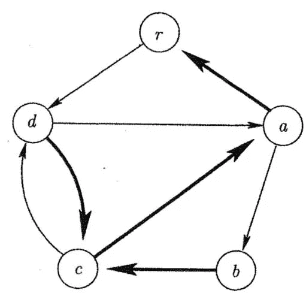
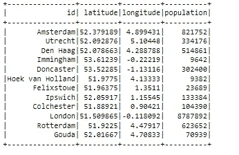
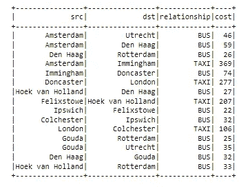
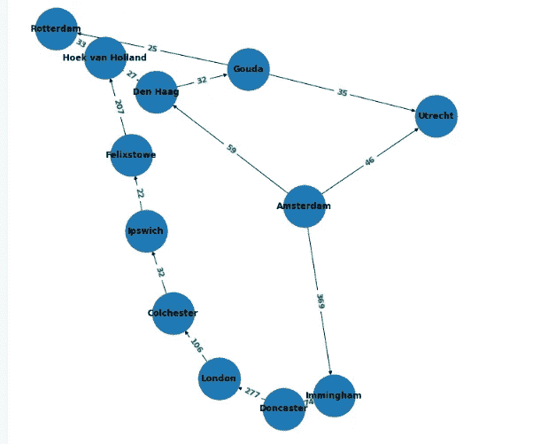
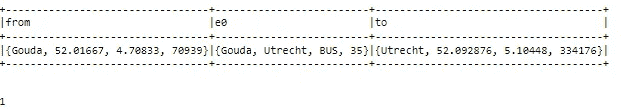
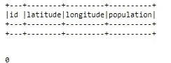
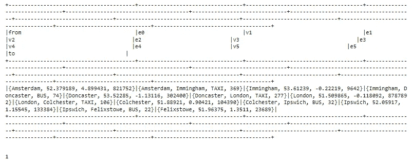
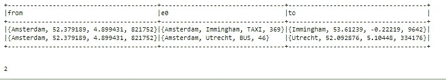
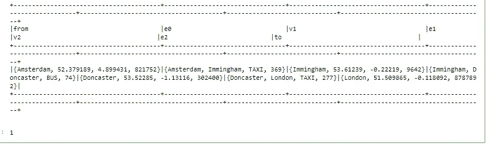
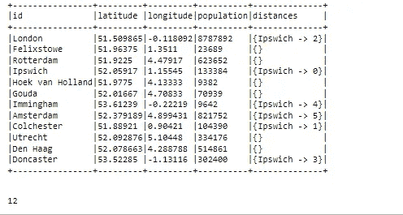

# 使用 GraphFrames 在 PySpark 中进行图形建模:第 3 部分——查找路径

> 原文：<https://blog.devgenius.io/graph-modeling-in-pyspark-using-graphframes-part-3-finding-paths-2fdd74920f1b?source=collection_archive---------5----------------------->

这是多部分教程的第 2 部分，在本教程中，我们将研究一些使用图算法寻找路径的方法。



> 如果您还没有阅读本教程的第 1 部分，我强烈建议您在跳到这里之前先阅读第 1 部分。如果您对图形框架有所了解，可以跳过第 1 部分
> 
> [https://sharmashorya 1996 . medium . com/graph-modeling-in-py spark-using-graph frames-part-1-e7cb 42099182](https://sharmashorya1996.medium.com/graph-modeling-in-pyspark-using-graphframes-part-1-e7cb42099182)

我们将使用“交通数据集”,在该数据集上，我们将找到城市之间的路径以及与旅行相关的成本。

让我们从常见的步骤开始

```
import os
import sys
import glob
from os.path import abspath
os.environ['SPARK_HOME'] = 'C:\spark-3.1.2-bin-hadoop3.2'
os.environ['JAVA_HOME'] = 'C:\Program Files\Java\jdk1.8.0_201'
os.environ['HADOOP_HOME'] = 'C:\spark-3.1.2-bin-hadoop3.2'
spark_python = os.path.join(os.environ.get('SPARK_HOME',None),'python')
py4j = glob.glob(os.path.join(spark_python,'lib','py4j-*.zip'))[0]
graphf = glob.glob(os.path.join(spark_python,'graphframes.zip'))[0]
sys.path[:0]=[spark_python,py4j]
sys.path[:0]=[spark_python,graphf]
os.environ['PYTHONPATH']=py4j+os.pathsep+graphf
import findspark
findspark.init()
findspark.find()
from pyspark.sql import SparkSession
spark = SparkSession.builder.appName("Spark Examples").enableHiveSupport().getOrCreate()from graphframes import *
import networkx as nx
import matplotlib.pyplot as plt
```

现在让我们导入数据集

```
transport_nodes = spark.read.format("csv").option("inferSchema", "true").option("header", "true").load("transport-nodes.csv")
transport_nodes.show()
```



```
transport_relationships = spark.read.format("csv").option("inferSchema", "true").option("header", "true").load("transport-relationships.csv")
transport_relationships.show()
```



现在让我们使用我们在第 1 部分中创建的函数来绘制有向图

```
# the function will plot the source and destination nodes and connect them by meand of undirected line
def plot_directed_graph(edge_list):
    plt.figure(figsize=(9,9))
    gplot=nx.DiGraph()
    edge_labels = {}
    for row in edge_list.select("src", "dst", "cost").take(1000):
        gplot.add_edge(row["src"], row["dst"])
        edge_labels[(row["src"], row["dst"])] = row["cost"]
    pos = nx.spring_layout(gplot)
    nx.draw(gplot, pos, with_labels=True, font_weight="bold", node_size=3500)
    nx.draw_networkx_edge_labels(gplot, pos, edge_labels=edge_labels, font_color="green", font_size=11, font_weight="bold")
```

让我们初始化图形框架并绘制它

```
route = GraphFrame(transport_nodes, transport_relationships)
plot_directed_graph(route.edges)
```



让我们应用 BFS 和最短路径函数来获得路径。

## 广度优先搜索

让我们找到豪达和乌得勒支之间的路径

```
#BFSfiltered_paths = route.bfs("id = 'Gouda'", "id = 'Utrecht'")
filtered_paths.show(truncate=False)
filtered_paths.count()
```



结果中只显示了一条边，这意味着在我们的图表中，这两个地方实际上有直接的联系。

让我们以豪达的 BFS 为起点，费利克斯托为终点，

```
#BFSfiltered_paths = route.bfs("id = 'Gouda'", "id = 'Felixstowe'")
filtered_paths.show(truncate=False)
filtered_paths.count()
```

结果是这些节点之间没有路径。



让我们找出阿姆斯特丹和费利克斯托之间的路径，我们知道它们之间没有直接的路径，

```
#BFSfiltered_paths = route.bfs("id = 'Amsterdam'", "id = 'Felixstowe'")
filtered_paths.show(truncate=False)
filtered_paths.count()
```



我们提供给 BFS 的两个参数实际上可以匹配多个节点，并且我们不限于基于 id 进行过滤。

```
#BFSfiltered_paths = route.bfs("id = 'Amsterdam'", "population < 500000")
filtered_paths.show(truncate=False)
filtered_paths.count()
```



虽然我们在阿姆斯特丹和有人口的节点之间有 2 个以上的连接< 500000, only 2 nodes showed up because BFS considers the number of Hops, and all other connections were indirect.

This time let’s look for the shortest path by specifying a maxPathLength parameter.

```
#BFSfiltered_paths = route.bfs("id = 'Amsterdam'", "id = 'London'", maxPathLength=5)
filtered_paths.show(truncate=False)
filtered_paths.count()
```



To find the shortest path from all connected nodes to a specific node in our graph, we can make use of the shortest path function.

## Shortest paths function

```
# shortest pathfiltered_paths = route.shortestPaths(landmarks=["Ipswich"])filtered_paths.show(truncate=False)
filtered_paths.count()
```



This brings us to the end of this part, In the next and the final part of this series we will look into some other graph algorithms.

The code and datasets for this tutorial are present at :

[](https://github.com/shorya1996/PySpark/blob/main/GettingStartedWithGraphFramesPart3.ipynb) [## PySpark/GettingStartedWithGraphFramesPart3.ipynb at main · shorya1996/PySpark

### The repository contains examples of various pyspark tips and tricks - PySpark/GettingStartedWithGraphFramesPart3.ipynb…

github.com](https://github.com/shorya1996/PySpark/blob/main/GettingStartedWithGraphFramesPart3.ipynb) 

**在 Linkedin 上关注我**

【领英:[**https://www.linkedin.com/in/shorya-sharma-b94161121**](https://www.linkedin.com/in/shorya-sharma-b94161121/)【领英】