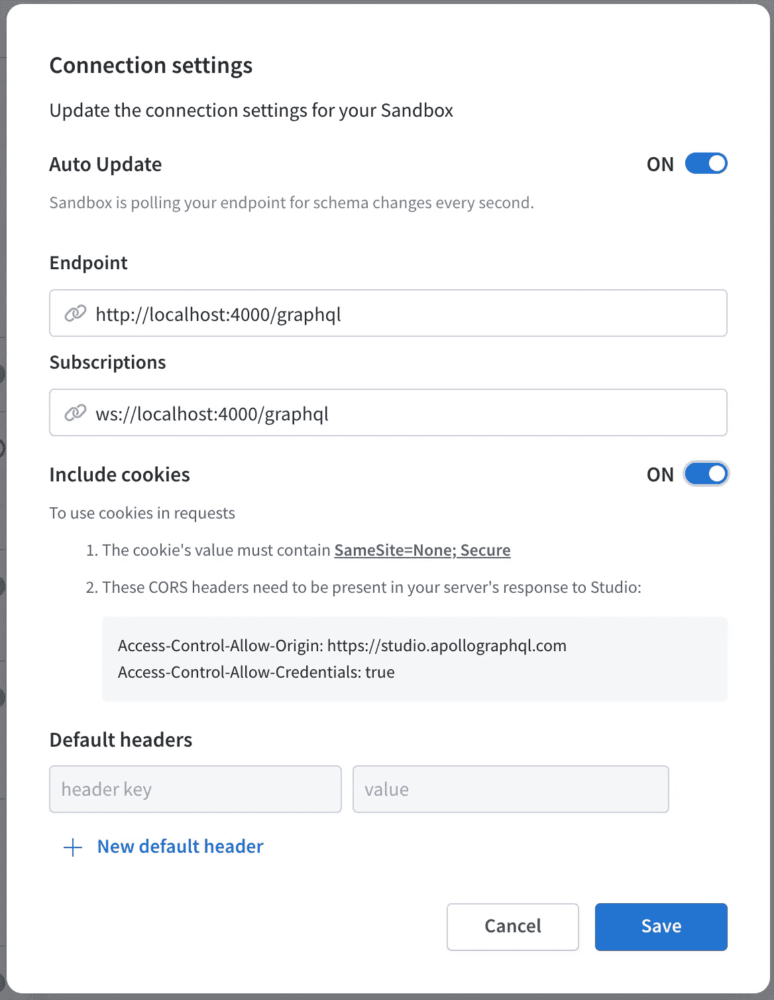
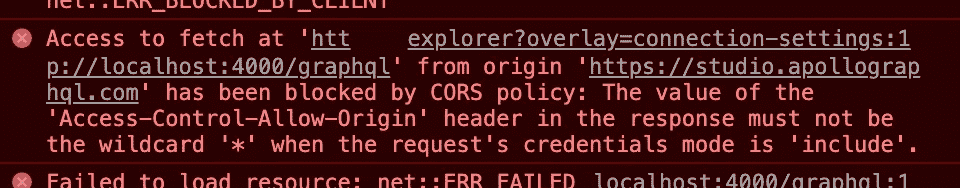
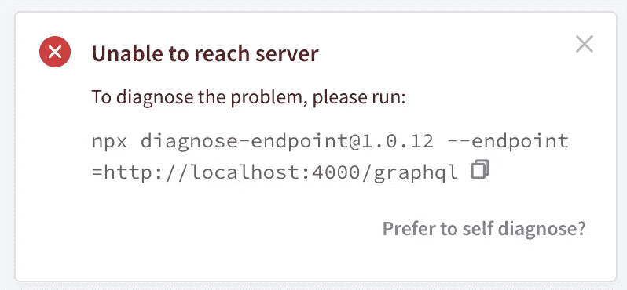
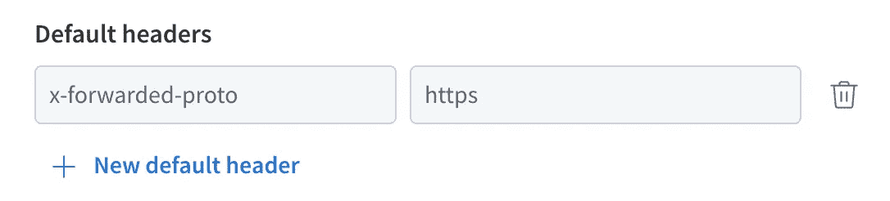

# GraphQL、Apollo Studio 和 Cookies

> 原文：<https://blog.devgenius.io/graphql-apollo-studio-and-cookies-5d8519d0ca7e?source=collection_archive---------2----------------------->

# 我们将涵盖的内容

[Apollo GraphQL](https://www.apollographql.com/) 是一个很棒的工具，但是有时它的文档很缺乏。快速的 Google 搜索会发现，人们努力解决的事情之一(通常不成功)是在 Apollo Studio 和 NodeJS GraphQL 服务器之间启用 cookies。

在本文中，我们将:

1.  描述问题(如果你很急，可以略读/跳过——参见 TL；部分底部的博士)
2.  确定我们在实施过程中的常见陷阱
3.  提供可行的最终解决方案

# 问题是

因此，您已经使用`[apollo-server-express](https://www.npmjs.com/package/apollo-server-express)`设置了 GraphQL 服务器，编写了一些查询，并决定了实现应用程序认证策略的时间。您选择基于 cookie 的会话方法，并使用熟悉的工具，如`[express-session](https://www.npmjs.com/package/express-session)`、`[redis](https://www.npmjs.com/package/redis)`和`[connect-redis](https://www.npmjs.com/package/connect-redis)`。在代码中设置好会话逻辑之后，您前往 Apollo Studio，看看您必须做些什么来让事情运转起来。你在屏幕左上角找到 cog 图标，打开对话框，在上切换**包含 Cookies** 到**，看到类似于**图 1** 的东西。**



**图 1:** 阿波罗工作室连接设置对话框

没问题，你自己想吧。您是一名经验丰富的软件工程师——CORS、cookie、头文件——所有这些您都很熟悉，并且您非常有信心在几秒钟内就能在 Apollo Studio 和您的服务器之间传递 cookie。将指定的 URL 添加到 CORS 源标头，启用凭据，然后保存项目。接下来，你去阿波罗工作室验证你的天才。可悲的是，你可能会遇到以下两种情况之一:

1) Apollo Studio 连接到您的服务器没有问题，但是 cookies 仍然不工作，或者；

2)你的浏览器控制台散落着 CORS 错误(**图 2** ，你在右下角看到一个类似于**图 3** 所示的弹出窗口(这个小对话框很可能即将成为你存在的祸根)。



**图 2** : CORS 错误信息



**图 3:** 阿波罗工作室连接错误对话框

如果你像许多在 Reddit 上发布这个问题的人一样，你会花几个小时试图找出问题所在，然后得出结论，Apollo Studio 坏了，cookies 不太可能出现。您选择使用 GraphQL Playground(这是一个不错的选择！)并永远与阿波罗工作室断绝关系。

快进几个月:你开始了一个新的项目，并决定也许你在最终拒绝阿波罗工作室时过于草率。你不仅记得它非常漂亮，而且你比许多个月前更有经验。长话短说，你会遇到同样的问题。你试试。你热血沸腾。你辞职了。这个循环在接下来的几个项目中重复，直到最后，你偶然发现了这篇文章，给了你希望*事情不一定是这样的*。

## **TL；博士**

**场景#1** : Apollo Studio 连接到你的 NodeJS GraphQL 服务器，但是 cookies 没有通过。

**场景#2** : Apollo Studio 拒绝连接你的服务器。

注意:尽管错误对话框(**图 3** )和 Apollo Studio 显示“获取失败”作为其错误响应消息，您仍然可以观察到您的服务器正在接收请求。

我们实际上将从**场景#2** 开始，因为修复它将把我们带到**场景#1** ，在这一点上我们可以继续我们的最终解决方案。

# 识别潜在原因

## 起始代码

如上所述，我们将从一个导致**场景#2** 的例子开始，并逐步找到一个完整的解决方案。很有可能您的代码看起来像这样:

**server.ts** : GraphQL 服务器**有问题**要修复

**appSession.ts** :利用 redis 的会话设置。

希望跟踪这些文件的流程不会太难。 **server.ts** 展示了一个`apollo-server-express`应用程序的非常标准的实现，而 **appSession.ts** 展示了一个使用`redis`作为其会话存储的`express-session`实现。 **appSession.ts** 已经按照需要的方式设置好了——请注意第 13 行和第 14 行的`sameSite`和`secure` cookie 属性，因为这些是所需功能所必需的。

*从这里开始，每当我们提到代码行时，我们都特指****server . ts****文件。*

## 摆脱“cors”包

如果你正在经历**场景#2** ，但是当 cookies 被切换到**关闭**时，应用程序似乎与 Apollo Studio 完美集成，那么很有可能你正在尝试使用`[cors](https://www.npmjs.com/package/cors)`包设置你的 CORS 头(如第 41–44 行所示)。

虽然我可能是唯一一个这样做的人，但我觉得这是值得解决的，因为当我第一次解决这个问题时，我花了很长时间才发现这是问题的一部分。

为了实施 cors 头和规则，将对象作为输入传递给`cors`,并将其传递给第 46 行的`server.applyMiddleware`输入的 CORS 属性。它应该是这样的:

```
server.applyMiddleware({
    app,
    cors: { 
       origin: ['https://studio.apollographql.com'],               
       credentials: true,
    }
});
```

删除`app.use(cors(//...))`，保存文件，并前往 Apollo Studio——您现在应该看到，讨厌的对话框已经消失，Apollo Studio 成功连接到您的服务器。

太好了！第一个主要障碍已经清除，我们现在进入了场景#1 。

## 代理中到底有什么？

我们必须添加到服务器的下一行代码是:

```
app.set('trust proxy', 1);
```

我知道这一节的标题暗示了某种解释，但是相反，我将只让您参考 [Express 文档](https://expressjs.com/en/guide/behind-proxies.html)，让您自己去钻研它。

你实际上不需要理解这行代码在做什么，因为我们不会以任何其他方式使用它(尽管我鼓励你向上阅读！).也就是说，如果您不知道什么是代理以及设置此选项的含义，我建议您进行以下修改:

```
process.env.__dev__ && app.set('trust proxy', 1);
```

基本上，除非您已经在使用反向代理，并且知道您在做什么，否则在生产中包含这个选项会使您的服务器易受攻击。包含这个一行程序可以让您在本地开发中随心所欲地使用 Apollo Studio 上的 cookies，但也可以防止您的服务器在发布后受到损害。

## 设置“x-Forwarded-proto”Apollo Studio 标题

如果您查看**图 1** ，您会在对话框底部看到**默认标题**部分。我们需要做的最后一件事是设置一个名为`x-forwarded-proto`的头，并给它赋值`https`。这很简单，但我还是加入了图 4 以防万一:



**图 4**:X-Forwarded-Proto 头

这个标题与我们几乎没有谈到的代理主题直接相关，所以我不会在这里详细讨论，但是请在阅读中留意这个标题的参考资料！

如果一切顺利，这是最后一步，您的应用程序应该能够与 Apollo Studio 交换 cookies 了！

# 最终解决方案

正如所承诺的，这里有一个文件片段，包含了我们讨论过的所有更改:

**server.ts** : GraphQL 服务器配置为与 Apollo Studio 交换 cookies

# 结论

我希望这有所帮助！我花了很长时间才弄明白这一点(第一部分描述的叙述非常符合我的经历！)，所以我想分享我所学到的好处。

如果这篇文章为你节省了一些时间和挫折，请考虑通过[请我喝咖啡](https://www.buymeacoffee.com/dannyibrahim)来提供支持！如果有任何关于这篇文章的澄清或问题，或者如果有我提到的东西，你想进一步解释，请在下面联系或评论！