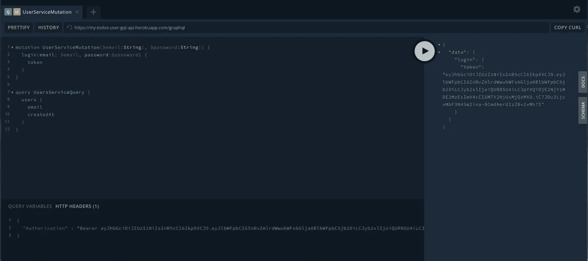
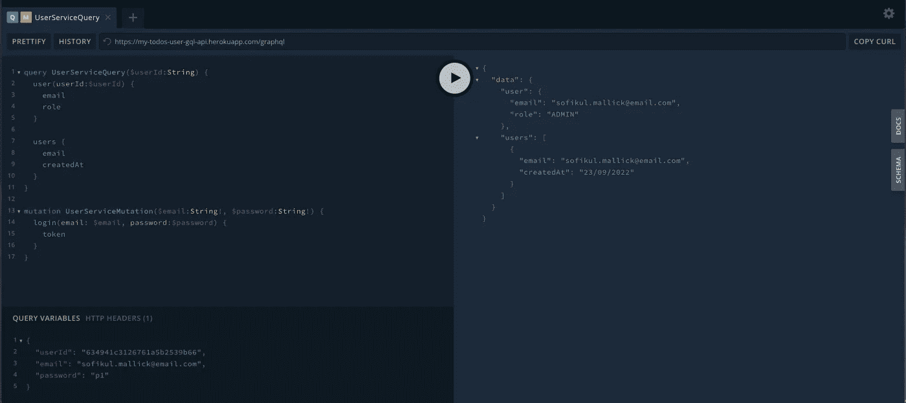

# GraphQL 身份验证和授权

> 原文：<https://blog.devgenius.io/graphql-authentication-and-authorization-6894d6f40ac0?source=collection_archive---------7----------------------->

本内容面向那些对 REST 和 GraphQL 有基本了解的工程师。我们将陆续公布以下内容。

# 1[my-todos 项目设计](https://medium.com/@sofikul.m/design-my-todos-project-with-graphql-rest-microservices-482cffc7729b)

[#2 编码 GraphQL 服务](https://medium.com/@sofikul.m/coding-graphql-services-eafd9235fdf7)

***#3 GraphQL 服务认证和授权(我们在这里发帖)***

#4 编码 GraphQL 网关服务

#5 使用 Nuxt 编码 my-todos web

#6 所有服务的部署

# 我们要在这里讨论什么？

从这篇文章的标题，你已经知道我们将在这里讨论什么主题😎。在我们之前的文章中([*【2 号编码 GraphQL 服务*](https://medium.com/@sofikul.m/coding-graphql-services-eafd9235fdf7) *)* 我们创建了一个 node express GraphQL 服务，在那里`users`查询受到保护，只有`admin`用户可以访问它。我们如何保护 GraphQL 操作，我们将在这里讨论。👇

# 我们有哪些实施方案？

我已经探索了实现它的几个选项，让我们先列出来

🌟身份验证作为上下文的一部分

🌟作为解析程序一部分的身份验证

🌟身份验证作为模式的一部分

# 👨‍💻作为 ApolloServer 上下文一部分的身份验证

# 👨‍💻作为解析程序一部分的身份验证

# 👨‍💻身份验证作为模式的一部分

我们将利用 GraphQL 模式指令。我们将创建自定义的`@auth`指令。

**#1 在模式中定义授权指令**

**#2 执行授权指令**

**#3 转换模式以在服务器中使用 auth 指令**

> 💥完整的代码总是在我的[回购](https://github.com/Sofiukl/my-todos-user-gql-api)里。

# 测试认证

正如我们在模式中定义的，我们的`users`查询是受保护的，只有管理员用户可以访问。所以要访问它，你需要在`Authorization`头中传递令牌。

执行`login`变异将获得令牌。

# 下一步是什么

庆祝你的学习和成就🎉 🔥，我们将在下一篇文章 [*#4 编码 GraphQL 网关服务*](https://medium.com/@sofikul.m/coding-graphql-gateway-service-b8516d4052d4) 中看到。请订阅💕我们一发布就能得到最新消息。

> 继续学习！👍