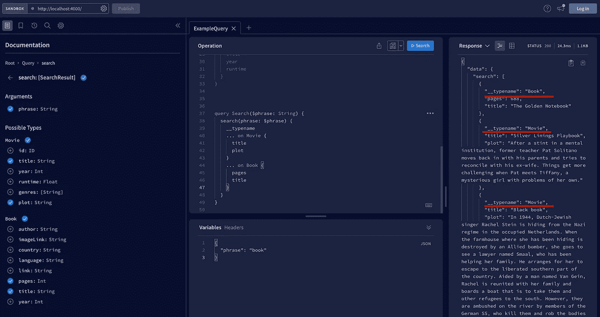
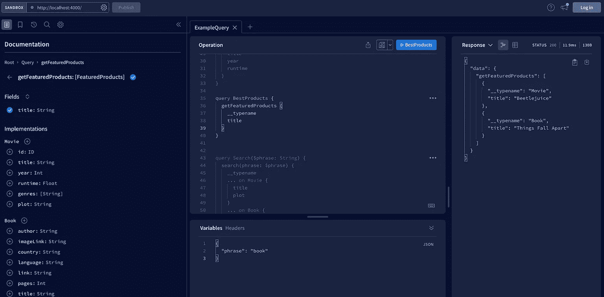

# 面向 Node.js 开发人员的 GraphQL，pt。2-联合和接口

> 原文：<https://blog.devgenius.io/graphql-for-node-js-developers-pt-2-unions-and-interfaces-772b7bbf761f?source=collection_archive---------12----------------------->

照片由[丹尼尔·伊德里](https://unsplash.com/@ricaros?utm_source=medium&utm_medium=referral)在 [Unsplash](https://unsplash.com?utm_source=medium&utm_medium=referral) 上拍摄

良好的模式设计对于创建最好的 GraphQL APIs 至关重要。为此，您必须了解所有可用的工具。此外，您必须彻底了解 GraphQL 模式。本文将帮助您理解抽象数据类型——联合和接口。本文是解释 GraphQL 概念的系列文章的第二部分。你可以在这里找到第一部分:

 [## NodeJS 开发人员的 GraphQL 介绍。一

### 你有没有听说过“GraphQL”或者“GraphQL API”这样的词组却不知道？或者你知道那是什么，但是你…

medium.com](https://medium.com/@piotrmol/introduction-to-graphql-for-nodejs-developers-5eb10240d38) 

我将以一个关于上一课的快速免责声明开始。如果您只对接口和联合感兴趣，请跳过两段继续学习。所以在之前的研究中，我创建了两个查询和一个变异。说实话，`createMovie`突变并不完美。它需要五个参数:

在这种情况下，创建包装对象是一个很好的做法。为此，您必须使用内置的 GraphQL 类型`input.``input`类型的工作方式几乎与通常的`type.`完全相同，一个不同之处是它只能在输入参数的上下文中使用。不能将输入类型设置为返回类型。那将是愚蠢的😏因此，在下面的代码中，您可以检查改进版本的突变:

我刚刚将输入参数包装在输入对象中。所以现在，突变的定义清晰多了。我做的下一件事是重构突变实现。在旧的实现中，我将输入属性直接展开。目前，我正在从`createMovie`方法参数中解开输入变量。这只是对上一课的免责声明。让我们转移到更令人兴奋的话题🎉。

现在，我们将讨论联合和接口。两者都是抽象类型，这意味着您不能直接创建它们的实现。相反，它们描述了一些预期的行为。联合类型是两个或更多类型的聚合。换句话说，它作为 OR 运算符工作。因此，如果查询返回某种联合类型，它可以返回 X 类型或 y 类型。但是您可能会问:看在上帝的份上，为什么我需要一些不能准确告诉我将得到什么的东西？

联合对于实现搜索功能非常有帮助。例如，假设您有一个为用户提供电影和书籍的 API。在你的网站上，你添加了一个搜索栏。当用户键入一些搜索短语时，您的 API 将搜索包含这些文本的电影和书籍。然后，API 响应可能包括电影或书籍。你看，我们到了。工会是有用的😄

所以现在，让我们亲眼看看。但是首先，让我们实现相同的功能。自从上一课以来，我已经添加了一个新的 JSON 文件，其中包含了一个图书列表。我还将 books 数组导入到脚本中，并为 books 准备了类型。它主要由字符串组成。然而，也有两个整数。您可以在下面的代码中检查它:

添加了`Book`类型后，您就可以继续我们的 GraphQL 类型之旅了。要实现搜索功能，您必须向`typeDefs`对象添加新的联合类型。让我们称它为`SearchResult`，并将其返回类型设置为`Movie`或`Book.`，然后，您将向模式中添加一个新的查询。您可以检查以下代码中的模式:

下一个任务是提供搜索查询的实现。与任何其他解析器函数一样，它有四个参数。但是，同样，我们将只关注第二个，即输入。基于输入，代码在 movies 和 books 数组中搜索所需的短语，并返回匹配的对象。

随着搜索功能添加到解析器，您几乎准备好了。有一个关键点。联合类型是抽象的。Apollo server 必须知道如何区分具体的联合类型。你得教阿波罗如何对付你这种类型的人。这是一项简单的任务:)您必须向您的`resolvers`对象添加另一个键，并且它必须与 union 的确切名称相匹配。在这种情况下，它是一个`SearchResult`名称。然后，您必须提供名为`__resolveType.`的回调函数作为输入参数，它接受一个普通的 JavaScript 对象。基于接收到的对象，您必须返回一个带有对象类名称的字符串。这是一张简单的支票。在我们的例子中，我们知道对象是一个`Movie`如果它包含一个`plot.`只有电影包含情节。其次，如果对象包含一个`pages`属性，那么它就是`Book`。就是这样。您已经实现了所有必要的部分。您可以在下面的代码片段中查看它们:

我们转移到阿波罗工作室，在实践中检验一下。我已经为您创建了一个示例查询。这类似于您之前看到的查询。有一个名称和输入参数。区别在于我们选择对象属性的方式。因为查询可能返回两种不同的类型，所以您可以选择其他参数。语法是放三个点、`on`关键字和类型名。接下来，在花括号内，指定从该类型中获取什么。这里有一个很好的实践。通常，向查询添加一个`__typename`变量是一个好的做法。请查看下面的代码:

执行查询时，根据搜索短语，您可能会得到类似的结果:

搜索查询结果

太好了，现在你知道怎么和工会打交道了。这是一条可靠的信息。为自己感到骄傲！现在我们来快速看一下接口。但是了解了工会，事情就简单多了。让我们从头开始。接口是简单的契约。当您想要创建包含一条公共信息的多个类型时，可以创建接口。您不能创建接口的实例。相反，一些具体类型必须实现接口功能。为了说明这一点，让我们创建一个名为`FeaturedProducts.`的界面，它只有一个要求——要求产品有一个标题。类型`Movie`和`Book`都有标题字段。您需要重构模式，并设置实现`FeaturedProducts`接口的类型。现在，您可以创建一个新的查询来实际检查接口。

我将在 resolver 函数中实现一些虚拟逻辑—我将从电影和书籍数组中返回第一批对象。找最好产品的逻辑，这里不是这样的。有趣的是突变的返回类型。这里，函数返回任何实现接口`FeaturedProducts.`
的类型。接口，与联合完全一样，要求我们提供`__resolveType`方法。但是有另一种方式来描述返回什么类型。您可以通过设置`__typename`字段来返回该对象内部的对象。有时候第二种方法就足够了。在下面的代码中检查它:

最后，让我们执行查询并确定它是否正常工作。我将从每种类型中选择`__typename`和标题变量。您可以在这里看到查询的结果:

功能产品查询结果

今天就到这里吧。干得好！您已经学习了如何处理 GraphQL 的抽象类型。现在，您在 GraphQL 的旅程中又前进了两步。在文章的最后，我放置了今天课程的全部代码。可以复习一下，总结一下学到的东西。

请考虑关注我，以免错过下一篇文章。下一次我将讨论 GraphQL 错误处理。祝你有美好的一天！