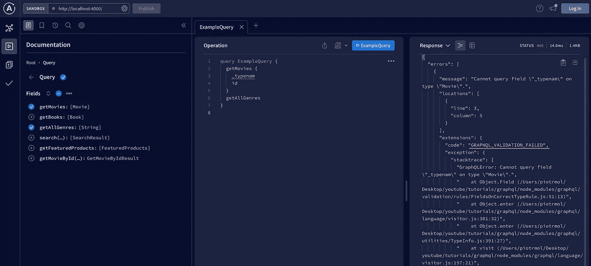
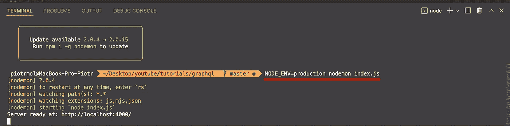
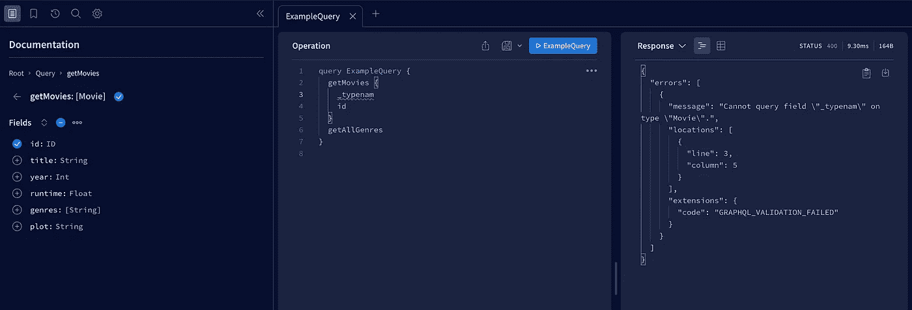
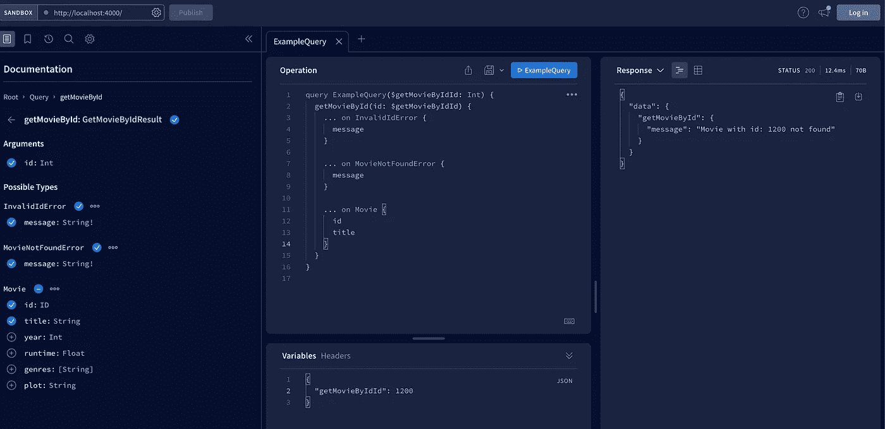

# 面向 Node.js 开发人员的 GraphQL，pt。3 —错误处理

> 原文：<https://blog.devgenius.io/graphql-for-node-js-developers-pt-3-error-handling-37f7e96f3608?source=collection_archive---------1----------------------->

照片由 [Remy_Loz](https://unsplash.com/@remyloz?utm_source=medium&utm_medium=referral) 在 [Unsplash](https://unsplash.com?utm_source=medium&utm_medium=referral) 上拍摄

我们都会犯错。问题是，我们如何处理它们。这同样适用于我们的 API。肯定会有错误。我们必须做好应对的准备。所以在本教程中，我将教你如何处理 GraphQL APIs 中的错误。拿杯咖啡跟我来。

与 rest APIs 相比，GraphQL 中的错误处理方式有所不同。GraphQL 不依赖 HTTP 状态来通知错误。相反，响应主体中返回的值告诉我们是成功还是失败。那个身体里面有两把钥匙:`data`和`errors`。如果出现一个或多个错误，它们将出现在 errors 数组中。因此，从客户端的角度来看，要验证是否发生了不好的事情，您必须检查错误数组是否不为空。

所以，我们用实践来论证一下。首先，我从一个基本案例开始。假设查询中有一个错误。例如，我打错了`__typename`这个名字。那么 API 会返回什么呢？在这个场景中，apollo 服务器将返回一个从`ApolloError`类派生的错误，代码等于`GRAPHQL_VALIDATION_FAILED`，这是 apollo 服务器预定义的错误之一。

阿波罗服务器错误

您可以在 apollo 文档中查看所有可能的错误代码:

 [## 错误处理

### 每当 Apollo 服务器在处理 GraphQL 操作时遇到错误，它对客户机的响应包括一个…

www.apollographql.com](https://www.apollographql.com/docs/apollo-server/data/errors/#error-codes) 

除了错误代码之外，error 对象还包含错误消息和堆栈跟踪。堆栈跟踪对于调试很有用，但是它不应该包含在生产环境中。要禁用错误消息中的堆栈跟踪，您必须将`NODE_ENV`变量设置为`production`或`test`。

设置 NODE_ENV

这样，堆栈跟踪就不会公开:

没有暴露堆栈跟踪的错误

Apollo Server 会在适当的时候自动抛出大多数内置类型的错误。例如，每当传入的操作对服务器的模式无效时，它就会抛出一个`ValidationError`。有些情况下，您不想向客户端公开实际的错误。例如，错误消息可能包含机密信息，或者对客户端来说毫无意义。在这种情况下，最好覆盖最终的错误消息。为此，有一个简便的方法可以使用。apollo 服务器构造器可以将`formatError`回调作为输入参数。回调函数只接受一个参数，即错误。在回调返回错误之前，您可以随意处理它。

例如，让我们假设发生了一个数据库错误。首先，您必须捕捉错误，因为它包含一些特定于方案的细节，公开这些信息可能会很危险。然后你想返回一般的`Internal Server Error.`为此，让我们创建一个回调函数，把错误作为输入。首先，检查`typeof`错误是否是`DatabaseError`在回调。如果是，则返回一个包含一般消息的新错误；否则，返回错误，不做任何更改。现在将回调传递给 apollo 构造函数。必须添加到`formatError`键下。

仅此而已。现在，这些特定的错误不会暴露给用户。到目前为止，一切顺利。但是有没有关于如何用 GraphQL 处理错误的最佳实践呢？当然，他们是。但是要做好这件事，我们必须从头开始。GraphQL 模式必须设计为支持良好的错误处理。它将基于接口和联合类型。在我之前的教程中，我为管理电影 API 创建了一些查询和变体。

 [## 面向 Node.js 开发人员的 GraphQL，pt。2-联合和接口

### 良好的模式设计对于创建最好的 GraphQL APIs 至关重要。为此，您必须了解所有可用的工具。在…

blog.devgenius.io](/graphql-for-node-js-developers-pt-2-unions-and-interfaces-772b7bbf761f) 

让我们将这个例子扩展到另一个查询。让我们创建一个`getMovieById`查询。该查询可能返回一部电影或两种错误— `MovieNotFoundError`或`InvalidMovieIdError`。我将创建名为`BaseError`的接口，并将消息设置为必需的。接下来，我将添加接口的两个实现，并创建名为`GetMovieByidResult`的联合类型。Union 将返回`Movie`类型或`MovieNotFoundError`或`InvalidMovieIdError.` 最后要做的事情是创建查询。在这里，您可以看到最终的查询定义:

让我们看看 union 的用法将如何影响解析器。`getMovieById`解析器功能检查 id 是否为`typeOf`号。如果没有，就有一个验证错误(*我知道这是一个愚蠢的例子，但是我想告诉你如何处理这个错误*😅。)接下来，它检查是否存在具有特定 id 的电影。如果否，则出现电影未找到错误。最后，如果有电影，该函数将返回电影。**这里重要的是你要使用** `__typename` **变量并指定返回类型。** Apollo 服务器必须知道解析器返回的是哪种类型。

准备好解析器功能后，您可以在 apollo studio 中测试它。前端查询还必须区分返回的类型。同样，让我们使用`__typename`变量来实现。

带有错误处理的 GraphQL 查询

那么，今天就到此为止。干得好！您已经学习了如何处理 GraphQL 的错误。现在，您可以区分实际数据中的错误，并且可以隐藏敏感信息。在文章的最后，我放置了今天课程的全部代码。可以复习一下，总结一下学到的东西。

请考虑关注我，以免错过下一篇文章。下一次我将讨论 GraphQL 解析器上下文对象。**祝您愉快！**