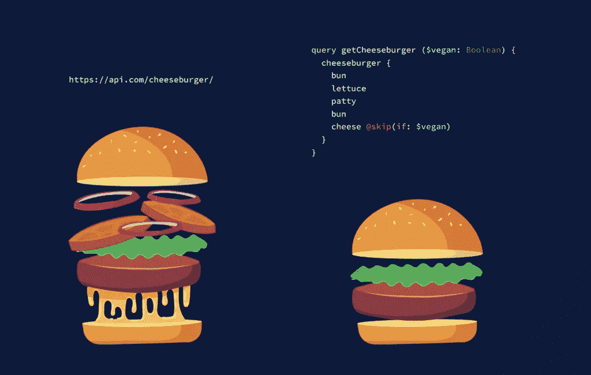

# 前端开发人员 GraphQL 指南

> 原文：<https://blog.devgenius.io/graphql-guide-for-frontend-developers-4ee6e97d64b0?source=collection_archive---------4----------------------->



来源:[https://hy graph . com/blog/graph QL-vs-rest-APIs # graph QL-vs-rest](https://hygraph.com/blog/graphql-vs-rest-apis#graphql-vs-rest)

在我的载体中，我几次接触 GraphQL 并学习了基本知识。
我观看视频，阅读文档，甚至用 GraphQL 做简单的项目；尽管如此，我还是经常觉得整个生态系统对我来说并不清楚。
在向具有前端开发技能的学生教授 GraphQL 的过程中，我意识到在网上找到简单明了地解释 GraphQL 是什么以及如何使用它的信息是多么困难。
所以我试图填补这个空白。

# GraphQL 是什么？

在官网上，GraphQL 被定义为“你的 API 的查询语言”。
这是什么意思？
API 是一个应用程序(应用程序编程接口)，允许开发者在应用程序之间交换数据。
例如，后端应用程序中有一些数据，需要在前端应用程序中显示这些数据。在这种情况下，我们将使用应用程序接口或 API 将这些数据从后端传输到前端应用程序。

我们可以把 API 想象成一部手机。电话是我们用来从一个地方向另一个地方、从一个人向另一个人发送信息的东西。API 用于将数据从一个应用程序发送到另一个应用程序。根据这个例子，API 的查询语言是我们用来交流的语言:英语、德语、法语……

GraphQL 是一种语言。它使用一个查询与 API 通信并请求数据。

## 面向前端开发人员的 REST 与 GRAPHQL

经常有人将 GraphQL 与 REST 相比较。
如果你不确切知道 REST API 是如何工作的(也许你学会了如何使用它，但从未真正想过它是如何在幕后工作的)，以这种方式学习 GraphQL 可能会令人困惑。
REST API 提供了所谓的端点，这些端点是返回大量数据的 URL。
即[**API . my**](https://api.my)**Website.com/getAllUsers**可以是返回用户列表的典型端点。

但是这实际上是如何工作的呢？这个网址是哪里来的？而这些数据从何而来？
我不会详细讲述如何编写 RESTful API，但是理解这些端点是由开发人员创建的是很重要的。后端开发人员编写一些代码来做类似的事情:

*   理解请求是什么(在上面的例子中，请求是一个用户列表)
*   连接到数据库或存储并检索所有这些数据(从数据库中获取所有用户)
*   作为响应返回用户(返回一组用户，包括姓名、年龄、地址、电子邮件等)

与 REST 完全一样，GraphQL 包含一些后端代码。
在后台，有一些代码将:

*   创建端点并使其对前端可用
*   定义模式—模式指定哪些数据可用以及每个数据的类型(即名称:字符串、年龄:数字等)
*   当请求特定查询时返回一组数据

如果你有兴趣了解更多关于 GraphQL 的后端，查看这篇简短清晰的[教程](https://www.tutorialspoint.com/graphql/graphql_example.htm)。

不可能编写 GraphQL 前端代码来与用 REST 编写的后端进行通信。这是因为它们是两种不同的语言。
回到我们的电话示例:他们都使用相同的工具进行通信(电话/API ),但一个用中文，另一个用阿拉伯语。他们如何才能相互理解？不可能。

## **混淆概念:**

当我第一次学习 GraphQL 时，我对那些谈论设置服务器和使用 [Apollo](https://www.apollographql.com/) 的例子和文档感到非常困惑。
仅仅是写 GraphQL 的后端代码，就需要一个服务器。
如果我的目标只是从预先存在的 GraphQL 端点获取数据，我就不需要服务器。

Apollo 是一个强大且广泛使用的工具，它让生活变得更简单(有时；) )作为一个使用 GraphQL 的开发者。
重要的是要明白，使用 Apollo 并不是强制性的，也不是完成这项工作的唯一工具。
如果你是第一次接触 GraphQL，我建议你花点时间去了解哪些设置和哪些工具最适合你要编码的项目。

您完全可以开始使用 GraphQL 前端，而无需创建服务器或使用 Apollo 或任何类似的工具。现在我们来看看如何实现。

# 立即开始使用 GraphQL

如果你是一名前端开发人员，想要开始使用 GraphQL API，你不需要知道任何关于后端代码、服务器代码或者 API 是如何创建的。
对您来说重要的概念是:

*   了解如何用 GrahpQL 编写查询
*   如何找出可以查询的操作和字段

## 用 GraphQL 获取数据:代码

如果您已经使用过 REST API 或者在前端获取数据，那么您可能对`fetch`方法很熟悉。
让我们举一个例子:对于 REST，我们有这样一个端点:`[https://adroablespuppies.com/](https://adroablespuppies.com/)allDogs`
为了获取狗的列表，我们将编写:

```
fetch(https://adroablespuppies.com/allDogs)
```

这里我们隐式地使用了`GET`方法。
如果我们需要发布一些更改，我们将使用`POST`方法并编写如下代码:

```
fetch(https://adroablespuppies.com/addDog, {
  method: 'POST',
  headers: { 
   "Content-Type": "application/json"
  },
  body: { name: 'Fido', breed: 'mixed', age: 7 }
})
```

在 GraphQL 中，我们编写了一个非常相似的代码，但是我们总是有一个语法，要么我们获取数据，要么我们发布数据。

```
fetch(https://adroablespuppies.com/, {
  method: 'POST',
  headers: { 
   "Content-Type": "application/json"
  },
  body:  JSON.stringify({query: dogQuery)}
})
```

我们稍后将详细讨论`dogQuery`，但需要注意的是:

*   我们甚至使用`POST` 来获取数据
*   我们正在传递一个对象给身体，这个对象必须是`{query: YOUR_QUERY}`

## 如何编写查询

在上面的例子中我们写了`dogQuery`作为要发送的数据。`dogQuery`实际上并不是什么数据，而是一个查询，它告诉 GraphQL 后端我们希望得到哪些信息作为响应。

要编写查询，我们需要理解两个重要的概念。
经营与领域。

```
const dogQuery = query DogDetails{
    dog(id : 1) {
        name,
        breed,
        age
    }
}
```

*   **查询**:操作类型(我们要做哪种操作)
*   **DogDetails** :操作名称(我们正在调用哪个方法)
*   **dog** :根字段(包含有效负载的对象)
*   **id: 1:** 查询参数
*   **名称、品种、年龄:**字段(有效载荷)

**关于操作类型:** 操作类型描述了需要对数据执行的操作，因此需要从这些操作类型之一开始查询。**T21**有三种操作:

*   查询—只读获取。
*   突变—先写后取。
*   订阅—响应源事件获取数据的长期请求。

如果省略操作类型，则默认为`query`。

**操作名称及字段** 操作名称及字段由后台开发人员编写。
你无法猜测它们，也无法在 GraphQL 官方文档中找到它们。
你可以直接从写后台的人那里得到它们。
如果使用的是公共 GraphQL API，那么提供这些 API 的团队也将提供文档。查看此公共 GraphQL API[https://ivangoncharov.github.io/graphql-apis/.](https://ivangoncharov.github.io/graphql-apis/.)列表

这是一个提供文档和一些代码的游乐场的好例子: [GraphiQL](https://www.predic8.de/fruit-shop-graphql?query=%0A%7B%0A%20%20products%20%7B%0A%20%20%20%20name%20%0A%20%20%7D%0A%7D%0A)

# 有用的链接:

[https://www . digital ocean . com/community/教程/理解-查询-in-graphql](https://www.digitalocean.com/community/tutorials/understanding-queries-in-graphql)——对 GraphQL 详尽且文笔流畅的解释

[https://www.predic8.de/graphql-query-samples.htm](https://www.predic8.de/graphql-query-samples.htm)——一套绝佳的查询示例+游乐场，让您一尝 GraphQL 的滋味

[https://ivangoncharov.github.io/graphql-apis/](https://ivangoncharov.github.io/graphql-apis/.)—公共 API 列表

# 结论

与 REST 和 GraphQL 一样，如果不阅读文档或与后端开发人员交谈，您就不知道要获取哪个端点。
不同之处在于，对于 REST，我们只需要知道端点，一旦看到响应，我们就可以计算出我们拥有哪些数据。

使用 GraphQL，我们需要知道哪些字段可用于编写查询，然后最终获取数据并查看响应。
因此，开始编写代码前的准备工作至关重要。

一旦知道了可用的方法和字段，就可以开始使用 GraphQL，而不需要任何第三方工具或库。
就像做一个获取请求一样简单！


你的学习之路需要支持吗？[让我们在 codementor 上聊聊](https://www.codementor.io/@giorgiasambrotta?refer=badge)