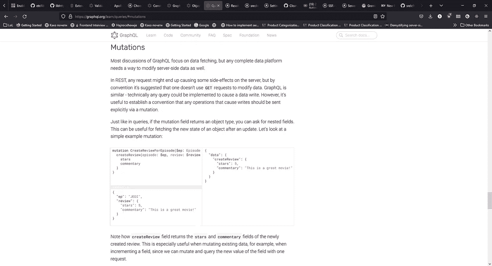

# GraphQL 学习路径

> 原文：<https://blog.devgenius.io/graphql-learning-path-1dc47425da8c?source=collection_archive---------14----------------------->

我的 GraphQL 学习之路的一个片段。

浏览器中的 graphql 文档

# 第一次互动

第一个 GraphQL 页面[入门](https://graphql.org/learn)链接指向[学习页面](https://graphql.org/learn/)。第一次学 GraphQL，感觉很迷茫。在阅读了学习页面上的主题后，我想知道如何使用 GraphQL。这一页想教给我什么？GraphQL 的哪一部分在这个页面上？还有更多 GraphQL 工具吗？我应该使用什么 GraphQL 工具？我有很多问题却没有答案。

花费的时间:~2 小时。

# 第二次互动

学习问题分析是这样的:

1.  GraphQL 是一个客户端-服务器工具。
2.  GraphQL 客户端需要一个 GraphQL 服务器。
3.  没有服务器我用不了客户端，那就从服务器开始吧。
4.  GraphQL 文档提供了工具列表吗？是的，汉迪。
5.  嗯，GraphQL 阿波罗服务器应该是一个好的开始。
6.  Apollo 服务器文档看起来不错。我很快就可以开始工作了。
7.  在第一页之后，我有了一个正在运行的 GraphQL 服务器。

我尝试了一些事情:

*   修改查询。
*   添加一个变量。
*   阅读有关缓存的信息。
*   突变。
*   …

花费时间:2 天

第一天:~1 小时。

第二天:~10 小时*(包括休息和其他活动)*。

第二轮的结论:

*   GraphQL 的多语言支持。
*   多层主题和相对陡峭的学习曲线。
*   容易进入但很难掌握。

# 第三次互动

局势越来越紧张。我想用 typescript，所以设置了 nodemon 和 ts-node。五分钟后，typescript 服务器运行。十五分钟后，我看到了类型声明。一种特性悄然出现，我想使用模式。第一个特征蠕变是类型脚本。该模式不起作用，我正在阅读阿波罗文档。四十五分钟后，什么都没用。我在浪费时间。javascript 服务器正在运行，我不需要类型脚本或模式。将设置恢复为 javascript，并让服务器再次运行。我承诺要做一个最简单可行的产品。与怪物的战斗还在继续。

我试图为 Apollo 创建一个 GQL 模式，但不起作用。打开阿波罗文档，但没有太多关于模式的内容。TypeDefs 和 Resolvers 无处不在，但它们是我们要走的路吗？

我打开 GQL 文档来了解如何创建一个模式。运气不好。等等，太奇怪了。创建模式的文档不是我第一次使用的文档。嗯，为什么不止有一份文件？他们的区别是什么？我打开旧文档，它使用的是 GraphQL express 服务器。关于同一件事的不止一个文档。这些文件是关于同一件事的吗？他们描述的不一样，我想通了。多层的东西:

*   GraphQL 模式。
*   解析器。
*   我们可以用。gql 扩展。

哦，我的上帝…

我唯一有更多问题的话题是 C++。昨天我试图弄清楚 C++类继承是如何工作的。为什么父类前面有 public 这个关键字？有三种类继承模式:私有、受保护和公共继承。默认情况下，类继承是私有的，但是它们需要一个公共的。我花了半个小时研究才弄明白。

我了解 C++继承的页面来自:[https://www . section . io/engineering-education/extending-classes/](https://www.section.io/engineering-education/extending-classes/)。

# 结束语

我可以轻松地编写入门级 GraphQL 应用程序。实验之旅很有趣。有心情的时候会多看看 GraphQL。这个概念令人兴奋。

# 仓库

在撰写本文时，GraphQL 工作正在进行中。如果有一个名为 graphql-checkout 的分支，打开它。实验目录中是 graphql-checkout 文件夹。

我的工作就在[这个](https://github.com/srele96/sk-experiments)仓库里。